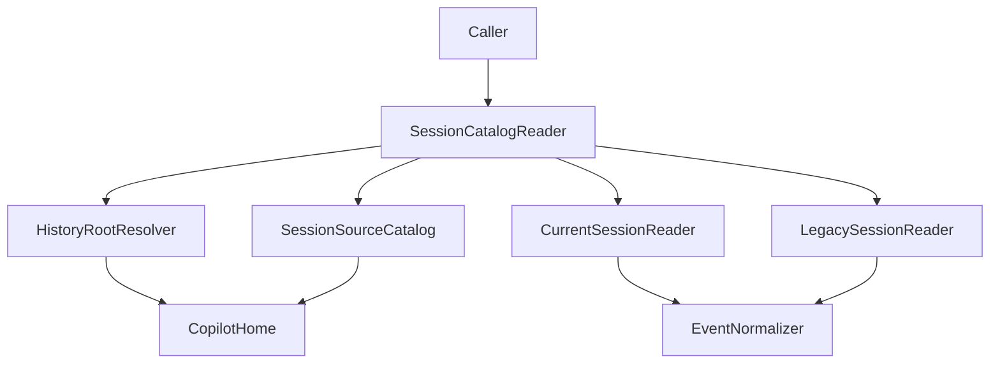
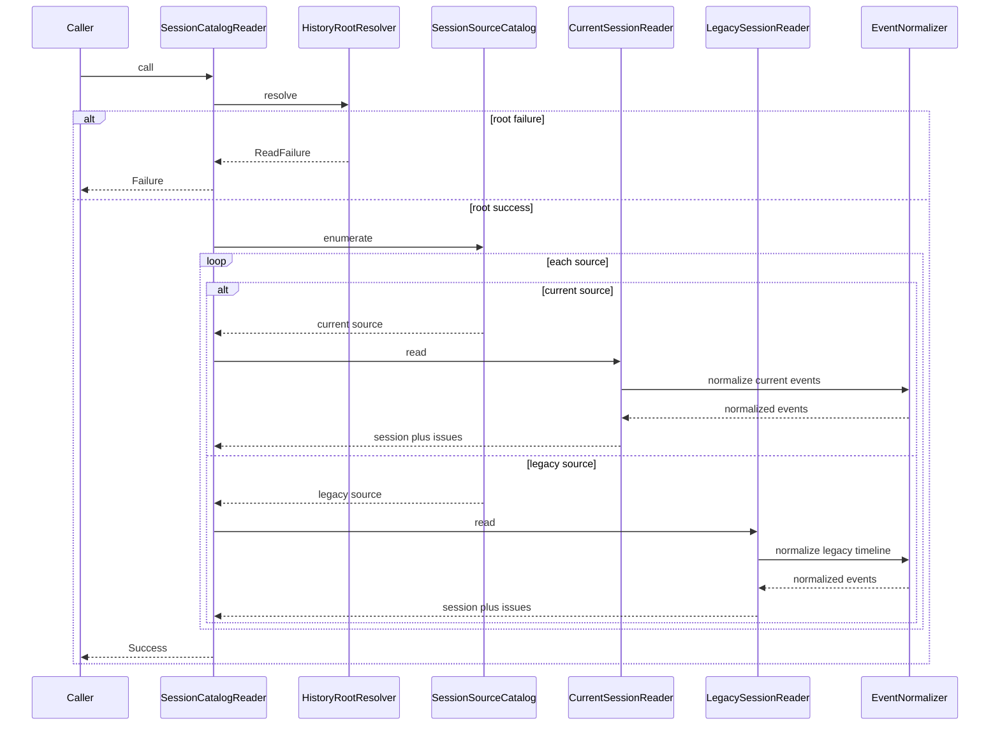

# Design Document

## Overview
この feature は、Rails backend 内で GitHub Copilot CLI のローカル履歴ファイルを読み取るための共通基盤を提供する。対象は `COPILOT_HOME` または `~/.copilot` 配下の raw files に限定し、現行 `session-state` と旧形式 `history-session-state` の両方を同じ normalized session object へ変換する。

主な利用者は Phase4 以降の backend 開発者であり、API や永続化の実装はこの基盤が返す共通オブジェクトを入力として利用する。影響範囲は `backend/lib/` と `spec/lib/` に閉じ、controller・route・DB schema には踏み込まない。

### Goals
- `COPILOT_HOME` 優先、未設定時 `~/.copilot` で履歴ルートを一貫して解決する。
- 現行形式と旧形式の session を同じ `NormalizedSession` 契約へ変換する。
- root failure と session issue を区別しつつ、未知 event の raw payload と event 順序を失わない。
- 公開戻り値と内部 result を `ReadResult` / `ReadFailure` / `NormalizationResult` で固定し、実装者ごとの解釈差をなくす。
- legacy `chatMessages` を `timeline` と競合させず、補助的な `message_snapshots` として lossless に保持する。

### Non-Goals
- セッション一覧 API / セッション詳細 API の設計
- ActiveRecord / MySQL を使った永続化 schema
- file watch、増分同期、自動更新
- frontend 向け表示整形、Markdown 変換、検索 UI

## Boundary Commitments

### This Spec Owns
- ローカル履歴ルートの解決と access check
- `session-state` / `history-session-state` の source discovery
- current / legacy それぞれの format reader
- 形式差分を吸収する normalized session / normalized event 契約
- session 局所の parse issue と unknown event payload の保持

### Out of Boundary
- HTTP endpoint、controller、serializer、routing
- persistence schema、reindex、検索最適化
- Copilot CLI プロセス制御や `/resume` 等の CLI 操作
- frontend 表示都合の summary 生成や装飾

### Allowed Dependencies
- Ruby / Rails runtime の標準機能: `Pathname`, `Dir`, `File`, `JSON`, `Time`, `Psych.safe_load`
- 読み取り可能なローカル filesystem path (`COPILOT_HOME` または `~/.copilot`)
- RSpec fixture による sample history files
- 既存 Rails autoload (`backend/lib/`)

### Revalidation Triggers
- `workspace.yaml`, `events.jsonl`, `history-session-state/*.json` の contract shape が変わる場合
- normalized object に API 専用 field や DB 主キーを持ち込む場合
- root 解決前提が `COPILOT_HOME` / `~/.copilot` 以外へ広がる場合
- reader が ActiveRecord, HTTP, background watch に依存し始める場合

## Architecture

### Existing Architecture Analysis
- backend は Rails API の最小雛形で、現状の route は `/up` のみである。
- `backend/lib/` は autoload 済みであり、reader 基盤を Rails 層から独立させて配置できる。
- 既存 spec は request spec 中心のため、本機能は fixture ベースの `spec/lib/` を新設して検証する。

### Architecture Pattern & Boundary Map



**Architecture Integration**:
- Selected pattern: reader adapter pipeline。format 差分を reader 側へ閉じ込め、公開境界は `SessionCatalogReader` のみとする。
- Domain boundaries: `Types / ErrorCodes → RootResolver / SourceCatalog → EventNormalizer → CurrentSessionReader / LegacySessionReader → SessionCatalogReader`
- Existing patterns preserved: Rails API 本体には controller や model を追加せず、`lib/` autoload と RSpec fixture を利用する。
- New components rationale: root 解決、source 列挙、format parse、common normalization、公開 facade を分離し、実装 task の ownership を明確にする。
- Steering compliance: `.kiro/steering/` は未配置のため、requirements・brief・既存 backend 構成に合わせて boundary を最小化する。

### Technology Stack

| Layer | Choice / Version | Role in Feature | Notes |
|-------|------------------|-----------------|-------|
| Backend / Services | Rails API 8.1, Ruby 4, Zeitwerk | reader service と value object の実行基盤 | `backend/lib/` を autoload 利用 |
| Data / Storage | なし | この spec は in memory の normalized contract だけを定義する | ActiveRecord / MySQL には依存しない |
| Messaging / Events | JSON Lines, JSON | Copilot CLI の raw event source | 内部 schema なので raw payload を保持する |
| Infrastructure / Runtime | Local filesystem, `Psych.safe_load` | current / legacy history files の安全な読取 | Docker mount 済み path も通常 path と同様に扱う |

## File Structure Plan

### Directory Structure
```text
backend/
├── lib/
│   └── copilot_history/
│       ├── session_catalog_reader.rb          # 公開 entrypoint。root 解決から session 読取までを束ねる
│       ├── history_root_resolver.rb           # COPILOT_HOME と既定 path を解決し、missing / permission failure を返す
│       ├── session_source_catalog.rb          # current / legacy の source file 群を列挙する
│       ├── current_session_reader.rb          # workspace.yaml と events.jsonl から current session を組み立てる
│       ├── legacy_session_reader.rb           # history-session-state JSON を共通 session へ変換する
│       ├── event_normalizer.rb                # raw event から normalized event を生成する
│       ├── errors/
│       │   └── read_error_code.rb             # root failure と session issue で共有する安定 code 群を定義する
│       └── types/
│           ├── resolved_history_root.rb       # 解決済み root path と source directory 情報
│           ├── session_source.rb              # current / legacy の入力 source descriptor
│           ├── normalized_session.rb          # source format 非依存の session value object
│           ├── message_snapshot.rb            # 補助 transcript (`chatMessages`) を保持する共通 value object
│           ├── normalized_event.rb            # 順序付き event と raw payload
│           ├── read_issue.rb                  # session 局所の parse / compatibility issue
│           ├── read_failure.rb                # root 単位の fatal failure payload
│           ├── normalization_result.rb        # event 1 件分の normalized event と issue 配列
│           └── read_result.rb                 # `Success` / `Failure` だけを外部公開する discriminated envelope
└── spec/
    ├── fixtures/
    │   └── copilot_history/
    │       ├── current_valid/                 # 正常 current session fixture
    │       ├── current_invalid_yaml/          # workspace.yaml parse failure fixture
    │       ├── current_invalid_jsonl/         # events.jsonl line failure fixture
    │       ├── legacy_valid/                  # 正常 legacy session fixture
    │       └── legacy_invalid/                # legacy JSON parse failure fixture
    └── lib/
        └── copilot_history/
            ├── history_root_resolver_spec.rb
            ├── session_source_catalog_spec.rb
            ├── current_session_reader_spec.rb
            ├── legacy_session_reader_spec.rb
            ├── event_normalizer_spec.rb
            └── session_catalog_reader_spec.rb
```

### Modified Files
- `backend/config/application.rb` — 既存の `config.autoload_lib` をそのまま利用する。実装時に autoload 命名で問題が出た場合のみ、このファイルで load path 調整を行う。
- `backend/spec/rails_helper.rb` — fixture helper や support 読込が必要な場合のみ最小変更で対応する。

## System Flows



- root failure は session 列挙に進まず即時終了する。
- root 列挙後に発生した source file 単位の unreadable は `ReadIssue` として扱い、root failure へ昇格させない。
- session 局所の parse failure は `ReadIssue` として保持し、他 session の読取は継続する。
- event 順序は current の line index、legacy の timeline index を canonical sequence として保持する。
- legacy `chatMessages` は `message_snapshots` へ保存し、`timeline` 由来の `events` を canonical interaction stream として維持する。

## Requirements Traceability

| Requirement | Summary | Components | Interfaces | Flows |
|-------------|---------|------------|------------|-------|
| 1.1 | `COPILOT_HOME` 優先で履歴ルートを解決する | `HistoryRootResolver` | root resolution service | Session read flow |
| 1.2 | 未設定時は `~/.copilot` を使う | `HistoryRootResolver` | root resolution service | Session read flow |
| 1.3 | root 不在 / 不可読を識別可能に返す | `HistoryRootResolver`, `Types::ReadFailure`, `Types::ReadResult` | failure envelope | Session read flow |
| 1.4 | raw files を一次ソースとする | `SessionSourceCatalog`, `CurrentSessionReader`, `LegacySessionReader` | source descriptor contract | Session read flow |
| 2.1 | `workspace.yaml` から session metadata を得る | `CurrentSessionReader`, `Types::NormalizedSession` | current session reader contract | Session read flow |
| 2.2 | `events.jsonl` を出現順で扱う | `CurrentSessionReader`, `EventNormalizer` | normalized event contract | Session read flow |
| 2.3 | 壊れた `workspace.yaml` を正常データと区別する | `CurrentSessionReader`, `Types::ReadIssue` | session issue contract | Session read flow |
| 2.4 | 壊れた JSONL 行を識別可能に返す | `CurrentSessionReader`, `Types::ReadIssue` | session issue contract | Session read flow |
| 2.5 | metadata と events を単一 session object へ統合する | `CurrentSessionReader`, `Types::NormalizedSession` | normalized session contract | Session read flow |
| 3.1 | `history-session-state/*.json` を検出する | `SessionSourceCatalog`, `LegacySessionReader` | source descriptor contract | Session read flow |
| 3.2 | legacy field 群を共通 object へ変換する | `LegacySessionReader`, `EventNormalizer`, `Types::NormalizedSession`, `Types::MessageSnapshot` | legacy reader contract | Session read flow |
| 3.3 | 壊れた legacy JSON を正常 session と区別する | `LegacySessionReader`, `Types::ReadIssue` | session issue contract | Session read flow |
| 3.4 | current / legacy とも同じ種類の object を返す | `SessionCatalogReader`, `Types::NormalizedSession` | public read result contract | Session read flow |
| 4.1 | 未知 event でも raw JSON を保持する | `EventNormalizer`, `Types::NormalizedEvent` | normalized event contract | Session read flow |
| 4.2 | 部分対応でも共通項目と raw を両方返す | `EventNormalizer`, `Types::NormalizedEvent` | normalized event contract | Session read flow |
| 4.3 | event 順序を保持する | `EventNormalizer`, `Types::NormalizedEvent` | normalized event contract | Session read flow |
| 4.4 | API / DB 未実装でも利用できる normalized data を返す | `SessionCatalogReader`, `Types::ReadResult`, `Types::NormalizedSession` | public read result contract | Session read flow |
| 5.1 | ローカル履歴ファイルのみを対象にする | `HistoryRootResolver`, `SessionSourceCatalog` | root resolution and source catalog contracts | Session read flow |
| 5.2 | 権限不足を識別可能に返す | `HistoryRootResolver`, `CurrentSessionReader`, `LegacySessionReader`, `Types::ReadResult`, `Types::ReadIssue` | failure and issue contracts | Session read flow |
| 5.3 | Docker mount 済み root を通常読取対象として扱う | `HistoryRootResolver`, `SessionSourceCatalog` | root resolution service | Session read flow |

## Components and Interfaces

| Component | Domain/Layer | Intent | Req Coverage | Key Dependencies (P0/P1) | Contracts |
|-----------|--------------|--------|--------------|--------------------------|-----------|
| SessionCatalogReader | Orchestration | root 解決、source 列挙、format reader を束ねる公開 entrypoint | 1.3, 3.4, 4.4, 5.1, 5.2 | `HistoryRootResolver` (P0), `SessionSourceCatalog` (P0), `CurrentSessionReader` (P0), `LegacySessionReader` (P0) | Service, State |
| HistoryRootResolver | Filesystem boundary | `COPILOT_HOME` / `~/.copilot` を解決し access failure を分類する | 1.1, 1.2, 1.3, 5.1, 5.2, 5.3 | ENV (P0), local filesystem (P0) | Service |
| SessionSourceCatalog | Discovery | current / legacy source descriptor を生成する | 1.4, 3.1, 5.1, 5.3 | `Types::ResolvedHistoryRoot` (P0), filesystem glob (P0) | Service |
| CurrentSessionReader | Parser | `workspace.yaml` と `events.jsonl` を単一 session へ組み立てる | 2.1, 2.2, 2.3, 2.4, 2.5 | `EventNormalizer` (P0), `Psych.safe_load` (P0), `JSON.parse` (P0) | Service, State |
| LegacySessionReader | Parser | legacy JSON を共通 session へ変換する | 3.2, 3.3, 3.4 | `EventNormalizer` (P0), `JSON.parse` (P0) | Service, State |
| EventNormalizer | Mapping | known / unknown event を ordered normalized event へ写像する | 4.1, 4.2, 4.3 | `Types::NormalizedEvent` (P0), raw payload (P0) | Service, State |

### Orchestration

#### SessionCatalogReader

| Field | Detail |
|-------|--------|
| Intent | caller に対して root 単位の成功 / 失敗を返す唯一の公開 service |
| Requirements | 1.3, 3.4, 4.4, 5.1, 5.2 |

**Responsibilities & Constraints**
- root 解決後に source 列挙と current / legacy reader 呼び出しを統括する。
- root failure 時は session 読取へ進まない。
- API / DB 形状を持ち込まず `Types::ReadResult` だけを外部へ返す。
- internal な `ReadFailure` は公開境界で必ず `Types::ReadResult::Failure` へ包み直す。

**Dependencies**
- Inbound: future application service / controller — normalized session 群の取得 (P0)
- Outbound: `HistoryRootResolver` — root 解決 (P0)
- Outbound: `SessionSourceCatalog` — source 列挙 (P0)
- Outbound: `CurrentSessionReader` / `LegacySessionReader` — source ごとの parse (P0)

**Contracts**: Service [x] / API [ ] / Event [ ] / Batch [ ] / State [x]

##### Service Interface
```ruby
module CopilotHistory
  class SessionCatalogReader
    # @return [Types::ReadResult::Success, Types::ReadResult::Failure]
    def call; end
  end
end
```
- Preconditions: 実行環境はローカル filesystem へ read access 可能であること。
- Postconditions: fatal root error 時は `ReadResult::Failure(failure: ReadFailure)`、成功時は `ReadResult::Success(root:, sessions:)` を返す。
- Invariants: controller、ActiveRecord、HTTP client に依存せず、呼び出し元は `ReadResult` の union だけを分岐点として扱う。

**Implementation Notes**
- Integration: future API 層はこの service の戻り値だけを見て root fatal と session issue を判定する。
- Validation: mixed current/legacy fixture で success path を検証する。
- Risks: session sorting policy をここで決めすぎると API 側責務を侵食する。

### Filesystem Boundary

#### HistoryRootResolver

| Field | Detail |
|-------|--------|
| Intent | 履歴ルート path を一意に解決し、missing / permission failure を code 化する |
| Requirements | 1.1, 1.2, 1.3, 5.1, 5.2, 5.3 |

**Responsibilities & Constraints**
- `COPILOT_HOME` を優先し、未設定時は `~/.copilot` を採用する。
- path existence、directory readability、child directory accessibility を判定する。
- network path や外部サービス lookup は扱わず、local filesystem のみを対象にする。
- source 列挙自体が不可能になる failure だけを fatal とし、source file 単位の unreadable は reader 側 issue に委譲する。

**Dependencies**
- Inbound: `SessionCatalogReader` — root 解決の要求 (P0)
- External: ENV / `Pathname` / `File` — path 展開と permission check (P0)

**Contracts**: Service [x] / API [ ] / Event [ ] / Batch [ ] / State [ ]

##### Service Interface
```ruby
module CopilotHistory
  class HistoryRootResolver
    # @return [Types::ResolvedHistoryRoot, Types::ReadFailure]
    def call; end
  end
end
```
- Preconditions: `ENV["COPILOT_HOME"]` が未設定でもよい。
- Postconditions: 成功時は resolved root と source directory path 群を返す。
- Invariants: resolve 対象は 1 root のみで、優先順位は `COPILOT_HOME` → `~/.copilot` で固定し、戻り値の `ReadFailure` は `SessionCatalogReader` 以外へ直接公開しない。

**Implementation Notes**
- Integration: Docker read only mount でも通常の absolute path と同じ判定を行う。
- Validation: env precedence、default fallback、missing root、permission denied を個別に検証する。
- Risks: root fatal と source file issue の境界を曖昧にすると 5.2 の識別性が崩れる。

#### SessionSourceCatalog

| Field | Detail |
|-------|--------|
| Intent | resolved root 配下から current / legacy source descriptor を列挙する |
| Requirements | 1.4, 3.1, 5.1, 5.3 |

**Responsibilities & Constraints**
- `session-state/<session-id>/` を current source、`history-session-state/*.json` を legacy source として列挙する。
- source descriptor は format、session identifier、artifact path 群を持ち、reader が file-level issue を返せるだけの位置情報を含む。
- 読取順の責務は source descriptor の安定列挙までとし、API 向け並び替えは持ち込まない。

**Dependencies**
- Inbound: `SessionCatalogReader` — root 解決後の列挙要求 (P0)
- Outbound: `Types::SessionSource` — reader 入力契約 (P0)
- External: filesystem glob — directory / file scan (P0)

**Contracts**: Service [x] / API [ ] / Event [ ] / Batch [ ] / State [ ]

##### Service Interface
```ruby
module CopilotHistory
  class SessionSourceCatalog
    # @param root [Types::ResolvedHistoryRoot]
    # @return [Array[Types::SessionSource]]
    def call(root); end
  end
end
```
- Preconditions: input root は `HistoryRootResolver` により access 済みである。
- Postconditions: current / legacy の source descriptor を lossless に返す。
- Invariants: descriptor は file path を保持し、raw file が source of truth である前提を崩さない。

**Implementation Notes**
- Integration: current / legacy の判定は directory shape だけに依存する。
- Validation: current only、legacy only、mixed root の 3 パターンを fixture で確認する。
- Risks: directory naming 以外の推測ロジックを足すと形式変化時に誤検出が増える。

### Parsers

#### CurrentSessionReader

| Field | Detail |
|-------|--------|
| Intent | `workspace.yaml` と `events.jsonl` を current `NormalizedSession` へ変換する |
| Requirements | 2.1, 2.2, 2.3, 2.4, 2.5 |

**Responsibilities & Constraints**
- `workspace.yaml` から session metadata を抽出する。
- `events.jsonl` を line 単位で parse し、line index を順序情報として保持する。
- YAML / JSONL の parse 問題は `ReadIssue` に落とし込み、session 単位で識別可能にする。
- `workspace.yaml` / `events.jsonl` の unreadable は session-level issue として保持し、列挙済みの sibling session を止めない。

**Dependencies**
- Inbound: `SessionCatalogReader` — current source の parse 要求 (P0)
- Outbound: `EventNormalizer` — raw current event の共通変換 (P0)
- External: `Psych.safe_load`, `JSON.parse`, `Time` — parse と timestamp 変換 (P0)

**Contracts**: Service [x] / API [ ] / Event [ ] / Batch [ ] / State [x]

##### Service Interface
```ruby
module CopilotHistory
  class CurrentSessionReader
    # @param source [Types::SessionSource]
    # @return [Types::NormalizedSession]
    def call(source); end
  end
end
```
- Preconditions: source は current format の directory を指す。
- Postconditions: metadata、ordered events、issues を 1 つの `NormalizedSession` に格納する。
- Invariants: 読み取れた event は issue があっても順序保持のまま残し、file access issue は fatal failure へ昇格させない。

**Implementation Notes**
- Integration: `workspace.yaml` が unreadable / invalid でも `events.jsonl` が読めた場合は session を部分成功として返す。
- Validation: valid current、invalid YAML、invalid JSONL、workspace unreadable、events unreadable、unknown event type をそれぞれ fixture で確認する。
- Risks: parse 失敗時に event 全体を落とすと 4.1, 4.2 の lossless 性が崩れる。

#### LegacySessionReader

| Field | Detail |
|-------|--------|
| Intent | legacy JSON を `NormalizedSession` へ変換し current と同じ公開契約へ揃える |
| Requirements | 3.2, 3.3, 3.4 |

**Responsibilities & Constraints**
- `sessionId`, `startTime`, `chatMessages`, `timeline`, `selectedModel` を読み取る。
- legacy timeline を current と同じ `NormalizedEvent` 配列へ写像し、canonical interaction stream として扱う。
- `chatMessages` は `message_snapshots` へ正規化して保持し、`timeline` と重複 dedupe や再順序付けは行わない。
- JSON parse failure や file unreadable は legacy session 局所の `ReadIssue` として返す。

**Dependencies**
- Inbound: `SessionCatalogReader` — legacy source の parse 要求 (P0)
- Outbound: `EventNormalizer` — timeline entry の共通変換 (P0)
- External: `JSON.parse`, `Time` — parse と timestamp 変換 (P0)

**Contracts**: Service [x] / API [ ] / Event [ ] / Batch [ ] / State [x]

##### Service Interface
```ruby
module CopilotHistory
  class LegacySessionReader
    # @param source [Types::SessionSource]
    # @return [Types::NormalizedSession]
    def call(source); end
  end
end
```
- Preconditions: source は legacy JSON file を指す。
- Postconditions: current format と同じ `NormalizedSession` 契約を返す。
- Invariants: legacy 固有 field は正規化しても `source_format` を保持し、`events` が canonical、`message_snapshots` が補助 transcript である役割を崩さない。

**Implementation Notes**
- Integration: legacy 専用 field を無理に current metadata へ押し込まず、`chatMessages` は `message_snapshots` へ退避し、必要最小限だけ共通 field へ写像する。
- Validation: valid legacy、invalid legacy JSON、legacy unreadable、timeline unknown entry、chatMessages preserve を fixture で確認する。
- Risks: legacy schema の欠落 field を current と同じ必須条件で扱うと不要な failure が増える。

#### EventNormalizer

| Field | Detail |
|-------|--------|
| Intent | raw current / legacy event を common event shape と raw payload 保持付きで返す |
| Requirements | 4.1, 4.2, 4.3 |

**Responsibilities & Constraints**
- known event では role、content、timestamp 等の共通 field を抽出する。
- partially mapped event は共通 field と raw payload の両方を保持する。
- unknown event は `kind: :unknown` とし、raw payload を必須保持する。

**Dependencies**
- Inbound: `CurrentSessionReader` / `LegacySessionReader` — raw event の変換要求 (P0)
- Outbound: `Types::NormalizationResult` — event 1 件分の normalized contract (P0)
- Outbound: `Types::NormalizedEvent` / `Types::ReadIssue` — ordered event と compatibility issue (P1)

**Contracts**: Service [x] / API [ ] / Event [ ] / Batch [ ] / State [x]

##### Service Interface
```ruby
module CopilotHistory
  class EventNormalizer
    # @param raw_event [Hash]
    # @param source_format [:current, :legacy]
    # @param sequence [Integer]
    # @return [Types::NormalizationResult]
    def call(raw_event:, source_format:, sequence:); end
  end
end
```
- Preconditions: caller は raw parse 済み payload と canonical sequence を渡す。
- Postconditions: `NormalizationResult` は常に 1 件の `NormalizedEvent` と 0..n 件の `ReadIssue` を返し、`NormalizedEvent` は raw payload を保持する。
- Invariants: event sequence は input sequence を上書きせず、戻り値 shape は known / partial / unknown の別にかかわらず不変とする。

**Implementation Notes**
- Integration: unsupported event shape は exception ではなく issue と unknown event に分解して返す。
- Validation: known current event、known legacy entry、partial mapping、unknown event を確認する。
- Risks: 正規化 field を増やしすぎると future API の責務を先食いする。

## Data Models

### Domain Model
- **Aggregate**: `NormalizedSession`
  - `session_id`
  - `source_format` (`current` / `legacy`)
  - `workspace_metadata` 相当の共通 field (`cwd`, `git_root`, `repository`, `branch`, `created_at`, `updated_at`, `selected_model`)
  - `events`
  - `message_snapshots`
  - `issues`
  - `source_paths`
- **Value Objects**:
  - `ResolvedHistoryRoot` — root path と current / legacy の base directory
  - `SessionSource` — reader 入力の format / path / derived session identifier
  - `MessageSnapshot` — legacy `chatMessages` など非 canonical transcript を保持する補助 value
  - `NormalizedEvent` — `sequence`, `kind`, `raw_type`, `occurred_at`, `role`, `content`, `raw_payload`
  - `ReadIssue` — `code`, `message`, `source_path`, `sequence`, `severity`
  - `ReadFailure` — `code`, `path`, `message` を持つ root fatal payload
  - `NormalizationResult` — `event`, `issues`
  - `ReadResult` — `Success(root:, sessions:)` / `Failure(failure:)` の公開 envelope
- **Business Rules & Invariants**:
  - session ごとの event sequence は source file 順を保持する。
  - unknown / partial event でも `raw_payload` は欠落させない。
  - root failure は session list を返さず、session issue は sibling session を止めない。
  - `events` は canonical interaction stream とし、`message_snapshots` は補助 transcript であって並び替えや dedupe の根拠に使わない。

### Logical Data Model

| Entity | Key Fields | Integrity Rules |
|--------|------------|-----------------|
| `ResolvedHistoryRoot` | `root_path`, `current_root`, `legacy_root` | root path は 1 つの filesystem root を指す |
| `SessionSource` | `format`, `session_id`, `source_path` | `format` に応じて directory または file を指す |
| `NormalizedSession` | `session_id`, `source_format`, `events`, `message_snapshots`, `issues` | `events` は canonical stream、`message_snapshots` は補助 transcript として source file に紐づく |
| `MessageSnapshot` | `role`, `content`, `raw_payload` | raw payload を保持し、event sequence を持たない |
| `NormalizedEvent` | `sequence`, `kind`, `raw_type`, `raw_payload` | `sequence` は session 内で一意、`raw_payload` は必須 |
| `ReadIssue` | `code`, `source_path`, `sequence` | `sequence` は該当 event がある場合のみ設定される |
| `ReadFailure` | `code`, `path`, `message` | root failure としてのみ返る |
| `NormalizationResult` | `event`, `issues` | `event` は常に 1 件、`issues` は空配列を許容する |

### Data Contracts & Integration
- **Caller Contract**:
  - 成功時は `Types::ReadResult::Success` から `root` と `NormalizedSession` 配列を取得する。
  - 失敗時は `Types::ReadResult::Failure` から `ReadFailure` の `code` と `path` を参照する。
  - reader 内部では `NormalizationResult(event:, issues:)` を積み上げて `NormalizedSession` を構築する。
- **Compatibility Rules**:
  - current / legacy のどちらでも `NormalizedSession` と `NormalizedEvent` のクラスは同じ。
  - `source_format` と `raw_payload` を残すことで将来の再正規化を可能にする。
  - legacy `chatMessages` は `message_snapshots` として保持し、`timeline` 由来の `events` を canonical source として優先する。

## Error Handling

### Error Strategy
- root 単位の失敗は `ReadFailure` として即時返却する。
- root 列挙後に発生した session/file 単位の access 失敗は `ReadIssue` として session に蓄積する。
- session 局所の parse / compatibility 問題は `ReadIssue` として session に蓄積する。
- unknown event はエラーで落とさず `NormalizedEvent(kind: :unknown)` と issue の組み合わせで返す。

### Error Categories and Responses
- **Root Preconditions**: `root_missing`、`root_permission_denied`、`root_unreadable` → `ReadFailure`
- **Session Source Access**: `current.workspace_unreadable`、`current.events_unreadable`、`legacy.source_unreadable` → `ReadIssue`
- **Data Format Errors**: `current.workspace_parse_failed`、`current.event_parse_failed`、`legacy.json_parse_failed` → `ReadIssue`
- **Compatibility Warnings**: `event.partial_mapping`、`event.unknown_shape` → `ReadIssue` と unknown / partial `NormalizedEvent`

### Monitoring
- 実装時の log field は `session_id`, `source_format`, `source_path`, `issue_code`, `failure_code` を最低限持つ。
- root failure と session issue は同じ log level にせず、root failure を error、session issue を warn 相当で扱う。

## Testing Strategy

### Unit Tests
- `HistoryRootResolver` が `COPILOT_HOME` を優先し、未設定時に `~/.copilot` を使うことを検証する。
- `HistoryRootResolver` が missing root と permission denied を異なる failure code で返すことを検証する。
- `SessionCatalogReader` が `ReadResult::Success` と `ReadResult::Failure` のどちらかのみを返し、公開境界で raw `ReadFailure` を露出しないことを検証する。
- `CurrentSessionReader` が `workspace.yaml` から `session_id`, `cwd`, `git_root`, `repository`, `created_at`, `updated_at` を抽出できることを検証する。
- `CurrentSessionReader` が invalid YAML / unreadable artifact / invalid JSONL line を `ReadIssue` として保持することを検証する。
- `LegacySessionReader` が `chatMessages` を `message_snapshots` として保持し、`timeline` を canonical `events` として返すことを検証する。
- `EventNormalizer` が known / partial / unknown のいずれでも `NormalizationResult` を返し、`raw_payload` と `sequence` を保持することを検証する。

### Integration Tests
- mixed root fixture から current / legacy の両 session を 1 回の `SessionCatalogReader#call` で返せることを検証する。
- current session fixture で `events.jsonl` の行順が `NormalizedEvent.sequence` にそのまま反映されることを検証する。
- legacy fixture で `sessionId`, `startTime`, `selectedModel`, `timeline`, `chatMessages` が current と同じ `NormalizedSession` 契約へ写像されることを検証する。
- current / legacy 混在 fixture で file-level unreadable が `ReadIssue` に留まり、root failure に昇格しないことを検証する。
- Docker mount 相当の absolute path を `COPILOT_HOME` に与えた場合も通常 path と同じ success path を通ることを検証する。

### E2E/UI Tests
- この spec では対象外。HTTP endpoint と frontend は別 spec で検証する。

## Security Considerations
- 読取対象はローカル filesystem のみとし、network source や外部 API は受け付けない。
- `workspace.yaml` は `Psych.safe_load` 前提で unsafe object deserialization を避ける。
- raw payload は保持するが、この spec では外部送信も永続化も行わない。
