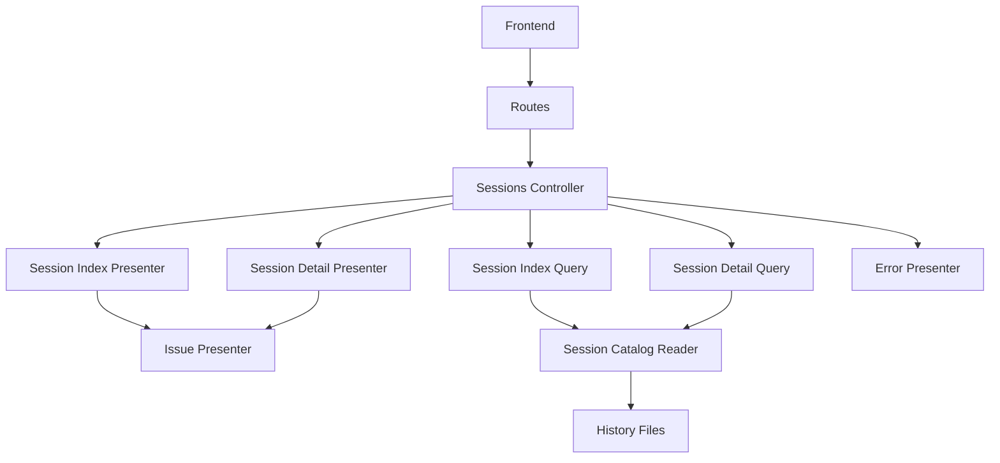
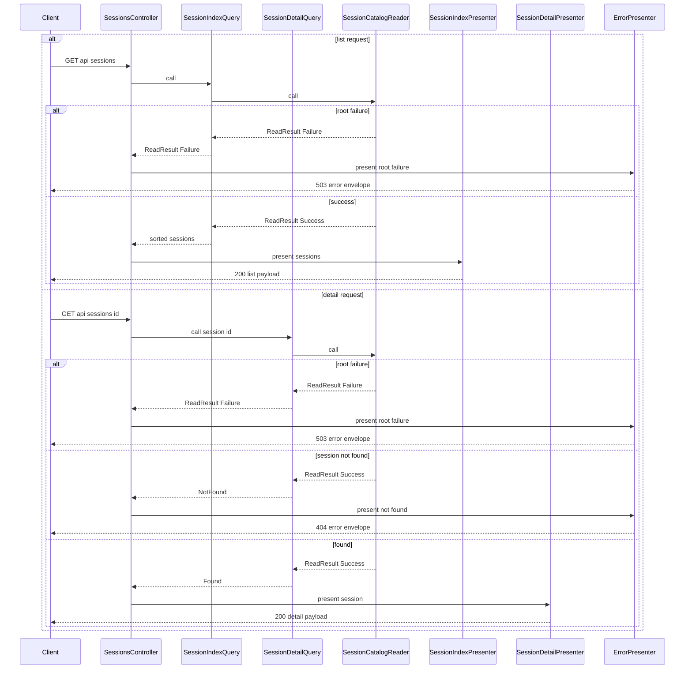

# Design Document

## Overview
この feature は、`backend-history-reader` が返す正規化済みセッションを、frontend と将来の API 利用側が使える read-only HTTP API として提供する。対象はセッション一覧取得と単一セッション詳細タイムライン取得に限定し、raw files の読取や current / legacy の差分吸収は upstream reader に委譲する。

backend は API-only Rails であり、今回の変更は `/api/sessions` の HTTP 境界と、その背後で reader 結果を API 契約へ写像する query / presenter 層を追加する。root 障害、session 局所の劣化、session 未検出を別々に扱える contract を固定し、frontend が自由文解釈なしで分岐できる状態を作る。

### Goals
- `GET /api/sessions` で current / legacy 混在セッションを単一契約の一覧として返す。
- `GET /api/sessions/:id` でヘッダ情報、補助 message snapshots、タイムラインを単一レスポンスで返す。
- root fatal、session not found、degraded success を別契約で表現し、空データと障害を混同させない。
- query / presenter / controller の責務を分離し、後続 spec が検索や永続化を追加するときの境界を保つ。

### Non-Goals
- repo / branch / date / model による検索・フィルタ
- DB 永続化、cache、再インデックス
- file watch、増分同期、バックグラウンド更新
- frontend 表示実装、認証・認可、外部公開前提の hardening

## Boundary Commitments

### This Spec Owns
- `GET /api/sessions` と `GET /api/sessions/:id` の route、controller、HTTP status、JSON 契約
- `backend-history-reader` の `ReadResult` / `NormalizedSession` / `ReadIssue` / `ReadFailure` を API payload へ写像する query / presenter
- current / legacy 共通 session schema と detail timeline schema の固定
- `session_not_found` を含む API 固有 error 契約と、reader root failure code を HTTP error へ透過写像するルール
- session 単位 / event 単位の劣化可視化ルール

### Out of Boundary
- `workspace.yaml`, `events.jsonl`, legacy JSON の parse / normalization
- reader の error code 追加・改名・所有権変更や正規化ロジック変更
- 永続化、検索インデックス、監視、キャッシュ
- frontend 側の state 管理、画面レイアウト、表示文言最適化
- 認証、認可、外部ネットワーク越し公開の設計

### Allowed Dependencies
- `CopilotHistory::SessionCatalogReader` とその公開型 (`ReadResult`, `NormalizedSession`, `NormalizedEvent`, `ReadIssue`, `ReadFailure`)
- `CopilotHistory::Errors::ReadErrorCode::ROOT_FAILURE_CODES` を root failure の canonical code source として参照すること
- Rails API controller / routing / JSON render
- `backend/lib/` autoload 配下の feature ロジック
- 既存 RSpec request spec と fixture helper

### Revalidation Triggers
- upstream reader の field / error code / result union が変わる場合
- API が local-only 前提を超えて認証や外部公開を必要とする場合
- list / detail 以外の endpoint や検索機能を追加する場合
- request ごとの full scan を許容できず cache / persistence を導入する場合

## Architecture

### Existing Architecture Analysis
- backend は `config.api_only = true` の Rails API で、現状の route は `/up` のみである。
- 履歴読取の責務は `backend/lib/copilot_history/` にあり、`SessionCatalogReader` が root failure と mixed session success を公開境界として固定している。
- `spec/support/copilot_history_fixture_helper.rb` と `spec/lib/copilot_history/*` により、mixed current / legacy fixture を使った reader 検証パターンが既にある。

### Architecture Pattern & Boundary Map



**Architecture Integration**:
- Selected pattern: query / presenter 分離。query は reader 呼び出しと session 抽出、presenter は JSON 契約整形、controller は status と render のみを担当する。
- Domain / feature boundaries: `CopilotHistory::Types` → `CopilotHistory::SessionCatalogReader` → `CopilotHistory::Api::Types` → `CopilotHistory::Api::Queries` → `CopilotHistory::Api::Presenters` → `Api::SessionsController`
- Existing patterns preserved: raw files 読取と format 吸収は reader 側へ残し、Rails app 側には endpoint と response mapping だけを追加する。
- New components rationale: list/detail query を分けることで not found と list sort を分離し、共通 issue / error presenter で契約 drift を防ぐ。
- Steering compliance: Rails API mode、`backend/lib/` autoload、read-only / raw files 正本の原則を維持する。

### Technology Stack

| Layer | Choice / Version | Role in Feature | Notes |
|-------|------------------|-----------------|-------|
| Backend / Services | Rails API 8.1, Ruby 4, Zeitwerk | endpoint、query、presenter、type union の実行基盤 | `backend/lib/` と `app/controllers` を併用 |
| Data / Storage | なし | API は in-memory で reader 結果を整形するだけ | MySQL / ActiveRecord は使わない |
| Infrastructure / Runtime | local filesystem via `CopilotHistory::SessionCatalogReader` | current / legacy session の読取元 | API 層は filesystem を直接触らない |

## File Structure Plan

### Directory Structure
```text
backend/
├── app/
│   └── controllers/
│       └── api/
│           └── sessions_controller.rb                    # index / show の HTTP entrypoint。query 結果を status + JSON へ写像する
├── lib/
│   └── copilot_history/
│       └── api/
│           ├── session_index_query.rb                    # reader を呼び、一覧用の deterministic order を決める
│           ├── session_detail_query.rb                   # reader を呼び、exact session_id lookup と not found を返す
│           ├── presenters/
│           │   ├── issue_presenter.rb                    # ReadIssue を共通 issue payload へ変換する
│           │   ├── session_index_presenter.rb            # NormalizedSession 一覧を summary payload へ変換する
│           │   ├── session_detail_presenter.rb           # NormalizedSession を header + timeline payload へ変換する
│           │   └── error_presenter.rb                    # root failure / session not found の共通 error envelope を返す
│           └── types/
│               └── session_lookup_result.rb              # detail query 専用の Found / NotFound union
├── config/
│   └── routes.rb                                         # `/api/sessions` と `/api/sessions/:id` だけを追加する
└── spec/
    ├── requests/
    │   └── api/
    │       └── sessions_spec.rb                          # list / detail / root failure / not found の request 契約を確認する
    └── lib/
        └── copilot_history/
            └── api/
                ├── session_index_query_spec.rb           # list query の success / failure / sorting を確認する
                ├── session_detail_query_spec.rb          # detail query の found / not found / root failure を確認する
                ├── presenters/
                │   ├── issue_presenter_spec.rb           # issue payload の scope / event_sequence を固定する
                │   ├── session_index_presenter_spec.rb   # current / legacy 共通 summary schema を固定する
                │   ├── session_detail_presenter_spec.rb  # timeline order、raw_payload、message_snapshots を固定する
                │   └── error_presenter_spec.rb           # error envelope と status mapping を固定する
                └── types/
                    └── session_lookup_result_spec.rb     # detail query union の public shape を固定する
```

### Modified Files
- `backend/config/routes.rb` — `api` namespace の read-only route として `sessions#index` / `sessions#show` を追加する

## System Flows



- list query は `updated_at || created_at` を優先し、欠落時は `session_id` を tie breaker とする deterministic order を適用する。これは UI 安定化のための並び順であり、検索機能の導入まではこの spec が所有する。
- detail query は reader success から exact `session_id` match を 1 件だけ抽出する。reader の mixed current / legacy 成功境界は変更しない。
- presenter は degraded success を 200 のまま返し、issue を session / event へ再配置する。

## Requirements Traceability

| Requirement | Summary | Components | Interfaces | Flows |
|-------------|---------|------------|------------|-------|
| 1.1 | current / legacy を同じ一覧契約で返す | `SessionIndexQuery`, `SessionIndexPresenter` | SessionIndexResponse | list request |
| 1.2 | session ID、source format、日時、作業コンテキスト要約を返す | `SessionIndexPresenter` | SessionSummary payload | list request |
| 1.3 | issue を持つ session を識別しつつ一覧返却を継続する | `SessionIndexQuery`, `IssuePresenter`, `SessionIndexPresenter` | issue payload | list request |
| 1.4 | read-only 取得操作として提供する | `Api::SessionsController`, `routes.rb` | GET `/api/sessions` | list request |
| 2.1 | 単一 session の header と timeline を単一レスポンスで返す | `SessionDetailQuery`, `SessionDetailPresenter`, `Api::SessionsController` | SessionDetailResponse | detail request |
| 2.2 | timeline の観測順を保持する | `SessionDetailPresenter` | TimelineEvent payload | detail request |
| 2.3 | event 種別、順序、表示内容、劣化有無を識別可能に返す | `SessionDetailPresenter`, `IssuePresenter` | TimelineEvent payload, issue payload | detail request |
| 2.4 | session 未検出を root 障害と区別して返す | `SessionDetailQuery`, `ErrorPresenter`, `SessionLookupResult` | ErrorResponse | detail request |
| 3.1 | history root 障害を識別可能な error 応答で返し、空成功を返さない | `SessionIndexQuery`, `SessionDetailQuery`, `ErrorPresenter` | ErrorResponse | list request, detail request |
| 3.2 | metadata 読取失敗や壊れた event data を正常データと区別して返す | `IssuePresenter`, `SessionIndexPresenter`, `SessionDetailPresenter` | issue payload, degraded flags | list request, detail request |
| 3.3 | issue 情報を session または event に対応づけて返す | `IssuePresenter`, `SessionDetailPresenter` | issue payload | detail request |
| 3.4 | 一貫した error 契約を list / detail の両方で使う | `ErrorPresenter`, `Api::SessionsController` | ErrorResponse | list request, detail request |
| 4.1 | current / legacy を共通 session 契約で扱う | `SessionIndexPresenter`, `SessionDetailPresenter` | SessionSummary payload, SessionDetail payload | list request, detail request |
| 4.2 | format 差分による利用可能情報と欠落情報を区別して返す | `SessionIndexPresenter`, `SessionDetailPresenter` | nullable fields, empty arrays | list request, detail request |
| 4.3 | 一覧取得と単一詳細取得だけを提供する | `routes.rb`, `Api::SessionsController` | GET endpoints only | list request, detail request |
| 4.4 | 検索、永続化、監視を契約に含めない | Boundary Commitments, File Structure Plan | route / file scope | architecture boundary |

## Components and Interfaces

| Component | Domain/Layer | Intent | Req Coverage | Key Dependencies (P0/P1) | Contracts |
|-----------|--------------|--------|--------------|--------------------------|-----------|
| `Api::SessionsController` | HTTP boundary | request を list / detail query と presenter へ中継し、status を決める | 1.4, 2.1, 3.4, 4.3 | `SessionIndexQuery` (P0), `SessionDetailQuery` (P0), `ErrorPresenter` (P0) | API |
| `CopilotHistory::Api::SessionIndexQuery` | Application query | reader success / failure を一覧取得ユースケースへ写像する | 1.1, 1.3, 3.1 | `SessionCatalogReader` (P0) | Service, State |
| `CopilotHistory::Api::SessionDetailQuery` | Application query | exact session lookup と not found 判定を担う | 2.1, 2.4, 3.1 | `SessionCatalogReader` (P0), `SessionLookupResult` (P0) | Service, State |
| `CopilotHistory::Api::Presenters::SessionIndexPresenter` | Presentation | session 一覧を共通 summary payload へ変換する | 1.1, 1.2, 1.3, 4.1, 4.2 | `IssuePresenter` (P0) | Service |
| `CopilotHistory::Api::Presenters::SessionDetailPresenter` | Presentation | header、message snapshots、timeline を detail payload へ変換する | 2.1, 2.2, 2.3, 3.2, 3.3, 4.1, 4.2 | `IssuePresenter` (P0) | Service |
| `CopilotHistory::Api::Presenters::IssuePresenter` | Presentation | `ReadIssue` を共通 issue contract へ変換する | 1.3, 2.3, 3.2, 3.3 | `ReadIssue` (P0) | Service |
| `CopilotHistory::Api::Presenters::ErrorPresenter` | Presentation | root failure / session not found の一貫した error envelope を返す | 2.4, 3.1, 3.4 | `ReadFailure` (P0) | Service |
| `CopilotHistory::Api::Types::SessionLookupResult` | Type boundary | detail query の Found / NotFound union を固定する | 2.4 | `NormalizedSession` (P0) | State |

### HTTP Boundary

#### `Api::SessionsController`

| Field | Detail |
|-------|--------|
| Intent | read-only session API の唯一の controller として list / detail endpoint を公開する |
| Requirements | 1.4, 2.1, 3.4, 4.3 |

**Responsibilities & Constraints**
- `index` は `SessionIndexQuery` の結果を 200 または error envelope へ写像する。
- `show` は `DetailQueryResult = Found | NotFound | ReadResult::Failure` だけを受け取り、case ごとに 1 つの presenter / status へ振り分ける。
- reader や `NormalizedSession` を直接 JSON 化せず、必ず presenter を通す。
- POST / PATCH / DELETE を持たず、side effect を発生させない。

**Dependencies**
- Inbound: Rails routing — HTTP GET request の到達点 (P0)
- Outbound: `CopilotHistory::Api::SessionIndexQuery` — 一覧取得 (P0)
- Outbound: `CopilotHistory::Api::SessionDetailQuery` — 詳細取得 (P0)
- Outbound: `CopilotHistory::Api::Presenters::SessionIndexPresenter` — 一覧 payload 生成 (P0)
- Outbound: `CopilotHistory::Api::Presenters::SessionDetailPresenter` — 詳細 payload 生成 (P0)
- Outbound: `CopilotHistory::Api::Presenters::ErrorPresenter` — error envelope 生成 (P0)

**Contracts**: Service [ ] / API [x] / Event [ ] / Batch [ ] / State [ ]

##### API Contract
| Method | Endpoint | Request | Response | Errors |
|--------|----------|---------|----------|--------|
| GET | `/api/sessions` | なし | `SessionIndexResponse` | `503` `root_missing`, `root_permission_denied`, `root_unreadable` |
| GET | `/api/sessions/:id` | path `id` | `SessionDetailResponse` | `404` `session_not_found`, `503` root failure codes |

##### State Management
- State model: `index` は `ReadResult::Success | ReadResult::Failure`、`show` は `DetailQueryResult = SessionLookupResult::Found | SessionLookupResult::NotFound | ReadResult::Failure`
- Persistence & consistency: query が返した union を controller が 1 回だけ HTTP へ写像し、途中で Hash 化しない
- Concurrency strategy: request 単位の immutable result object を case 分岐で扱う

##### Result Mapping
| Query Result | Presenter | HTTP Status | `error.code` の所有者 |
|--------------|-----------|-------------|------------------------|
| `ReadResult::Success` (index) | `SessionIndexPresenter` | `200` | 該当なし |
| `SessionLookupResult::Found` | `SessionDetailPresenter` | `200` | 該当なし |
| `SessionLookupResult::NotFound` | `ErrorPresenter#from_not_found` | `404` | API 契約 (`session_not_found`) |
| `ReadResult::Failure` | `ErrorPresenter#from_read_failure` | `503` | upstream reader (`ReadFailure.code`) |

**Implementation Notes**
- Integration: `host! "localhost"` を使う request spec で `/api/sessions` と `/api/sessions/:id` を固定する。
- Validation: controller spec は増やさず request spec で status と body 契約を確認する。
- Risks: controller に issue grouping や sort を持ち込むと query / presenter 境界が崩れる。

### Query Layer

#### `CopilotHistory::Api::SessionIndexQuery`

| Field | Detail |
|-------|--------|
| Intent | `SessionCatalogReader` の結果を一覧ユースケースとして返し、deterministic order を与える |
| Requirements | 1.1, 1.3, 3.1 |

**Responsibilities & Constraints**
- `SessionCatalogReader#call` を 1 回だけ呼び、root failure はそのまま返す。
- success 時は session 配列を UI 向けの deterministic order に並べる。
- issue を削除せず、session payload へ引き渡す。
- detail lookup や HTTP status 判定を持たない。

**Dependencies**
- Inbound: `Api::SessionsController#index` — list request 処理 (P0)
- Outbound: `CopilotHistory::SessionCatalogReader` — mixed current / legacy session 読取 (P0)

**Contracts**: Service [x] / API [ ] / Event [ ] / Batch [ ] / State [x]

##### Service Interface
```ruby
module CopilotHistory
  module Api
    class SessionIndexQuery
      # @return [CopilotHistory::Types::ReadResult::Success, CopilotHistory::Types::ReadResult::Failure]
      def call; end
    end
  end
end
```
- Preconditions: `SessionCatalogReader` が利用可能であること。
- Postconditions: root failure 時は `ReadResult::Failure`、success 時は sort 済み `sessions` を持つ `ReadResult::Success` を返す。
- Invariants: reader の `issues` と `root` を破棄しない。

**Implementation Notes**
- Integration: sort key は `updated_at || created_at || Time.at(0)` の降順、同順位時は `session_id` 昇順とする。
- Validation: mixed root fixture で current / legacy が同一レスポンスへ残ることを確認する。
- Risks: query が summary field 生成まで担うと presenter と責務重複する。

#### `CopilotHistory::Api::SessionDetailQuery`

| Field | Detail |
|-------|--------|
| Intent | success 結果から指定 session を抽出し、not found を API 固有 union で返す |
| Requirements | 2.1, 2.4, 3.1 |

**Responsibilities & Constraints**
- `SessionCatalogReader#call` を 1 回だけ呼び、root failure はそのまま返す。
- success 時は exact `session_id` match を 1 件検索し、見つかれば `Found`、なければ `NotFound` を返す。
- session lookup は API 固有責務であり、reader へ逆流させない。
- partial / unknown event を含む session でも detail success として返す。

**Dependencies**
- Inbound: `Api::SessionsController#show` — detail request 処理 (P0)
- Outbound: `CopilotHistory::SessionCatalogReader` — session catalog 読取 (P0)
- Outbound: `CopilotHistory::Api::Types::SessionLookupResult` — detail lookup union (P0)

**Contracts**: Service [x] / API [ ] / Event [ ] / Batch [ ] / State [x]

##### Service Interface
```ruby
module CopilotHistory
  module Api
    class SessionDetailQuery
      # @return [
      #   CopilotHistory::Api::Types::SessionLookupResult::Found,
      #   CopilotHistory::Api::Types::SessionLookupResult::NotFound,
      #   CopilotHistory::Types::ReadResult::Failure
      # ]
      def call(session_id:); end
    end
  end
end
```
- Preconditions: `session_id` は空文字でない string とする。
- Postconditions: found 時は `Found(root:, session:)`、未検出時は `NotFound(session_id:)`、root failure 時は upstream の `ReadResult::Failure(failure:)` を返す。
- Invariants: `session_id` 比較は exact match で行い、source format ごとの特別扱いをしない。query は HTTP status や error Hash を生成しない。

##### State Management
- State model: `DetailQueryResult = SessionLookupResult::Found | SessionLookupResult::NotFound | ReadResult::Failure`
- Persistence & consistency: `Found` / `NotFound` は API 層所有、`ReadResult::Failure` は upstream 所有のまま透過する
- Concurrency strategy: request ごとに 1 回だけ reader を実行し、返却 union を不変オブジェクトとして扱う

**Implementation Notes**
- Integration: detail endpoint は list endpoint と同じ reader 実行経路を通す。
- Validation: readable root に存在しない `session_id` が 404 へ写像されることを request spec で固定する。
- Risks: future filter 導入時に query signature が肥大化する可能性があるため、MVP は `session_id` のみを受け取る。

#### `CopilotHistory::Api::Types::SessionLookupResult`

| Field | Detail |
|-------|--------|
| Intent | detail query の found / not found を HTTP とは独立して表現する |
| Requirements | 2.4 |

**Responsibilities & Constraints**
- `Found(root:, session:)` は presenter に必要な `ResolvedHistoryRoot` と `NormalizedSession` を保持する。
- `NotFound(session_id:)` は API error payload のための検索対象 ID だけを保持する。
- root failure を再定義せず、既存 `ReadResult::Failure` を再利用する。

**Dependencies**
- Inbound: `SessionDetailQuery` — lookup result 生成 (P0)
- Outbound: `NormalizedSession` — found payload (P0)

**Contracts**: Service [ ] / API [ ] / Event [ ] / Batch [ ] / State [x]

##### State Management
- State model: `Found(root:, session:)` / `NotFound(session_id:)`
- Persistence & consistency: request 内だけで生成・消費し、永続化しない
- Concurrency strategy: shared mutable state を持たない immutable Data object とする

**Implementation Notes**
- Integration: controller は `case` 分岐で class 判定するだけに留める。
- Validation: union shape を spec で固定し、追加 field の流出を防ぐ。
- Risks: found / not found 以外の state を増やすと error contract が曖昧になる。

### Presentation Layer

#### `CopilotHistory::Api::Presenters::SessionIndexPresenter`

| Field | Detail |
|-------|--------|
| Intent | `NormalizedSession` 一覧を current / legacy 共通の summary payload に変換する |
| Requirements | 1.1, 1.2, 1.3, 4.1, 4.2 |

**Responsibilities & Constraints**
- session summary field を固定し、format ごとの差分は `null` と空配列で表現する。
- `degraded` は `issues.any?` で算出し、issue payload は共通 shape へ写像する。
- list endpoint では timeline 全件を返さず、summary に必要な件数だけを返す。
- reader object をそのまま expose しない。

**Dependencies**
- Inbound: `Api::SessionsController#index` — success response 整形 (P0)
- Outbound: `IssuePresenter` — issue payload 変換 (P0)

**Contracts**: Service [x] / API [ ] / Event [ ] / Batch [ ] / State [ ]

##### Service Interface
```ruby
module CopilotHistory
  module Api
    module Presenters
      class SessionIndexPresenter
        # @param result [CopilotHistory::Types::ReadResult::Success]
        # @return [Hash]
        def call(result:); end
      end
    end
  end
end
```
- Preconditions: `result` は `ReadResult::Success` であること。
- Postconditions: `data` 配列の各要素は共通 session summary schema を持つ。
- Invariants: list payload で current / legacy 別 schema を作らない。

**Implementation Notes**
- Integration: `work_context` は `cwd`, `git_root`, `repository`, `branch` を固定 key とし、欠落は `null` とする。
- Validation: legacy summary に `selected_model` が入り、current summary では同 field が `null` になることを確認する。
- Risks: summary に detail 専用 field を入れすぎると payload が肥大化する。

#### `CopilotHistory::Api::Presenters::SessionDetailPresenter`

| Field | Detail |
|-------|--------|
| Intent | 単一 session を header、supplemental message snapshots、timeline payload へ変換する |
| Requirements | 2.1, 2.2, 2.3, 3.2, 3.3, 4.1, 4.2 |

**Responsibilities & Constraints**
- `events` の順序を変更せずに timeline payload を生成する。
- event issue を sequence ごとにグルーピングし、該当 event の `issues` へ入れる。
- legacy `message_snapshots` は detail payload の補助情報として返し、timeline へ混ぜない。
- `raw_payload` を detail payload に残し、unknown / partial event の診断可能性を維持する。

**Dependencies**
- Inbound: `Api::SessionsController#show` — found response 整形 (P0)
- Outbound: `IssuePresenter` — issue payload 変換 (P0)

**Contracts**: Service [x] / API [ ] / Event [ ] / Batch [ ] / State [ ]

##### Service Interface
```ruby
module CopilotHistory
  module Api
    module Presenters
      class SessionDetailPresenter
        # @param result [CopilotHistory::Api::Types::SessionLookupResult::Found]
        # @return [Hash]
        def call(result:); end
      end
    end
  end
end
```
- Preconditions: `result` は `Found(root:, session:)` であること。
- Postconditions: `timeline` は reader の `sequence` 順を保持し、各 event に `degraded` と `issues` を持つ。
- Invariants: `message_snapshots` は timeline へ再配置しない。

**Implementation Notes**
- Integration: session-level issue は `session.issues` のうち `sequence.nil?` を header 側へ、event-level issue は `sequence` ごとに event 側へ配置する。
- Validation: unknown / partial event が `raw_type`, `raw_payload`, `degraded`, `issues` を持つことを spec で確認する。
- Risks: event issue grouping を controller へ漏らすと request spec 以外での再利用が難しくなる。

#### `CopilotHistory::Api::Presenters::IssuePresenter`

| Field | Detail |
|-------|--------|
| Intent | `ReadIssue` を list / detail 共通の issue payload へ写像する |
| Requirements | 1.3, 2.3, 3.2, 3.3 |

**Responsibilities & Constraints**
- `sequence` の有無から `scope` を `session` または `event` に決定する。
- `source_path` は string 化して返し、`event_sequence` は event issue のみ値を持つ。
- error / warning を文字列 contract へ固定する。
- session / detail 用の別 schema を作らない。
- `ReadIssue` の canonical field は削除せず、JSON 互換な型と位置情報へだけ正規化する。

**Dependencies**
- Inbound: `SessionIndexPresenter` — list issue 変換 (P0)
- Inbound: `SessionDetailPresenter` — detail issue 変換 (P0)
- Outbound: `ReadIssue` — canonical source (P0)

**Contracts**: Service [x] / API [ ] / Event [ ] / Batch [ ] / State [ ]

##### Service Interface
```ruby
module CopilotHistory
  module Api
    module Presenters
      class IssuePresenter
        # @param issue [CopilotHistory::Types::ReadIssue]
        # @return [Hash]
        def call(issue:); end
      end
    end
  end
end
```
- Preconditions: `issue` は `ReadIssue` であること。
- Postconditions: payload は `code`, `severity`, `message`, `source_path`, `scope`, `event_sequence` を持つ。
- Invariants: `scope == "event"` のときだけ `event_sequence` を持つ。

##### API Contract
| Source | Output | Rules |
|--------|--------|-------|
| `ReadIssue(code:, message:, source_path:, sequence: nil, severity:)` | `ApiIssue` | `scope: "session"`, `event_sequence: null` |
| `ReadIssue(code:, message:, source_path:, sequence: Integer, severity:)` | `ApiIssue` | `scope: "event"`, `event_sequence` は `sequence` と同値 |

**Implementation Notes**
- Integration: detail presenter はこの payload を event ごとに再配置するが shape は変えない。`ReadIssue` canonical field は削除せず、JSON 互換な型へだけ正規化する。
- Validation: warning issue と error issue の両方が文字列 severity で返り、`sequence` が `scope` / `event_sequence` へ一意に写像されることを確認する。
- Risks: source path を削除すると運用切り分けが弱くなる。

#### `CopilotHistory::Api::Presenters::ErrorPresenter`

| Field | Detail |
|-------|--------|
| Intent | root failure と session not found を一貫した error envelope へ変換する |
| Requirements | 2.4, 3.1, 3.4 |

**Responsibilities & Constraints**
- root failure code を保持したまま `503` へ写像する。
- `session_not_found` を `404` で返し、root failure と混同させない。
- `ReadFailure.code` は upstream reader 所有のまま透過し、API 層はそれを改名・再分類しない。
- `session_not_found` は API 契約所有の唯一の追加 code とし、`CopilotHistory::Errors::ReadErrorCode` へ逆流させない。
- list / detail の両 endpoint で同じ error payload shape を返す。
- degraded success を error envelope へ変換しない。

**Dependencies**
- Inbound: `Api::SessionsController` — error response 整形 (P0)
- Outbound: `ReadFailure` — root failure payload (P0)
- Outbound: `SessionLookupResult::NotFound` — detail not found payload (P0)

**Contracts**: Service [x] / API [ ] / Event [ ] / Batch [ ] / State [ ]

##### Service Interface
```ruby
module CopilotHistory
  module Api
    module Presenters
      class ErrorPresenter
        # @return [Array(Symbol, Hash)]
        def from_read_failure(failure:); end

        # @return [Array(Symbol, Hash)]
        def from_not_found(session_id:); end
      end
    end
  end
end
```
- Preconditions: `failure` は `ReadFailure`、`session_id` は空文字でない string であること。
- Postconditions: 戻り値は `status` と `error` envelope を返し、`error.code` は機械判別可能である。
- Invariants: list / detail で payload shape を変えない。

##### API Contract
| Input | Response Shape | Status | Code Ownership |
|-------|----------------|--------|----------------|
| `ReadFailure(code:, path:, message:)` | `{ error: { code, message, details: { path } } }` | `503` | upstream reader |
| `SessionLookupResult::NotFound(session_id:)` | `{ error: { code: "session_not_found", message, details: { session_id } } }` | `404` | API 契約 |

**Implementation Notes**
- Integration: error envelope は `{ error: { code, message, details } }` を固定 shape とする。
- Validation: `root_missing` / `root_permission_denied` / `root_unreadable` が全て 503 で返り、`session_not_found` が 404 で返ることを確認する。
- Risks: status mapping を controller 側に分散させると list / detail で差異が生じやすい。

## Data Models

### Domain Model
- **Upstream reader result**: `CopilotHistory::Types::ReadResult::Success(root:, sessions:)` または `ReadResult::Failure(failure:)`
- **Detail lookup result**: `CopilotHistory::Api::Types::SessionLookupResult::Found(root:, session:)` または `NotFound(session_id:)`
- **Detail query result union**: `DetailQueryResult = SessionLookupResult::Found | SessionLookupResult::NotFound | ReadResult::Failure`
- **API session summary**: list endpoint が返す共通 session 概要
- **API session detail**: detail endpoint が返す header、message snapshots、timeline
- **API issue**: session / event へ結びつく機械判別可能な劣化情報
- **API error**: root failure または `session_not_found` を表す fatal envelope

### Logical Data Model

| Entity | Key Fields | Source | Notes |
|--------|------------|--------|-------|
| `SessionSummary` | `id`, `source_format`, `created_at`, `updated_at`, `work_context`, `selected_model`, `event_count`, `message_snapshot_count`, `degraded`, `issues` | `NormalizedSession` | list endpoint 用。timeline は含まない |
| `SessionDetail` | `id`, `source_format`, `created_at`, `updated_at`, `work_context`, `selected_model`, `degraded`, `issues`, `message_snapshots`, `timeline` | `NormalizedSession` | detail endpoint 用 |
| `TimelineEvent` | `sequence`, `kind`, `raw_type`, `occurred_at`, `role`, `content`, `raw_payload`, `degraded`, `issues` | `NormalizedEvent` | event 順序は reader の canonical sequence をそのまま使う |
| `ApiIssue` | `code`, `severity`, `message`, `source_path`, `scope`, `event_sequence` | `ReadIssue` | `scope` は `session` / `event` |
| `ApiError` | `code`, `message`, `details` | `ReadFailure` または API 固有 not found | list / detail 共通 |

### Data Contracts & Integration

**SessionIndexResponse**

| Field | Type | Notes |
|-------|------|-------|
| `data` | `SessionSummary[]` | sort 済み一覧 |
| `meta.count` | Integer | 返却 session 数 |
| `meta.partial_results` | Boolean | `issues.any?` な session が 1 件でもあれば `true` |

**SessionSummary**

| Field | Type | Notes |
|-------|------|-------|
| `id` | String | `session.session_id` |
| `source_format` | String | `current` / `legacy` |
| `created_at` | String or null | ISO8601 |
| `updated_at` | String or null | ISO8601 |
| `work_context.cwd` | String or null | current で取得可能な場合のみ値を持つ |
| `work_context.git_root` | String or null | 同上 |
| `work_context.repository` | String or null | 同上 |
| `work_context.branch` | String or null | 同上 |
| `selected_model` | String or null | legacy で取得可能な場合のみ値を持つ |
| `event_count` | Integer | `events.length` |
| `message_snapshot_count` | Integer | `message_snapshots.length` |
| `degraded` | Boolean | `issues.any?` |
| `issues` | `ApiIssue[]` | event 由来 issue は `scope: "event"` と `event_sequence` を持つ |

**SessionDetailResponse**

| Field | Type | Notes |
|-------|------|-------|
| `data` | `SessionDetail` | 単一 session payload |

**SessionDetail**

| Field | Type | Notes |
|-------|------|-------|
| `id` | String | `session.session_id` |
| `source_format` | String | `current` / `legacy` |
| `created_at` | String or null | ISO8601 |
| `updated_at` | String or null | ISO8601 |
| `work_context` | Object | list と同じ field を固定 key で持つ |
| `selected_model` | String or null | legacy 由来の補助情報 |
| `degraded` | Boolean | session または event に issue があれば `true` |
| `issues` | `ApiIssue[]` | session-level issue のみ。`scope` は `session` |
| `message_snapshots` | Array | legacy `chatMessages`。current は空配列 |
| `timeline` | `TimelineEvent[]` | canonical sequence 順 |

**TimelineEvent**

| Field | Type | Notes |
|-------|------|-------|
| `sequence` | Integer | reader の canonical sequence |
| `kind` | String | `message` / `partial` / `unknown` |
| `raw_type` | String | upstream event type |
| `occurred_at` | String or null | ISO8601 |
| `role` | String or null | `user` / `assistant` など |
| `content` | String or null | 表示可能な本文 |
| `raw_payload` | Object or Array or String or null | 診断・未知 shape 表示用 |
| `degraded` | Boolean | event-level issue が存在する場合 `true` |
| `issues` | `ApiIssue[]` | `scope` は `event`、`event_sequence` は当該 sequence と一致 |

**ApiIssue**

| Field | Type | Notes |
|-------|------|-------|
| `code` | String | reader issue code |
| `severity` | String | `warning` / `error` |
| `message` | String | 機械判別 code を補う説明 |
| `source_path` | String | 局所障害の発生元 path |
| `scope` | String | `session` / `event` |
| `event_sequence` | Integer or null | event issue のときのみ値を持つ |

**ReadIssue to ApiIssue Mapping**

| ReadIssue field | API field | Transformation | Notes |
|-----------------|-----------|----------------|-------|
| `code` | `code` | 変換なし | canonical issue code を保持する |
| `severity` | `severity` | `:warning` / `:error` を `"warning"` / `"error"` へ文字列化する | JSON 契約を固定する |
| `message` | `message` | 変換なし | 表示・診断用メッセージを保持する |
| `source_path` | `source_path` | `Pathname` を string へ変換する | レスポンスの JSON 互換性を保つ |
| `sequence` | `scope`, `event_sequence` | `nil` なら `scope: "session"`, 非 `nil` なら `scope: "event"` かつ同値を `event_sequence` へ写像する | event 配置と session 配置の両方で同一 schema を使う |
| dropped field | なし | canonical field は全て表現する | detail presenter は event issue を再配置するが field は削除しない |

**ApiError**

| Field | Type | Notes |
|-------|------|-------|
| `error.code` | String | `root_*` は `ReadFailure.code` を透過利用し、`session_not_found` だけを API 固有 code とする |
| `error.message` | String | 利用側が表示可能な説明 |
| `error.details.path` | String or null | root failure のみ |
| `error.details.session_id` | String or null | not found のみ |

### Physical Data Model
この feature は物理ストレージを持たない。request ごとに reader を実行し、in-memory で sort / lookup / presentation を行う。

## Error Handling

### Error Strategy
- root failure は reader code を保持したまま error envelope と `503` へ写像し、空の `data` を返さない。
- `session_not_found` は detail query が生成し、root failure と別の `404` error envelope として返す。
- session / event の劣化は success response のまま `degraded` と `issues` で返す。
- controller は broad rescue を追加せず、feature が所有する既知 failure のみを明示的に分岐する。

### Error Code Ownership and Mapping

| Code Family | Canonical Owner | Generated By | HTTP Surface Rule |
|-------------|-----------------|--------------|-------------------|
| `root_missing`, `root_permission_denied`, `root_unreadable` | `CopilotHistory::Errors::ReadErrorCode` / `ReadFailure` | upstream reader | `ErrorPresenter#from_read_failure` が code を透過し `503` へ写像する |
| `current.*`, `legacy.*`, `event.*` | `CopilotHistory::Errors::ReadErrorCode` / `ReadIssue` | upstream reader | success payload の `issues` にのみ現れ、fatal error へ昇格しない |
| `session_not_found` | API 契約 | `SessionDetailQuery` + `ErrorPresenter#from_not_found` | detail endpoint のみで `404` error envelope として返す |

- API 層は reader code taxonomy を再定義せず、HTTP 文脈で新設する code を `session_not_found` に限定する。
- 将来 API 固有 code を増やす場合も、reader code への追加ではなく API 境界の契約変更として扱う。

### Error Categories and Responses
- **Root Failures (503)**: `root_missing`, `root_permission_denied`, `root_unreadable` → `{ error: { code, message, details.path } }`
- **Lookup Error (404)**: `session_not_found` → `{ error: { code, message, details.session_id } }`
- **Degraded Success (200)**: `current.workspace_parse_failed`, `current.event_parse_failed`, `legacy.json_parse_failed`, `event.partial_mapping`, `event.unknown_shape` など → session / event payload の `issues`

### Monitoring
- file-level issue と root failure の logging は `SessionCatalogReader` 既存実装を一次ソースとする。
- API 層は同じ issue を再度 warning/error logging しない。重複 log を避け、HTTP 契約の責務に集中する。
- `session_not_found` は request 文脈の切り分け用に controller で info レベル記録してよいが、failure code 体系には混ぜない。

## Testing Strategy

### Unit Tests
- `SessionIndexQuery` が root failure をそのまま返し、success 時に mixed current / legacy を deterministic order へ並べること
- `SessionDetailQuery` が `DetailQueryResult` として found / not found / root failure を正しく分岐し、HTTP status を持ち込まないこと
- `SessionIndexPresenter` が current / legacy 両方を同一 summary schema へ写像し、欠落 field を `null` または空配列で返すこと
- `SessionDetailPresenter` が timeline sequence を保持し、event issue を該当 event にだけ割り当てること
- `IssuePresenter` が `ReadIssue` の canonical field を落とさず、`severity` / `source_path` / `sequence` を JSON 契約へ正規化すること
- `ErrorPresenter` が root failure code を透過し、`session_not_found` だけを API 固有 code として返すこと

### Integration Tests
- `GET /api/sessions` が mixed root fixture から current / legacy を同一 payload で返すこと
- `GET /api/sessions` で session 局所の issue があっても 200 を返し、`degraded` と `issues` で識別できること
- `GET /api/sessions` で root failure が起きたとき、空の `data` ではなく `503` error envelope を返すこと
- `GET /api/sessions/:id` が header、message_snapshots、timeline を単一レスポンスで返し、timeline order を保持すること
- `GET /api/sessions/:id` が unknown / partial event の `raw_payload` と event issue を保持すること
- `GET /api/sessions/:id` が `session_not_found` を `404` で返し、root failure と code / details が異なること

### Performance / Load
- list / detail とも request 中に `SessionCatalogReader` を 1 回だけ呼ぶこと
- presenter が event 配列を追加コピーしすぎず、issue grouping を線形処理で完結させること

### Security Considerations
- endpoint は GET のみで read-only とし、mutation path を追加しない。
- `source_path` と `raw_payload` を返す設計はローカル利用前提であり、外部公開やマルチユーザー環境に拡張する場合は再設計を必須とする。
- API 層は raw payload を評価・実行せず、reader が返した JSON 互換値をそのまま serialize するだけに留める。

### Performance & Scalability
- MVP では cache / DB を持たず、request ごとの full scan を許容する。
- 履歴件数増加で UI 応答が悪化した場合は、この spec を拡張せず検索 / 永続化 spec へ責務移譲する。
