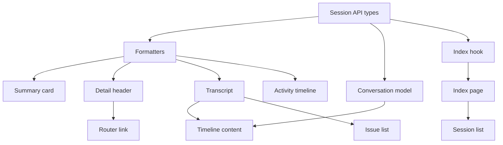
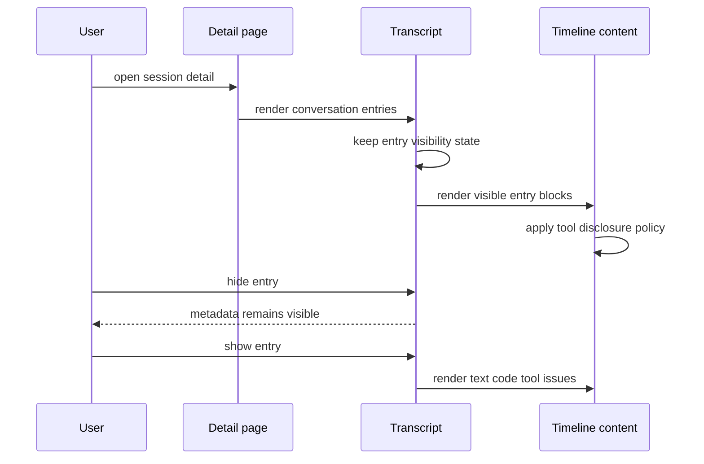
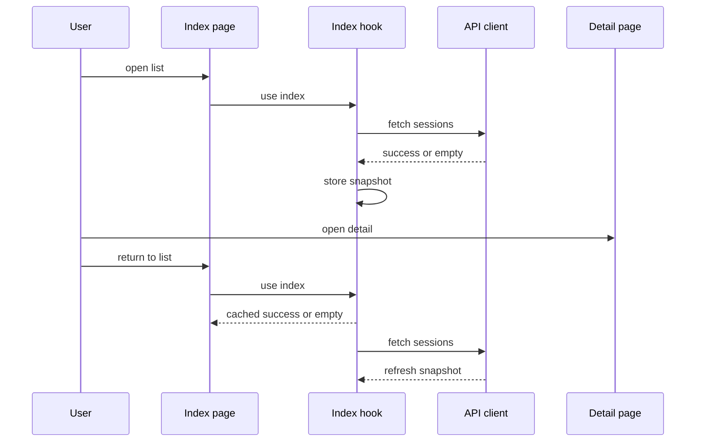

# Design Document

## Overview
この feature は、GitHub Copilot CLI のローカル会話履歴を読み返す利用者に、詳細画面で会話の流れを素早く把握できる read-only 表示を提供する。利用者は User / Assistant の発話主体、JST の発生時刻、degraded / issue 情報、長い tool call の存在を見分けながら、必要な発話だけを開いて読める。

変更は `frontend-session-ui` の既存 React UI に対する拡張である。backend API 契約、履歴読取、current / legacy 正規化は変更せず、表示 formatter、conversation presentation model、transcript component、tool call disclosure、`useSessionIndex` の軽量 cache に責務を閉じる。

### Goals
- 一覧、詳細 header、会話、activity timeline の日時を JST として識別できる形式で表示する。
- User / Assistant 発話を badge だけでなく card の背景、枠線、強調表示でも区別する。
- 発話単位で本文、code block、tool call 補助情報、発話内 issue を表示 / 非表示にできる。
- `skill-context`、複数行、truncated の tool call arguments を初期状態で折りたたむ。
- 詳細から一覧へ戻ったとき、直前に成功表示した一覧または空状態を即時再利用する。

### Non-Goals
- backend API contract、reader、presenter、current / legacy 正規化の変更
- 検索、絞り込み、並び替え、手動再読み込み、自動更新の追加
- タイムゾーン選択 UI、折りたたみ状態の永続化、raw payload 専用 viewer
- 編集、削除、送信、共有など read-only 境界を越える操作
- 外部状態管理 library または data fetching library の導入

## Boundary Commitments

### This Spec Owns
- frontend の日時表示 contract としての `formatTimestamp` の JST 表示規則。
- conversation transcript の role 別 visual treatment と発話単位の transient visibility state。
- tool hint visual block の初期折りたたみ判定と `TimelineContent` の disclosure UI。
- `useSessionIndex` 内に閉じた直近 success / empty の module-scope cache。
- 上記表示挙動を固定する frontend unit / component tests。

### Out of Boundary
- `GET /api/sessions` と `GET /api/sessions/:id` の response shape、sort、error envelope。
- 履歴ファイルの読取、欠損補正、tool call 正規化、issue 生成。
- activity timeline 全体の再設計や raw payload 常時表示。
- session 一覧の検索、filter、sort、refresh、polling。
- localStorage、URL query、DB、backend cache などへの UI state 永続化。

### Allowed Dependencies
- `frontend/src/features/sessions/api/sessionApi.types.ts` の既存 DTO。
- React 19 の component state と event handler。
- browser 標準の `Intl.DateTimeFormat` と `timeZone: 'Asia/Tokyo'`。
- 既存の Tailwind CSS 4 utility styling。
- 既存の `react-router` route lifecycle と `Link` navigation。
- Vitest、Testing Library、既存 test setup。

### Revalidation Triggers
- backend DTO で `conversation.entries`, `tool_calls`, `occurred_at`, `issues`, `degraded` の shape が変わる場合。
- session list の取得契約や route path が変更され、`useSessionIndex` cache の client / route 前提が崩れる場合。
- タイムゾーン選択、折りたたみ永続化、refresh / polling を追加する場合。
- tool call arguments の専用 DTO や full raw viewer が別 contract として導入される場合。
- frontend が source format や raw payload を直接判定する変更を加える場合。

## Architecture

### Existing Architecture Analysis
- `frontend/src/features/sessions` は API 型、presentation helper、components、hooks、pages を feature-local に配置している。
- 一覧 card、詳細 header、timeline entry、activity entry、conversation entry はすべて `formatTimestamp` を経由して日時を表示している。
- `ConversationTranscript` は `SessionConversationEntry` を発話単位で描画しているが、現在は role badge 以外の差分と visibility state を持たない。
- `TimelineContent` は text / code / tool hint / detail を共有描画し、tool call arguments preview を常時展開している。
- `useSessionIndex` は hook-local settled state のみを持つため、詳細画面から戻ると一覧 route の再 mount 時に loading へ戻る。

### Architecture Pattern & Boundary Map



**Architecture Integration**:
- Selected pattern: frontend presentation extension。既存 API DTO をそのまま使い、表示用 helper、component-local state、hook-local integration を拡張する。
- Dependency direction: `sessionApi.types` → `presentation helpers` → `components` → `pages`。hooks は `sessionApi` と pages の間に置き、components は hook や page を import しない。
- Existing patterns preserved: relative import、feature 近傍 test、Tailwind utility styling、lightweight SPA、read-only API 利用。
- New components rationale: 新規境界は追加せず、既存 file に表示契約を足す。必要な test file だけを近傍に追加する。
- Steering compliance: local-first / read-only / current-legacy 共通 contract / lightweight SPA の方針を維持する。

### Technology Stack

| Layer | Choice / Version | Role in Feature | Notes |
|-------|------------------|-----------------|-------|
| Frontend | React 19, TypeScript 6 | transcript visibility、tool disclosure、route 再 mount 時の UI state | 新規 dependency なし |
| Frontend UI | Tailwind CSS 4 | role 別 card、collapsed state、badge、button styling | 既存 utility 方針を継続 |
| Frontend Formatting | browser `Intl.DateTimeFormat` | `Asia/Tokyo` の JST 表示 | 成功変換時だけ `JST` を表示 |
| Frontend Tests | Vitest, Testing Library | formatter、hook、component interaction の検証 | 既存近傍配置を継続 |
| Backend / Services | 既存 Rails API endpoints | list / detail data source | contract 変更なし |

## File Structure Plan

### Directory Structure
```text
frontend/
└── src/
    └── features/
        └── sessions/
            ├── api/
            │   └── sessionApi.types.ts                   # 既存 backend DTO contract。今回の feature では shape を変更しない
            ├── presentation/
            │   ├── formatters.ts                         # JST timestamp formatting と既存 label helpers を所有する
            │   ├── formatters.test.ts                    # null、invalid、UTC to JST の表示契約を固定する
            │   ├── conversationContent.ts                # conversation visual blocks と tool collapse policy を導出する
            │   ├── conversationContent.test.ts           # code block と tool collapse policy の分岐を固定する
            │   └── timelineContent.ts                    # activity / timeline 向け visual blocks を既存境界で維持する
            ├── components/
            │   ├── ConversationTranscript.tsx            # role 別 card と発話単位 visibility state を所有する
            │   ├── ConversationTranscript.test.tsx       # 発話 hide/show、role 差分、degraded 維持を確認する
            │   ├── TimelineContent.tsx                   # tool arguments disclosure state と shared block rendering を所有する
            │   ├── TimelineContent.test.tsx              # 初期折りたたみ、展開、truncated 表示維持を確認する
            │   ├── IssueList.tsx                         # 発話内 issue と session issue の既存表示を継続する
            │   ├── SessionList.tsx                       # cache 再表示時も選択可能な一覧 link 群を描画する
            │   ├── SessionSummaryCard.tsx                # JST formatter の一覧表示利用を継続する
            │   ├── SessionDetailHeader.tsx               # JST formatter と一覧へ戻る導線を継続する
            │   ├── TimelineEntry.tsx                     # activity timeline の JST formatter 利用を継続する
            │   └── ActivityTimeline.tsx                  # activity entry の JST formatter 利用を継続する
            ├── hooks/
            │   ├── useSessionIndex.ts                    # 直近 success / empty cache と既存 fetch lifecycle を所有する
            │   └── useSessionIndex.test.tsx              # cache hit、empty reuse、未取得 loading、error 非 reuse を確認する
            └── pages/
                ├── SessionIndexPage.tsx                  # `useSessionIndex` の cached state を既存一覧 UI へ渡す
                └── SessionIndexPage.test.tsx             # cache 再表示時の selectable list を page level で確認する
```

### Modified Files
- `frontend/src/features/sessions/presentation/formatters.ts` — `formatTimestamp` を `Asia/Tokyo` 成功変換 + `JST` 明示へ変更し、欠落値と解釈不能値を成功変換と区別する。
- `frontend/src/features/sessions/presentation/formatters.test.ts` — null、invalid input、UTC から JST への変換結果を固定する。
- `frontend/src/features/sessions/presentation/conversationContent.ts` — tool hint block に `argumentsDefaultCollapsed` と `collapseReason` を追加する。
- `frontend/src/features/sessions/presentation/conversationContent.test.ts` — `skill-context`、複数行、truncated、短い単一行 preview の collapse policy を検証する。
- `frontend/src/features/sessions/components/ConversationTranscript.tsx` — role 別 card styling、発話 hide/show button、発話 visibility state を追加する。
- `frontend/src/features/sessions/components/ConversationTranscript.test.tsx` — 発話本文と issue の非表示 / 再表示、非表示時 metadata 維持を検証する。
- `frontend/src/features/sessions/components/TimelineContent.tsx` — tool arguments preview の disclosure UI を追加し、tool 名、status、truncated は collapsed 時も表示する。
- `frontend/src/features/sessions/components/TimelineContent.test.tsx` — tool arguments の初期折りたたみと展開後表示を検証する。
- `frontend/src/features/sessions/hooks/useSessionIndex.ts` — 同一 client の直近 success / empty を module-scope snapshot として再利用する。
- `frontend/src/features/sessions/hooks/useSessionIndex.test.tsx` — 詳細から戻る再 mount 相当の cache reuse と error 非 cache を検証する。

## System Flows





- 発話 visibility は session detail の component lifetime 内だけで保持する。route 離脱、reload、別 session 表示で初期化される。
- tool call arguments は block ごとの disclosure state とし、発話全体が非表示の場合は tool block も描画しない。
- 一覧 cache は同一 client の success / empty だけを即時再利用する。error は cache せず、初回未取得時は既存 loading を維持する。

## Requirements Traceability

| Requirement | Summary | Components | Interfaces | Flows |
|-------------|---------|------------|------------|-------|
| 1.1 | 一覧日時を JST として識別可能にする | `formatTimestamp`, `SessionSummaryCard` | formatter contract | index cache flow |
| 1.2 | 詳細 header 日時を JST として識別可能にする | `formatTimestamp`, `SessionDetailHeader` | formatter contract | detail render flow |
| 1.3 | 会話発話と activity timeline 日時を JST として識別可能にする | `formatTimestamp`, `ConversationTranscript`, `TimelineEntry`, `ActivityTimeline` | formatter contract | detail render flow |
| 1.4 | 欠落日時を JST と誤認させない | `formatTimestamp` | formatter contract | detail render flow |
| 1.5 | 解釈不能日時を成功した JST 変換結果として表示しない | `formatTimestamp` | formatter contract | detail render flow |
| 2.1 | user 発話を badge 以外でも識別可能にする | `ConversationTranscript` | role visual state | detail render flow |
| 2.2 | assistant 発話を badge 以外でも識別可能にする | `ConversationTranscript` | role visual state | detail render flow |
| 2.3 | 連続発話の主体差分を背景や枠線で比較可能にする | `ConversationTranscript` | role visual state | detail render flow |
| 2.4 | degraded / issue と role 識別を同時に維持する | `ConversationTranscript`, `IssueList` | entry metadata state | detail render flow |
| 2.5 | role styling で本文や code や tool call の可読性を落とさない | `ConversationTranscript`, `TimelineContent` | visual block contract | detail render flow |
| 3.1 | 各発話に本文表示切替操作を提供する | `ConversationTranscript` | entry visibility state | detail render flow |
| 3.2 | 非表示時に本文、code、tool、issue 詳細を折りたたむ | `ConversationTranscript`, `TimelineContent`, `IssueList` | entry visibility state | detail render flow |
| 3.3 | 再表示時に本文、code、tool、issue 詳細を確認可能にする | `ConversationTranscript`, `TimelineContent`, `IssueList` | entry visibility state | detail render flow |
| 3.4 | 非表示時も発話番号、role、日時、degraded を残す | `ConversationTranscript`, `formatTimestamp` | entry metadata state | detail render flow |
| 3.5 | 発話表示状態をセッション外へ永続化しない | `ConversationTranscript` | component local state | detail render flow |
| 4.1 | `skill-context` の arguments preview を初期折りたたみにする | `conversationContent`, `TimelineContent` | tool disclosure policy | detail render flow |
| 4.2 | 複数行 arguments preview を初期折りたたみにする | `conversationContent`, `TimelineContent` | tool disclosure policy | detail render flow |
| 4.3 | truncated 表示を維持して初期折りたたみにする | `conversationContent`, `TimelineContent` | tool disclosure policy | detail render flow |
| 4.4 | 展開後に tool 名、status、truncated、arguments を確認可能にする | `TimelineContent` | tool disclosure state | detail render flow |
| 4.5 | 折りたたみ中も tool の存在と tool 名を本文と区別する | `TimelineContent` | tool visual block | detail render flow |
| 5.1 | 詳細から一覧へ戻ったとき直前成功一覧を即時表示する | `useSessionIndex`, `SessionIndexPage`, `SessionList` | index cache snapshot | index cache flow |
| 5.2 | cache 再表示中も session 選択を可能にする | `useSessionIndex`, `SessionList` | success state | index cache flow |
| 5.3 | 一覧未取得時は既存 loading を表示する | `useSessionIndex`, `SessionIndexPage` | loading state | index cache flow |
| 5.4 | 直前空状態を即時再表示する | `useSessionIndex`, `SessionIndexPage` | empty state | index cache flow |
| 5.5 | 一覧再利用で新しい検索や refresh 操作を追加しない | Boundary Commitments, `useSessionIndex` | route state | index cache flow |
| 6.1 | 編集、削除、送信、共有を提供しない | Boundary Commitments, pages | read-only UI boundary | architecture boundary |
| 6.2 | backend list / detail 契約変更を必須にしない | `sessionApi.types`, presentation helpers | existing DTO | architecture boundary |
| 6.3 | current / legacy の本文、activity、degraded、issue を維持する | `ConversationTranscript`, `ActivityTimeline`, `IssueList` | existing DTO | detail render flow |
| 6.4 | tool call や本文欠落が他発話閲覧を妨げない | `conversationContent`, `TimelineContent`, `ConversationTranscript` | visual block contract | detail render flow |
| 6.5 | timezone 選択、collapse 永続化、raw viewer を提供しない | Boundary Commitments, components | local state only | architecture boundary |

## Components and Interfaces

| Component | Domain/Layer | Intent | Req Coverage | Key Dependencies | Contracts |
|-----------|--------------|--------|--------------|------------------|-----------|
| `formatTimestamp` | Presentation helper | nullable timestamp を JST 識別可能な表示へ変換する | 1.1, 1.2, 1.3, 1.4, 1.5 | browser `Intl` P0 | Service |
| `conversationContent` | Presentation helper | conversation content と tool call を visual blocks へ変換する | 4.1, 4.2, 4.3, 6.4 | `SessionTimelineToolCall` P0 | Service |
| `ConversationTranscript` | Presentation component | role 別発話 card と発話 visibility state を所有する | 2.1, 2.2, 2.3, 2.4, 2.5, 3.1, 3.2, 3.3, 3.4, 3.5, 6.3 | `TimelineContent` P0, `IssueList` P0 | State |
| `TimelineContent` | Presentation component | visual block と tool arguments disclosure を描画する | 2.5, 3.2, 3.3, 4.1, 4.2, 4.3, 4.4, 4.5, 6.4 | `formatTimelineContent` P0 | State |
| `useSessionIndex` | UI logic hook | session list fetch state と直近 success / empty cache を管理する | 5.1, 5.2, 5.3, 5.4, 5.5 | `SessionApiClient` P0 | Service, State |
| Existing session display components | Presentation components | JST formatter と既存 read-only metadata 表示を利用する | 1.1, 1.2, 1.3, 6.1, 6.3 | `formatTimestamp` P0 | State |

### Presentation Helpers

#### `formatTimestamp`

| Field | Detail |
|-------|--------|
| Intent | 入力 timestamp を成功時だけ JST として識別できる固定表示へ変換する |
| Requirements | 1.1, 1.2, 1.3, 1.4, 1.5 |

**Responsibilities & Constraints**
- `null` は既存の欠落 label を返す。
- `Date` として解釈不能な値は、成功した JST 変換結果と同じ suffix や形式で表示しない。
- 成功時は `Asia/Tokyo` で変換し、`JST` を明示する。
- component は timezone logic を重複実装しない。

**Contracts**: Service [x] / API [ ] / Event [ ] / Batch [ ] / State [ ]

##### Service Interface
```typescript
function formatTimestamp(value: string | null): string
```
- Preconditions: `value` は backend DTO の nullable timestamp または欠損値である。
- Postconditions: 成功変換時だけ JST 表示を返す。
- Invariants: 欠落値と invalid value は JST 成功表示として扱わない。

#### `conversationContent`

| Field | Detail |
|-------|--------|
| Intent | 発話本文、code block、tool hint を表示用 block へ変換し、tool arguments の初期折りたたみ方針を決める |
| Requirements | 4.1, 4.2, 4.3, 6.4 |

**Responsibilities & Constraints**
- `SessionConversationEntry.content` の text / fenced code 抽出を維持する。
- tool call の `name`, `arguments_preview`, `is_truncated`, `status` を失わない。
- `skill-context`、複数行 preview、truncated preview は初期折りたたみ対象とする。
- short single-line preview は既存の読みやすさを優先し、初期展開を許容する。

**Contracts**: Service [x] / API [ ] / Event [ ] / Batch [ ] / State [ ]

##### Service Interface
```typescript
type ToolCollapseReason = 'skill_context' | 'multiline_arguments' | 'truncated_arguments' | 'none'

interface ToolHintBlock {
  kind: 'tool_hint'
  name: string | null
  argumentsPreview: string | null
  isTruncated: boolean
  status: 'complete' | 'partial'
  argumentsDefaultCollapsed: boolean
  collapseReason: ToolCollapseReason
}

function formatConversationEntryContent(entry: SessionConversationEntry): ConversationEntryContentModel
```
- Preconditions: entry は API DTO の `SessionConversationEntry` である。
- Postconditions: tool call の存在は arguments が collapsed でも block として残る。
- Invariants: backend DTO の内容を変更せず、表示用 metadata だけを追加する。

### Components

#### `ConversationTranscript`

| Field | Detail |
|-------|--------|
| Intent | 会話 transcript を role 別に識別可能な発話 card として描画し、発話単位の表示状態を制御する |
| Requirements | 2.1, 2.2, 2.3, 2.4, 2.5, 3.1, 3.2, 3.3, 3.4, 3.5, 6.3 |

**Responsibilities & Constraints**
- `user` と `assistant` で外側 card の背景、枠線、accent を変える。
- `partial` badge、issue section、日時表示を role styling と共存させる。
- 各発話に表示 / 非表示 button を提供する。
- 非表示時は発話番号、role、日時、degraded 状態だけを残し、本文、code、tool、issue 詳細を描画しない。
- visibility state は component-local に限定し、URL、storage、backend へ保存しない。

**Dependencies**
- Inbound: `SessionDetailPage` — conversation DTO を渡す (P0)
- Outbound: `formatConversationEntryContent` — visual blocks を導出する (P0)
- Outbound: `formatTimestamp` — 発話日時を JST 表示する (P0)
- Outbound: `TimelineContent` — visible entry の content を描画する (P0)
- Outbound: `IssueList` — visible entry の issue を描画する (P0)

**Contracts**: Service [ ] / API [ ] / Event [ ] / Batch [ ] / State [x]

##### State Management
- State model: `Readonly<Record<number, boolean>>` または同等の sequence keyed map。`true` は visible、`false` は collapsed。
- Persistence & consistency: component lifetime のみ。conversation prop が変わった場合、存在しない sequence の状態は使わない。
- Concurrency strategy: user click のみで変更し、remote fetch state と同期しない。

#### `TimelineContent`

| Field | Detail |
|-------|--------|
| Intent | text / code / detail / tool hint block を描画し、tool arguments preview の disclosure を管理する |
| Requirements | 2.5, 3.2, 3.3, 4.1, 4.2, 4.3, 4.4, 4.5, 6.4 |

**Responsibilities & Constraints**
- tool block は本文とは別の visual container として表示する。
- collapsed 時も tool 名、status、truncated badge を表示する。
- 展開後は tool 名、status、truncated、arguments preview を同じ block 内で確認可能にする。
- `argumentsPreview == null` の場合は展開 button を出さず、tool の存在だけ表示する。
- code block と text block の既存 readable styling を維持する。

**Dependencies**
- Inbound: `ConversationTranscript`, `TimelineEntry`, `ActivityTimeline` — event-like payload を渡す (P0)
- Outbound: `formatTimelineContent` — visual blocks を導出する (P0)

**Contracts**: Service [ ] / API [ ] / Event [ ] / Batch [ ] / State [x]

##### State Management
- State model: block key ごとの `expanded` boolean。初期値は `!argumentsDefaultCollapsed`。
- Persistence & consistency: component lifetime のみ。発話が非表示になると mounted block state は破棄されてもよい。
- Concurrency strategy: local click のみで変更し、backend state と同期しない。

#### `useSessionIndex`

| Field | Detail |
|-------|--------|
| Intent | 一覧取得 state を管理し、同一閲覧 flow の直近 success / empty を即時再利用する |
| Requirements | 5.1, 5.2, 5.3, 5.4, 5.5 |

**Responsibilities & Constraints**
- 初回取得前は既存 loading state を返す。
- 同一 `SessionApiClient` の直近 success / empty snapshot がある場合、mount 直後からその state を返す。
- background fetch の成功で snapshot を更新する。
- error は snapshot として保存しない。既存 error handling は維持する。
- search、filter、sort、manual refresh、auto refresh の UI contract を追加しない。

**Dependencies**
- Inbound: `SessionIndexPage` — hook result を表示に使う (P0)
- Outbound: `SessionApiClient.fetchSessionIndex` — read-only list fetch (P0)
- External: `AbortController` — unmount 時の in-flight request abort (P0)

**Contracts**: Service [x] / API [ ] / Event [ ] / Batch [ ] / State [x]

##### Service Interface
```typescript
interface UseSessionIndexResult {
  state: SessionIndexState
}

function useSessionIndex(options?: UseSessionIndexOptions): UseSessionIndexResult
```
- Preconditions: `client` は `SessionApiClient` contract を満たす。
- Postconditions: success / empty は即時再利用可能な snapshot として保存される。
- Invariants: hook は backend order を変更せず、error を cache しない。

##### State Management
- State model: module-scope `SessionIndexCacheSnapshot | null` と hook-local settled state。
- Persistence & consistency: browser process 内の module lifetime のみ。reload、tab 間共有、storage 永続化はしない。
- Concurrency strategy: unmount 時 abort と existing active flag を維持し、古い response が unmounted hook を更新しない。

## Data Models

### UI State Model
- `EntryVisibilityState`: `sequence` を key にした発話表示状態。API DTO ではなく component-local state。
- `ToolDisclosureState`: visual block key を key にした tool arguments 展開状態。初期値は presentation model の `argumentsDefaultCollapsed` から決まる。
- `SessionIndexCacheSnapshot`: `client` と `state` を持つ module-scope snapshot。`state` は `success` または `empty` のみを許可する。

### Data Contracts & Integration
- API transfer contract は既存 `SessionSummary`, `SessionDetail`, `SessionConversationEntry`, `SessionTimelineToolCall`, `SessionIssue` をそのまま使う。
- 新しい backend field、request parameter、response parameter は追加しない。
- UI state は API payload へ書き戻さない。

## Error Handling

### Error Strategy
- Timestamp parse failure は fatal error にせず、成功した JST 変換結果として表示しない。
- tool call arguments が欠落している場合、tool 名と status の表示を維持し、arguments preview 領域だけ省略する。
- 発話 content が空または tool call が空でも、他の発話表示を妨げない。
- 一覧 fetch error は既存 error state を返し、cache snapshot として保存しない。

### Monitoring
この feature は frontend-only の read-only 表示改善であり、新規 logging / telemetry は追加しない。検証は既存 Vitest / Testing Library に寄せる。

## Testing Strategy

### Unit Tests
- `formatters.test.ts`: `2026-04-26T09:05:00Z` が JST 表示になり、`JST` suffix を持つことを確認する。
- `formatters.test.ts`: `null` は `時刻不明`、invalid input は JST 成功表示と同じ形にならないことを確認する。
- `conversationContent.test.ts`: `skill-context` tool、複数行 arguments、truncated arguments が `argumentsDefaultCollapsed: true` になることを確認する。
- `conversationContent.test.ts`: 短い単一行 arguments は tool 名、status、preview を保持し、必要以上に折りたたまれないことを確認する。

### Component Tests
- `ConversationTranscript.test.tsx`: user と assistant の発話が role badge 以外の区別可能な class または semantic marker を持つことを確認する。
- `ConversationTranscript.test.tsx`: 発話を非表示にすると本文、code、tool、issue 詳細が消え、発話番号、role、日時、partial badge が残ることを確認する。
- `ConversationTranscript.test.tsx`: 非表示発話を再表示すると本文、code、tool、issue 詳細が戻ることを確認する。
- `TimelineContent.test.tsx`: `skill-context` / 複数行 / truncated tool arguments が初期表示で collapsed になり、tool 名と truncated badge は残ることを確認する。
- `TimelineContent.test.tsx`: 展開操作後に arguments preview、tool 名、status、truncated が同じ tool block で確認できることを確認する。

### Hook / Page Tests
- `useSessionIndex.test.tsx`: success 取得後の再 mount で cached success を loading なしに返し、session を選択可能な state になることを確認する。
- `useSessionIndex.test.tsx`: empty 取得後の再 mount で cached empty を即時返すことを確認する。
- `useSessionIndex.test.tsx`: 初回未取得時は loading を返し、error は cache されないことを確認する。
- `SessionIndexPage.test.tsx`: cached success state でも既存の session link が表示されることを確認する。

### Regression Tests
- current session と legacy session の detail 表示で会話本文、activity、degraded、issue 情報が引き続き表示されることを `SessionDetailPage.test.tsx` で確認する。
- read-only 境界として、編集、削除、送信、共有、timezone 選択、折りたたみ永続化、既存 Raw 取得 UI とは別の raw 専用 viewer が追加されていないことを page tests で確認する。

## Performance & Scalability
- JST formatting は表示時の軽量変換のみであり、API payload や backend 処理量を増やさない。
- 発話折りたたみは hidden content を DOM から外すため、長い session の初期表示負荷と縦方向の圧迫を減らす。
- module-scope cache は直近 list payload 1 件だけを保持する。複数 query variant を持たないため、cache eviction policy は不要である。
- 非常に長い arguments preview は初期 collapsed とし、展開後も既存 `overflow-x-auto` / wrapping 方針で layout 崩れを抑える。

## Security Considerations
- この feature は read-only UI の表示状態だけを変更し、履歴の編集、削除、送信、共有を追加しない。
- API response の text、code、arguments preview は React の text rendering と `<code>` 表示を継続し、HTML injection を行わない。
- UI state は browser storage に保存しないため、折りたたみ状態から利用者の閲覧意図を永続化しない。
