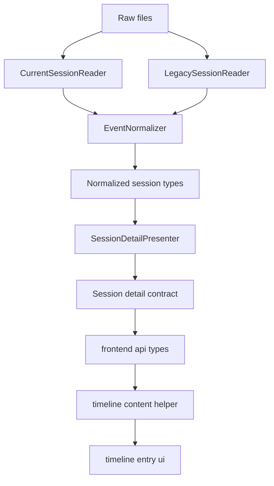
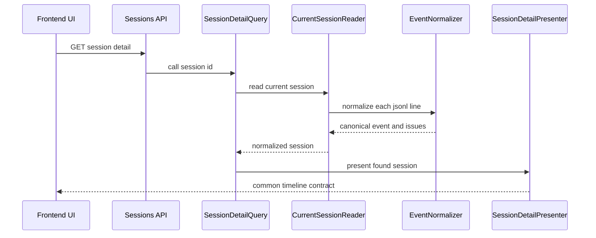

# Design Document

## Overview
この仕様は、Copilot CLI の current `events.jsonl` schema を既存の read-only 履歴参照アプリへ取り込み、legacy と同じ主要な読取体験を保つための設計である。対象は current session の会話本文、tool request 補助情報、非会話イベント、degraded 可視化に限定し、責務の中心は backend の正規化境界と API 契約の強化に置く。

利用者は current / legacy の差を意識せずにセッション詳細を読み返せる。運用者は部分互換や未知 event を空成功と混同せず切り分けられる。変更は controller や root 解決を広げず、`backend/lib/copilot_history` と `frontend/src/features/sessions` の既存責務内に閉じる。

### Goals
- current schema の `user.message` / `assistant.message` / `system.message` を legacy と同じ timeline 文脈で読める canonical contract へ正規化する
- assistant message の tool request を通常本文と区別できる helper field として API へ出し、frontend が source format 非依存で描画できるようにする
- 非会話 event を message と誤認させず、detail と unknown を分けて degraded / issue 可視化を維持する

### Non-Goals
- `backend-history-reader` / `backend-session-api` / `frontend-session-ui` の基礎責務を変更すること
- Phase 7 の永続化、検索、監視、詳細 debug drawer、外部共有機能の追加
- tool execution の開始完了を相関して高度な実行トレースを構築すること

## Boundary Commitments

### This Spec Owns
- current `events.jsonl` line を canonical timeline event に変換する reader / normalizer の拡張
- session detail API における current / legacy 共通 timeline contract の拡張
- timeline event の tool request summary と non-message detail summary の表示契約
- current schema 互換不足を `degraded` / `issues` で可視化するための設計

### Out of Boundary
- session index contract の再設計
- raw payload 全体を閲覧する専用 UI や debug 画面
- schema 差分を永続ストアへ保存する仕組み
- CLI 実行、tool invocation、hook 実行の再現や再実行

### Allowed Dependencies
- `backend/lib/copilot_history` 配下の reader / types / presenter / errors
- `frontend/src/features/sessions` 配下の API types、presentation helper、timeline component
- `workspace.yaml` と `events.jsonl` の raw files
- 既存の `degraded` / `issues` / `raw_payload` 契約

### Revalidation Triggers
- session detail timeline DTO の field shape 変更
- `NormalizedEvent` の ownership や kind taxonomy の変更
- tool request summary の生成規則や truncation 方針の変更
- current / legacy の責務境界が backend 以外へ移る変更

## Architecture

### Existing Architecture Analysis
- `CurrentSessionReader` は `workspace.yaml` と `events.jsonl` を読み、各 line を `EventNormalizer` へ渡す。
- `EventNormalizer` は flat な `user_message` / `assistant_message` にしか対応していない。
- `SessionDetailPresenter` は `raw_payload` を timeline DTO へそのまま載せる。
- frontend は `timelineContent.ts` で `raw_payload.toolRequests` を直接読んでおり、current schema の nested `data.toolRequests` には未対応である。

### Architecture Pattern & Boundary Map



**Architecture Integration**:
- Selected pattern: backend canonicalization。source format 差分は normalizer で吸収し、API と UI は共通 timeline contract だけを見る。
- Domain boundaries: raw file 読み取りは reader、event の意味づけは normalizer、HTTP response shape は presenter、表示整形は frontend presentation helper に分離する。
- Existing patterns preserved: controller は薄いまま、`copilot_history` namespace に読取と整形を寄せる、frontend は相対 import と feature 配下の局所テストを維持する。
- New components rationale: tool request summary と detail summary は raw payload だけでは current / legacy 共通表示が保てないため、API helper field として追加する。
- Helper field ownership: `kind`, `mapping_status`, `tool_calls`, `detail` の意味づけは `EventNormalizer` で確定し、`SessionDetailPresenter` は再分類せず DTO へ写像するだけに留める。
- Steering compliance: raw files 正本、format 差分の reader 吸収、read-only API 契約、partial degradation の明示を維持する。

**Dependency Direction**
- Backend read path: `errors and types -> event normalizer -> current/legacy readers -> session detail query`
- Backend response path: `normalized session -> session detail presenter -> controller response`
- Frontend: `sessionApi.types -> presentation/timelineContent -> components/TimelineContent -> components/TimelineEntry -> pages/SessionDetailPage`
- `tool_calls`, `detail`, `mapping_status` の確定責務は backend normalizer に閉じ込め、query / presenter / frontend へ source format 判定を逆流させない。
- 実装と review はこの依存方向違反をエラーとして扱う。

### Technology Stack

| Layer | Choice / Version | Role in Feature | Notes |
|-------|------------------|-----------------|-------|
| Backend | Ruby 4 / Rails 8.1 API | current / legacy の共通 timeline 正規化と API 提供 | 新規外部依存は追加しない |
| Frontend | React 19 / TypeScript 6 | canonical timeline contract の描画 | source format 分岐は持たない |
| Data / Storage | local `workspace.yaml` / `events.jsonl` | raw history の一次ソース | DB migration なし |
| Infrastructure / Runtime | Docker Compose | backend / frontend 検証環境 | 既存コマンドのみ使用 |

## File Structure Plan

### Directory Structure
```text
backend/
├── lib/copilot_history/
│   ├── current_session_reader.rb                # current session line read と normalizer 呼び出し
│   ├── event_normalizer.rb                      # current / legacy の canonical event 正規化
│   ├── errors/read_error_code.rb                # degraded / unknown 用 code 定義
│   ├── types/
│   │   ├── normalized_event.rb                  # canonical timeline event 型
│   │   └── normalized_tool_call.rb              # tool request summary 型
│   └── api/presenters/session_detail_presenter.rb # API DTO への変換
├── spec/fixtures/copilot_history/
│   └── current_cli_schema_compatibility/        # current schema の代表 fixture
└── spec/lib/copilot_history/
    ├── current_session_reader_spec.rb           # current fixture と degraded 読取
    ├── event_normalizer_spec.rb                 # event type 別 canonicalization
    └── api/presenters/session_detail_presenter_spec.rb # timeline DTO shape

frontend/
└── src/features/sessions/
    ├── api/sessionApi.types.ts                  # timeline DTO 型
    ├── presentation/timelineContent.ts          # content block と tool detail 変換
    ├── presentation/timelineContent.test.ts     # canonical helper field の描画確認
    ├── components/TimelineContent.tsx           # tool request / detail summary 描画
    ├── components/TimelineEntry.tsx             # event badge と degraded 表示
    └── pages/SessionDetailPage.test.tsx         # current / legacy 共通読取体験の画面確認
```

### Modified Files
- `backend/lib/copilot_history/current_session_reader.rb` — line 単位 read は維持しつつ、current schema fixture に合わせた issue 収集を明確化する
- `backend/lib/copilot_history/event_normalizer.rb` — current envelope と legacy flat payload の両方を canonical fields へ変換する
- `backend/lib/copilot_history/errors/read_error_code.rb` — 現行 code を継続利用し、current schema の partial / unknown にも適用する前提を明示する
- `backend/lib/copilot_history/types/normalized_event.rb` — `kind`, `mapping_status`, `tool_calls`, `detail` を持てる canonical event へ拡張する
- `backend/lib/copilot_history/api/presenters/session_detail_presenter.rb` — frontend が raw payload に依存せず読める helper field を追加する
- `frontend/src/features/sessions/api/sessionApi.types.ts` — `mapping_status`、tool call summary、detail summary を型定義する
- `frontend/src/features/sessions/presentation/timelineContent.ts` — canonical helper field を優先して表示 block を生成する
- `frontend/src/features/sessions/components/TimelineContent.tsx` — tool request と detail summary を通常本文と別セクションで表示する
- `frontend/src/features/sessions/components/TimelineEntry.tsx` — `kind` と `mapping_status` を併用し、`detail` / `unknown` と部分互換を区別して示す

## System Flows



**Flow decisions**
- `events.jsonl` は line 単位で読み、1 line failure が session 全体 failure に昇格しないようにする。
- non-message event も sequence を保ったまま timeline へ残し、message event と visually 別扱いにする。
- frontend は source format を見ず、API helper field と issue 情報だけで描画する。

## Requirements Traceability

| Requirement | Summary | Components | Interfaces | Flows |
|-------------|---------|------------|------------|-------|
| 1.1 | current 会話 event の識別 | EventNormalizer, NormalizedEvent | canonical timeline event | session detail flow |
| 1.2 | current / legacy の本文共通読取 | EventNormalizer, SessionDetailPresenter, TimelineContent | session detail DTO | session detail flow |
| 1.3 | 部分欠損 event の区別 | EventNormalizer, ReadErrorCode, TimelineEntry | `mapping_status`, issue contract | session detail flow |
| 1.4 | legacy 読取体験の維持 | EventNormalizer, SessionDetailPresenter | common timeline DTO | session detail flow |
| 2.1 | 本文の改行と code block 読解 | SessionDetailPresenter, timelineContent | `content` field | session detail flow |
| 2.2 | tool 名と入力要約の分離表示 | EventNormalizer, NormalizedToolCall, TimelineContent | `tool_calls` DTO | session detail flow |
| 2.3 | 欠損 tool 情報の部分保持 | EventNormalizer, ReadErrorCode | `tool_calls.status`, `issues` | session detail flow |
| 2.4 | tool 情報が本文順序を壊さない | EventNormalizer, TimelineContent | canonical timeline event | session detail flow |
| 3.1 | 非会話 event の誤認防止 | EventNormalizer, TimelineEntry | `kind=detail|unknown`, `detail` | session detail flow |
| 3.2 | 主タイムライン優先で detail 保持 | SessionDetailPresenter, TimelineContent, TimelineEntry | `detail` helper field | session detail flow |
| 3.3 | 未対応形状の unknown 保持 | EventNormalizer, ReadErrorCode | `kind=unknown`, `raw_payload`, `issues` | session detail flow |
| 3.4 | 非会話 event が順序を崩さない | CurrentSessionReader, EventNormalizer | `sequence` field | session detail flow |
| 4.1 | current / legacy 共通契約 | SessionDetailPresenter, sessionApi.types | session detail DTO | session detail flow |
| 4.2 | schema 切替不要の UI | sessionApi.types, TimelineContent, TimelineEntry | frontend typed contract | session detail flow |
| 4.3 | 項目未提供と読取失敗の区別 | EventNormalizer, SessionDetailPresenter | nullable helper fields, `mapping_status`, issues | session detail flow |
| 4.4 | current 対応で legacy 後退を防ぐ | backend specs, frontend specs | regression spec suite | session detail flow |
| 5.1 | 部分互換の識別 | EventNormalizer, SessionDetailPresenter, TimelineEntry | degraded + `mapping_status` + issues | session detail flow |
| 5.2 | 未知形状を issue として可視化 | ReadErrorCode, EventNormalizer, IssueList | issue contract | session detail flow |
| 5.3 | 読める範囲と不確実範囲の説明 | SessionDetailPresenter, TimelineEntry, IssueList | session / event issues | session detail flow |
| 5.4 | 劣化時も閲覧継続 | CurrentSessionReader, EventNormalizer, SessionDetailPresenter | partial success contract | session detail flow |

## Components and Interfaces

| Component | Domain/Layer | Intent | Req Coverage | Key Dependencies | Contracts |
|-----------|--------------|--------|--------------|------------------|-----------|
| CurrentSessionReader | Backend reader | `workspace.yaml` と `events.jsonl` を読み、line 単位で正規化を進める | 1.2, 3.4, 5.4 | EventNormalizer P0 | Service |
| SessionDetailQuery | Backend orchestration | session source を解決して適切な reader を呼び、`NormalizedSession` を controller へ渡す | 4.1, 4.4, 5.4 | SessionSourceCatalog P0, CurrentSessionReader P0, LegacySessionReader P0 | Service |
| EventNormalizer | Backend normalization | current / legacy event を canonical timeline event に統一する | 1.1, 1.3, 2.2, 3.1, 3.3, 5.1, 5.2 | ReadErrorCode P0, NormalizedEvent P0 | Service |
| SessionDetailPresenter | Backend API | canonical event を frontend 共通 DTO へ変換する | 1.2, 2.1, 3.2, 4.1, 4.3, 5.3 | NormalizedSession P0 | API |
| TimelineContent formatter | Frontend presentation | canonical `content`, `tool_calls`, `detail` を視覚 block へ変換する | 2.1, 2.2, 2.4, 3.2, 4.2 | sessionApi.types P0 | Service |
| TimelineEntry UI | Frontend UI | kind と `mapping_status` の差を表示し、degraded / issue を event 単位で示す | 1.3, 3.1, 4.2, 5.1, 5.3 | TimelineContent formatter P0, IssueList P1 | State |

### Backend reader and normalization

#### CurrentSessionReader

| Field | Detail |
|-------|--------|
| Intent | current session の raw files を line 単位で読み、読めた範囲を失わず `NormalizedSession` を返す |
| Requirements | 1.2, 3.4, 5.4 |

**Responsibilities & Constraints**
- `workspace.yaml` の失敗と `events.jsonl` の部分失敗を区別する
- `events.jsonl` の行順を `sequence` として保持する
- 1 行の parse failure や unknown shape が session 全体 failure へ波及しない

**Dependencies**
- Outbound: `EventNormalizer` — line payload の canonicalization (P0)
- Outbound: `CopilotHistory::Types::NormalizedSession` — session 組み立て (P0)
- Outbound: `CopilotHistory::Types::ReadIssue` — session / event issue 蓄積 (P0)

**Contracts**: Service [x] / API [ ] / Event [ ] / Batch [ ] / State [ ]

##### Service Interface
```ruby
class CopilotHistory::CurrentSessionReader
  def call(source) => CopilotHistory::Types::NormalizedSession
end
```
- Preconditions:
  - `source.format` は `:current`
  - `artifact_paths[:events]` が `events.jsonl` を指す
- Postconditions:
  - 読めた event は source 順で `events` に入る
  - session issue と event issue は `issues` に統合される
- Invariants:
  - unreadable line や unknown event があっても `events` の既読部分は保持する

**Implementation Notes**
- Integration: 既存の line iteration を保ち、cross event correlation は導入しない
- Validation: current fixture の正常系、partial mapping、unknown、invalid JSONL を spec で固定する
- Risks: error message が抽象的すぎると運用切り分けが難しいため raw type を含む説明を優先する

#### EventNormalizer

| Field | Detail |
|-------|--------|
| Intent | current / legacy の raw event を共通の timeline event taxonomy へ変換する |
| Requirements | 1.1, 1.3, 2.2, 2.3, 3.1, 3.3, 5.1, 5.2 |

**Responsibilities & Constraints**
- `kind` は `message`, `detail`, `unknown` の 3 taxonomy に限定し、不完全さは `mapping_status` で表す
- `mapping_status` は `complete` または `partial` とし、role / content / timestamp / tool summary の欠損を kind から分離して表す
- current conversation event は root `type` と `data` から、legacy conversation event は flat payload から同じ field を抽出する
- non-message event のうち既知 type 群は `detail` として summary を与え、未対応形状のみ `unknown` にする
- tool request summary は `NormalizedToolCall` に正規化し、secret-like key の redact と長さ制限を適用する
- raw payload は常に保持し、silent drop を行わない

**Dependencies**
- Inbound: `CurrentSessionReader` — source format と sequence の供給 (P0)
- Outbound: `CopilotHistory::Errors::ReadErrorCode` — partial / unknown issue code (P0)
- Outbound: `CopilotHistory::Types::NormalizedEvent` — canonical event 生成 (P0)
- Outbound: `CopilotHistory::Types::NormalizedToolCall` — tool summary 生成 (P0)

**Contracts**: Service [x] / API [ ] / Event [ ] / Batch [ ] / State [ ]

##### Service Interface
```ruby
class CopilotHistory::EventNormalizer
  def call(raw_event:, source_format:, sequence:) => CopilotHistory::Types::NormalizationResult
end
```
- Preconditions:
  - `raw_event` は JSON parse 済み value
  - `source_format` は `:current` または `:legacy`
- Postconditions:
  - 返る event は canonical kind を持つ
  - 不完全な mapping は `mapping_status=partial` と対応 issue を返す
  - 未対応形状は `kind=unknown` と対応 issue を返す
- Invariants:
  - `raw_payload` は元イベントを保持する
  - current / legacy の format 差分は frontend へ漏らさない

**Canonical Event Contract**

| Field | Type | Meaning |
|-------|------|---------|
| `sequence` | Integer | `events.jsonl` または legacy transcript 内の順序 |
| `kind` | `message \| detail \| unknown` | timeline 上の意味分類 |
| `mapping_status` | `complete \| partial` | canonical helper field が十分に埋まったか |
| `raw_type` | String | 元 event type |
| `occurred_at` | Time or nil | root または payload から読めた発生時刻 |
| `role` | String or nil | `user`, `assistant`, `system` などの会話 role |
| `content` | String or nil | 会話本文 |
| `tool_calls` | `NormalizedToolCall[]` | assistant message から抽出した tool request |
| `detail` | Hash or nil | `category`, `title`, `body` を持つ detail summary |
| `raw_payload` | Hash or Array or scalar | 元 payload |

**Tool Call Contract**

| Field | Type | Meaning |
|-------|------|---------|
| `name` | String or nil | tool 名。取得できない場合は `nil` |
| `arguments_preview` | String or nil | redact / truncation 済みの入力要約 |
| `is_truncated` | Boolean | 要約が上限で切り詰められたか |
| `status` | `complete \| partial` | tool summary 単位の完全性 |

- `arguments_preview` は compact JSON もしくは文字列化した入力から生成し、`token`, `secret`, `password`, `authorization`, `cookie` を key 名に含む項目は `[REDACTED]` へ置換する
- `arguments_preview` は最大 240 文字とし、超過時は末尾を切り詰めて `is_truncated=true` にする
- tool 名欠損または入力要約生成不可のときは、保持できた値だけ残して `status=partial` と warning issue を返す

**Detail Classification Rules**
- `assistant.turn_start`, `assistant.turn_end` → `detail.category = assistant_turn`
- `tool.execution_start`, `tool.execution_complete` → `detail.category = tool_execution`
- `hook.start`, `hook.end` → `detail.category = hook`
- `skill.invoked` → `detail.category = skill`
- 上記以外の非会話 event → `unknown`

**Implementation Notes**
- Integration: role は `data.role` がなければ `type` prefix から補完する
- Validation: assistant message の `toolRequests` 欠損時も本文を維持し、必要時のみ `mapping_status=partial` の issue を出す
- Risks: current schema の将来追加 type に備え、classifier は closed list と unknown fallback の組み合わせにする

#### SessionDetailPresenter

| Field | Detail |
|-------|--------|
| Intent | `NormalizedSession` を current / legacy 共通の session detail DTO へ変換する |
| Requirements | 1.2, 2.1, 3.2, 4.1, 4.3, 5.3 |

**Responsibilities & Constraints**
- frontend が raw payload 深掘りなしで描画できる helper field を追加する
- session issue と event issue の責務境界を維持する
- `EventNormalizer` が決めた `kind`, `mapping_status`, `tool_calls`, `detail` を再解釈しない
- `raw_payload` は残しつつ、primary UI は canonical helper field を使えるようにする

**Dependencies**
- Inbound: `NormalizedSession` — canonical session model (P0)
- Outbound: frontend session detail DTO — JSON response shape (P0)

**Contracts**: Service [ ] / API [x] / Event [ ] / Batch [ ] / State [ ]

##### API Contract
| Method | Endpoint | Request | Response | Errors |
|--------|----------|---------|----------|--------|
| GET | `/api/sessions/:id` | none | `SessionDetailResponse` with extended timeline items | existing root failure and not found |

**Session timeline DTO additions**

| Field | Type | Purpose |
|-------|------|---------|
| `tool_calls` | array | 固定 shape の tool summary を source format 非依存で返す |
| `detail` | object or null | non-message event の category と summary を返す |
| `kind` | string | `message \| detail \| unknown` の 3 taxonomy を返す |
| `mapping_status` | string | `complete \| partial` を返し、意味分類と劣化状態を分離する |

**`tool_calls[*]` DTO**

| Field | Type | Notes |
|-------|------|-------|
| `name` | string \| null | UI は `null` の場合に "unknown tool" などの中立ラベルを使う |
| `arguments_preview` | string \| null | redact / truncation 済みの表示専用文字列 |
| `is_truncated` | boolean | preview が上限到達したか |
| `status` | `'complete' \| 'partial'` | 欠損がある summary を識別する |

**Implementation Notes**
- Integration: session index DTO は変更しない
- Validation: presenter spec で legacy と current の両方に同じ primary field が存在することを固定する
- Risks: DTO 追加により frontend type 更新が必須になるため、同一 task wave で進める

### Frontend presentation

#### TimelineContent formatter

| Field | Detail |
|-------|--------|
| Intent | canonical timeline event を本文 block、tool block、detail block へ分解する |
| Requirements | 2.1, 2.2, 2.4, 3.2, 4.2 |

**Responsibilities & Constraints**
- `content` の code fence 分解を継続する
- `tool_calls` を通常本文とは別 block として出す
- `detail` がある event は message block と混同しない表示 model に変換する
- source format や raw payload path に依存しない

**Dependencies**
- Inbound: `SessionTimelineEvent` — API からの typed contract (P0)
- Outbound: `TimelineContent` component — visual block model (P0)

**Contracts**: Service [x] / API [ ] / Event [ ] / Batch [ ] / State [ ]

##### Service Interface
```typescript
interface TimelineContentModel {
  blocks: readonly TimelineVisualBlock[]
}

declare function formatTimelineContent(
  event: Pick<SessionTimelineEvent, 'kind' | 'content' | 'tool_calls' | 'detail'>
): TimelineContentModel
```
- Preconditions:
  - event は presenter の canonical DTO に従う
- Postconditions:
  - 本文、tool hint、detail summary は UI 表示順を壊さず block 化される
- Invariants:
  - raw payload の format 差分を参照しない

**Implementation Notes**
- Integration: 既存 code fence parsing を流用しつつ、tool block と detail block を追加する
- Validation: current tool request と unknown detail を混在させた test fixture で順序を固定する
- Risks: detail block を過剰に増やすと主会話が読みにくくなるため summary を短く保つ

#### TimelineEntry UI

| Field | Detail |
|-------|--------|
| Intent | event kind と degraded 状態を視覚的に区別し、issue を event 単位で読めるようにする |
| Requirements | 1.3, 3.1, 4.2, 5.1, 5.3 |

**Responsibilities & Constraints**
- `message`, `detail`, `unknown` を badge で区別する
- `mapping_status=partial` は secondary badge や tone で補助表示し、kind と混同しない
- role badge は `message` のみで利用し、detail では category summary を優先する
- issue list は event ごとに維持する

**Dependencies**
- Inbound: `TimelineContent` — block 表示 (P0)
- Inbound: `IssueList` — degraded 情報表示 (P1)

**Contracts**: Service [ ] / API [ ] / Event [ ] / Batch [ ] / State [x]

##### State Management
- State model: `SessionDetailPage` が受け取った immutable DTO をそのまま描画する
- Persistence & consistency: frontend local state 追加なし
- Concurrency strategy: 詳細取得中・取得後の既存 hook 振る舞いを維持する

**Implementation Notes**
- Integration: 既存の `TimelineEntry.tsx` を拡張し、画面全体の routing や data fetch flow は変更しない
- Validation: degraded current session と clean legacy session の両描画を page test で確認する
- Risks: detail event の視認性が高すぎると会話本文が埋もれるため、message より控えめな視覚強度に留める

## Data Models

### Domain Model
- **NormalizedSession**: `workspace.yaml` metadata、timeline events、session issues を束ねる read-only 集約
- **NormalizedEvent**: current / legacy 共通の timeline event。`kind` と `mapping_status`、helper field を持つ
- **NormalizedToolCall**: assistant message に付随する tool request summary。`name`, `arguments_preview`, `is_truncated`, `status` を持つ

### Logical Data Model

**Structure Definition**
- `NormalizedEvent.kind` は `message`, `detail`, `unknown` の排他的分類
- `NormalizedEvent.mapping_status` は `complete`, `partial` の排他的分類
- `NormalizedEvent.role` は message 系 event のみで意味を持つ nullable field
- `NormalizedEvent.tool_calls` は assistant message を主対象とする 0..n の配列で、各要素は `name`, `arguments_preview`, `is_truncated`, `status` を持つ
- `NormalizedEvent.detail` は non-message 既知 event のみで意味を持つ nullable object

**Consistency & Integrity**
- `sequence` は source order を保持し、timeline 並び替えの唯一キーとする
- `raw_payload` は canonical helper field 抽出の成否に関わらず保持する
- `issues` は session scope と event scope を混在させない

### Data Contracts & Integration

**API Data Transfer**
- `SessionDetailResponse.data.timeline[*]` は legacy / current 共通 shape を持つ
- 新規 nullable field:
  - `tool_calls: []` を既定値にする
  - `detail: null` を既定値にする
- 新規非 nullable field:
  - `mapping_status: "complete"` を既定値にする
- `tool_calls[*]` は `name`, `arguments_preview`, `is_truncated`, `status` の固定 shape を持つ
- `raw_payload` は後方互換と将来調査のため保持するが、UI の主表示ロジックは helper field を使う

## Error Handling

### Error Strategy
- root unreadable や session not found は既存 error envelope を維持する
- current event の部分互換は session success のまま `degraded` と `issues` で返す
- 未知 event type は `unknown` timeline event と warning issue を返し、空配列へ落とさない

### Error Categories and Responses
- **Read errors**: JSONL parse failure、workspace parse failure、unreadable file は session issue として返す
- **Compatibility warnings**: role/content/timestamp/tool summary の不足は元の `kind` を保ったまま `mapping_status=partial` と warning issue で返す
- **Unknown shapes**: classifier に乗らない event は raw payload を残して `unknown` として返す

### Monitoring
- 新規監視基盤は追加しない
- 運用上の切り分けは session issue と event issue、`raw_type`、`source_path`、`event_sequence` を使う

## Testing Strategy

### Unit Tests
- `EventNormalizer` が `user.message`, `assistant.message`, `system.message` を canonical `message` へ変換することを確認する
- `EventNormalizer` が message / detail / unknown の kind と、`complete` / `partial` の `mapping_status` を独立に返すことを確認する
- `EventNormalizer` が assistant message の `toolRequests` から `tool_calls` を抽出し、欠損時は本文を維持したまま `mapping_status=partial` と warning issue を返すことを確認する
- `EventNormalizer` が `arguments_preview` に redact / truncation ルールを適用することを確認する
- `EventNormalizer` が `assistant.turn_*`, `tool.execution_*`, `hook.*`, `skill.invoked` を `detail` へ分類し、未対応 type は `unknown` へ落とすことを確認する
- `CurrentSessionReader` が invalid JSONL line や unreadable workspace を含んでも既読 event を保持することを確認する
- `SessionDetailPresenter` が legacy / current の両方で同じ primary timeline field と `tool_calls[*]` shape を返すことを確認する

### Integration Tests
- current fixture を使った session detail API が message、tool_calls、detail、`mapping_status`、issues を同じ timeline で返すことを request / presenter spec で確認する
- legacy fixture が current 対応後も `message` timeline と issue grouping を維持することを回帰確認する
- current session の unknown event が空 success ではなく degraded timeline item として返ることを確認する

### E2E/UI Tests
- `SessionDetailPage` が current session の会話本文、code block、tool hint を source format 分岐なしで表示することを確認する
- `SessionDetailPage` が detail event を message と異なる badge / summary で表示し、`mapping_status=partial` を別 badge で示しつつ会話本文の順序を維持することを確認する
- degraded current session で session issue と event issue の両方が見え、閲覧自体は継続できることを確認する

### Performance/Load
- JSONL 読み取りは single pass を維持し、全 event を再走査して相関しない
- detail summary は event 単位の局所計算に限定し、O n の line processing を崩さない

## Security Considerations
- tool request の `arguments_preview` は表示専用であり、shell 展開や再実行を行わない
- `arguments_preview` 生成時は secret-like key を redact し、240 文字上限で切り詰める
- current raw payload に含まれる補助情報は read-only で扱い、UI は React の既存 escaping に依存して文字列表示する
- 非会話 event の要約生成はローカル raw file からの抽出に限定し、外部送信や追加権限を導入しない
