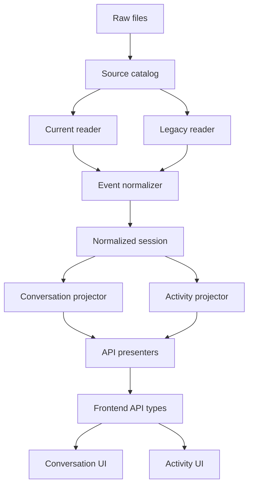
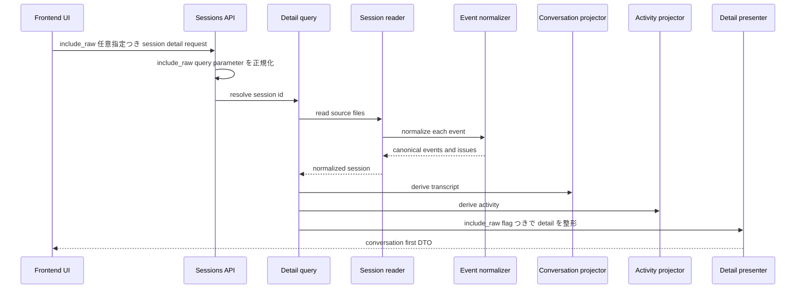

# Design Document

## Overview
この仕様は、現行 Copilot CLI の `session-state/{session-id}/events.jsonl` を read-only 履歴参照アプリで会話中心に読めるようにする。対象利用者は、過去セッションの user / assistant のやり取りを最初に読み返したい利用者と、schema 差分や部分破損を切り分けたい運用者である。

変更の中心は backend の正規化境界と API 契約である。`events.jsonl` の完全 event log は失わず、主表示用の conversation transcript、補助 activity、明示要求時の raw detail を分けて返す。frontend は source format を判定せず、API が提供する共通 contract だけで current / legacy を表示する。

### Goals
- current schema の `user.message` と本文付き `assistant.message` から主会話 transcript を抽出する
- system / turn / tool execution / hook / skill / unknown event を会話本文から分離し、追跡可能な activity と issue として保持する
- 一覧と詳細の両方で、会話あり session、会話数、preview、利用者向け更新時刻、degraded 状態を一貫して提示する

### Non-Goals
- `session-store.db`、`session.db`、MySQL を transcript source にすること
- 全文検索、差分取り込み、永続化 schema、外部共有、gist 連携
- tool request と tool execution の完全相関、または raw payload 専用 viewer の構築
- root 解決、controller routing、legacy reader の基礎責務の再設計

## Boundary Commitments

### This Spec Owns
- current `events.jsonl` event を canonical event、conversation entry、activity entry へ分類する互換ルール
- session index / detail API における conversation summary、conversation transcript、activity summary、raw detail 分離の contract
- detail API の `include_raw` 明示要求を controller から presenter / frontend typed client へ伝搬する最小 contract
- current session の更新時刻を event timestamp と file mtime から補正する判断順序
- current session の `source_state` を `complete | workspace_only | degraded` に分類する導出規則
- current schema 互換不足を `degraded` と `issues` で可視化する規則
- legacy `history-session-state` の既存会話表示を維持する回帰条件

### Out of Boundary
- Copilot CLI の保存 schema 自体の安定化や変更
- raw payload 全体を通常 detail 画面に常時表示する UI
- tool execution の親子相関、実行再現、権限判断、hook 実行
- 検索 index、正規化 DB、session-store の再構築
- API endpoint の認証認可や外部公開

### Allowed Dependencies
- `backend/lib/copilot_history` 配下の reader、normalizer、types、query、presenter、errors
- `frontend/src/features/sessions` 配下の API 型、presentation helper、session 一覧・詳細 UI
- raw source としての `workspace.yaml`、`events.jsonl`、legacy `history-session-state/*.json`
- 既存の `degraded`、`issues`、read-only API、Docker Compose 検証導線

### Revalidation Triggers
- session index / detail DTO における `conversation`、`activity`、`timeline`、`raw_payload` の shape 変更
- `include_raw` query parameter の名前、真偽値解釈、または controller / presenter 伝搬方針の変更
- `source_state` の enum 値、優先順位、または workspace-only 判定条件の変更
- `NormalizedEvent`、`NormalizedConversationEntry`、`NormalizedActivityEntry` の ownership または kind taxonomy 変更
- current schema の message / tool / activity classifier 追加や fallback 方針変更
- 更新時刻補正の優先順位変更
- frontend が raw payload または source format を直接判定する変更

## Architecture

### Existing Architecture Analysis
- `SessionSourceCatalog` は current directory と legacy JSON を source として列挙し、format 差分を reader へ委譲している。
- `CurrentSessionReader` は `workspace.yaml` と `events.jsonl` を読み、line 単位で `EventNormalizer` に渡す。現状は session metadata の `updated_at` を優先しており、event timestamp や file mtime の補正が不足している。
- `EventNormalizer` は current dotted event と legacy flat event を `message | detail | unknown` に正規化できるが、主会話 transcript と activity の API 上の分離はまだ contract として固定されていない。
- `SessionDetailPresenter` は timeline を返すが、通常閲覧で raw payload が重くなる懸念がある。frontend は timeline を主表示としているため、会話 first ではなく event log first になりやすい。
- `SessionIndexPresenter` は event count と message snapshot count を返すが、表示可能な会話数、preview、workspace-only current session の識別を返していない。

### Architecture Pattern & Boundary Map



**Architecture Integration**:
- Selected pattern: backend canonicalization。source format 差分と event 分類は backend に閉じ、frontend は共通 DTO を描画する。
- Domain boundaries: reader は raw file read と read issue、normalizer は event 意味づけ、projector は conversation / activity 派生、presenter は API shape、frontend は表示状態だけを担当する。
- Existing patterns preserved: controller は薄く保ち、`copilot_history` namespace に履歴 domain を集約し、frontend は `features/sessions` 内の API 型と presentation helper に閉じる。
- New components rationale: conversation transcript と activity 分離は複数要件にまたがるため、presenter 内の ad hoc filter ではなく projector と DTO として明示する。
- Raw request path: controller は `include_raw` query parameter を boolean に正規化して presenter へ渡すだけに留め、reader / query / frontend component は raw inclusion policy を直接決めない。
- Steering compliance: raw files を正本とし、壊れた data を隠さず、current / legacy を共通 contract に正規化する。

**Dependency Direction**
- Backend read path: `types/errors -> normalizer -> readers -> queries -> presenters`
- Backend projection path: `NormalizedSession -> ConversationProjector / ActivityProjector -> index/detail presenters`
- Frontend path: `sessionApi.types -> presentation helpers -> components -> pages`
- query、presenter、frontend は current raw shape を直接判定しない。event type classifier の ownership は `EventNormalizer` に固定する。

### Technology Stack

| Layer | Choice / Version | Role in Feature | Notes |
|-------|------------------|-----------------|-------|
| Backend | Ruby 4 / Rails 8.1 API | current / legacy の正規化、projection、read-only API | 新規 gem は追加しない |
| Frontend | React 19 / TypeScript 6 / Vitest | conversation first の描画、activity 折りたたみ、raw 明示要求 | `any` は使わず union type で DTO を表す |
| Data / Storage | local `workspace.yaml` / `events.jsonl` / legacy JSON | raw history の一次ソース | DB migration なし |
| Infrastructure | Docker Compose | backend / frontend 検証 | 既存コマンドを維持 |

## File Structure Plan

### Directory Structure
```text
backend/
├── lib/copilot_history/
│   ├── current_session_reader.rb
│   ├── legacy_session_reader.rb
│   ├── event_normalizer.rb
│   ├── api/
│   │   ├── session_index_query.rb
│   │   ├── session_detail_query.rb
│   │   └── presenters/
│   │       ├── session_index_presenter.rb
│   │       └── session_detail_presenter.rb
│   ├── errors/read_error_code.rb
│   ├── projections/
│   │   ├── conversation_projector.rb
│   │   └── activity_projector.rb
│   └── types/
│       ├── normalized_session.rb
│       ├── normalized_event.rb
│       ├── normalized_conversation_entry.rb
│       ├── normalized_activity_entry.rb
│       └── normalized_tool_call.rb
└── spec/
    ├── fixtures/copilot_history/current_cli_schema_compatibility/
    └── lib/copilot_history/
        ├── current_session_reader_spec.rb
        ├── event_normalizer_spec.rb
        ├── projections/conversation_projector_spec.rb
        ├── projections/activity_projector_spec.rb
        └── api/presenters/
            ├── session_index_presenter_spec.rb
            └── session_detail_presenter_spec.rb

frontend/
└── src/features/sessions/
    ├── api/sessionApi.types.ts
    ├── api/sessionApi.ts
    ├── presentation/
    │   ├── conversationContent.ts
    │   ├── timelineContent.ts
    │   └── formatters.ts
    ├── components/
    │   ├── ConversationTranscript.tsx
    │   ├── ActivityTimeline.tsx
    │   ├── TimelineContent.tsx
    │   ├── TimelineEntry.tsx
    │   ├── SessionSummaryCard.tsx
    │   └── IssueList.tsx
    └── pages/
        ├── SessionIndexPage.tsx
        └── SessionDetailPage.tsx

frontend の test files は実装近接配置の既存 pattern に従う:
`sessionApi.test.ts`, `conversationContent.test.ts`, `TimelineContent.test.tsx`, `ConversationTranscript.test.tsx`, `ActivityTimeline.test.tsx`, `SessionSummaryCard.test.tsx`, `SessionDetailPage.test.tsx`, and `SessionIndexPage.test.tsx`.
```

### Modified Files
- `backend/lib/copilot_history/current_session_reader.rb` - event timestamp と `events.jsonl` mtime を使った current `updated_at` 補正、workspace-only issue の扱い、line 単位 issue 継続を明確化する
- `backend/lib/copilot_history/legacy_session_reader.rb` - legacy message が conversation projector へ入る canonical fields を維持し、legacy 回帰 fixture を追加する
- `backend/lib/copilot_history/event_normalizer.rb` - current `user.message` / `assistant.message` / `system.message`、tool request、detail event、unknown event の分類規則を固定する
- `backend/lib/copilot_history/types/normalized_event.rb` - full timeline 用 canonical event を保持し、conversation / activity projection の入力 contract とする
- `backend/lib/copilot_history/types/normalized_tool_call.rb` - tool 名、入力要約、truncation、partial 状態の contract を維持する
- `backend/lib/copilot_history/types/normalized_session.rb` - corrected `updated_at` と projection 入力に必要な source state を保持する
- `backend/app/controllers/api/sessions_controller.rb` - `include_raw` query parameter を boolean として解釈し、detail presenter へ渡す
- `backend/lib/copilot_history/api/session_index_query.rb` - current / legacy 混在時の sort が corrected `updated_at` を使うことを保証する
- `backend/lib/copilot_history/api/presenters/session_index_presenter.rb` - `conversation_summary` と workspace-only / degraded 識別情報を返す
- `backend/lib/copilot_history/api/presenters/session_detail_presenter.rb` - `conversation`、`activity`、`timeline`、raw inclusion policy を明示した detail DTO を返す
- `backend/lib/copilot_history/errors/read_error_code.rb` - current schema の partial / unknown / workspace-only / raw omission に既存 code または最小追加 code を割り当てる
- `frontend/src/features/sessions/api/sessionApi.types.ts` - conversation / activity / raw inclusion の DTO を TypeScript union と interface で定義する
- `frontend/src/features/sessions/api/sessionApi.ts` - `include_raw` 明示要求と通常 detail 取得を typed client として分ける
- `frontend/src/features/sessions/hooks/useSessionDetail.ts` - 通常 detail と raw 明示要求を区別して取得できる state / action を提供する
- `frontend/src/features/sessions/presentation/conversationContent.ts` - message content、code block、tool hint を conversation entry から生成する
- `frontend/src/features/sessions/presentation/timelineContent.ts` - activity detail と fallback timeline 表示の helper に限定する
- `frontend/src/features/sessions/components/ConversationTranscript.tsx` - detail 画面の主表示として user / assistant の会話を表示し、空状態を示す
- `frontend/src/features/sessions/components/ActivityTimeline.tsx` - detail / unknown / tool execution などを初期折りたたみで表示する
- `frontend/src/features/sessions/components/SessionSummaryCard.tsx` - 会話有無、会話数、preview、workspace-only 状態、補正済み更新時刻を表示する
- `frontend/src/features/sessions/pages/SessionDetailPage.tsx` - conversation first、activity secondary、raw explicit action の画面構成へ変更する

## System Flows



**Flow decisions**
- `events.jsonl` は line 単位で読み、1 line の parse failure を session 全体 failure に昇格させない。
- `conversation.entries` は主会話だけを含め、完全 event log は `timeline` と `activity.entries` に残す。
- raw payload は通常 detail では返さず、controller が `include_raw=true` を受け取った場合だけ presenter が timeline / activity の raw payload field に値を入れる。
- `include_raw` は `true` の文字列だけを明示要求として扱い、それ以外の値または未指定は通常 detail と同じ `false` とする。

## Requirements Traceability

| Requirement | Summary | Components | Interfaces | Flows |
|-------------|---------|------------|------------|-------|
| 1.1 | current 会話 event の抽出 | EventNormalizer, ConversationProjector | `NormalizedConversationEntry` | detail flow |
| 1.2 | event 発生順の保持 | CurrentSessionReader, ConversationProjector | `sequence`, `occurred_at` | detail flow |
| 1.3 | 空 assistant tool request の除外 | ConversationProjector, EventNormalizer | `content`, `tool_calls` | detail flow |
| 1.4 | system/detail/unknown の主会話除外 | EventNormalizer, ActivityProjector | `kind`, `activity.category` | detail flow |
| 1.5 | legacy 会話表示の維持 | LegacySessionReader, ConversationProjector, regression specs | common conversation DTO | detail flow |
| 2.1 | 詳細初期表示を会話にする | SessionDetailPresenter, ConversationTranscript | `conversation.entries` | detail flow |
| 2.2 | 会話なし空状態 | ConversationProjector, ConversationTranscript | `conversation.empty_reason` | detail flow |
| 2.3 | transcript を timeline より優先 | SessionDetailPage | `conversation`, `timeline` | detail flow |
| 2.4 | transcript 未提供時 fallback | conversationContent, SessionDetailPage | timeline-derived fallback | detail flow |
| 2.5 | 改行/code/長文保持 | ConversationTranscript, conversationContent | content blocks | detail flow |
| 3.1 | 内部 activity 分類 | EventNormalizer, ActivityProjector | `activity.entries` | detail flow |
| 3.2 | 内部 activity を会話に混在させない | ConversationProjector, ConversationTranscript | role filter | detail flow |
| 3.3 | activity は初期状態で邪魔しない | ActivityTimeline, SessionDetailPage | collapsed state | detail flow |
| 3.4 | unknown raw 追跡 | EventNormalizer, ActivityProjector, SessionDetailPresenter | issue + raw ref | detail flow |
| 3.5 | activity が会話順序を崩さない | ConversationProjector | stable sequence sort | detail flow |
| 4.1 | 本文付き assistant の tool 付帯情報 | EventNormalizer, ConversationProjector | `tool_calls` | detail flow |
| 4.2 | tool 名と入力要約 | NormalizedToolCall, ConversationTranscript | `name`, `arguments_preview` | detail flow |
| 4.3 | 欠損 tool 情報の部分保持 | EventNormalizer, IssueList | `status=partial`, issues | detail flow |
| 4.4 | execution event は activity | EventNormalizer, ActivityProjector | `activity.category=tool_execution` | detail flow |
| 4.5 | tool 完全相関は不要 | EventNormalizer, ActivityProjector | no correlation invariant | detail flow |
| 5.1 | 一覧で会話有無を判断 | SessionIndexPresenter, SessionSummaryCard | `conversation_summary.has_conversation` | index flow |
| 5.2 | 一覧で会話数を表示 | ConversationProjector, SessionIndexPresenter | `message_count` | index flow |
| 5.3 | preview は会話本文から生成 | ConversationProjector, SessionSummaryCard | `preview` | index flow |
| 5.4 | workspace-only current session 識別 | CurrentSessionReader, SessionIndexPresenter | `source_state` | index flow |
| 5.5 | degraded / legacy 一覧回帰防止 | SessionIndexPresenter, regression specs | common summary DTO | index flow |
| 6.1 | event timestamp を更新時刻に反映 | CurrentSessionReader, SessionIndexQuery | corrected `updated_at` | index flow |
| 6.2 | file mtime fallback | CurrentSessionReader | source artifact stat | index flow |
| 6.3 | workspace metadata fallback | CurrentSessionReader, LegacySessionReader | created/updated fallback | index flow |
| 6.4 | current / legacy の一貫表示 | SessionIndexQuery, SessionSummaryCard | common `updated_at` semantics | index flow |
| 7.1 | raw 量に主会話が依存しない | SessionDetailPresenter, ConversationTranscript | 通常 detail では raw を入れない | detail flow |
| 7.2 | 明示要求時 raw 確認 | SessionDetailPresenter, sessionApi | `include_raw` contract | detail flow |
| 7.3 | raw 省略でも分類を失わない | EventNormalizer, ActivityProjector | helper fields + raw ref | detail flow |
| 7.4 | unknown 追跡可能性維持 | ActivityProjector, IssueList | raw availability + issue | detail flow |
| 8.1 | 部分解釈の識別 | EventNormalizer, SessionDetailPresenter | `mapping_status=partial` | detail flow |
| 8.2 | unknown / 読取不足を issue 化 | ReadErrorCode, IssueList | `event.unknown_shape`, read issues | detail flow |
| 8.3 | 読める範囲と不確実範囲の説明 | ConversationTranscript, ActivityTimeline, IssueList | per-session/event issues | detail flow |
| 8.4 | 劣化時も閲覧継続 | CurrentSessionReader, LegacySessionReader, presenters | partial success contract | index/detail flow |
| 8.5 | legacy 体験の回帰防止 | regression specs, presenters, frontend tests | common DTO | index/detail flow |

## Components and Interfaces

| Component | Domain/Layer | Intent | Req Coverage | Key Dependencies | Contracts |
|-----------|--------------|--------|--------------|------------------|-----------|
| CurrentSessionReader | Backend reader | current raw files から corrected session を作る | 1.2, 5.4, 6.1, 6.2, 6.3, 8.4 | EventNormalizer P0 | Service |
| EventNormalizer | Backend normalization | raw event を message/detail/unknown に分類する | 1.1, 1.4, 3.1, 4.1, 4.2, 4.3, 4.4, 8.1, 8.2 | NormalizedEvent P0 | Service |
| ConversationProjector | Backend projection | 主会話 transcript と index summary を派生する | 1.1, 1.2, 1.3, 1.5, 2.2, 3.2, 5.1, 5.2, 5.3 | NormalizedSession P0 | Service |
| ActivityProjector | Backend projection | detail/unknown/tool execution を補助 activity に分離する | 3.1, 3.3, 3.4, 3.5, 4.4, 7.3, 7.4 | NormalizedSession P0 | Service |
| SessionIndexPresenter | Backend API | 会話有無、会話数、preview、更新時刻を一覧 DTO に出す | 5.1, 5.2, 5.3, 5.4, 5.5, 6.4 | ConversationProjector P0 | API |
| SessionDetailPresenter | Backend API | conversation first detail と raw inclusion policy を返す | 2.1, 2.3, 7.1, 7.2, 8.3 | ConversationProjector P0, ActivityProjector P0 | API |
| ConversationTranscript | Frontend UI | 主会話を最初に表示する | 2.1, 2.2, 2.5, 4.1, 4.2, 4.3 | sessionApi.types P0 | State |
| ActivityTimeline | Frontend UI | 内部 activity と unknown を補助表示する | 3.1, 3.3, 3.4, 4.4, 8.3 | sessionApi.types P0 | State |
| SessionSummaryCard | Frontend UI | 一覧で会話あり session を選べる情報を出す | 5.1, 5.2, 5.3, 5.4, 6.4 | sessionApi.types P0 | State |

### Backend Reader And Normalization

#### CurrentSessionReader

| Field | Detail |
|-------|--------|
| Intent | current session の `workspace.yaml` と `events.jsonl` を読み、補正済み metadata と canonical event を返す |
| Requirements | 1.2, 5.4, 6.1, 6.2, 6.3, 8.4 |

**Responsibilities & Constraints**
- `events.jsonl` が存在しない current directory を workspace-only source として扱い、通常会話 session と区別できる `source_state=workspace_only` と専用 issue を返す。
- event timestamp の最大値を current session の利用者向け `updated_at` として優先する。
- event timestamp がない場合は `events.jsonl` mtime、次に workspace metadata の `updated_at` / `created_at` を fallback にする。
- JSONL の 1 行 parse failure は session 全体 failure にしない。
- `source_state` は reader が決定する。current source は `events.jsonl` 欠如だけなら `workspace_only`、読取/parse/normalization issue が 1 件以上あれば `degraded`、それ以外を `complete` とする。workspace parse failure と events 欠如が同時に起きる場合は `degraded` を優先する。
- `LegacySessionReader` は既存 reader の成功 path では `complete` を返し、legacy 読取 issue がある場合だけ `degraded` とする。

**Contracts**: Service [x] / API [ ] / Event [ ] / Batch [ ] / State [ ]

##### Service Interface
```ruby
class CopilotHistory::CurrentSessionReader
  def call(source) => CopilotHistory::Types::NormalizedSession
end
```
- Preconditions: `source.format == :current`
- Postconditions: 読めた event は source order の `sequence` を保持する。`updated_at` は補正済み時刻になり、`source_state` は上記優先順位で設定される。
- Invariants: workspace-only、invalid line、unknown event があっても読める範囲は保持する。workspace-only は空成功ではなく issue と `source_state` で識別できる。

#### EventNormalizer

| Field | Detail |
|-------|--------|
| Intent | current / legacy raw event を canonical event taxonomy に統一する |
| Requirements | 1.1, 1.4, 3.1, 4.1, 4.2, 4.3, 4.4, 8.1, 8.2 |

**Responsibilities & Constraints**
- `kind` は `message`, `detail`, `unknown` に限定する。
- current message は root `type` と `data` から role、content、timestamp、tool requests を抽出する。
- `system.message` は canonical event としては保持するが、conversation projector では主会話に入れない。
- `assistant.message` の content が空または `null` で tool request のみの場合、message event として保持しつつ主 conversation entry は作らない。
- `assistant.turn_*`, `tool.execution_*`, `hook.*`, `skill.invoked` は `detail` として分類する。
- unknown shape は raw payload を保持し、warning issue を出す。
- tool arguments preview は表示用要約に限定し、secret-like key を redact し、長さ制限を適用する。

**Contracts**: Service [x] / API [ ] / Event [ ] / Batch [ ] / State [ ]

##### Service Interface
```ruby
class CopilotHistory::EventNormalizer
  def call(raw_event:, source_format:, sequence:) => CopilotHistory::Types::NormalizationResult
end
```
- Preconditions: `source_format` は `:current` または `:legacy`
- Postconditions: event と issue は同じ `sequence` で関連付けられる。
- Invariants: raw payload は分類成功/失敗にかかわらず保持される。

### Backend Projection

#### ConversationProjector

| Field | Detail |
|-------|--------|
| Intent | normalized events から主会話 transcript と一覧 summary を派生する |
| Requirements | 1.1, 1.2, 1.3, 1.5, 2.2, 3.2, 5.1, 5.2, 5.3 |

**Responsibilities & Constraints**
- `kind == :message` かつ `role` が `user` または `assistant` で、非空 `content` を持つ event だけを transcript entry にする。
- `system`、`detail`、`unknown` は transcript entry にしない。
- transcript order は event `sequence` 昇順で固定する。
- assistant の本文付き entry には event の `tool_calls` を付帯情報として渡す。
- summary preview は最初に見つかった user または assistant の本文から生成し、activity 本文は使わない。

**Contracts**: Service [x] / API [ ] / Event [ ] / Batch [ ] / State [ ]

##### Service Interface
```ruby
class CopilotHistory::Projections::ConversationProjector
  def call(session) => CopilotHistory::Types::ConversationProjection
end
```
- Postconditions: `message_count == entries.length`。空の場合は `empty_reason` が設定される。
- Invariants: projection は read-only で、`NormalizedSession` を変更しない。

#### ActivityProjector

| Field | Detail |
|-------|--------|
| Intent | 主会話ではない event を調査可能な activity に分離する |
| Requirements | 3.1, 3.3, 3.4, 3.5, 4.4, 7.3, 7.4 |

**Responsibilities & Constraints**
- `detail` と `unknown` event は activity entry にする。
- `system.message` は会話本文ではなく activity entry として表示できる。
- `tool.execution_*` は assistant 発話へ相関できてもできなくても activity に留める。
- raw payload が通常 detail で省略されても、source path、sequence、raw type、issue によって追跡できる。

**Contracts**: Service [x] / API [ ] / Event [ ] / Batch [ ] / State [ ]

### Backend API

#### SessionIndexPresenter

| Field | Detail |
|-------|--------|
| Intent | session list に会話有無と補正済み更新時刻を出す |
| Requirements | 5.1, 5.2, 5.3, 5.4, 5.5, 6.4 |

**Contracts**: Service [ ] / API [x] / Event [ ] / Batch [ ] / State [ ]

##### API Contract
| Field | Type | Description |
|-------|------|-------------|
| `conversation_summary.has_conversation` | boolean | 主会話 transcript が 1 件以上ある |
| `conversation_summary.message_count` | number | 主会話 entry 数 |
| `conversation_summary.preview` | string or null | user / assistant 本文から生成した短い preview |
| `conversation_summary.activity_count` | number | 主会話以外の activity 数 |
| `source_state` | string | `complete`, `workspace_only`, `degraded` のいずれか |
| `updated_at` | string or null | event timestamp / file mtime / workspace metadata の順で補正した更新時刻 |

#### SessionDetailPresenter

| Field | Detail |
|-------|--------|
| Intent | 通常 detail を conversation first にし、raw detail は明示要求に分離する |
| Requirements | 2.1, 2.3, 7.1, 7.2, 8.3 |

**Contracts**: Service [ ] / API [x] / Event [ ] / Batch [ ] / State [ ]

##### API Contract
| Method | Endpoint | Request | Response | Errors |
|--------|----------|---------|----------|--------|
| GET | `/api/sessions/:id` | none | raw payload を含まない session detail | 404, root failure |
| GET | `/api/sessions/:id?include_raw=true` | explicit raw request | raw payload field に値を入れた session detail | 404, root failure |

**Controller / presenter contract**
- `SessionsController#show` は `params[:include_raw] == "true"` を `include_raw:` として `SessionDetailPresenter#call` へ渡す。
- `SessionDetailQuery` は session 解決だけを継続して担当し、raw inclusion policy を所有しない。
- `SessionDetailPresenter#call(result:, include_raw: false)` は通常 detail と raw 付き detail で同じ top-level DTO shape を返す。
- `include_raw` が false の場合、timeline / activity entries の `raw_payload` は `nil` にし、`raw_included=false` を返す。
- `include_raw` が true の場合、timeline / activity entries の `raw_payload` に `NormalizedEvent#raw_payload` を入れ、`raw_included=true` を返す。

**Response shape**
- `conversation.entries`: user / assistant transcript entries
- `conversation.empty_reason`: `no_events`, `no_conversation_messages`, `events_unavailable` のいずれか、または `null`
- `activity.entries`: system/detail/unknown/internal activity entries
- `timeline.events`: complete event order for compatibility and fallback, raw payload is `nil` by default
- `raw_included`: response が raw payload を含むかを示す boolean
- `issues`: session-level issue。event-level issue は該当 `conversation`, `activity`, `timeline` entry にも紐づく

**Frontend raw request contract**
- `sessionApi.fetchSessionDetail(sessionId, signal)` は通常 detail を取得し、`include_raw` を付けない。
- `sessionApi.fetchSessionDetailWithRaw(sessionId, signal)` または同等の typed option は `/api/sessions/:id?include_raw=true` を取得する。
- `useSessionDetail` は初回表示で通常 detail だけを取得し、raw 明示 action が呼ばれた場合だけ raw 付き detail を再取得する。

### Frontend Presentation

#### ConversationTranscript

| Field | Detail |
|-------|--------|
| Intent | detail 画面の最初の主表示として会話 transcript を描画する |
| Requirements | 2.1, 2.2, 2.5, 4.1, 4.2, 4.3 |

**Responsibilities & Constraints**
- `conversation.entries` があれば page の最初の content section として表示する。
- entry が空なら空状態を表示し、activity や raw payload の量で主表示を埋めない。
- 改行、コードブロック、長い本文は既存の readable block 表示を維持する。
- tool request は assistant 本文内の付帯情報として、本文とは別の block で表示する。

#### ActivityTimeline

| Field | Detail |
|-------|--------|
| Intent | 内部 activity と unknown event を会話から分離して確認可能にする |
| Requirements | 3.1, 3.3, 3.4, 4.4, 8.3 |

**Responsibilities & Constraints**
- 初期状態では主会話の下に折りたたみまたは控えめな secondary section として置く。
- `detail.category`, `raw_type`, `mapping_status`, issue を表示し、message と混同させない。
- raw payload は通常表示しない。明示要求後に API response が raw を含む場合だけ詳細として参照する。

## Data Models

### Domain Model
- `NormalizedSession`: session 単位の aggregate。metadata、corrected timestamps、`source_state`、events、issues、source paths を保持する。
- `NormalizedEvent`: full event timeline の source of truth。message / detail / unknown の分類と raw traceability を持つ。
- `NormalizedConversationEntry`: 主会話表示用 projection。`sequence`, `role`, `content`, `occurred_at`, `tool_calls`, `issues` を持つ。
- `NormalizedActivityEntry`: 補助 activity projection。`sequence`, `category`, `title`, `summary`, `raw_type`, `mapping_status`, `issues`, `raw_available` を持つ。
- `NormalizedToolCall`: tool request の表示用要約。実行相関や再実行責務は持たない。

### Data Contracts & Integration

**Conversation entry**
| Field | Type | Rules |
|-------|------|-------|
| `sequence` | number | source event の順序 |
| `role` | `user` or `assistant` | system は含めない |
| `content` | string | 非空のみ |
| `tool_calls` | array | assistant entry で本文付きの場合のみ付帯可能 |
| `degraded` | boolean | event issue がある場合 true |

**Activity entry**
| Field | Type | Rules |
|-------|------|-------|
| `category` | string | `system`, `assistant_turn`, `tool_execution`, `hook`, `skill`, `unknown` |
| `title` | string | raw type または分類名 |
| `summary` | string or null | raw payload から生成した短い説明 |
| `raw_available` | boolean | 明示要求で raw を取得可能 |

**Session source state**
| Value | Rules | 利用者向け意味 |
|-------|-------|--------------|
| `complete` | session が読め、session-level / event-level issue がない | 通常の会話 session として扱える |
| `workspace_only` | current source で `workspace.yaml` は読めるが `events.jsonl` が存在しない。workspace parse failure や events unreadable がある場合は該当しない | metadata-only session として通常会話 session から区別する |
| `degraded` | workspace parse failure、events unreadable、JSONL parse failure、partial mapping、unknown shape、legacy read issue のいずれかがある | 読める範囲は表示できるが、信頼できない範囲が issue に残る |

**Source state precedence**
1. root failure は API error envelope で返し、session `source_state` にはしない。
2. session issue が 1 件以上ある場合は原則 `degraded`。
3. 例外として、current source の唯一の issue が `current.events_missing` で、workspace metadata が読めている場合は `workspace_only`。
4. issue がなく event source が読めている場合は `complete`。

**Raw payload policy**
- 通常 detail response は `raw_payload` を `nil` とし、生 payload を含めない。
- `include_raw=true` の response は timeline / activity entry に raw payload を含める。
- 生 payload を入れない通常 detail でも `sequence`, `source_path`, `raw_type`, `issues` は保持する。

## Error Handling

### Error Strategy
- root が読めない場合は既存 error envelope で失敗する。
- session 内の workspace parse failure、events missing、events unreadable、JSONL parse failure、partial mapping、unknown shape は session issue として返し、読める範囲の閲覧は継続する。
- workspace-only current session は空成功ではなく、`source_state=workspace_only` と `current.events_missing` issue で通常会話 session と区別する。

### Error Categories and Responses
- User-visible empty state: conversation entry が 0 件のとき、会話本文がない理由を `empty_reason` から表示する。
- Partial degradation: `mapping_status=partial` と warning issue を event / entry 単位で表示する。
- Unknown compatibility: unknown event は activity に残し、raw tracking 情報と issue を表示する。
- Raw 省略: raw payload が通常 detail にないことは failure ではなく、`raw_included=false` と `raw_available=true` で表す。

### Error Code Additions
- `current.events_missing`: current session directory に `workspace.yaml` はあるが `events.jsonl` が存在しない。severity は warning とし、`source_state=workspace_only` の導出にだけ使う。
- 既存の `current.events_unreadable` は file が存在するが権限や I/O により読めない場合に使い、`source_state=degraded` とする。
- `event.partial_mapping` と `event.unknown_shape` は既存 code を維持し、該当 event sequence に紐づけて `source_state=degraded` とする。

### Monitoring
新規監視基盤は追加しない。既存 Rails logger と RSpec / Vitest の failure を validation hook とし、root failure と session issue の code が UI まで到達することを確認する。

## Testing Strategy

### Unit Tests
- `EventNormalizer` が `user.message` / 本文付き `assistant.message` / `system.message` / 空 assistant tool request / detail / unknown を分類することを確認する。
- `ConversationProjector` が user / assistant の非空本文だけを sequence 順に抽出し、system/detail/unknown を除外することを確認する。
- `ActivityProjector` が `assistant.turn_*`, `tool.execution_*`, `hook.*`, `skill.invoked`, unknown を activity として保持することを確認する。
- `CurrentSessionReader` が event timestamp、file mtime、workspace metadata の順で `updated_at` を補正することを確認する。
- `CurrentSessionReader` が `current.events_missing` だけを持つ current source を `workspace_only`、その他 issue を持つ session を `degraded`、issue なしを `complete` とすることを確認する。
- `NormalizedToolCall` と preview helper が欠損、redaction、truncation を会話本文から独立して扱うことを確認する。

### Integration Tests
- current schema fixture から detail response が `conversation`, `activity`, `timeline`, `issues`, `raw_included=false` を返すことを確認する。
- controller が `include_raw=true` を presenter に渡し、未指定または `true` 以外の値では `include_raw=false` として扱うことを確認する。
- `include_raw=true` で raw payload が復元され、通常 detail では raw payload が返らないことを確認する。
- mixed current / legacy fixture で session list の sort と `conversation_summary` が一貫することを確認する。
- workspace-only current session が `source_state=workspace_only`、`current.events_missing` issue、会話なし summary を返すことを確認する。
- invalid JSONL と unknown event を含む session が degraded でも読める conversation を返すことを確認する。

### E2E/UI Tests
- 詳細画面を開くと、最初に user / assistant の会話 transcript が表示され、activity は主会話に混在しないことを確認する。
- 会話なし session で空状態が表示され、raw payload や activity の量で主表示が埋まらないことを確認する。
- assistant 本文の tool request が本文とは別の付帯情報として表示されることを確認する。
- 一覧カードで会話有無、会話数、preview、補正済み更新時刻、degraded 状態を確認できることを確認する。
- raw 明示 action 後だけ raw payload を含む detail が取得され、初期表示では raw payload が表示されないことを確認する。
- legacy session の既存詳細表示が current schema 互換追加後も後退しないことを確認する。

### Performance
- `events.jsonl` は既存通り line 単位で読み、projection は session 内 event 数に対する線形処理に留める。
- raw payload は通常 response から省略し、detail 初期表示の payload size を event log の巨大さに比例させない。

## Security Considerations
- raw files はローカル一次ソースとして扱い、外部送信や共有は行わない。
- tool arguments preview は secret-like key を redact し、通常 UI では raw payload を表示しない。
- `include_raw=true` は read-only の明示要求であり、実行・再送信・共有の機能を持たない。

## Supporting References
- `.kiro/specs/current-copilot-cli-schema-compatibility/research.md` - discovery log と design decisions
- GitHub Docs: Copilot CLI configuration directory - `session-state/` は session ID ごとの event log と workspace artifacts を保存する
- GitHub Docs: Copilot SDK streaming events - `assistant.message` は `content` と `toolRequests` を持ち、turn / tool execution event と別 event として扱われる
