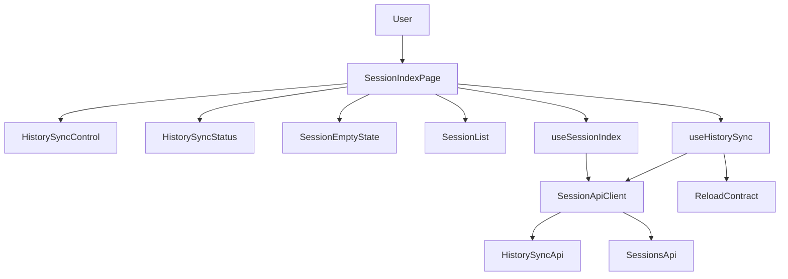
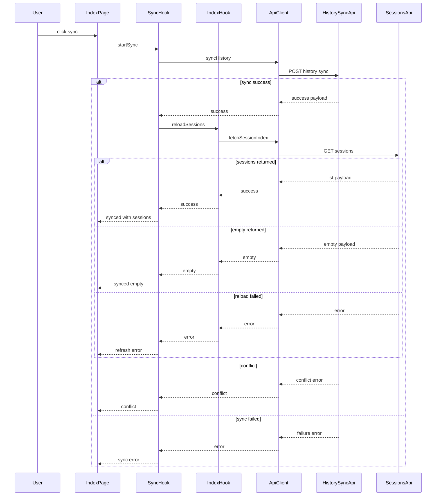
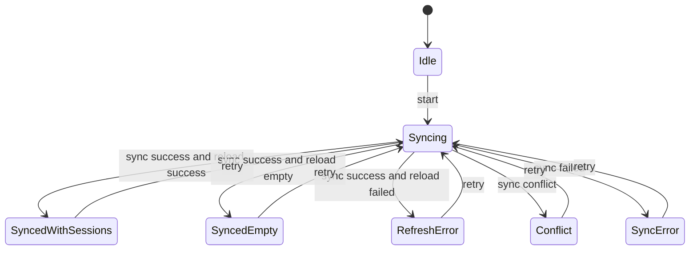

# 設計書

## 概要
この feature は、セッション一覧画面に利用者が明示的に履歴同期を開始できる UI を追加し、同期成功後に一覧を再取得して、DB 空状態や同期失敗を誤認なく判断できるようにする。対象利用者は Copilot CLI のローカル履歴を読み返したい利用者であり、DB read model 化の移行中でも画面上から取り込みを開始できる体験を得る。

実装は frontend の `features/sessions` slice に限定する。backend の同期処理、session list/detail API の参照元切替、検索や自動更新は扱わず、既存の一覧カードと詳細画面への導線を維持したまま同期導線と状態表示を追加する。

### 目標
- セッション一覧画面に「履歴を最新化」操作を表示し、利用者の明示操作で `POST /api/history/sync` を呼ぶ。
- 同期中、成功、同期失敗、二重実行 conflict、同期成功後の一覧再取得失敗、空状態を区別して表示する。
- 同期成功後に `GET /api/sessions` を再取得し、表示可能なセッションがあれば既存一覧表示へ反映する。
- DB 空状態でも履歴取り込みの primary action を提示する。
- 既存 session list rendering と詳細画面への selection flow を維持する。

### 対象外
- backend 同期 service、controller、presenter、DB schema の変更
- session list/detail API の DB query 化、日付範囲 UI、検索 UI、自動更新、進捗 polling
- 認証・認可、同期履歴画面、raw files の削除、DB の手動編集
- 詳細画面の表示構成変更

## 境界の約束

### この仕様が所有する範囲
- 一覧画面上の明示同期操作、空状態内の取り込み操作、同期中 disabled / loading 表示
- `POST /api/history/sync` を呼ぶ typed frontend client contract
- 同期 request state と、成功後の一覧再取得結果を組み合わせる page-local state machine
- 同期成功、同期失敗、conflict、再取得失敗、成功後空状態の最小表示
- 既存 `SessionList` を使った同期後一覧表示への反映

### 境界外
- raw files の読取、同期判定、insert / update / skip、running lock、sync run 記録
- `GET /api/sessions` と `GET /api/sessions/:id` の response shape、並び順、参照元切替
- 詳細画面、timeline、issue 表示の再設計
- search、filter、date range、manual DB edit、auto refresh、background polling
- backend error code taxonomy の新規定義

### 許可する依存
- `history-sync-api` の `POST /api/history/sync` success/error/conflict contract
- 既存 session list API `GET /api/sessions`
- 既存 frontend stack: React 19、TypeScript 6、Vite、Tailwind CSS 4、Vitest、Testing Library
- browser `fetch`、`AbortController`、`VITE_API_BASE_URL`
- 既存 `SessionList`、`StatusPanel`、`SessionSummaryCard`、`useSessionIndex` の一覧表示境界

### 再検証トリガー
- `POST /api/history/sync` の HTTP status、success payload、error code、conflict details が変わる場合
- session list API が空状態、error envelope、並び順、response shape を変更する場合
- 同期 API が request 内完了から background job / polling 型へ変わる場合
- 一覧 UI に search、filter、date range、自動更新を追加する場合
- 詳細画面から同期を開始する導線を追加する場合
- `VITE_API_BASE_URL` 以外の API 接続方式へ変わる場合

## アーキテクチャ

### 既存アーキテクチャ分析
- frontend は `features/sessions` 配下に API 型、API client、hook、page、component、presentation helper、近傍 test を置く構成である。
- `SessionApiClient` は `VITE_API_BASE_URL` を検証し、`fetch` の成功、backend error、network error、config error を typed result union へ正規化している。
- `useSessionIndex` は初回一覧取得と reusable snapshot を持つが、同期成功後に呼び出す明示再取得 contract はまだ持たない。
- `SessionIndexPage` は `loading | empty | error | success` を `StatusPanel` または `SessionList` に分岐するだけで、一覧 rendering と詳細遷移は `SessionList` / `SessionSummaryCard` に委譲している。
- backend には `POST /api/history/sync` があり、200 success、409 `history_sync_running`、503 root failure、500 `history_sync_failed` を区別する。

### アーキテクチャパターンと境界マップ



**Architecture Integration**:
- Selected pattern: page-local orchestration。`SessionIndexPage` が一覧取得 hook と同期 hook を組み合わせ、API mutation と一覧 read state を page 内で統合する。
- Dependency direction: `sessionApi.types` → `apiBaseUrl` → `sessionApi` → `useSessionIndex` / `useHistorySync` → `SessionIndexPage` → presentational components。presentational components は hooks や API client を import しない。
- Existing patterns preserved: relative import、feature 近傍 test、Tailwind utility styling、global state manager なし、backend contract の typed normalization。
- New components rationale: 同期操作、同期 status、空状態の取り込み action を分離し、既存 `SessionList` と詳細画面へ同期責務を漏らさない。
- Steering compliance: Docker Compose 前提の既存 frontend stack を継続し、新規 npm dependency は追加しない。

### 技術スタック

| Layer | Choice / Version | Role in Feature | Notes |
|-------|------------------|-----------------|-------|
| Frontend | React 19, TypeScript 6 | 一覧 page composition、同期操作、state rendering | 既存 stack を継続 |
| Frontend UI | Tailwind CSS 4 | button、status banner、empty state の styling | 新規 UI library は追加しない |
| Frontend API | browser `fetch`, `AbortController` | `POST /api/history/sync` と `GET /api/sessions` の実行と中断 | 既存 `SessionApiClient` を拡張 |
| Backend / Services | Rails API existing endpoints | 同期 API と session list API の upstream contract | backend 実装は変更しない |
| Infrastructure / Runtime | Vite, `VITE_API_BASE_URL`, Docker Compose | frontend/backend 接続設定 | 既存 runtime 前提を維持 |

## ファイル構成計画

### ディレクトリ構成
```text
frontend/
└── src/
    └── features/
        └── sessions/
            ├── api/
            │   ├── sessionApi.types.ts              # 既存 session 型に history sync response 型と client method contract を追加
            │   ├── sessionApi.ts                    # POST /api/history/sync と method 指定可能な requestJson を追加
            │   └── sessionApi.test.ts               # sync success、409 conflict、503/500、network/config error の正規化を検証
            ├── hooks/
            │   ├── useSessionIndex.ts               # 明示 reload contract、refreshing state、reload outcome を追加
            │   ├── useSessionIndex.test.tsx         # reload、stale response、再取得失敗、snapshot 維持を検証
            │   ├── useHistorySync.ts                # 同期 state machine と成功後一覧 reload orchestration を所有
            │   └── useHistorySync.test.tsx          # idle、syncing、success、empty、conflict、sync error、refresh error を検証
            ├── pages/
            │   ├── SessionIndexPage.tsx             # 同期 control、status、empty action、既存 list rendering を合成
            │   └── SessionIndexPage.test.tsx        # ユーザー操作、disabled、一覧維持、成功後表示、失敗表示を検証
            └── components/
                ├── HistorySyncControl.tsx           # 一覧上部の履歴最新化ボタンと同期中表示
                ├── HistorySyncStatus.tsx            # 同期成功、失敗、conflict、再取得失敗の banner
                ├── SessionEmptyState.tsx            # 空状態と履歴取り込み primary action
                └── StatusPanel.tsx                  # 必要に応じて action slot を追加し、既存 loading/error 用途を維持
```

### 変更するファイル
- `frontend/src/features/sessions/api/sessionApi.types.ts` — `HistorySyncRun`, `HistorySyncCounts`, `HistorySyncResponse`, `SessionApiClient.syncHistory` を追加する。
- `frontend/src/features/sessions/api/sessionApi.ts` — `requestJson` に HTTP method を渡せるようにし、`syncHistory(signal?)` で `POST /api/history/sync` を呼ぶ。
- `frontend/src/features/sessions/api/sessionApi.test.ts` — 同期成功 payload、409 conflict、503 root failure、500 backend failure、network/config failure を固定する。
- `frontend/src/features/sessions/hooks/useSessionIndex.ts` — `reloadSessions()` と `isRefreshing` を返し、同期後再取得で最新 outcome を呼び出し側へ返す。
- `frontend/src/features/sessions/hooks/useSessionIndex.test.tsx` — 初回取得に加えて明示 reload、reload 中の snapshot 維持、reload error の返却、abort を検証する。
- `frontend/src/features/sessions/pages/SessionIndexPage.tsx` — 同期 control と status を追加し、empty state の primary action と success list を合成する。
- `frontend/src/features/sessions/pages/SessionIndexPage.test.tsx` — 同期操作、二重実行防止、成功後再取得、再取得失敗、空状態 action、既存詳細 link 維持を検証する。
- `frontend/src/features/sessions/components/StatusPanel.tsx` — 空状態 action を共通 panel に載せる場合のみ action slot を追加し、既存 variant の見た目とリンク contract を維持する。

### 作成するファイル
- `frontend/src/features/sessions/hooks/useHistorySync.ts` — 同期 request、二重実行防止、成功後 reload、error 分類を所有する。
- `frontend/src/features/sessions/hooks/useHistorySync.test.tsx` — hook の状態遷移と `syncHistory` / `reloadSessions` 呼び出し順序を検証する。
- `frontend/src/features/sessions/components/HistorySyncControl.tsx` — 一覧上部の明示同期ボタンを描画し、`syncing` 中は disabled にする。
- `frontend/src/features/sessions/components/HistorySyncStatus.tsx` — 同期完了、conflict、同期失敗、同期後再取得失敗を成功一覧と誤認しない banner として描画する。
- `frontend/src/features/sessions/components/SessionEmptyState.tsx` — 空一覧を loading/error と区別し、同じ同期要求を開始する primary action を提供する。

### 参照する既存ファイル
- `frontend/src/features/sessions/components/SessionList.tsx` — 同期後に再取得された `SessionSummary` 配列を既存順序のまま描画する。変更しない。
- `frontend/src/features/sessions/components/SessionSummaryCard.tsx` — 詳細画面への既存 link contract を維持する。変更しない。
- `frontend/src/features/sessions/api/apiBaseUrl.ts` — 既存 API base URL validation を同期 API client でも再利用する。変更しない。

## システムフロー



- 同期中は同じ画面の同期ボタンと空状態 action を disabled にし、同じ UI 操作からの二重実行を防ぐ。
- 同期中も既に表示中の一覧は隠さない。初回空状態で同期中の場合は空状態内の action を loading 表示へ切り替える。
- 同期失敗時は既存一覧を最新化済み一覧として扱わず、失敗 banner を優先表示する。
- 同期成功後の再取得に失敗した場合は、同期自体の成功と最新一覧の表示失敗を分けて表示する。

### 状態フロー



## 要件トレーサビリティ

| Requirement | Summary | Components | Interfaces | Flows |
|-------------|---------|------------|------------|-------|
| 1.1 | 一覧画面に履歴最新化操作を表示する | `SessionIndexPage`, `HistorySyncControl`, `SessionEmptyState` | component props | state flow |
| 1.2 | 明示操作で履歴同期を要求する | `HistorySyncControl`, `useHistorySync`, `SessionApiClient` | `syncHistory` | sync sequence |
| 1.3 | 同期要求中を識別表示する | `useHistorySync`, `HistorySyncControl`, `HistorySyncStatus` | `HistorySyncState` | state flow |
| 1.4 | 同じ画面操作からの二重実行を防ぐ | `useHistorySync`, `HistorySyncControl`, `SessionEmptyState` | disabled state | state flow |
| 1.5 | 明示操作まで自動同期しない | `useHistorySync`, `SessionIndexPage` | user event contract | architecture boundary |
| 2.1 | 同期成功後に一覧を再取得する | `useHistorySync`, `useSessionIndex`, `SessionApiClient` | `reloadSessions` | sync sequence |
| 2.2 | 再取得後の sessions を既存表示で描画する | `SessionIndexPage`, `SessionList` | `SessionIndexState` | sync sequence |
| 2.3 | 同期完了後の一覧であることを表示する | `HistorySyncStatus`, `useHistorySync` | `HistorySyncState` | state flow |
| 2.4 | 同期成功後の再取得失敗を成功一覧と誤認させない | `useHistorySync`, `HistorySyncStatus`, `useSessionIndex` | `refresh_error` | sync sequence |
| 2.5 | 同期結果詳細を最小限に限定する | `HistorySyncStatus`, `HistorySyncCounts` | success summary | architecture boundary |
| 3.1 | 空状態を loading/error と区別する | `useSessionIndex`, `SessionEmptyState`, `SessionIndexPage` | `SessionIndexState.empty` | state flow |
| 3.2 | 空状態内に履歴取り込み操作を表示する | `SessionEmptyState`, `HistorySyncControl` | component props | state flow |
| 3.3 | 空状態 action も同じ同期要求を開始する | `SessionEmptyState`, `useHistorySync`, `SessionApiClient` | `syncHistory` | sync sequence |
| 3.4 | 空状態同期中の二重実行を防ぐ | `SessionEmptyState`, `useHistorySync` | disabled state | state flow |
| 3.5 | 同期成功後も空なら失敗と区別する | `useHistorySync`, `SessionEmptyState`, `HistorySyncStatus` | `synced_empty` | sync sequence |
| 4.1 | 同期要求失敗を error state として表示する | `useHistorySync`, `HistorySyncStatus` | `sync_error` | sync sequence |
| 4.2 | conflict を既に同期中の可能性として表示する | `useHistorySync`, `HistorySyncStatus` | `conflict` | sync sequence |
| 4.3 | network/config/backend failure の再試行判断を助ける | `SessionApiClient`, `useHistorySync`, `HistorySyncStatus` | `SessionApiError` | sync sequence |
| 4.4 | 同期失敗時に既存一覧を最新一覧扱いしない | `useHistorySync`, `HistorySyncStatus`, `SessionIndexPage` | status banner | state flow |
| 4.5 | 失敗後の再実行を新しい同期要求として扱う | `useHistorySync`, `SessionApiClient` | retry transition | state flow |
| 5.1 | 既存 list rendering と詳細選択導線を維持する | `SessionIndexPage`, `SessionList`, `SessionSummaryCard` | existing list props | architecture boundary |
| 5.2 | 同期中に既存一覧を不必要に隠さない | `SessionIndexPage`, `useSessionIndex`, `HistorySyncStatus` | snapshot rendering | state flow |
| 5.3 | 詳細画面を対象に含めない | Boundary Commitments | route boundary | architecture boundary |
| 5.4 | filter/search/auto update/polling/auth を含めない | Boundary Commitments | feature boundary | architecture boundary |
| 5.5 | raw files 削除や backend 同期処理変更を含めない | Boundary Commitments | dependency boundary | architecture boundary |

## コンポーネントとインターフェース

| Component | Domain/Layer | Intent | Req Coverage | Key Dependencies | Contracts |
|-----------|--------------|--------|--------------|------------------|-----------|
| `SessionApiClient` | Integration | session API と history sync API を typed result へ正規化する | 1.2, 2.1, 4.1, 4.2, 4.3, 4.5 | `fetch` P0, `apiBaseUrl` P0 | Service, API |
| `useSessionIndex` | UI logic | 一覧取得 state と明示 reload outcome を管理する | 2.1, 2.2, 2.4, 3.1, 5.2 | `SessionApiClient` P0 | Service, State |
| `useHistorySync` | UI logic | 同期実行、二重実行防止、成功後 reload、失敗分類を管理する | 1.2, 1.3, 1.4, 1.5, 2.1, 2.3, 2.4, 3.3, 3.4, 3.5, 4.1, 4.2, 4.3, 4.4, 4.5 | `SessionApiClient` P0, `reloadSessions` P0 | Service, State |
| `SessionIndexPage` | Route page | 一覧画面で同期 UI と既存 list rendering を合成する | 1.1, 2.2, 3.1, 5.1, 5.2 | `useSessionIndex` P0, `useHistorySync` P0, `SessionList` P0 | State |
| `HistorySyncControl` | Presentation | 一覧上部の明示同期操作を描画する | 1.1, 1.3, 1.4 | `useHistorySync` state P0 | State |
| `HistorySyncStatus` | Presentation | 同期結果と失敗状態を success list と区別して表示する | 2.3, 2.4, 2.5, 3.5, 4.1, 4.2, 4.3, 4.4 | `HistorySyncState` P0 | State |
| `SessionEmptyState` | Presentation | 空一覧の説明と履歴取り込み action を描画する | 3.1, 3.2, 3.3, 3.4, 3.5 | `useHistorySync` state P0 | State |
| `StatusPanel` | Presentation | 既存 loading/error callout と action slot を提供する | 3.1, 4.1 | existing variants P1 | State |
| `SessionList` | Presentation | 既存 session summary cards を backend 順で描画する | 2.2, 5.1, 5.2 | `SessionSummaryCard` P0 | State |

### API Integration

#### `SessionApiClient`

| Field | Detail |
|-------|--------|
| Intent | backend HTTP contract を frontend の typed result に変換する |
| Requirements | 1.2, 2.1, 4.1, 4.2, 4.3, 4.5 |

**Responsibilities & Constraints**
- `syncHistory(signal?)` は body なしの `POST /api/history/sync` を実行する。
- 200 は `HistorySyncResponse` として返し、409/503/500/network/config は既存 `SessionApiError` union へ正規化する。
- 409 かつ `code === 'history_sync_running'` は hook 側で conflict として分類できるよう、status と code を失わない。
- `requestJson` は method を明示できるが、default は既存 list/detail の GET とする。
- TypeScript で `any` を使わず、未知 payload は `unknown` と runtime guard で扱う。

**Dependencies**
- Inbound: `useHistorySync` — 同期要求を実行する (P0)
- Inbound: `useSessionIndex` — 同期後の一覧再取得を実行する (P0)
- Outbound: `apiBaseUrl` — API base URL validation (P0)
- External: browser `fetch` — HTTP 実行 (P0)
- External: `POST /api/history/sync` — 同期 API (P0)

**Contracts**: Service [x] / API [x] / Event [ ] / Batch [ ] / State [ ]

##### Service Interface
```typescript
interface SessionApiClient {
  fetchSessionIndex(signal?: AbortSignal): Promise<SessionApiResult<SessionIndexResponse>>
  fetchSessionDetail(
    sessionId: string,
    signal?: AbortSignal,
  ): Promise<SessionApiResult<SessionDetailResponse>>
  fetchSessionDetailWithRaw(
    sessionId: string,
    signal?: AbortSignal,
  ): Promise<SessionApiResult<SessionDetailResponse>>
  syncHistory(signal?: AbortSignal): Promise<SessionApiResult<HistorySyncResponse>>
}
```
- Preconditions: `VITE_API_BASE_URL` は絶対 URL として解決できる。同期 request は利用者操作からのみ呼ばれる。
- Postconditions: HTTP status と error code は失われず、hook が conflict / failure を分類できる。
- Invariants: GET list/detail の既存 URL と error normalization を変更しない。

##### API Contract
| Method | Endpoint | Request | Response | Errors |
|--------|----------|---------|----------|--------|
| POST | `/api/history/sync` | body なし | `HistorySyncResponse` | 409 `history_sync_running`, 503 root failure code, 500 `history_sync_failed`, network/config error |

```typescript
interface HistorySyncRun {
  id: number
  status: string
  started_at: string | null
  finished_at: string | null
}

interface HistorySyncCounts {
  processed_count: number
  inserted_count: number
  updated_count: number
  saved_count: number
  skipped_count: number
  failed_count: number
  degraded_count: number
}

interface HistorySyncResponse {
  data: {
    sync_run: HistorySyncRun
    counts: HistorySyncCounts
  }
}
```

### UI Logic

#### `useSessionIndex`

| Field | Detail |
|-------|--------|
| Intent | 一覧取得と同期後の明示再取得を同じ typed state で扱う |
| Requirements | 2.1, 2.2, 2.4, 3.1, 5.2 |

**Responsibilities & Constraints**
- 初回 mount 時に既存通り `fetchSessionIndex` を実行する。
- `reloadSessions()` は現在の client で一覧を再取得し、`success | empty | error` の settled state を Promise で返す。
- reload 中は `isRefreshing` を `true` にし、既存 `success` または `empty` snapshot を即座に破棄しない。
- reload が error の場合、呼び出し元へ error outcome を返し、同期 hook が `refresh_error` を表示できるようにする。
- backend が返した session order を並び替えない。

**Dependencies**
- Inbound: `SessionIndexPage` — 現在の一覧 state を描画する (P0)
- Inbound: `useHistorySync` — 同期成功後に reload を呼ぶ (P0)
- Outbound: `SessionApiClient` — `fetchSessionIndex` (P0)

**Contracts**: Service [x] / API [ ] / Event [ ] / Batch [ ] / State [x]

##### Service Interface
```typescript
type SessionIndexState =
  | { status: 'loading' }
  | { status: 'empty' }
  | { status: 'success'; sessions: readonly SessionSummary[]; meta: SessionIndexMeta }
  | { status: 'error'; error: SessionApiError }

interface UseSessionIndexResult {
  state: SessionIndexState
  isRefreshing: boolean
  reloadSessions(): Promise<Exclude<SessionIndexState, { status: 'loading' }>>
}
```
- Preconditions: `reloadSessions` は mounted hook instance から呼ばれる。
- Postconditions: reload outcome は同期 hook に返され、page state と矛盾しない。
- Invariants: `SessionList` には `success.sessions` のみ渡す。

#### `useHistorySync`

| Field | Detail |
|-------|--------|
| Intent | 明示同期操作の lifecycle と一覧再取得 orchestration を管理する |
| Requirements | 1.2, 1.3, 1.4, 1.5, 2.1, 2.3, 2.4, 3.3, 3.4, 3.5, 4.1, 4.2, 4.3, 4.4, 4.5 |

**Responsibilities & Constraints**
- `startSync()` が呼ばれるまで同期 request を開始しない。
- `syncing` 中に `startSync()` が再度呼ばれても新しい request を発行しない。
- 同期成功後は必ず `reloadSessions()` を呼び、結果を `synced_with_sessions | synced_empty | refresh_error` に分類する。
- 409 `history_sync_running` は `conflict` として分類し、通常の backend failure と文言を分ける。
- network/config/backend failure は `sync_error` として保持し、再試行時は新しい同期 request を発行する。

**Dependencies**
- Inbound: `SessionIndexPage`, `HistorySyncControl`, `SessionEmptyState` — 操作と表示 (P0)
- Outbound: `SessionApiClient` — `syncHistory` (P0)
- Outbound: `useSessionIndex.reloadSessions` — 同期後再取得 (P0)

**Contracts**: Service [x] / API [ ] / Event [ ] / Batch [ ] / State [x]

##### State Management
```typescript
type HistorySyncState =
  | { status: 'idle' }
  | { status: 'syncing' }
  | { status: 'synced_with_sessions'; result: HistorySyncResponse['data'] }
  | { status: 'synced_empty'; result: HistorySyncResponse['data'] }
  | { status: 'refresh_error'; result: HistorySyncResponse['data']; error: SessionApiError }
  | { status: 'conflict'; error: SessionApiError }
  | { status: 'sync_error'; error: SessionApiError }

interface UseHistorySyncResult {
  state: HistorySyncState
  isSyncing: boolean
  startSync(): Promise<void>
}
```
- Persistence & consistency: state は page-local で永続化しない。reload 後の一覧 data は `useSessionIndex` が所有する。
- Concurrency strategy: `isSyncing` 中の duplicate UI event は無視し、button は disabled にする。
- Recovery: terminal state からの `startSync()` は新しい request として扱う。

### Presentation

#### `SessionIndexPage`

| Field | Detail |
|-------|--------|
| Intent | 同期 UI、空状態、既存一覧表示を同じ一覧 route に統合する |
| Requirements | 1.1, 2.2, 3.1, 5.1, 5.2 |

**Responsibilities & Constraints**
- page heading 付近に `HistorySyncControl` を表示する。
- `state.status === 'success'` のときは常に `SessionList` を描画し、同期中 banner があっても list を隠さない。
- `state.status === 'empty'` のときは `SessionEmptyState` を描画し、同期 action は `HistorySyncControl` と同じ `startSync` を使う。
- `state.status === 'error'` は一覧取得失敗として既存 error panel を表示し、同期 error と混同しない。
- 詳細 route、detail page、`SessionSummaryCard` の link contract を変更しない。

**Dependencies**
- Inbound: `App` index route (P0)
- Outbound: `useSessionIndex` (P0)
- Outbound: `useHistorySync` (P0)
- Outbound: `SessionList`, `HistorySyncControl`, `HistorySyncStatus`, `SessionEmptyState`, `StatusPanel` (P0)

**Contracts**: Service [ ] / API [ ] / Event [ ] / Batch [ ] / State [x]

#### `HistorySyncControl`
- `isSyncing` のとき button は disabled で、loading text を表示する。
- terminal state の後は再試行可能な通常 button に戻す。
- 自動実行せず、`onSync` callback は click または keyboard activation の user event でのみ呼ぶ。

#### `HistorySyncStatus`
- `synced_with_sessions`: 同期完了と一覧再取得完了を表示する。保存件数と劣化件数だけを短く示す。
- `synced_empty`: 同期は完了したが表示対象がないことを、失敗ではない empty outcome として表示する。
- `refresh_error`: 同期は完了したが最新一覧を表示できないことを error banner として表示する。
- `conflict`: 既に同期中の可能性を示し、時間を置いた再試行を促す。
- `sync_error`: network/config/backend failure を成功と区別し、再試行できる状態として表示する。

#### `SessionEmptyState`
- 空一覧を loading/error と区別する見出しと説明を持つ。
- 履歴取り込み primary action は `startSync` と同じ callback を使う。
- `isSyncing` 中は action を disabled にし、二重実行を防ぐ。
- `synced_empty` の場合は取り込み後も表示対象がないことを失敗と区別して補足する。

## データモデル

### Domain Model
- `HistorySyncState`: frontend だけが所有する page-local 同期状態。backend sync run を永続化しない。
- `SessionIndexState`: session list API の取得状態。session data の所有権は session API response にある。
- `HistorySyncResponse`: sync API success payload の最小 typed representation。sync run と counts を表示判断に使う。
- `SessionApiError`: 既存 error union。sync API の 409/503/500/network/config も同じ union で扱う。

### Data Contracts & Integration
- `HistorySyncResponse` は backend success payload をそのまま表す。frontend は counts を再計算しない。
- conflict 判定は `SessionApiError.kind === 'backend'`, `httpStatus === 409`, `code === 'history_sync_running'` の組み合わせで行う。
- root failure、backend failure、network failure、config failure は成功 state に昇格しない。
- `SessionIndexResponse.data.length === 0` は empty state であり、sync failure ではない。

## エラーハンドリング

### Error Strategy
- 同期 request failure は `sync_error` として表示し、既存 session list があっても最新化成功とは表示しない。
- 409 conflict は `conflict` として表示し、backend 側で既に running sync がある可能性を明示する。
- 同期成功後の一覧再取得失敗は `refresh_error` として表示し、同期成功と最新一覧表示失敗を分ける。
- 初回一覧取得 error は既存 `SessionIndexState.error` として扱い、同期 error banner と混ぜない。

### Error Categories and Responses
- User/State conflict: 409 `history_sync_running` → 同期中の可能性を示す conflict banner。
- System errors: 503 root failure、500 backend failure、network error → 同期未完了または最新一覧未確認の error banner。
- Config errors: `VITE_API_BASE_URL` missing/invalid → API 設定が必要な error banner。
- Empty success: 同期成功後の empty list → `synced_empty` と empty state を表示し、失敗表示にしない。

### Monitoring
- この feature では新規 telemetry や logging は追加しない。検証は frontend test と backend API 契約に依存する。

## テスト戦略

### Unit Tests
- `sessionApi.test.ts`: `syncHistory` が `POST /api/history/sync` を呼び、200 success payload を `HistorySyncResponse` として返すことを検証する。
- `sessionApi.test.ts`: 409 `history_sync_running`、503 root failure、500 `history_sync_failed`、network error、config error が `SessionApiError` として正規化されることを検証する。
- `useSessionIndex.test.tsx`: `reloadSessions()` が success/empty/error outcome を返し、reload 中に既存 success list を不必要に消さないことを検証する。
- `useHistorySync.test.tsx`: `startSync()` まで request を出さず、`syncing` 中の二重実行を抑止することを検証する。
- `useHistorySync.test.tsx`: 同期成功後に `reloadSessions()` を呼び、success/empty/error を `synced_with_sessions` / `synced_empty` / `refresh_error` に分類することを検証する。

### Integration Tests
- `SessionIndexPage.test.tsx`: 一覧上部に履歴最新化操作を表示し、click で同期 hook を起動することを検証する。
- `SessionIndexPage.test.tsx`: 同期中は上部 button と空状態 action が disabled になり、既存 session cards と詳細 link が残ることを検証する。
- `SessionIndexPage.test.tsx`: 同期成功後の再取得で sessions が返った場合、既存 `SessionList` 表示と完了 banner が表示されることを検証する。
- `SessionIndexPage.test.tsx`: 同期成功後の再取得が失敗した場合、最新一覧を表示できない error banner を表示し、成功一覧と誤認させないことを検証する。
- `SessionIndexPage.test.tsx`: empty state の取り込み action が上部同期操作と同じ同期要求を開始することを検証する。

### E2E/UI Tests
- 既存 test runtime は Testing Library 中心であり、この feature では追加 E2E runtime を導入しない。
- 重要ユーザーフローは page integration test で代替する: 初回空状態から同期、既存一覧表示中の同期、conflict 表示、同期失敗後の再試行。

### Performance
- 同期処理自体は backend が request 内で実行する。frontend は二重クリックを防ぎ、同期中に polling を行わない。
- 同期成功後の再取得は 1 回だけ実行し、自動 retry や auto refresh は行わない。

## セキュリティ考慮事項
- この feature は既存 API base URL への browser request のみを追加し、認証・認可の新規設計は扱わない。
- raw files の内容や DB payload を frontend で編集、削除、送信する機能は追加しない。
- backend error details は既存 error envelope の範囲で表示し、sync run の監査詳細を過度に露出しない。
