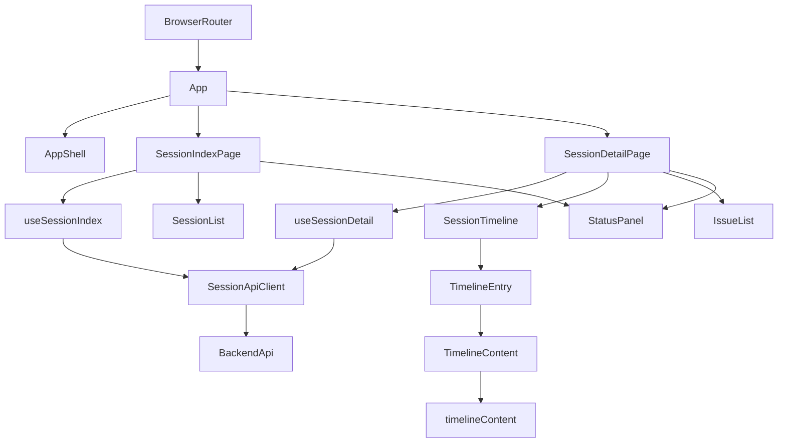
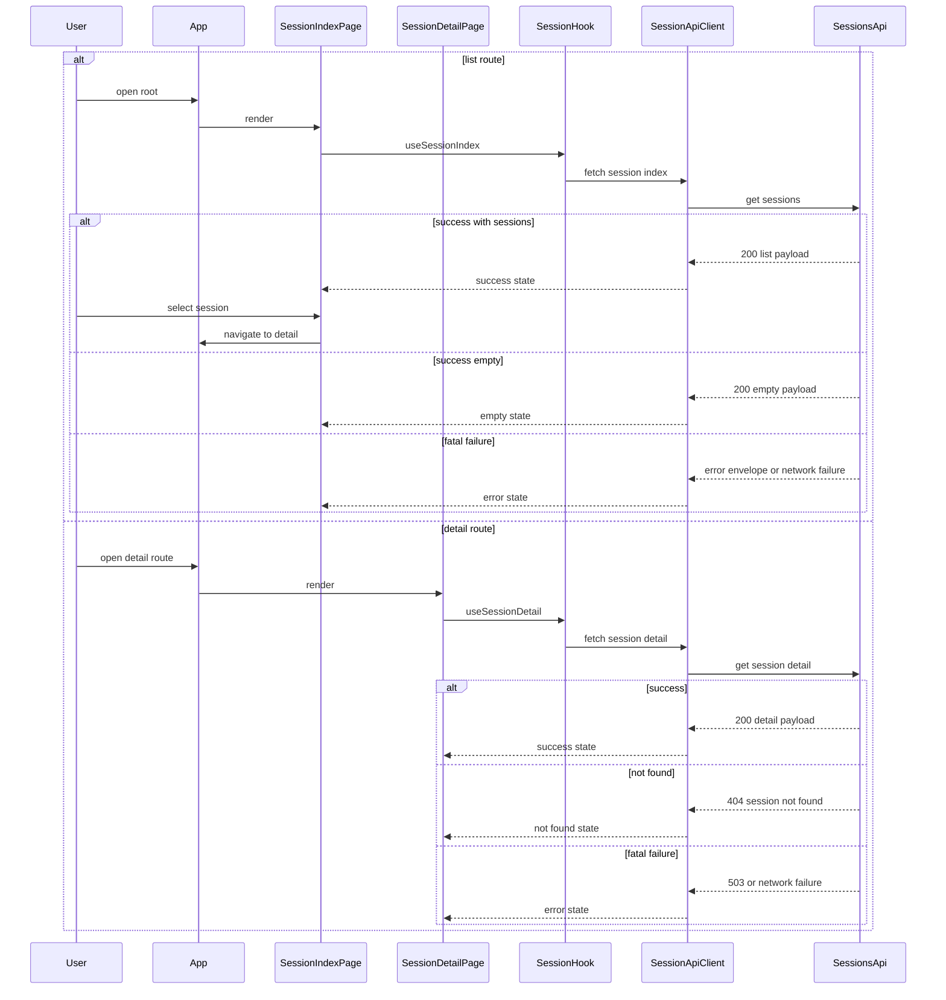

# Design Document

## Overview
この feature は、backend-session-api が返す read-only session data を、browser 上の一覧画面と詳細タイムライン画面として読める frontend SPA を提供する。利用者は一覧から対象 session を選ぶか、詳細 URL を直接開き、会話本文・識別可能な tool 呼び出し情報・code block・degraded 情報を見分けながら履歴を読み返せる。

frontend は現在 static placeholder しか持たないため、この spec では route tree、typed API integration、page-local state machine、timeline presentation を新たに定義する。ただし raw 履歴の読取や API schema の所有権は backend に残し、frontend は既存 contract を安全に描画する責務に限定する。

### Goals
- `/` で session 一覧、`/sessions/:sessionId` で詳細タイムラインを表示する。
- loading、empty、not found、fatal failure、degraded success を誤認なく可視化する。
- 識別可能な tool 呼び出し情報、code block、partial / unknown event を通常メッセージと区別して読める UI を提供する。
- lightweight SPA の原則を保ち、routing と data loading を feature-local な境界に閉じる。

### Non-Goals
- 検索、絞り込み、並び替え条件変更、再読み込み、auto refresh
- backend API 契約の変更、raw payload 正規化、reader 実装
- 認証・認可、外部公開前提の hardening、共有機能
- DB 永続化、cache layer、global state manager、E2E 専用 runtime 導入

## Boundary Commitments

### This Spec Owns
- frontend route tree と page composition (`/` と `/sessions/:sessionId`)
- `VITE_API_BASE_URL` を使った read-only API client と typed error normalization
- session 一覧 card、詳細 header、issue 表示、timeline 表示の UI 契約
- loading / empty / not found / error / degraded の page-local state machine
- `content` と canonical detail payload 内で識別可能な構造化情報を使った tool hint / code block の safe rendering

### Out of Boundary
- `GET /api/sessions` と `GET /api/sessions/:id` の response shape や並び順決定ロジック
- raw history files や `raw_payload` 全体の parse / normalization / schema 進化の吸収
- 検索 UI、filter UI、refresh button、background polling
- edit / delete / export などの mutating action
- auth、telemetry、外部共有の設計

### Allowed Dependencies
- backend-session-api の既存 endpoint と error envelope
- React 19、TypeScript 6、Vite 8、Tailwind CSS 4
- `react-router` の declarative routing (`BrowserRouter`, `Routes`, `Route`, `Link`, `useParams`, `Outlet`)
- browser `fetch` と `AbortController`
- `import.meta.env.VITE_API_BASE_URL` による runtime config

### Revalidation Triggers
- backend の session list order、detail payload field、error code taxonomy が変わる場合
- route path や basename が変わる場合
- current Vite SPA 以外の runtime へ移り、direct URL に別の fallback 設定が必要になる場合
- search / filter / refresh / auto-update を追加する場合
- backend が dedicated な tool metadata を別 contract で露出し、frontend の limited hint detection を置き換えられる場合

## Architecture

### Existing Architecture Analysis
- frontend は `main.tsx` が `App` を直接 mount するだけで、router と API client は未実装である。
- `App.tsx` は静的 hero を描画しており、現在の UI は session data を一切読まない。
- path alias は導入されておらず、steering は relative import と feature 近傍テストを前提にしている。
- backend は `GET /api/sessions` と `GET /api/sessions/:id` を持ち、CORS と `VITE_API_BASE_URL` の runtime 前提も揃っている。

### Architecture Pattern & Boundary Map



**Architecture Integration**:
- Selected pattern: route-centric SPA。`App` が route と shared shell、`SessionApiClient` が HTTP 正規化、hooks が page state、presentation helpers が timeline 表現を担当する。
- Dependency direction: `sessionApi.types` → `apiBaseUrl` → `sessionApi` → `useSessionIndex` / `useSessionDetail` → `SessionIndexPage` / `SessionDetailPage` → presentation components。presentational component は上位 page や hook を import しない。
- Existing patterns preserved: relative import、feature 近傍 test、Tailwind utility styling、lightweight SPA。
- New components rationale: routing、HTTP normalization、page state、timeline rendering を分離することで、検索や refresh を持ち込まずに要件 coverage と task 境界を両立する。
- Steering compliance: frontend は UI 近傍に test を置き、global state manager を入れず、backend contract をそのまま read-only に利用する。

### Technology Stack

| Layer | Choice / Version | Role in Feature | Notes |
|-------|------------------|-----------------|-------|
| Frontend | React 19, TypeScript 6, Vite 8 | route tree、page composition、typed client-side rendering | 既存基盤を継続利用 |
| Frontend UI | Tailwind CSS 4 | session list、detail、status panel、timeline の見た目 | 新しい CSS framework は追加しない |
| Frontend Routing | `react-router` v7 library mode | `/` と `/sessions/:sessionId` の client-side routing | direct URL と list navigation を統一 |
| Backend / Services | Rails API 8.1 existing endpoints | list / detail session data の read-only source | contract owner は backend |
| Infrastructure / Runtime | Docker Compose, `VITE_API_BASE_URL`, browser `fetch` | local frontend/backend 接続 | current dev runtime は Vite SPA |

## File Structure Plan

### Directory Structure
```text
frontend/
└── src/
    ├── App.tsx                                              # route host。shared shell と 2 つの owned route を宣言する
    ├── App.test.tsx                                         # route host と初期画面導線の smoke test
    ├── main.tsx                                             # BrowserRouter を mount する entrypoint
    ├── app/
    │   └── AppShell.tsx                                     # 共通見出し、一覧リンク、`Outlet` を持つ read-only layout
    └── features/
        └── sessions/
            ├── api/
            │   ├── apiBaseUrl.ts                            # `VITE_API_BASE_URL` を検証し、絶対 URL 化を一元化する
            │   ├── sessionApi.types.ts                      # backend response と frontend error/state contract を定義する
            │   ├── sessionApi.ts                            # `SessionApiClient` 実装。list/detail fetch と status code normalization を担当する
            │   └── sessionApi.test.ts                       # HTTP 200/404/503/config/network の分岐を固定する
            ├── hooks/
            │   ├── useSessionIndex.ts                       # 一覧画面の loading/success/empty/error state machine
            │   └── useSessionDetail.ts                      # 詳細画面の loading/success/not_found/error state machine
            ├── pages/
            │   ├── SessionIndexPage.tsx                     # 一覧 route の composition。status panel と session list を切り替える
            │   ├── SessionIndexPage.test.tsx                # loading、empty、success、fatal failure を確認する
            │   ├── SessionDetailPage.tsx                    # 詳細 route の composition。back link、header、issues、timeline を組み立てる
            │   └── SessionDetailPage.test.tsx               # direct route、not_found、degraded、service failure、stale response を確認する
            ├── components/
            │   ├── StatusPanel.tsx                          # loading / empty / error / not_found の共通 callout
            │   ├── SessionList.tsx                          # backend 順序を保持して summary cards を並べる
            │   ├── SessionSummaryCard.tsx                   # 1 session の要約情報と detail link を描画する
            │   ├── SessionDetailHeader.tsx                  # session metadata、degraded badge、一覧へ戻る導線
            │   ├── IssueList.tsx                            # session issue / event issue の説明を統一表示する
            │   ├── SessionTimeline.tsx                      # ordered timeline container。event list と issue list を束ねる
            │   ├── TimelineEntry.tsx                        # sequence、time、role、kind badge、本文領域を持つ 1 行コンポーネント
            │   └── TimelineContent.tsx                      # text / code / tool hint block を安全に描画する
            └── presentation/
                ├── formatters.ts                            # timestamp、work context、badge label の表示用 helper
                ├── timelineContent.ts                       # `content` と `raw_payload` から visual blocks を導出する
                └── timelineContent.test.ts                  # fenced code と tool hint の抽出規則を固定する
```

### Modified Files
- `frontend/package.json` — `react-router` 依存を追加する
- `frontend/src/main.tsx` — `BrowserRouter` を mount する
- `frontend/src/App.tsx` — static placeholder を route host に置き換える
- `frontend/src/App.test.tsx` — hero 固定文言 test から route / shell test に更新する

## System Flows



- 一覧画面は backend が返した順序をそのまま描画し、frontend で再 sort しない。
- 詳細画面は route param 変更時に in-flight request を abort し、古い response が新しい route を上書きしない。
- degraded session は `success` state のまま issue と badge を表示し、fatal failure と混同しない。

## Requirements Traceability

| Requirement | Summary | Components | Interfaces | Flows |
|-------------|---------|------------|------------|-------|
| 1.1 | 最新更新順の session 一覧を表示する | `SessionApiClient`, `useSessionIndex`, `SessionList` | SessionIndexResponse | list route |
| 1.2 | ID、更新日時、work context、model、degraded を表示する | `SessionSummaryCard`, `formatters` | SessionSummary | list route |
| 1.3 | 一覧取得中を識別表示する | `useSessionIndex`, `StatusPanel`, `SessionIndexPage` | SessionIndexState | list route |
| 1.4 | session が存在しないとき空状態を表示する | `useSessionIndex`, `StatusPanel`, `SessionIndexPage` | SessionIndexState | list route |
| 2.1 | 一覧から詳細へ遷移する | `App`, `SessionSummaryCard`, `SessionDetailPage` | route state | list route |
| 2.2 | 詳細 URL を直接開いて表示する | `App`, `useSessionDetail`, `SessionDetailPage` | route param, SessionDetailResponse | detail route |
| 2.3 | 詳細取得中を識別表示する | `useSessionDetail`, `StatusPanel`, `SessionDetailPage` | SessionDetailState | detail route |
| 2.4 | 詳細から一覧へ戻る導線を提供する | `AppShell`, `SessionDetailHeader` | route link contract | detail route |
| 2.5 | 存在しない session を明示し一覧へ戻せるようにする | `useSessionDetail`, `StatusPanel`, `SessionDetailPage` | SessionApiError | detail route |
| 3.1 | タイムラインを時系列で追える順序で表示する | `SessionTimeline`, `TimelineEntry` | TimelineEvent | detail route |
| 3.2 | kind、role、順序または時刻、本文を区別表示する | `TimelineEntry`, `formatters`, `TimelineContent` | TimelineEvent, TimelineContentModel | detail route |
| 3.3 | 識別可能な tool 呼び出し情報を通常本文と区別表示する | `TimelineContent`, `timelineContent` | TimelineToolHintBlock | detail route |
| 3.4 | code block の改行と構造を保つ | `TimelineContent`, `timelineContent` | TimelineCodeBlock | detail route |
| 4.1 | degraded を一覧と詳細の両方で識別可能にする | `SessionSummaryCard`, `SessionDetailHeader`, `IssueList` | SessionSummary, SessionDetail | list route, detail route |
| 4.2 | issue 情報から欠落や影響範囲を理解できる説明を表示する | `IssueList`, `TimelineEntry` | SessionIssue | detail route |
| 4.3 | 一覧/詳細の取得失敗を成功表示と区別し一覧基点で再判断できるようにする | `SessionApiClient`, `StatusPanel`, `SessionIndexPage`, `SessionDetailPage` | SessionApiError, SessionIndexState, SessionDetailState | list route, detail route |
| 4.4 | 編集、削除、検索、絞り込み、再読み込み、自動更新を提供しない | Boundary Commitments, `AppShell`, `StatusPanel` | route and page scope | architecture boundary |

## Components and Interfaces

| Component | Domain/Layer | Intent | Req Coverage | Key Dependencies (P0/P1) | Contracts |
|-----------|--------------|--------|--------------|--------------------------|-----------|
| `App` | Routing | owned routes と shared shell を宣言する | 2.1, 2.2, 2.4, 2.5, 4.4 | `react-router` (P0), `AppShell` (P0), `SessionIndexPage` (P0), `SessionDetailPage` (P0) | State |
| `SessionApiClient` | Integration | backend HTTP contract を typed frontend result へ正規化する | 1.1, 2.2, 2.5, 4.3 | `fetch` (P0), `apiBaseUrl` (P0) | Service, API |
| `useSessionIndex` | UI logic | 一覧画面の remote state を管理する | 1.1, 1.3, 1.4, 4.3 | `SessionApiClient` (P0) | Service, State |
| `useSessionDetail` | UI logic | 詳細画面の remote state と route-driven lifecycle を管理する | 2.2, 2.3, 2.5, 4.1, 4.2, 4.3 | `SessionApiClient` (P0), route param (P0) | Service, State |
| `SessionIndexPage` | Route page | 一覧画面の状態分岐と session list 描画を担う | 1.1, 1.2, 1.3, 1.4, 2.1, 4.1, 4.3 | `useSessionIndex` (P0), `SessionList` (P0), `StatusPanel` (P0) | State |
| `SessionDetailPage` | Route page | 詳細画面の状態分岐、back link、header、issues、timeline を束ねる | 2.2, 2.3, 2.4, 2.5, 3.1, 4.1, 4.2, 4.3 | `useSessionDetail` (P0), `SessionDetailHeader` (P0), `IssueList` (P0), `SessionTimeline` (P0), `StatusPanel` (P0) | State |
| `SessionTimeline` | Presentation | 順序付き timeline event 群を描画する | 3.1, 3.2, 4.1, 4.2 | `TimelineEntry` (P0), `TimelineContent` (P0), `IssueList` (P1) | State |
| `TimelineContent` | Presentation helper | plain text、code、recognizable tool hint を安全に描画する | 3.2, 3.3, 3.4 | `timelineContent` (P0) | Service |
| `IssueList` | Presentation | session / event issue 説明を一貫して描画する | 4.1, 4.2, 4.3 | `formatters` (P1) | State |
| `StatusPanel` | Presentation | loading、empty、not_found、error の共通 panel を描画する | 1.3, 1.4, 2.3, 2.5, 4.3 | route links (P1) | State |

### Routing

#### `App`

| Field | Detail |
|-------|--------|
| Intent | frontend-session-ui が所有する route と shared shell の境界を固定する |
| Requirements | 2.1, 2.2, 2.4, 2.5, 4.4 |

**Responsibilities & Constraints**
- `/` と `/sessions/:sessionId` の 2 route だけを owned path として宣言する。
- `AppShell` を親 layout とし、一覧への恒常導線を共有する。
- routing は browser history を正本とし、一覧遷移と direct URL を同一 contract に乗せる。
- remote data 取得、backend error 分岐、timeline 表示ロジックは所有しない。

**Dependencies**
- Inbound: `BrowserRouter` — browser history を提供する (P0)
- Outbound: `AppShell` — shared layout (P0)
- Outbound: `SessionIndexPage` — index route body (P0)
- Outbound: `SessionDetailPage` — detail route body (P0)
- External: `react-router` — routing primitives (P0)

**Contracts**: Service [ ] / API [ ] / Event [ ] / Batch [ ] / State [x]

##### State Management
- State model: `index route | detail route(sessionId)` の 2 状態
- Persistence & consistency: browser history に従う。route param が state の唯一の入力
- Concurrency strategy: route 変更時は下位 hook が request abort を行い、stale response を UI に反映しない

**Implementation Notes**
- Integration: current runtime では Vite SPA の history fallback を前提にする
- Validation: route test で `/` と `/sessions/:sessionId` の両方を直接 render 可能であることを確認する
- Risks: basename や hosting が変わると direct URL 前提が壊れる

### Integration

#### `SessionApiClient`

| Field | Detail |
|-------|--------|
| Intent | backend の HTTP 応答を、frontend が分岐しやすい typed result へ変換する |
| Requirements | 1.1, 2.2, 2.5, 4.3 |

**Responsibilities & Constraints**
- `GET /api/sessions` と `GET /api/sessions/:id` のみを扱う read-only client である。
- `VITE_API_BASE_URL` を一箇所で検証し、missing / malformed を config error として返す。
- 200 success、404 `session_not_found`、5xx/root failure、network failure を明示 union に分岐する。
- backend order や nullable field を改変せず、そのまま上位 hook へ渡す。

**Dependencies**
- Inbound: `useSessionIndex` — list request (P0)
- Inbound: `useSessionDetail` — detail request (P0)
- Outbound: `apiBaseUrl` — validated base URL (P0)
- External: browser `fetch` — HTTP transport (P0)

**Contracts**: Service [x] / API [x] / Event [ ] / Batch [ ] / State [ ]

##### Service Interface
```typescript
type SessionApiResult<T> =
  | { status: 'success'; data: T }
  | { status: 'error'; error: SessionApiError };

interface SessionApiClient {
  fetchSessionIndex(signal?: AbortSignal): Promise<SessionApiResult<SessionIndexResponse>>;
  fetchSessionDetail(
    sessionId: string,
    signal?: AbortSignal,
  ): Promise<SessionApiResult<SessionDetailResponse>>;
}
```
- Preconditions: `VITE_API_BASE_URL` が絶対 URL として解決可能であること。`sessionId` は空文字でないこと。
- Postconditions: 非 success 応答は必ず `SessionApiError` に正規化される。
- Invariants: `404 session_not_found` は `not_found` 系 error として保持し、service failure と混同しない。

##### API Contract
| Method | Endpoint | Request | Response | Errors |
|--------|----------|---------|----------|--------|
| GET | `/api/sessions` | none | `SessionIndexResponse` | config error, network error, backend error envelope |
| GET | `/api/sessions/:sessionId` | route param | `SessionDetailResponse` | `session_not_found`, config error, network error, backend error envelope |

**Implementation Notes**
- Integration: backend の error envelope は `code` / `message` / `details` を維持したまま client error union に写像する
- Validation: API client test で 200 / 404 / 503 / config / network をすべて固定する
- Risks: backend contract drift が最も影響する境界である

#### `useSessionIndex`

| Field | Detail |
|-------|--------|
| Intent | 一覧 route の 1 回読み込みを、UI が扱いやすい状態機械へ閉じ込める |
| Requirements | 1.1, 1.3, 1.4, 4.3 |

**Responsibilities & Constraints**
- mount 時に一覧 request を開始し、`loading` → `success | empty | error` のいずれかへ遷移する。
- `success` state では backend order を保持した `sessions` 配列を返す。
- `data.length === 0` は `empty` として扱い、error と混同しない。
- retry、refresh、polling は所有しない。

**Dependencies**
- Outbound: `SessionApiClient` — list request (P0)
- Inbound: `SessionIndexPage` — state consumer (P0)

**Contracts**: Service [x] / API [ ] / Event [ ] / Batch [ ] / State [x]

##### Service Interface
```typescript
type SessionIndexState =
  | { status: 'loading' }
  | { status: 'empty' }
  | {
      status: 'success';
      sessions: readonly SessionSummary[];
      meta: SessionIndexMeta;
    }
  | {
      status: 'error';
      error: SessionApiError;
    };

interface UseSessionIndexResult {
  state: SessionIndexState;
}
```
- Preconditions: hook は browser render 中に呼び出される。
- Postconditions: `success` と `error` は排他的であり、両方同時に保持しない。
- Invariants: `empty` は `success` の亜種ではなく独立 state として扱う。

##### State Management
- State model: `loading → success | empty | error`
- Persistence & consistency: route mount 中だけ有効。route 離脱で破棄される
- Concurrency strategy: unmount 時は request abort。stale resolution は無視する

**Implementation Notes**
- Integration: `SessionIndexPage` は state を読むだけで HTTP を知らない
- Validation: 一覧 page test で loading、empty、success、error を個別に固定する
- Risks: cache を持たないため route 再訪で都度 fetch が走る

#### `useSessionDetail`

| Field | Detail |
|-------|--------|
| Intent | 詳細 route の sessionId 駆動 request と状態分岐を管理する |
| Requirements | 2.2, 2.3, 2.5, 4.1, 4.2, 4.3 |

**Responsibilities & Constraints**
- route param `sessionId` を入力に詳細 request を開始し、`loading` → `success | not_found | error` のいずれかへ遷移する。
- degraded detail は `success` の中で issue / badge 表示に委譲する。
- `session_not_found` は `not_found` state として切り出し、fatal failure と混同しない。
- route param が変わったら古い request を abort し、新しい param の response だけを採用する。

**Dependencies**
- Inbound: `SessionDetailPage` — state consumer (P0)
- Outbound: `SessionApiClient` — detail request (P0)
- External: `react-router` route param — `sessionId` 入力 (P0)

**Contracts**: Service [x] / API [ ] / Event [ ] / Batch [ ] / State [x]

##### Service Interface
```typescript
type SessionDetailState =
  | { status: 'loading'; sessionId: string }
  | { status: 'not_found'; sessionId: string }
  | {
      status: 'success';
      sessionId: string;
      detail: SessionDetailResponse['data'];
    }
  | {
      status: 'error';
      sessionId: string;
      error: SessionApiError;
    };

interface UseSessionDetailResult {
  state: SessionDetailState;
}
```
- Preconditions: `sessionId` は route から得られる非空 string であること。
- Postconditions: `success` 以外では detail payload を持たない。
- Invariants: `not_found` は backend 404 にのみ対応し、network/config/service failure には使わない。

##### State Management
- State model: `loading → success | not_found | error`
- Persistence & consistency: current route param にのみ紐づく
- Concurrency strategy: param 変更時に旧 request を abort し、late response を捨てる

**Implementation Notes**
- Integration: `SessionDetailPage` は state に応じて header / issue / timeline または panel を描画する
- Validation: detail page test で direct route success、404、503/network、degraded success、param change race を確認する
- Risks: route param と render state のズレが起きると誤表示になるため abort 制御が重要

### Presentation

#### `TimelineContent`

| Field | Detail |
|-------|--------|
| Intent | backend event の本文を、recognizable tool hint・code block・plain text に安全に分解して表示する |
| Requirements | 3.2, 3.3, 3.4 |

**Responsibilities & Constraints**
- `content` の表示は text node と code block に限定し、HTML として評価しない。
- `raw_payload` 全体の schema を frontend で正規化しない。tool hint は canonical detail payload から識別できる限定パターンだけを扱う。
- frontend が認識済みの structured hint を event payload に見つけた場合だけ tool hint block を追加する。
- fenced code を分離して改行と空白を保持する。
- unknown / partial event でも、表示可能な本文は捨てずに block 化する。

**Dependencies**
- Inbound: `TimelineEntry` — event shell から利用される (P0)
- Outbound: `timelineContent` — visual block 導出 helper (P0)

**Contracts**: Service [x] / API [ ] / Event [ ] / Batch [ ] / State [ ]

##### Service Interface
```typescript
type TimelineVisualBlock =
  | { kind: 'text'; text: string }
  | { kind: 'code'; language: string | null; code: string }
  | { kind: 'tool_hint'; name: string; argumentsPreview: string | null };

interface TimelineContentModel {
  blocks: readonly TimelineVisualBlock[];
}

interface TimelineContentFormatter {
  format(event: SessionTimelineEvent): TimelineContentModel;
}
```
- Preconditions: `SessionTimelineEvent` は backend detail payload の 1 event であること。
- Postconditions: block 配列は event 本文の読取順を保つ。
- Invariants: tool hint が抽出できなくても text / code 表示は継続する。

**Implementation Notes**
- Integration: tool hint detection は canonical detail payload に既に現れている構造化 field の限定 allowlist を best-effort で読むだけで、新しい backend field は要求しない
- Validation: timeline content test で fenced code、recognized tool hint、unknown hint schema の plain text fallback を固定する
- Risks: future event schema の変化で tool hint が減る可能性があり、その場合でも plain text fallback で読解可能性を保つ

## Data Models

### Domain Model
- `SessionSummary` — 一覧 card に必要な session metadata。`id`, `updated_at`, `work_context`, `selected_model`, `degraded`, `issues`
- `SessionDetail` — 詳細画面の header と timeline の元データ。`id`, `work_context`, `selected_model`, `degraded`, `issues`, `timeline`
- `SessionIssue` — session / event の欠落や破損を表す共通 read-only object。`code`, `severity`, `message`, `scope`, `event_sequence`
- `SessionTimelineEvent` — sequence と kind を持つ canonical event。`content` と `raw_payload` から presentation model を導出する
- `TimelineVisualBlock` — UI 専用の派生モデル。`text | code | tool_hint`

### Logical Data Model

**Structure Definition**:

| Entity | Key Fields | Notes |
|--------|------------|-------|
| `SessionSummary` | `id`, `updated_at`, `created_at`, `work_context`, `selected_model`, `degraded`, `issues` | backend list order を保持して描画する |
| `SessionDetail` | `id`, `updated_at`, `work_context`, `selected_model`, `degraded`, `issues`, `timeline` | detail page の primary source |
| `SessionTimelineEvent` | `sequence`, `kind`, `raw_type`, `occurred_at`, `role`, `content`, `raw_payload`, `degraded`, `issues` | `sequence` が render order の canonical key |
| `TimelineVisualBlock` | `kind`, `text/code/name`, optional metadata | client-side derived only |

**Consistency & Integrity**:
- 一覧の並び順は backend contract を正本とし、frontend は preserve only を行う。
- 詳細 timeline は backend の配列順と `sequence` を一致させて描画する。
- nullable field (`updated_at`, `selected_model`, work context) は placeholder text に変換するが、`null` 自体の意味は保持する。
- `degraded` と `issues` は success payload の一部であり、error state に昇格させない。
- tool hint の有無は best-effort の presentation concern に留め、frontend が raw payload schema の所有者にならない。

### Data Contracts & Integration

**API Data Transfer**:

| Contract | Source | Consumer | Validation Rules |
|----------|--------|----------|------------------|
| `SessionIndexResponse` | `GET /api/sessions` | `SessionApiClient` → `useSessionIndex` | 200 では `data` 配列が存在し、`meta.count` と `partial_results` を読む |
| `SessionDetailResponse` | `GET /api/sessions/:id` | `SessionApiClient` → `useSessionDetail` | 200 では `data.timeline` 配列を持つ |
| `ErrorEnvelope` | 404 / 5xx / network substitute | `SessionApiClient` | `code` と `message` を必須化し、404 は `not_found` state に分岐する |

## Error Handling

### Error Strategy
- **Config error**: `VITE_API_BASE_URL` 不備は request 前に検知し、page-level error panel を表示する。
- **Network / service error**: backend 非到達や 5xx は `error` state に正規化し、成功表示と混在させない。
- **Not found**: `404 session_not_found` は `not_found` panel と一覧 link を表示する。
- **Degraded success**: `degraded: true` は success state のまま badge と issue description を表示する。
- **No silent fallback**: missing field や unknown tool hint schema は表示量を減らしても、成功/失敗 state 自体は明示 union で返す。

### Error Categories and Responses
- **User Errors**: `session_not_found` → not found panel + 一覧 link
- **System Errors**: root failure, network failure, invalid API base URL → error panel + 一覧 link
- **Business Logic Errors**: 該当なし。欠落や partial mapping は degraded success + issue 表示で扱う

### Monitoring
- この feature は local-only viewer であり、専用 telemetry stack は導入しない。
- 可観測性は user-visible panel と deterministic な test coverage に寄せる。
- hooks と API client は success-shaped fallback を返さず、error union を通じて UI に露出する。

## Testing Strategy

### Unit Tests
- `sessionApi.ts` が 200 / 404 / 503 / config / network を正しく `SessionApiResult` へ正規化する
- `timelineContent.ts` が fenced code を text 順序を崩さず抽出し、改行を維持する
- `timelineContent.ts` が recognized structured hint から tool hint を導出し、未知 schema や非対応 payload では plain text fallback する
- `formatters.ts` が `null` timestamp、missing context、missing model を安定 placeholder へ変換する

### Integration Tests
- `SessionIndexPage` が loading panel の後に session card 一覧を描画し、degraded badge を表示する
- `SessionIndexPage` が `data: []` を empty state として描画する
- `SessionIndexPage` が fatal failure を success list と混同せず error panel に出す
- `SessionDetailPage` が direct route で detail を読み込み、一覧へ戻る link を表示する
- `SessionDetailPage` が `404 session_not_found` を専用 panel として描画する
- `SessionDetailPage` が degraded session の issue list と timeline を success state の中で描画する
- `SessionDetailPage` が route param 変更後に旧 request が解決しても、現在の session state を上書きしない

### UI Route Tests
- session card click で `/sessions/:sessionId` へ遷移する
- detail route の初期 render が一覧経由なしでも成立する
- detail route が連続遷移したとき、遅延した旧 response を最新 route の描画に使わない
- timeline が partial / unknown / tool_hint / code block の各 visual variant を区別表示する

## Optional Sections

### Security Considerations
- event `content` や `raw_payload` を HTML として評価しない。`dangerouslySetInnerHTML` は使用しない。
- code block は safe text rendering に限定し、script 実行や link auto-detection を行わない。
- backend 由来の local path や error details は plain text のまま表示し、clickable file action へ変換しない。
- API endpoint は `VITE_API_BASE_URL` の validated value だけを使い、user input で切り替えない。
