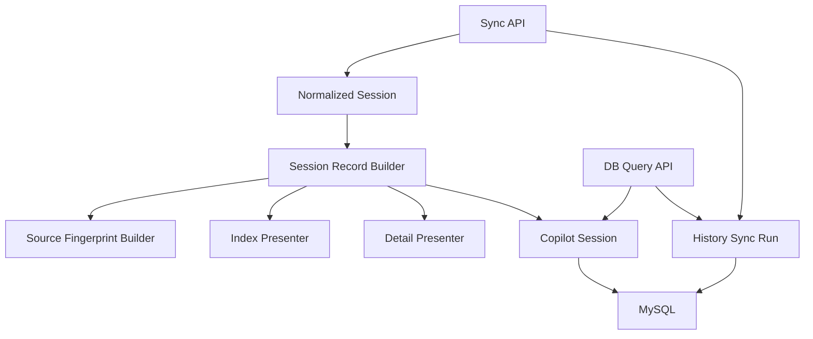
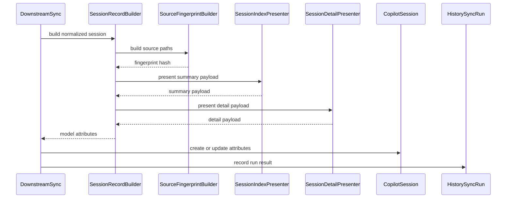
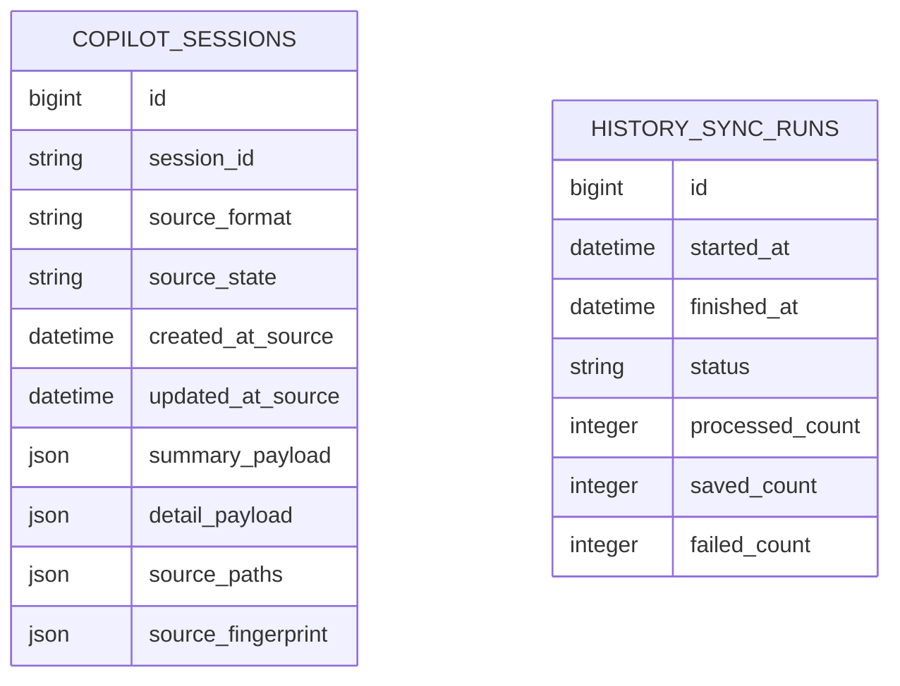
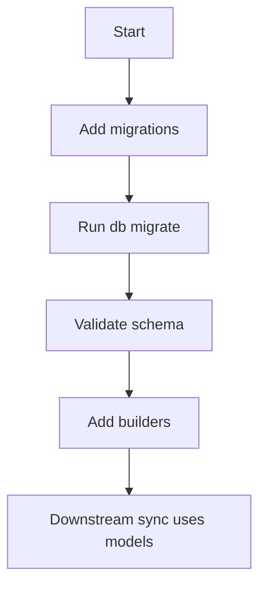

# Design Document

## Overview
この feature は、`backend-history-reader` が返す `NormalizedSession` を MySQL 上の再生成可能な read model として保存するための schema、ActiveRecord model、DB attributes builder を提供する。利用者は後続の同期 API と DB query 化 spec の backend 開発者であり、raw files を毎回読み直さずに一覧 / 詳細表示 payload、source metadata、同期実行結果を参照できる状態を作る。

影響範囲は Rails backend の persistence 境界に限定する。既存 `/api/sessions` の参照元切替、明示同期 API、frontend 導線、削除同期、background job はこの spec では実装しない。

### Goals
- `copilot_sessions` に 1 session 1 row の read model を保存できる。
- `summary_payload` / `detail_payload` を既存 presenter contract に基づいて保存し、raw files 再読取なしで後続 query が再利用できる。
- source paths と path / mtime / size ベースの fingerprint を保持し、不完全 fingerprint を識別できる。
- `history_sync_runs` に同期実行結果を session row とは独立して記録できる。
- 履歴由来日時と Rails row timestamp を分離し、日付不明 session を保存日時で偽装しない。

### Non-Goals
- raw files の読取起動、同期 service、skip / update 判断、HTTP endpoint
- `GET /api/sessions` / `GET /api/sessions/:id` の DB query 化
- frontend UI、同期ボタン、空状態、検索 UI
- raw files が削除された session の自動削除
- 認証・認可、外部公開向け hardening、background job

## Boundary Commitments

### This Spec Owns
- `copilot_sessions` と `history_sync_runs` の migration、schema、ActiveRecord model validation
- `NormalizedSession` から `CopilotSession` 保存 attributes を作る persistence builder contract
- `summary_payload` / `detail_payload` / `source_paths` / `source_fingerprint` の保存 contract
- source artifact の path / mtime / size / completeness を表す fingerprint contract
- 履歴由来日時 (`created_at_source`, `updated_at_source`) と保存レコード日時 (`created_at`, `updated_at`) の分離
- 同期実行結果の status、counts、失敗・劣化 summary を保持する record contract

### Out of Boundary
- `SessionCatalogReader` の起動、raw files 読取 orchestration、同期 API controller / route
- 既存 session API の DB 参照化、日付 query param の HTTP 契約、response pagination
- fingerprint を使った保存省略 / 再生成 / upsert 判断
- raw files 削除時の DB row 削除、archival、missing_since 管理
- payload contract 変更時の自動 backfill、background reindex
- frontend 表示、同期導線、検索、認証・認可

### Allowed Dependencies
- `CopilotHistory::Types::NormalizedSession`、`ReadResult::Success`、`ReadIssue`
- `CopilotHistory::Api::Presenters::SessionIndexPresenter` と `SessionDetailPresenter`
- `CopilotHistory::Api::Types::SessionLookupResult::Found`
- Rails 8.1 ActiveRecord、Rails migration、MySQL JSON / datetime / index
- Ruby 標準の `Pathname`, `File::Stat`, `Time`
- 既存 `backend/lib/` autoload と RSpec / Rails model spec

### Revalidation Triggers
- `NormalizedSession` の field、source format/state、issues、source paths contract が変わる場合
- 既存 API presenter の `summary_payload` / `detail_payload` shape が変わる場合
- DB query spec が `history_date_source` の materialized column や別 index を必要とする場合
- 同期 API が fingerprint の比較規則、status、counts を変更する場合
- raw files を一次ソースから外す、または削除同期を導入する場合

## Architecture

### Existing Architecture Analysis
- backend は Rails API mode で、ActiveRecord railtie と `ApplicationRecord` が有効である。
- `backend/lib/copilot_history/` は reader、query、presenter、type object を持ち、`config.autoload_lib` により autoload される。
- 既存 API presenter は `NormalizedSession` から list/detail payload を生成する責務を持つため、この spec は presenter contract を再利用し、controller には依存しない。
- `backend/db/migrate` と `backend/db/schema.rb` はまだ存在しないため、この feature が初回のアプリ固有 DB schema を導入する。

### Architecture Pattern & Boundary Map



**Architecture Integration**:
- Selected pattern: ActiveRecord read model + persistence builder。builder が upstream normalized contract を DB attributes に写像し、model は validation と query 可能な scalar fields を所有する。
- Dependency direction: `CopilotHistory::Types` → `CopilotHistory::Api::Presenters` → `CopilotHistory::Persistence` → `ApplicationRecord models` → downstream sync/query。逆方向 import は禁止する。
- Existing patterns preserved: raw files 正本、reader と API presenter の責務分離、Rails model は `app/models`、domain helper は `backend/lib/copilot_history` に置く。
- New components rationale: schema / model は保存 contract、record builder は変換 contract、fingerprint builder は source metadata contract、sync run model は実行結果 contract をそれぞれ独立して固定する。
- Steering compliance: Rails API / MySQL / Docker Compose を正本とし、DB を再生成可能な補助層として扱う。

### Technology Stack

| Layer | Choice / Version | Role in Feature | Notes |
|-------|------------------|-----------------|-------|
| Backend / Services | Ruby 4, Rails 8.1.3, ActiveRecord 8.1.3 | model validation、migration、builder 実行 | 新規 gem は追加しない |
| Data / Storage | MySQL 9.7, mysql2 0.5.7 | read model と sync run の永続化 | JSON column と scalar index を併用 |
| Infrastructure / Runtime | Docker Compose | migration / test 実行環境 | `docker compose run backend ...` を標準にする |

## File Structure Plan

### Directory Structure
```text
backend/
├── app/
│   └── models/
│       ├── copilot_session.rb                         # 1 session 1 row の read model validation と enum-like constants
│       └── history_sync_run.rb                        # 同期実行結果の status / counts / summary validation
├── db/
│   ├── migrate/
│   │   ├── YYYYMMDDHHMMSS_create_copilot_sessions.rb  # read model table、unique key、日付 / metadata index
│   │   └── YYYYMMDDHHMMSS_create_history_sync_runs.rb # sync run table、status / started_at index
│   └── schema.rb                                      # migration 実行後に Rails が生成する schema snapshot
├── lib/
│   └── copilot_history/
│       └── persistence/
│           ├── session_record_builder.rb              # NormalizedSession から CopilotSession attributes を作る
│           └── source_fingerprint_builder.rb          # source_paths の file metadata から fingerprint Hash を作る
└── spec/
    ├── models/
    │   ├── copilot_session_spec.rb                    # validation、uniqueness、required payload、date nullability
    │   └── history_sync_run_spec.rb                   # status、counts、failure / degradation summary validation
    └── lib/
        └── copilot_history/
            └── persistence/
                ├── session_record_builder_spec.rb     # presenter payload 再利用、日時分離、issue counts
                └── source_fingerprint_builder_spec.rb # path / mtime / size 安定性、不完全 fingerprint
```

### Modified Files
- `backend/db/schema.rb` — migration 実行時に生成され、`copilot_sessions` と `history_sync_runs` の physical schema snapshot を保持する。

### Created Files
- `backend/app/models/copilot_session.rb` — 1 session 1 row の read model validation と enum-like constants。
- `backend/app/models/history_sync_run.rb` — 同期実行結果の status / counts / summary validation。
- `backend/db/migrate/YYYYMMDDHHMMSS_create_copilot_sessions.rb` — read model table、unique key、日付 / metadata index。
- `backend/db/migrate/YYYYMMDDHHMMSS_create_history_sync_runs.rb` — sync run table、status / started_at index。
- `backend/lib/copilot_history/persistence/session_record_builder.rb` — `NormalizedSession` から `CopilotSession` 保存 attributes を作る。
- `backend/lib/copilot_history/persistence/source_fingerprint_builder.rb` — source paths の file metadata から fingerprint Hash を作る。
- `backend/spec/models/copilot_session_spec.rb` — validation、uniqueness、required payload、date nullability の model spec。
- `backend/spec/models/history_sync_run_spec.rb` — status、counts、failure / degradation summary validation の model spec。
- `backend/spec/lib/copilot_history/persistence/session_record_builder_spec.rb` — presenter payload 再利用、日時分離、issue counts の builder spec。
- `backend/spec/lib/copilot_history/persistence/source_fingerprint_builder_spec.rb` — path / mtime / size 安定性、不完全 fingerprint の builder spec。

### Existing Files Used Without Modification
- `backend/lib/copilot_history/types/normalized_session.rb` — read model attributes の upstream source contract。
- `backend/lib/copilot_history/api/presenters/session_index_presenter.rb` — `summary_payload` 生成に使う既存 presenter。
- `backend/lib/copilot_history/api/presenters/session_detail_presenter.rb` — `detail_payload` 生成に使う既存 presenter。
- `backend/lib/copilot_history/api/types/session_lookup_result.rb` — detail presenter 呼び出し時の `Found` result contract。

## System Flows



- builder は model 保存を実行せず、attributes を返すだけにする。upsert と transaction は downstream sync の責務である。
- fingerprint builder は file metadata の取得に失敗しても artifact 単位の status と `complete: false` を返し、例外で同期全体の判断を奪わない。
- sync run は session row の有無と独立して保存されるため、session 保存前の failure でも `history_sync_runs` に記録できる。

## Requirements Traceability

| Requirement | Summary | Components | Interfaces | Flows |
|-------------|---------|------------|------------|-------|
| 1.1 | session ID ごとに 1 read model を保持する | `CopilotSession` | unique `session_id` | DB write |
| 1.2 | 同一 session の再生成で重複させない | `CopilotSession` | unique index, update attributes | DB write |
| 1.3 | source format/state、work context、model、履歴日時を提供する | `SessionRecordBuilder`, `CopilotSession` | scalar columns | build flow |
| 1.4 | 履歴日時欠落を保存日時で補完しない | `SessionRecordBuilder`, `CopilotSession` | nullable source datetime | build flow |
| 1.5 | 履歴由来日時と row timestamp を区別する | `CopilotSession` | `created_at_source`, `updated_at_source`, Rails timestamps | DB schema |
| 2.1 | 一覧 payload を保持する | `SessionRecordBuilder`, `CopilotSession` | `summary_payload` | build flow |
| 2.2 | 詳細 payload を保持する | `SessionRecordBuilder`, `CopilotSession` | `detail_payload` | build flow |
| 2.3 | current / legacy を共通 read model として扱う | `CopilotSession`, `SessionRecordBuilder` | `source_format`, payload JSON | build flow |
| 2.4 | issue と degraded 状態を保持する | `SessionRecordBuilder`, `CopilotSession` | `issue_count`, `degraded`, payload issues | build flow |
| 2.5 | raw files 再読取なしで payload を参照可能にする | `CopilotSession` | persisted payload JSON | downstream query |
| 3.1 | source artifact role と path を保持する | `SessionRecordBuilder`, `CopilotSession` | `source_paths` | build flow |
| 3.2 | path / mtime / size に基づく比較材料を提供する | `SourceFingerprintBuilder` | `source_fingerprint` | fingerprint build |
| 3.3 | metadata 不変時に安定 fingerprint を提供する | `SourceFingerprintBuilder` | deterministic hash | fingerprint build |
| 3.4 | metadata 変更時に区別可能な fingerprint を提供する | `SourceFingerprintBuilder` | per artifact metadata | fingerprint build |
| 3.5 | metadata 取得不能時に不完全状態を識別する | `SourceFingerprintBuilder` | `complete: false`, artifact status | fingerprint build |
| 3.6 | fingerprint は比較材料に留める | Boundary, `SourceFingerprintBuilder` | no skip/update decision | architecture |
| 4.1 | 同期実行結果を記録する | `HistorySyncRun` | status, counts, summaries | sync run write |
| 4.2 | session 不在と同期失敗を区別する | `HistorySyncRun` | failed run independent of sessions | sync run write |
| 4.3 | 完全成功と部分劣化を区別する | `HistorySyncRun` | `succeeded`, `completed_with_issues` | sync run write |
| 4.4 | 読取開始や外部操作入口を含めない | Boundary, File Structure Plan | no controller/service | architecture |
| 5.1 | 更新日時優先、欠落時作成日時を使える情報を提供する | `CopilotSession` | nullable datetime columns | downstream query |
| 5.2 | 両方欠落時は日付不明として識別する | `CopilotSession`, `SessionRecordBuilder` | both source datetimes nil | build flow |
| 5.3 | 履歴由来日時で並び替え可能にする | `CopilotSession` | date indexes | downstream query |
| 5.4 | 範囲判定日時と日付不明を区別する | `CopilotSession` | `updated_at_source`, `created_at_source` | downstream query |
| 6.1 | raw files 由来の再生成可能な補助データにする | Boundary, `SessionRecordBuilder` | generated attributes | architecture |
| 6.2 | payload contract 変更時に置換可能にする | `CopilotSession` | unique session update | DB write |
| 6.3 | raw files を一次ソースから外さない | Boundary | allowed dependencies | architecture |
| 6.4 | raw files 削除 session の自動削除を含めない | Boundary | no deletion contract | architecture |
| 6.5 | API 切替、UI、検索を含めない | Boundary, File Structure Plan | no route/frontend files | architecture |

## Components and Interfaces

| Component | Domain/Layer | Intent | Req Coverage | Key Dependencies (P0/P1) | Contracts |
|-----------|--------------|--------|--------------|--------------------------|-----------|
| `CopilotSession` | Persistence model | セッション表示用 read model を 1 session 1 row で保持する | 1.1, 1.2, 1.3, 1.4, 1.5, 2.1, 2.2, 2.3, 2.4, 2.5, 5.1, 5.2, 5.3, 5.4, 6.2 | ActiveRecord (P0), MySQL (P0) | State |
| `HistorySyncRun` | Persistence model | 同期実行結果を session row と独立して保持する | 4.1, 4.2, 4.3 | ActiveRecord (P0), MySQL (P0) | State |
| `SessionRecordBuilder` | Persistence mapping | `NormalizedSession` を `CopilotSession` 保存 attributes へ変換する | 1.3, 1.4, 2.1, 2.2, 2.3, 2.4, 3.1, 5.1, 5.2, 6.1 | `NormalizedSession` (P0), existing presenters (P0), `SourceFingerprintBuilder` (P0) | Service |
| `SourceFingerprintBuilder` | Source metadata | source artifact の比較材料 Hash を作る | 3.2, 3.3, 3.4, 3.5, 3.6 | `Pathname` (P0), filesystem stat (P0) | Service |

### Persistence Models

#### `CopilotSession`

| Field | Detail |
|-------|--------|
| Intent | 保存済み session read model と表示 payload の authoritative DB row |
| Requirements | 1.1, 1.2, 1.3, 1.4, 1.5, 2.1, 2.2, 2.3, 2.4, 2.5, 5.1, 5.2, 5.3, 5.4, 6.2 |

**Responsibilities & Constraints**
- `session_id` を natural key とし、同一 session を重複保存しない。
- `source_format`, `source_state`, work context、model、件数、degraded、payload、source metadata を保持する。
- 履歴由来日時は `created_at_source` / `updated_at_source` に保存し、`nil` を許可する。
- Rails `created_at` / `updated_at` を保存 row timestamp として維持し、履歴日時の補完に使わない。
- raw file 削除や sync decision を持たない。

**Dependencies**
- Inbound: downstream sync — builder が返した attributes の保存先 (P0)
- Inbound: downstream DB query — saved payload と date columns の参照元 (P1)
- Outbound: ActiveRecord / MySQL — persistence runtime (P0)

**Contracts**: Service [ ] / API [ ] / Event [ ] / Batch [ ] / State [x]

##### State Management
- State model: `session_id` unique な read model row。
- Persistence & consistency: downstream sync は同一 `session_id` の row を再生成 attributes で置換できる。
- Concurrency strategy: DB unique index で重複を防ぎ、同時 upsert の最終整合は downstream sync の transaction に委ねる。

##### Validation Contract
| Field | Rule |
|-------|------|
| `session_id` | presence, uniqueness |
| `source_format` | presence, inclusion: `current`, `legacy` |
| `source_state` | presence, inclusion: `complete`, `workspace_only`, `degraded` |
| `event_count`, `message_snapshot_count`, `issue_count`, `message_count`, `activity_count` | integer, greater than or equal to 0 |
| `degraded` | boolean, not null |
| `summary_payload`, `detail_payload`, `source_paths`, `source_fingerprint` | presence, JSON object |
| `created_at_source`, `updated_at_source` | nullable datetime; validation で row timestamp に補完しない |
| `indexed_at` | presence |

**Implementation Notes**
- Integration: query 用 scalar columns と payload JSON を併存させ、downstream query は日付 / metadata を column で絞り込み、response は payload JSON を返せる。
- Validation: 両方の source datetime が `nil` でも valid とし、日付不明 session として保存できることを spec で固定する。
- Risks: payload JSON の key を model validation で深く検証しすぎると presenter 変更に弱くなるため、深い shape は builder spec で確認する。

#### `HistorySyncRun`

| Field | Detail |
|-------|--------|
| Intent | 同期実行の成否、処理件数、保存件数、失敗・劣化 summary を session row とは別に保持する |
| Requirements | 4.1, 4.2, 4.3, 4.4 |

**Responsibilities & Constraints**
- sync run の開始時刻、終了時刻、status、処理件数、保存件数、失敗件数、劣化件数、summary を保持する。
- session 保存前の failure でも独立 row として保存できる。
- raw files 読取の起動、retry、background job、HTTP response mapping を持たない。

**Dependencies**
- Inbound: downstream sync — 実行状態の記録元 (P0)
- Outbound: ActiveRecord / MySQL — persistence runtime (P0)

**Contracts**: Service [ ] / API [ ] / Event [ ] / Batch [ ] / State [x]

##### State Management
- State model: `running`, `succeeded`, `failed`, `completed_with_issues` のいずれか。
- Persistence & consistency: `started_at` は必須、`finished_at` は `running` では nullable、終了 status では presence。
- Concurrency strategy: sync orchestration が run row を所有し、この model は状態遷移の保存先に留まる。

##### Validation Contract
| Field | Rule |
|-------|------|
| `status` | inclusion: `running`, `succeeded`, `failed`, `completed_with_issues` |
| `started_at` | presence |
| `finished_at` | nullable for `running`, present for terminal statuses |
| `processed_count`, `saved_count`, `skipped_count`, `failed_count`, `degraded_count` | integer, greater than or equal to 0 |
| `failure_summary`, `degradation_summary` | nullable text |

**Implementation Notes**
- Integration: downstream sync は root failure 時に `failed`、全件正常時に `succeeded`、session issue を含む完了時に `completed_with_issues` を保存する。
- Validation: session row が 0 件でも `failed` run を保存できることを model spec で確認する。
- Risks: status を downstream API response 文言に合わせて増やすと query 側が分岐過多になるため、この spec の status set を canonical とする。

### Persistence Builders

#### `SessionRecordBuilder`

| Field | Detail |
|-------|--------|
| Intent | `NormalizedSession` と source metadata から `CopilotSession` 保存 attributes を生成する |
| Requirements | 1.3, 1.4, 2.1, 2.2, 2.3, 2.4, 3.1, 5.1, 5.2, 6.1 |

**Responsibilities & Constraints**
- `NormalizedSession` の scalar fields を DB column 用 attributes へ写像する。
- 既存 `SessionIndexPresenter` と `SessionDetailPresenter` を使い、`summary_payload` / `detail_payload` を生成する。
- 一覧 payload の `conversation_summary` から `conversation_preview`, `message_count`, `activity_count` を query 用 scalar columns へ写像する。
- `source_paths` は role keyed string Hash として保存する。
- `source_fingerprint` は `SourceFingerprintBuilder` に委譲する。
- model 保存、transaction、upsert、skip/update 判断を行わない。

**Dependencies**
- Inbound: downstream sync — raw reader から得た session を渡す (P0)
- Outbound: `NormalizedSession` — canonical source data (P0)
- Outbound: `SessionIndexPresenter` — summary payload 生成 (P0)
- Outbound: `SessionDetailPresenter` — detail payload 生成 (P0)
- Outbound: `SourceFingerprintBuilder` — fingerprint 生成 (P0)

**Contracts**: Service [x] / API [ ] / Event [ ] / Batch [ ] / State [ ]

##### Service Interface
```ruby
module CopilotHistory
  module Persistence
    class SessionRecordBuilder
      # @param session [CopilotHistory::Types::NormalizedSession]
      # @param indexed_at [Time]
      # @return [Hash]
      def call(session:, indexed_at: Time.current); end
    end
  end
end
```
- Preconditions: `session` は `NormalizedSession`、`indexed_at` は `Time` 互換値である。
- Postconditions: 戻り値は `CopilotSession` に保存可能な attributes を含む。
- Invariants: `created_at_source` / `updated_at_source` は `session.created_at` / `session.updated_at` をそのまま反映し、欠落時に補完しない。

**Implementation Notes**
- Integration: detail payload は `include_raw: false` を既定にし、既存詳細 API の通常表示 payload と同じ粒度を保存する。
- Validation: current / legacy の両方で source format を文字列化し、issue がある session では `degraded: true` と `issue_count` が一致することを確認する。
- Risks: presenter に保存専用分岐を追加すると既存 API contract と drift するため、builder 側で presenter 入出力を包む。

#### `SourceFingerprintBuilder`

| Field | Detail |
|-------|--------|
| Intent | source artifact の path、mtime、size に基づく deterministic fingerprint Hash を生成する |
| Requirements | 3.2, 3.3, 3.4, 3.5, 3.6 |

**Responsibilities & Constraints**
- role keyed source path ごとに `path`, `mtime`, `size`, `status` を保存する。
- 全 artifact の metadata が取得できた場合のみ `complete: true` を返す。
- path が存在しない、stat できない、権限で読めない場合は artifact `status` を残し、top-level `complete: false` にする。
- fingerprint 同士を比較する判断や DB 既存値との照合を行わない。

**Dependencies**
- Inbound: `SessionRecordBuilder` — `source_paths` の fingerprint 生成 (P0)
- Outbound: local filesystem stat — metadata 取得 (P0)

**Contracts**: Service [x] / API [ ] / Event [ ] / Batch [ ] / State [ ]

##### Service Interface
```ruby
module CopilotHistory
  module Persistence
    class SourceFingerprintBuilder
      # @param source_paths [Hash<Symbol, Pathname>]
      # @return [Hash]
      def call(source_paths:); end
    end
  end
end
```
- Preconditions: `source_paths` は artifact role から path への Hash である。
- Postconditions: JSON 保存可能な Hash を返す。
- Invariants: 同じ role、path、mtime、size の入力に対して同じ Hash を返す。

##### Fingerprint Contract
| Field | Type | Rule |
|-------|------|------|
| `complete` | Boolean | 全 artifact が `ok` の場合のみ `true` |
| `artifacts` | Object | role key ごとの metadata |
| `artifacts.<role>.path` | String | `Pathname#to_s` |
| `artifacts.<role>.mtime` | String or null | stat 成功時の ISO8601 |
| `artifacts.<role>.size` | Integer or null | stat 成功時の byte size |
| `artifacts.<role>.status` | String | `ok`, `missing`, `unreadable` |

**Implementation Notes**
- Integration: current は `workspace` / `events`、legacy は `source` role を想定するが、builder は role 名を限定しない。
- Validation: path 不変でも mtime または size が変わると Hash が変わり、metadata 取得不能時は `complete: false` になることを確認する。
- Risks: checksum まで読む設計にすると I/O cost が増えるため、requirements が求める path / mtime / size に限定する。

## Data Models

### Domain Model
- **CopilotSession**: 保存済み session read model。natural key は `session_id`。
- **HistorySyncRun**: 同期実行の記録。session row と独立して存在する。
- **SessionRecordAttributes**: `SessionRecordBuilder` が返す ActiveRecord 保存用 attributes。
- **SourceFingerprint**: source artifact metadata の JSON contract。
- **History Date Source**: downstream query が使う概念値。`updated_at_source || created_at_source` であり、両方欠落時は `nil`。

### Logical Data Model



- `copilot_sessions` と `history_sync_runs` の間に foreign key は置かない。sync run は session 保存前に失敗しても記録できる必要がある。
- `session_id` は raw files 由来の natural key であり、DB surrogate key は Rails model 内部用に留める。
- `summary_payload` / `detail_payload` は response 用 payload snapshot、scalar columns は query / filtering / diagnostics 用の投影である。

### Physical Data Model

#### `copilot_sessions`

| Column | Type | Null | Notes |
|--------|------|------|-------|
| `id` | bigint | false | Rails primary key |
| `session_id` | string | false | unique natural key |
| `source_format` | string | false | `current` / `legacy` |
| `source_state` | string | false | `complete` / `workspace_only` / `degraded` |
| `created_at_source` | datetime | true | 履歴由来作成日時 |
| `updated_at_source` | datetime | true | 履歴由来更新日時 |
| `cwd` | text | true | work context |
| `git_root` | text | true | work context |
| `repository` | string | true | work context |
| `branch` | string | true | work context |
| `selected_model` | string | true | 選択モデル |
| `event_count` | integer | false | default 0 |
| `message_snapshot_count` | integer | false | default 0 |
| `issue_count` | integer | false | default 0 |
| `degraded` | boolean | false | default false |
| `conversation_preview` | text | true | summary 検索・表示補助 |
| `message_count` | integer | false | default 0 |
| `activity_count` | integer | false | default 0 |
| `source_paths` | json | false | role keyed path Hash |
| `source_fingerprint` | json | false | fingerprint contract |
| `summary_payload` | json | false | list response 用 payload |
| `detail_payload` | json | false | detail response 用 payload |
| `indexed_at` | datetime | false | read model 生成時刻 |
| `created_at` | datetime | false | Rails row timestamp |
| `updated_at` | datetime | false | Rails row timestamp |

Indexes:
- unique index on `session_id`
- index on `updated_at_source`
- index on `created_at_source`
- index on `source_format`
- index on `source_state`
- index on `repository`
- index on `branch`

#### `history_sync_runs`

| Column | Type | Null | Notes |
|--------|------|------|-------|
| `id` | bigint | false | Rails primary key |
| `started_at` | datetime | false | 実行開始時刻 |
| `finished_at` | datetime | true | 実行終了時刻 |
| `status` | string | false | `running` / `succeeded` / `failed` / `completed_with_issues` |
| `processed_count` | integer | false | default 0 |
| `saved_count` | integer | false | default 0 |
| `skipped_count` | integer | false | default 0 |
| `failed_count` | integer | false | default 0 |
| `degraded_count` | integer | false | default 0 |
| `failure_summary` | text | true | root failure / fatal failure の概要 |
| `degradation_summary` | text | true | 部分劣化の概要 |
| `created_at` | datetime | false | Rails row timestamp |
| `updated_at` | datetime | false | Rails row timestamp |

Indexes:
- index on `started_at`
- index on `status`

### Data Contracts & Integration

**SessionRecordAttributes**

| Attribute | Source | Rule |
|-----------|--------|------|
| `session_id` | `NormalizedSession#session_id` | 文字列として保存 |
| `source_format` | `NormalizedSession#source_format` | symbol を string 化 |
| `source_state` | `NormalizedSession#source_state` | symbol を string 化 |
| `created_at_source` | `NormalizedSession#created_at` | `nil` を補完しない |
| `updated_at_source` | `NormalizedSession#updated_at` | `nil` を補完しない |
| `cwd`, `git_root` | path fields | `Pathname#to_s`、欠落は `nil` |
| `repository`, `branch`, `selected_model` | session fields | 欠落は `nil` |
| `event_count` | `events.length` | integer |
| `message_snapshot_count` | `message_snapshots.length` | integer |
| `issue_count` | `issues.length` | integer |
| `degraded` | `issues.any?` | boolean |
| `conversation_preview` | `summary_payload.conversation_summary.preview` | 欠落は `nil` |
| `message_count` | `summary_payload.conversation_summary.message_count` | integer, 欠落時は 0 |
| `activity_count` | `summary_payload.conversation_summary.activity_count` | integer, 欠落時は 0 |
| `summary_payload` | `SessionIndexPresenter` | single session を含む `data` 要素 |
| `detail_payload` | `SessionDetailPresenter` | `data` 要素 |
| `source_paths` | `NormalizedSession#source_paths` | role keyed string Hash |
| `source_fingerprint` | `SourceFingerprintBuilder` | fingerprint contract |
| `indexed_at` | builder input | default `Time.current` |

## Error Handling

### Error Strategy
- model validation failure は implementation bug または upstream contract mismatch として扱い、downstream sync が失敗 run に記録する。
- source metadata の stat failure は session 保存不能にはせず、`source_fingerprint.complete: false` と artifact status で表現する。
- 履歴由来日時の欠落は error ではなく valid state として保持する。
- payload builder は `NormalizedSession` の不正 format/state を再検証せず、upstream type validation を信頼する。

### Error Categories and Responses
- **Validation Error**: required payload 欠落、invalid status、negative counts、invalid source format/state → ActiveRecord validation error。
- **Incomplete Fingerprint**: source path missing / unreadable → fingerprint JSON に `complete: false` と `status` を保存。
- **Unknown History Date**: `created_at_source` と `updated_at_source` がどちらも `nil` → 保存可能。downstream query は日付不明として扱う。
- **Sync Failure Record**: session 保存前の root failure → `HistorySyncRun(status: "failed", failed_count:, failure_summary:)` として保存可能。

### Monitoring
- この spec は logging 基盤を追加しない。
- downstream sync は model validation failure や run status を既存 Rails logger / response に写像する。
- `history_sync_runs` が運用確認の永続 source となるため、failure / degradation summary は短く機械処理しやすい文言で保存する。

## Testing Strategy

### Unit Tests
- `SessionRecordBuilder` が `NormalizedSession` から scalar columns、件数、`degraded`、`source_paths` を生成し、履歴日時欠落を補完しないこと。
- `SessionRecordBuilder` が既存 `SessionIndexPresenter` / `SessionDetailPresenter` の payload を `summary_payload` / `detail_payload` に保存すること。
- `SourceFingerprintBuilder` が同じ path / mtime / size で同じ fingerprint を返し、mtime または size 変更で異なる fingerprint を返すこと。
- `SourceFingerprintBuilder` が missing / unreadable artifact を `complete: false` と artifact status で表現すること。
- `CopilotSession` が required JSON payload、valid source format/state、non-negative counts、unique `session_id` を検証すること。
- `HistorySyncRun` が status、terminal status の `finished_at`、non-negative counts を検証すること。

### Integration Tests
- migration 適用後に `copilot_sessions` が unique `session_id` と日付 / metadata indexes を持つこと。
- current 形式の `NormalizedSession` attributes を保存し、`summary_payload` / `detail_payload` / source metadata を再読取なしで取り出せること。
- legacy 形式の `NormalizedSession` attributes を同じ table と validation で保存できること。
- 同じ `session_id` の再生成 attributes で row を更新でき、重複 row を作らないこと。
- session row が存在しない状態でも `HistorySyncRun(status: "failed")` を保存できること。

### Performance / Load
- downstream query が `updated_at_source` / `created_at_source` index を利用できるよう、日付列を JSON payload 内だけに閉じ込めないこと。
- builder は source artifact の full content を読まず、fingerprint を path / mtime / size の stat に限定すること。
- payload JSON は初期実装の単純性を優先して保存し、巨大化が問題化した場合は別 spec で payload分割または圧縮を検討する。

### Security Considerations
- 保存対象はローカル履歴由来の path と会話 payload を含むため、外部公開やマルチユーザー認可を導入する場合は API / DB query spec で再設計する。
- fingerprint は file content を読まず、metadata のみを保存する。
- `source_paths` と payload JSON は秘密情報を含み得るため、この spec では新しい公開 endpoint を追加しない。

### Migration Strategy



- Phase 1: `copilot_sessions` と `history_sync_runs` の migrations / models / specs を追加する。
- Phase 2: `SessionRecordBuilder` と `SourceFingerprintBuilder` を追加し、既存 presenter contract との互換を確認する。
- Phase 3: downstream `history-sync-api` が builder attributes を使って upsert と run 記録を実装する。
- Rollback: 初期導入時は downstream API から未参照のため、migration rollback で table を削除できる。既存 raw reader API には影響しない。
