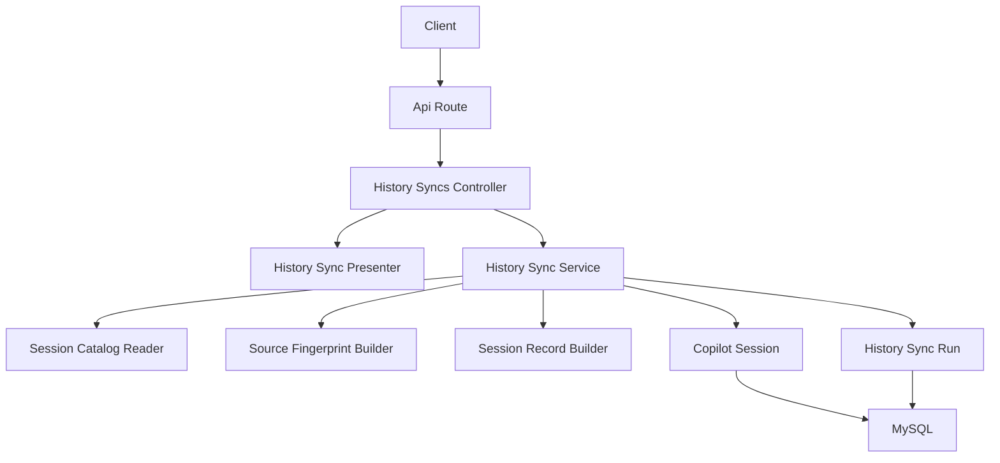
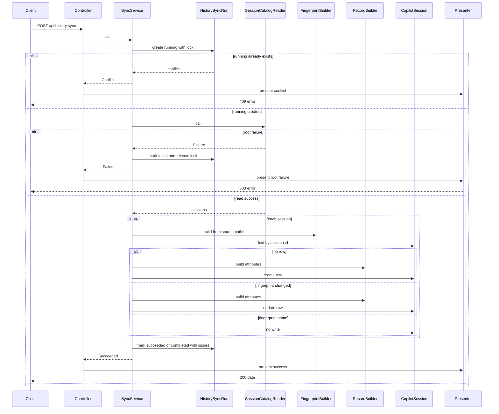
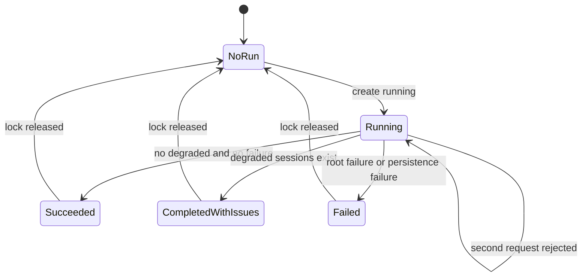
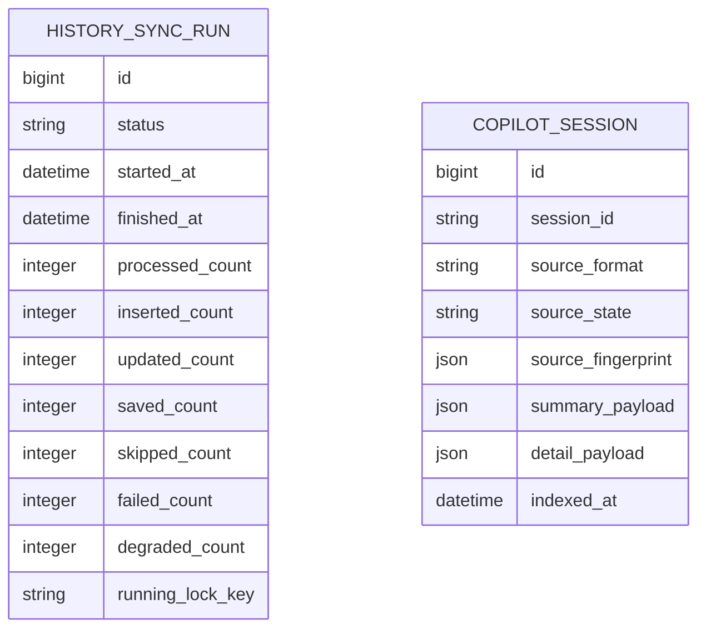
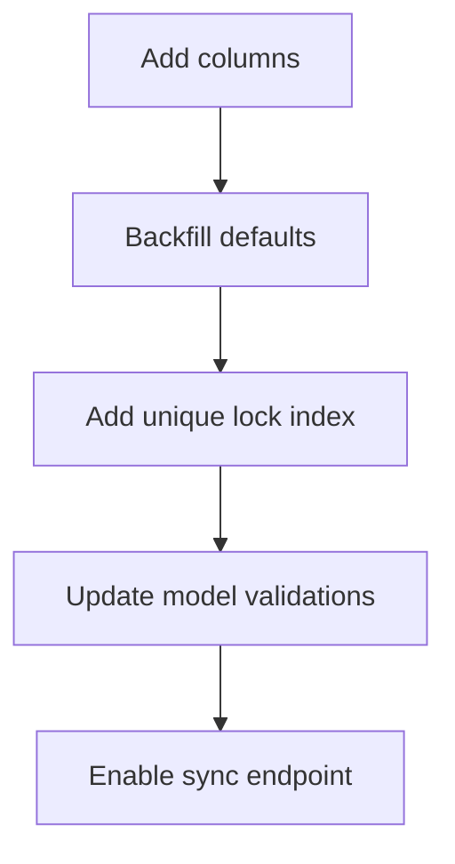

# 設計書

## 概要
この feature は、利用者または後続 UI からの明示操作で GitHub Copilot CLI の raw files を読み取り、保存済み read model を同期する HTTP API を提供する。同期は request 内で完了し、root failure、degraded session、insert / update / skip、二重実行 conflict を自由文解釈なしで判定できる応答と実行履歴を残す。

対象利用者はローカル履歴を更新したい利用者、同期結果を切り分ける運用者、後続の `frontend-history-sync-ui` 実装者である。影響範囲は Rails backend の同期 command endpoint、同期 service、sync run schema 拡張、request / service spec に限定し、既存 session list/detail API の参照元切替や frontend ボタンは扱わない。

### 目標
- `POST /api/history/sync` で raw files から保存済み read model への同期を request 内で完了する。
- `source_fingerprint` により insert / update / skip を判定し、同一 session の read model を重複保存しない。
- `HistorySyncRun` に running、terminal status、件数、root failure、degraded completion を記録する。
- root failure は失敗応答、session 単位の degraded は保存継続と `completed_with_issues` として区別する。
- running lock により未完了同期中の二重実行を 409 conflict として拒否する。

### 対象外
- background job、progress polling、自動 file watch、stale running 自動復旧
- raw files 削除に伴う `CopilotSession` の自動削除
- 既存 `GET /api/sessions` / `GET /api/sessions/:id` の DB query 化
- frontend 同期ボタン、日付フィルタ、検索 UI
- 認証・認可、外部公開向け hardening、同期履歴取得 API

## 境界の約束

### この仕様が所有する範囲
- `POST /api/history/sync` の route、controller、HTTP status、JSON 契約
- 同期 request 内 orchestration、running conflict 判定、root failure と degraded completion の分岐
- `NormalizedSession` から `CopilotSession` への insert / update / skip 判定と保存実行
- `HistorySyncRun` の実行 lifecycle、count 記録、failure / degradation summary 更新
- `history_sync_runs` の `inserted_count` / `updated_count` / `running_lock_key` schema 拡張
- 同期 API 向け presenter と service result contract

### 境界外
- `SessionCatalogReader` の raw file parse / normalization contract 変更
- `CopilotSession` の表示 payload schema 変更、既存 presenter contract 変更
- read model から消えた raw file session の削除、archive、missing 管理
- list/detail session API の参照元切替、search/filter endpoint、sync run history endpoint
- frontend state 管理、表示文言、ユーザー操作導線
- background queue、polling、file watch、crash 後の stale running 自動解消

### 許可する依存
- `CopilotHistory::SessionCatalogReader` と `ReadResult::Success` / `ReadResult::Failure`
- `CopilotHistory::Types::NormalizedSession`, `ReadFailure`, `ReadIssue`
- `CopilotHistory::Persistence::SessionRecordBuilder` と `SourceFingerprintBuilder`
- `CopilotSession` と `HistorySyncRun` ActiveRecord models
- 既存 `CopilotHistory::Api::Presenters::ErrorPresenter` の error envelope 方針
- Rails 8.1 API routing / controller / JSON render、ActiveRecord transaction、MySQL unique index
- RSpec request spec、model spec、fixture helper

### 再検証トリガー
- `ReadResult`, `NormalizedSession`, `source_paths`, `source_fingerprint` の contract が変わる場合
- `summary_payload` / `detail_payload` の保存 shape または presenter contract が変わる場合
- 同期を request 内完了から background job / polling へ変更する場合
- running conflict の stale recovery、timeout、強制解除を導入する場合
- raw files を一次ソースから外す、または削除同期を導入する場合
- 既存 session API が DB read model を参照元に切り替える場合

## アーキテクチャ

### 既存アーキテクチャ分析
- backend は Rails API mode で、HTTP 入口は `app/controllers/api`、domain logic は `backend/lib/copilot_history` に置く構成である。
- `SessionCatalogReader` は root failure と session issue を分離済みで、同期 service は filesystem を直接触らずこの公開境界を使える。
- `CopilotSession` は `session_id` unique の read model、`HistorySyncRun` は sync run status と基本 counts を保持済みである。
- `SessionRecordBuilder` は `NormalizedSession` から保存 attributes を作るが、insert/update/skip 判定と保存実行は持たない。

### アーキテクチャパターンと境界マップ



**Architecture Integration**:
- Selected pattern: command controller + orchestration service + presenter。controller は HTTP status と JSON render、service は同期 lifecycle と DB mutation、presenter は response contract を担当する。
- Dependency direction: `CopilotHistory::Types` → reader / persistence builders → `CopilotHistory::Sync` service → API presenter → Rails controller。reader と persistence builders は sync API に依存しない。
- Existing patterns preserved: raw files 正本、`backend/lib/copilot_history` domain placement、API controller の薄い render 境界、既存 error envelope。
- New components rationale: service result type が成功 / conflict / failed を固定し、presenter が HTTP 契約 drift を防ぎ、schema 拡張が二重実行と count traceability を DB に固定する。
- Steering compliance: Rails API、MySQL、RSpec、Docker Compose の既存標準に従い、新規 gem は追加しない。

### 技術スタック

| Layer | Choice / Version | Role in Feature | Notes |
|-------|------------------|-----------------|-------|
| Backend / Services | Ruby 4, Rails 8.1 API mode | controller、service、transaction、JSON response | 新規 gem は追加しない |
| Data / Storage | MySQL 9.7, ActiveRecord 8.1 | `CopilotSession` upsert、`HistorySyncRun` lifecycle、unique running lock | nullable unique index を利用 |
| Infrastructure / Runtime | Docker Compose | migration / RSpec 実行環境 | 既存 backend container 標準に従う |

## ファイル構成計画

### ディレクトリ構成
```text
backend/
├── app/
│   ├── controllers/
│   │   └── api/
│   │       └── history_syncs_controller.rb                # POST /api/history/sync の HTTP entrypoint
│   └── models/
│       └── history_sync_run.rb                            # running lock、insert/update count、terminal validation を追加
├── config/
│   └── routes.rb                                          # POST /api/history/sync を追加
├── db/
│   ├── migrate/
│   │   └── YYYYMMDDHHMMSS_extend_history_sync_runs_for_api.rb # counts と running lock schema を追加
│   └── schema.rb                                          # migration 実行後の schema snapshot
├── lib/
│   └── copilot_history/
│       ├── api/
│       │   └── presenters/
│       │       └── history_sync_presenter.rb              # service result を success/error payload へ変換
│       ├── persistence/
│       │   └── session_record_builder.rb                  # precomputed source_fingerprint を受け取れるよう拡張
│       └── sync/
│           ├── history_sync_service.rb                    # 同期 orchestration、判定、保存、run 更新を所有
│           └── sync_result.rb                             # Succeeded / Conflict / Failed result union
└── spec/
    ├── requests/
    │   └── api/
    │       └── history_syncs_spec.rb                      # success、degraded、root failure、conflict の HTTP 契約
    ├── models/
    │   └── history_sync_run_spec.rb                       # lock/count validation を追加
    └── lib/
        └── copilot_history/
            ├── api/
            │   └── presenters/
            │       └── history_sync_presenter_spec.rb     # payload と status mapping
            ├── persistence/
            │   └── session_record_builder_spec.rb         # precomputed fingerprint の利用確認を追加
            └── sync/
                ├── history_sync_service_spec.rb           # insert/update/skip、run lifecycle、rollback
                └── sync_result_spec.rb                    # result union の public shape
```

### 変更するファイル
- `backend/config/routes.rb` — `post "history/sync" => "history_syncs#create"` を `api` namespace 内へ追加する。
- `backend/app/models/history_sync_run.rb` — `inserted_count`, `updated_count`, `running_lock_key` の validation、不変条件、terminal status 時の lock 解放 contract を追加する。
- `backend/lib/copilot_history/persistence/session_record_builder.rb` — `call(session:, indexed_at:, source_fingerprint: nil)` を受け取り、保存 attributes に同じ fingerprint を使う。
- `backend/spec/models/history_sync_run_spec.rb` — running lock、insert/update count、`saved_count = inserted_count + updated_count` を検証する。
- `backend/spec/lib/copilot_history/persistence/session_record_builder_spec.rb` — precomputed fingerprint が再計算されず保存値に使われることを検証する。
- `backend/db/schema.rb` — migration 実行で `history_sync_runs` 拡張を反映する。

### 作成するファイル
- `backend/app/controllers/api/history_syncs_controller.rb` — sync service を呼び、presenter が返す status/payload を render する。
- `backend/db/migrate/YYYYMMDDHHMMSS_extend_history_sync_runs_for_api.rb` — `inserted_count`, `updated_count`, `running_lock_key` と unique index を追加する。
- `backend/lib/copilot_history/api/presenters/history_sync_presenter.rb` — success/conflict/failure response を既存 error envelope 方針で整形する。
- `backend/lib/copilot_history/sync/history_sync_service.rb` — running run 作成、reader 呼び出し、fingerprint 比較、保存、run terminal 更新を実行する。
- `backend/lib/copilot_history/sync/sync_result.rb` — `Succeeded`, `Conflict`, `Failed` の Data class union を定義する。
- `backend/spec/requests/api/history_syncs_spec.rb` — API 契約を fixture と DB state で検証する。
- `backend/spec/lib/copilot_history/api/presenters/history_sync_presenter_spec.rb` — JSON contract と HTTP status mapping を固定する。
- `backend/spec/lib/copilot_history/sync/history_sync_service_spec.rb` — service の判定と transaction 境界を検証する。
- `backend/spec/lib/copilot_history/sync/sync_result_spec.rb` — result union の predicate と data shape を検証する。

## システムフロー



### 状態フロー



- running lock は `HistorySyncRun` row 上に保持し、terminal status へ更新する同じ lifecycle で解放する。
- root failure は session write に進まず、read model を空データで上書きしない。
- degraded session は保存対象であり、issue 情報は既存 `SessionRecordBuilder` が作る payload と scalar counts に残る。
- skip は `CopilotSession#source_fingerprint` 完全一致時だけ発生し、表示 payload と `indexed_at` を再保存しない。

## 要件トレーサビリティ

| Requirement | Summary | Components | Interfaces | Flows |
|-------------|---------|------------|------------|-------|
| 1.1 | raw files から読める session を read model へ同期する | `HistorySyncService`, `SessionCatalogReader`, `CopilotSession` | service call, DB write | sync sequence |
| 1.2 | request 内で同期を完了し状態を返す | `HistorySyncsController`, `HistorySyncService`, `HistorySyncPresenter` | POST response | sync sequence |
| 1.3 | 成功応答に状態と件数を返す | `HistorySyncPresenter`, `SyncResult::Succeeded` | success payload | sync sequence |
| 1.4 | raw files を変更しない | Boundary, `HistorySyncService` | read-only reader dependency | architecture |
| 2.1 | 未保存 session を insert として扱う | `HistorySyncService`, `CopilotSession` | insert decision | sync sequence |
| 2.2 | fingerprint 差分 session を update として扱う | `HistorySyncService`, `SourceFingerprintBuilder` | update decision | sync sequence |
| 2.3 | fingerprint 一致 session を skip し payload を再保存しない | `HistorySyncService` | skip decision | sync sequence |
| 2.4 | 同一 session ID を重複保存しない | `CopilotSession`, `HistorySyncService` | unique session_id, update by natural key | sync sequence |
| 2.5 | insert/update/skip counts を識別する | `HistorySyncRun`, `HistorySyncPresenter` | count fields | success payload |
| 3.1 | 同期開始を running として記録する | `HistorySyncService`, `HistorySyncRun` | running row | state flow |
| 3.2 | 正常完了を ended succeeded として記録する | `HistorySyncService`, `HistorySyncRun` | terminal status | state flow |
| 3.3 | degraded completion を完全成功と区別する | `HistorySyncService`, `HistorySyncRun` | completed_with_issues | state flow |
| 3.4 | 完了不能 failure を failed として記録する | `HistorySyncService`, `HistorySyncRun` | failed status | state flow |
| 3.5 | 終了時 counts を記録する | `HistorySyncRun`, `HistorySyncService` | persisted counts | state flow |
| 4.1 | root failure を failed として記録する | `HistorySyncService`, `HistorySyncRun` | failed status | root failure branch |
| 4.2 | root failure は成功応答を返さない | `HistorySyncPresenter`, `HistorySyncsController` | 503 error | root failure branch |
| 4.3 | failure code と詳細を失敗応答に含める | `HistorySyncPresenter` | error envelope | root failure branch |
| 4.4 | root failure で read model を空上書きしない | `HistorySyncService` | no session write before success | root failure branch |
| 4.5 | root failure と degraded を同じ失敗にしない | `HistorySyncService`, `HistorySyncRun` | failed vs completed_with_issues | state flow |
| 5.1 | degraded session を含んでも同期を継続する | `HistorySyncService` | success read path | sync sequence |
| 5.2 | degraded state と issue を保存する | `SessionRecordBuilder`, `CopilotSession` | payload and counts | sync sequence |
| 5.3 | degraded count を response と run に含める | `HistorySyncRun`, `HistorySyncPresenter` | counts | success payload |
| 5.4 | degraded だけなら root failure 応答にしない | `HistorySyncPresenter`, `HistorySyncService` | 200 completed_with_issues | sync sequence |
| 6.1 | 未完了 sync 中は新規要求を conflict にする | `HistorySyncRun`, `HistorySyncService` | running lock | conflict branch |
| 6.2 | conflict は既存 running を上書きしない | `HistorySyncService`, `HistorySyncPresenter` | 409 error details | conflict branch |
| 6.3 | background job 等を初期実装に含めない | Boundary, `HistorySyncsController` | request scoped POST | architecture |
| 6.4 | raw files から消えた session を自動削除しない | Boundary, `HistorySyncService` | no deletion operation | sync sequence |
| 6.5 | 既存 session API の参照元切替を含めない | Boundary, File Structure Plan | no sessions controller changes | architecture |

## コンポーネントとインターフェース

| Component | Domain/Layer | Intent | Req Coverage | Key Dependencies (P0/P1) | Contracts |
|-----------|--------------|--------|--------------|--------------------------|-----------|
| `Api::HistorySyncsController` | HTTP | sync command endpoint を提供する | 1.2, 4.2, 6.3 | `HistorySyncService` (P0), `HistorySyncPresenter` (P0) | API |
| `HistorySyncPresenter` | API presentation | service result を success/error JSON に変換する | 1.3, 2.5, 4.2, 4.3, 5.3, 5.4, 6.2 | `SyncResult` (P0) | API |
| `HistorySyncService` | Sync orchestration | running lifecycle、reader、判定、保存、counts を統括する | 1.1, 1.2, 2.1, 2.2, 2.3, 2.4, 3.1, 3.2, 3.3, 3.4, 4.1, 4.4, 4.5, 5.1, 6.1, 6.4 | reader (P0), models (P0), builders (P0) | Service, State |
| `SyncResult` | Sync types | controller/presenter に返す discriminated result union | 1.2, 4.2, 6.2 | `HistorySyncRun` (P0), `ReadFailure` (P0) | Service |
| `HistorySyncRun` | Persistence model | sync run lifecycle と counts を保存する | 2.5, 3.1, 3.2, 3.3, 3.4, 3.5, 6.1, 6.2 | ActiveRecord (P0), MySQL unique index (P0) | State |
| `CopilotSession` | Persistence model | session read model の insert/update/skip 対象 | 1.1, 2.1, 2.2, 2.3, 2.4, 5.2, 6.4 | ActiveRecord (P0), `SessionRecordBuilder` (P0) | State |
| `SessionRecordBuilder` | Persistence mapping | 保存が必要な session の attributes を生成する | 2.1, 2.2, 5.2 | existing presenters (P0), optional fingerprint (P1) | Service |
| `SourceFingerprintBuilder` | Source metadata | skip/update 判定用 fingerprint を生成する | 2.2, 2.3 | filesystem stat (P0) | Service |

### HTTP 層

#### `Api::HistorySyncsController`

| Field | Detail |
|-------|--------|
| Intent | 明示同期要求を受け取り、service result を HTTP 応答へ写像する |
| Requirements | 1.2, 4.2, 6.3 |

**Responsibilities & Constraints**
- `POST /api/history/sync` だけを提供し、request body は初期実装では受け取らない。
- sync service の戻り値を presenter へ渡し、presenter が返す status と payload を render する。
- reader、fingerprint、ActiveRecord query を controller に書かない。

**Dependencies**
- Inbound: frontend または利用者の明示 POST request — 同期起動 (P0)
- Outbound: `CopilotHistory::Sync::HistorySyncService` — 同期実行 (P0)
- Outbound: `CopilotHistory::Api::Presenters::HistorySyncPresenter` — response 生成 (P0)

**Contracts**: Service [ ] / API [x] / Event [ ] / Batch [ ] / State [ ]

##### API 契約
| Method | Endpoint | Request | Response | Errors |
|--------|----------|---------|----------|--------|
| POST | `/api/history/sync` | empty JSON or no body | `HistorySyncSuccessResponse` | 409, 503, 500 |

##### API 応答契約
成功時は HTTP 200 を返す。

```json
{
  "data": {
    "sync_run": {
      "id": 1,
      "status": "succeeded",
      "started_at": "2026-04-30T06:00:00Z",
      "finished_at": "2026-04-30T06:00:02Z"
    },
    "counts": {
      "processed_count": 2,
      "inserted_count": 1,
      "updated_count": 1,
      "saved_count": 2,
      "skipped_count": 0,
      "failed_count": 0,
      "degraded_count": 0
    }
  }
}
```

失敗時は既存 error envelope 方針を維持し、sync run が存在する場合は `meta.sync_run` と `meta.counts` を付与する。

### API 表現

#### `HistorySyncPresenter`

| Field | Detail |
|-------|--------|
| Intent | sync result union を JSON payload と HTTP status symbol に変換する |
| Requirements | 1.3, 2.5, 4.2, 4.3, 5.3, 5.4, 6.2 |

**Responsibilities & Constraints**
- `Succeeded` は `:ok` と `data.sync_run` / `data.counts` を返す。
- `Conflict` は `:conflict` と `history_sync_running` error を返し、既存 running run の `id` と `started_at` を `details` に含める。
- root failure の `Failed` は `:service_unavailable` と upstream failure code/message/path を返す。
- persistence failure の `Failed` は `:internal_server_error` と `history_sync_failed` を返す。

**Dependencies**
- Inbound: `Api::HistorySyncsController` — render payload 取得 (P0)
- Outbound: `SyncResult` — result shape (P0)

**Contracts**: Service [ ] / API [x] / Event [ ] / Batch [ ] / State [ ]

##### エラーコード
| Code | HTTP | Details | Meaning |
|------|------|---------|---------|
| `history_sync_running` | 409 | `sync_run_id`, `started_at` | 既存 running sync がある |
| upstream root code | 503 | `path` | root failure により同期不能 |
| `history_sync_failed` | 500 | `sync_run_id`, `failure_class` | 永続化などの予期しない failure |

### 同期ドメイン

#### `HistorySyncService`

| Field | Detail |
|-------|--------|
| Intent | 1 request の同期実行境界と read model mutation を所有する |
| Requirements | 1.1, 1.2, 2.1, 2.2, 2.3, 2.4, 3.1, 3.2, 3.3, 3.4, 4.1, 4.4, 4.5, 5.1, 6.1, 6.4 |

**Responsibilities & Constraints**
- 最初に `HistorySyncRun` を `running` として作成し、DB unique lock 競合時は `Conflict` を返す。
- reader failure 時は session 保存を行わず、run を `failed` に更新する。
- reader success 時は session ごとに fingerprint を生成し、insert / update / skip を判定する。
- insert/update のみ `SessionRecordBuilder` で attributes を作り、`CopilotSession` を作成または更新する。
- session issue は root failure に昇格せず、degraded count と terminal status に反映する。
- raw files 削除同期、read model deletion、background retry を実行しない。

**Dependencies**
- Inbound: `Api::HistorySyncsController` — request-scoped sync execution (P0)
- Outbound: `HistorySyncRun` — lifecycle and counts persistence (P0)
- Outbound: `SessionCatalogReader` — normalized sessions or root failure (P0)
- Outbound: `SourceFingerprintBuilder` — compare persisted source state (P0)
- Outbound: `SessionRecordBuilder` — save attributes generation (P0)
- Outbound: `CopilotSession` — read model mutation (P0)

**Contracts**: Service [x] / API [ ] / Event [ ] / Batch [ ] / State [x]

##### サービスインターフェース
```ruby
module CopilotHistory
  module Sync
    class HistorySyncService
      # @return [SyncResult::Succeeded, SyncResult::Conflict, SyncResult::Failed]
      def call; end
    end
  end
end
```
- Preconditions: DB migration が適用済みで、reader が raw files へ read access できる。
- Postconditions: conflict 以外では sync run が terminal status へ更新される。root failure では session row を変更しない。
- Invariants: `saved_count == inserted_count + updated_count`、`processed_count == reader success sessions count`、skip 時は payload を再保存しない。

##### 判定ルール
| Condition | Action | Count Impact |
|-----------|--------|--------------|
| existing row absent | create `CopilotSession` | `inserted_count + 1`, `saved_count + 1` |
| existing fingerprint differs | update existing row | `updated_count + 1`, `saved_count + 1` |
| existing fingerprint equals | no write | `skipped_count + 1` |
| session has issues | continue save decision | `degraded_count + 1` |
| reader returns failure | no session write | `failed_count = 1` |

##### トランザクション戦略
- running run creation is committed before reader execution so conflict state is visible to concurrent requests.
- session create/update and successful terminal run update execute inside one ActiveRecord transaction.
- root failure updates the run to `failed` without opening session mutation transaction.
- unexpected persistence exception rolls back session mutations, then attempts to mark the run `failed` and release `running_lock_key`.

#### `SyncResult`

| Field | Detail |
|-------|--------|
| Intent | service と presenter の間で成功、conflict、失敗を型で分ける |
| Requirements | 1.2, 4.2, 6.2 |

**Responsibilities & Constraints**
- result kind は class で分け、string status の自由分岐を controller に漏らさない。
- `Succeeded` は terminal `HistorySyncRun` を持つ。
- `Conflict` は既存 running `HistorySyncRun` を持つ。
- `Failed` は terminal run と failure kind を持つ。root failure では `ReadFailure` を保持する。

**Contracts**: Service [x] / API [ ] / Event [ ] / Batch [ ] / State [ ]

##### サービスインターフェース
```ruby
module CopilotHistory
  module Sync
    module SyncResult
      class Succeeded < Data.define(:sync_run); end
      class Conflict < Data.define(:running_run); end
      class Failed < Data.define(:sync_run, :code, :message, :details); end
    end
  end
end
```

### 永続化モデル

#### `HistorySyncRun`

| Field | Detail |
|-------|--------|
| Intent | 同期実行の状態、件数、failure/degradation summary、running lock を保存する |
| Requirements | 2.5, 3.1, 3.2, 3.3, 3.4, 3.5, 6.1, 6.2 |

**Responsibilities & Constraints**
- `status` は `running`, `succeeded`, `failed`, `completed_with_issues` に限定する。
- terminal status は `finished_at` を必須にし、`running_lock_key` を `nil` にする。
- running status は `running_lock_key = "history_sync"` を持つ。
- count fields はすべて非負整数で、`saved_count` は `inserted_count + updated_count` と一致する。
- conflict 判定のため、`running_lock_key` に unique index を張る。

**Dependencies**
- Inbound: `HistorySyncService` — lifecycle mutation (P0)
- Outbound: ActiveRecord / MySQL — persistence and unique lock (P0)

**Contracts**: Service [ ] / API [ ] / Event [ ] / Batch [ ] / State [x]

##### 状態管理
- State model: 1 sync request 1 row。
- Persistence & consistency: running row は nullable unique lock で同時 1 件に制限される。
- Concurrency strategy: create running 時の unique violation を service が `Conflict` に変換する。

##### 物理データ追加
| Column | Type | Null | Default | Purpose |
|--------|------|------|---------|---------|
| `inserted_count` | integer | false | 0 | insert 判定件数 |
| `updated_count` | integer | false | 0 | update 判定件数 |
| `running_lock_key` | string | true | nil | running 中だけ固定値を入れる lock key |

| Index | Columns | Constraint | Purpose |
|-------|---------|------------|---------|
| `index_history_sync_runs_on_running_lock_key` | `running_lock_key` | unique | running sync を 1 件に制限する |

#### `CopilotSession`

| Field | Detail |
|-------|--------|
| Intent | 同期対象 session の保存済み read model |
| Requirements | 1.1, 2.1, 2.2, 2.3, 2.4, 5.2, 6.4 |

**Responsibilities & Constraints**
- `session_id` unique row として insert/update 対象になる。
- `source_fingerprint` は skip/update 判定の比較対象になる。
- degraded state、issue count、payload issue は `SessionRecordBuilder` 経由で保持する。
- raw files から消えた session の削除はこの service から実行されない。

**Contracts**: Service [ ] / API [ ] / Event [ ] / Batch [ ] / State [x]

### 永続化マッピング

#### `SessionRecordBuilder`

| Field | Detail |
|-------|--------|
| Intent | 保存が必要な `NormalizedSession` を `CopilotSession` attributes へ変換する |
| Requirements | 2.1, 2.2, 5.2 |

**Responsibilities & Constraints**
- 既存 summary/detail presenter contract を再利用する。
- `source_fingerprint:` が渡された場合はそれを保存 attributes に使い、未指定時のみ従来どおり builder 内で生成する。
- 保存、skip/update 判定、DB transaction は持たない。

**Contracts**: Service [x] / API [ ] / Event [ ] / Batch [ ] / State [ ]

##### サービスインターフェース
```ruby
def call(session:, indexed_at: Time.current, source_fingerprint: nil)
  # returns Hash of CopilotSession attributes
end
```

#### `SourceFingerprintBuilder`

| Field | Detail |
|-------|--------|
| Intent | source artifact metadata から比較可能な fingerprint Hash を生成する |
| Requirements | 2.2, 2.3 |

**Responsibilities & Constraints**
- role key の安定順、path、mtime、size、status、complete flag を返す。
- file metadata unreadable は artifact status として表現し、root failure に昇格しない。
- fingerprint の比較だけを提供し、保存判断は `HistorySyncService` が行う。

**Contracts**: Service [x] / API [ ] / Event [ ] / Batch [ ] / State [ ]

## データモデル

### ドメインモデル
- Aggregate: `HistorySyncRun` が 1 回の同期実行境界を表す。running から terminal への遷移と counts はこの aggregate の不変条件である。
- Entity: `CopilotSession` は `session_id` natural key の read model entity で、raw files から再生成可能である。
- Value Object: `source_fingerprint` は source artifact metadata の比較値であり、raw file 本文の永続 hash ではない。
- Business Rules:
  - root failure は session mutation を行わない。
  - degraded session は保存対象で、同期全体を failed にしない。
  - skip は payload と `indexed_at` を変更しない。
  - terminal run は lock を解放する。

### 論理データモデル



- `HistorySyncRun` と `CopilotSession` は foreign key を持たない。sync run は実行結果の audit record、session row は最新 read model である。
- `CopilotSession.session_id` は unique natural key であり、同一 session の同期結果は最新 row に置換される。
- `HistorySyncRun.running_lock_key` は running row の排他専用であり、terminal row では `nil` になる。

### 物理データモデル

`history_sync_runs` existing columns は維持し、以下を追加する。

```ruby
add_column :history_sync_runs, :inserted_count, :integer, null: false, default: 0
add_column :history_sync_runs, :updated_count, :integer, null: false, default: 0
add_column :history_sync_runs, :running_lock_key, :string
add_index :history_sync_runs, :running_lock_key, unique: true
```

`copilot_sessions` schema は変更しない。同期 service は既存 unique index `index_copilot_sessions_on_session_id` を使って重複保存を防ぐ。

### データ契約と統合

#### 成功応答
| Field | Type | Rule |
|-------|------|------|
| `data.sync_run.id` | integer | persisted run id |
| `data.sync_run.status` | string | `succeeded` or `completed_with_issues` |
| `data.sync_run.started_at` | string | ISO 8601 |
| `data.sync_run.finished_at` | string | ISO 8601 |
| `data.counts.processed_count` | integer | reader success sessions count |
| `data.counts.inserted_count` | integer | created session rows |
| `data.counts.updated_count` | integer | updated session rows |
| `data.counts.saved_count` | integer | inserted + updated |
| `data.counts.skipped_count` | integer | unchanged session rows |
| `data.counts.failed_count` | integer | root/persistence failure count, success path is 0 |
| `data.counts.degraded_count` | integer | sessions with issues |

#### エラー応答
| Scenario | HTTP | Code | Details |
|----------|------|------|---------|
| running conflict | 409 | `history_sync_running` | `sync_run_id`, `started_at` |
| root missing/unreadable | 503 | upstream root failure code | `path` |
| unexpected persistence failure | 500 | `history_sync_failed` | `sync_run_id`, `failure_class` |

## エラーハンドリング

### エラー戦略
- Root failure: reader `ReadResult::Failure` を受けたら run を `failed` にし、session write を行わず 503 を返す。
- Degraded session: `session.issues.any?` を degraded count に加算し、保存を継続して 200 `completed_with_issues` を返す。
- Running conflict: DB unique lock 競合または既存 running row 検出を 409 に変換し、既存 running row は変更しない。
- Persistence failure: session transaction を rollback し、可能な限り run を `failed` にして 500 を返す。

### エラーカテゴリと応答
| Category | Trigger | Response | Recovery |
|----------|---------|----------|----------|
| User or environment | history root missing/unreadable | 503 root failure envelope | `COPILOT_HOME` / mount / permission を修正して再実行 |
| Business conflict | running sync exists | 409 conflict envelope | 既存 sync 完了後に再実行 |
| Partial data | session issue exists | 200 `completed_with_issues` | issue payload を確認 |
| System | DB validation/connection failure | 500 `history_sync_failed` | backend logs と DB state を確認 |

### 監視
- `HistorySyncService` は root failure と persistence failure を Rails logger に structured hash で記録する。
- sync run row は `status`, `failure_summary`, `degradation_summary`, counts により、DB が空なのか同期失敗なのかを切り分けるための一次運用情報になる。

## テスト戦略

### 単体テスト
- `HistorySyncService` が未保存 session を insert として保存し、`inserted_count`, `saved_count`, `processed_count` を更新することを検証する。
- `HistorySyncService` が fingerprint 差分 session を update、一致 session を skip として扱い、skip 時に `summary_payload`, `detail_payload`, `indexed_at` を変更しないことを検証する。
- `HistorySyncService` が `ReadResult::Failure` で session write を行わず、run を `failed`、`failed_count = 1` にすることを検証する。
- `HistorySyncService` が degraded session を保存し、`completed_with_issues` と `degraded_count` を記録することを検証する。
- `HistorySyncPresenter` が success、conflict、root failure、persistence failure を正しい HTTP status と JSON shape に変換することを検証する。

### 統合テスト
- `POST /api/history/sync` が mixed current/legacy fixture を read model に保存し、200 success response と `HistorySyncRun` terminal row を返すことを検証する。
- 同じ fixture を再同期したとき、fingerprint 一致 session が skip になり payload が再保存されないことを検証する。
- fixture の raw file を変更した後の再同期で update count が増え、同じ `session_id` の row が重複しないことを検証する。
- root missing fixture で 503 error envelope、failed run、`CopilotSession.count == 0` を検証する。
- running row が存在する状態で POST したとき、409 conflict を返し既存 running row を上書きしないことを検証する。

### パフォーマンスと並行性テスト
- running lock の unique index により、同時 running 作成が 1 件だけ成功し、もう一方が conflict result になることを model/service spec で検証する。
- 大量 session fixture を使う場合は、processed/saved/skipped/degraded counts が session 数と一致し、N+1 的な追加 DB query が設計上増えないことを確認する。

### E2E/UI テスト
- この feature は frontend を変更しないため E2E/UI test は追加しない。後続 `frontend-history-sync-ui` がこの API 契約に基づく UI flow を検証する。

## セキュリティ考慮事項
- API はローカル backend 前提で、認証・認可は scope 外である。
- raw files は read-only source として扱い、同期 API は filesystem への write/delete を行わない。
- error response の details は既存 session API と同様に local path を含むため、外部公開する場合は認証・path redaction の revalidation が必要である。

## パフォーマンスとスケーラビリティ
- 初期実装は request 内同期であり、履歴数に比例して latency が増える。
- skip 判定は fingerprint 比較を先に行い、unchanged session では presenter payload の再生成と DB write を避ける。
- `session_id` unique index と `running_lock_key` unique index を使い、主要な lookup と conflict 判定を DB 側で保証する。
- background 化、chunking、progress polling は要件外であり、履歴量が request timeout を超える場合の revalidation trigger とする。

## マイグレーション戦略



- Migration は `inserted_count` / `updated_count` に default 0 を設定するため、既存 run rows は保存件数の詳細 split が不明な過去 row として 0 のまま残る。
- `running_lock_key` は nullable で追加するため、既存 terminal rows には影響しない。
- API 実装前に migration と model validation を適用し、service が running lock を使える状態にする。
- Rollback 時は endpoint を無効化してから migration を戻す。running row が存在する場合は terminal 更新または手動確認後に rollback する。
