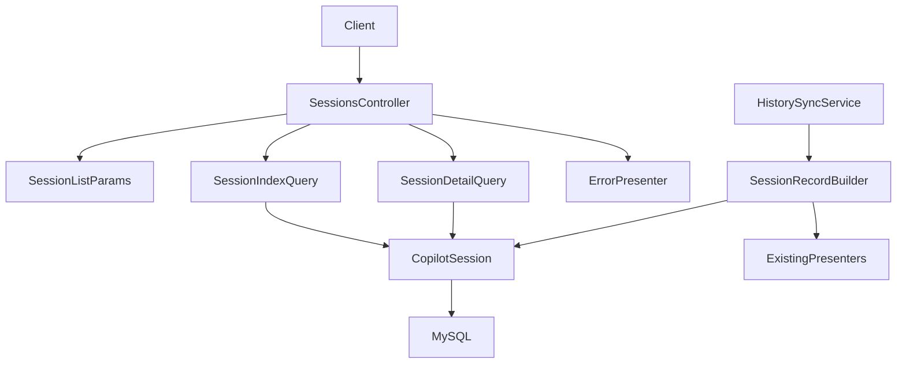
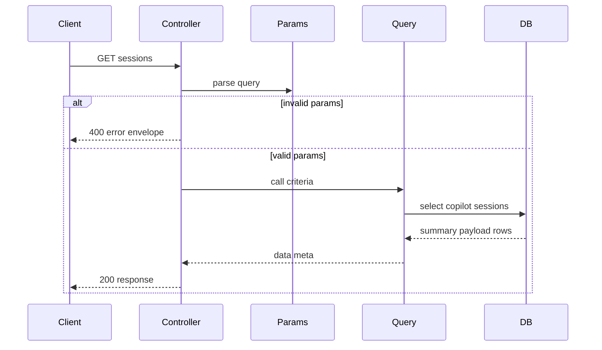
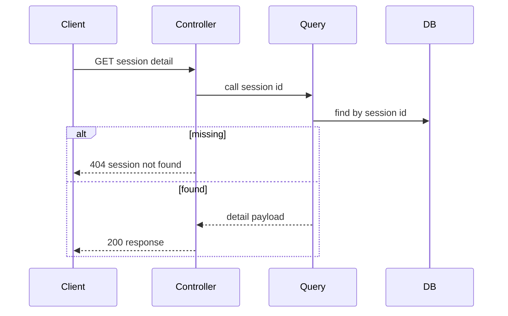

# Design Document

## Overview
この機能は、セッション一覧・詳細 API の参照元を raw files reader から MySQL 上の保存済み read model へ切り替え、一覧画面と詳細画面が raw files の毎回読取に依存しない状態を提供する。対象利用者は、GitHub Copilot CLI のローカル会話履歴を閲覧する利用者と、既存 session API response を利用する frontend 開発者である。

影響範囲は backend の read-only session API に限定する。`CopilotSession` に保存済みの `summary_payload` と `detail_payload` を既存 API response shape の互換 contract として返し、一覧では日付範囲と件数制限を DB query 条件として扱う。

### Goals
- `GET /api/sessions` が保存済み read model から既存一覧 shape 互換の response を返す。
- `GET /api/sessions/:id` が保存済み detail payload を返し、未登録セッションを `session_not_found` として区別する。
- `from` / `to` / `limit` の validation、既定直近 30 日、表示日時順の安定 sort を query contract として固定する。

### Non-Goals
- raw files への fallback、raw files の再読取、同期実行、削除同期。
- `POST /api/history/sync`、同期 service、frontend 同期 UI、検索 UI、repo / branch / model filter。
- `copilot_sessions` の保存 contract、migration、payload builder の構造変更。

## Boundary Commitments

### This Spec Owns
- `GET /api/sessions` の参照元を `CopilotSession` read model に切り替える query/controller contract。
- 一覧条件 `from` / `to` / `limit` の parsing、validation、error envelope。
- 保存済み `summary_payload` / `detail_payload` を既存 top-level response structure に載せる API response 組み立て。
- 未登録 detail の `session_not_found` と DB 空状態の一覧成功応答。

### Out of Boundary
- raw files reader、normalizer、projector、presenter の payload 生成規則変更。
- DB schema、`CopilotSession` validation、同期 service、history sync API の保存処理。
- frontend の日付 filter UI、検索、repo / branch / model filter、削除同期。
- 認証・認可、外部公開向け hardening、background job。

### Allowed Dependencies
- `CopilotSession` ActiveRecord model と既存 `copilot_sessions` table。
- 保存済み `summary_payload` / `detail_payload` contract。これらは `history-db-read-model` と `history-sync-api` が準備済みであることを前提にする。
- 既存 `Api::SessionsController`、`CopilotHistory::Api::Presenters::ErrorPresenter`、`SessionLookupResult` 系の API error/result 境界。
- Rails 8.1 API mode、ActiveRecord、MySQL 9.7、RSpec。

### Revalidation Triggers
- `summary_payload` または `detail_payload` の field 名、nesting、`raw_included` の意味が変わる。
- `copilot_sessions` の timestamp 列、`session_id` uniqueness、JSON payload validation が変わる。
- `GET /api/sessions` / `GET /api/sessions/:id` の top-level envelope や error envelope が変わる。
- frontend が `from` / `to` / `limit` UI を追加し、query param 生成規則を共有する必要が出る。
- 大量履歴で表示日時 query の性能問題が確認され、派生列や複合 index を追加する。

## Architecture

### Existing Architecture Analysis
現行 API は `Api::SessionsController` が `SessionIndexQuery` / `SessionDetailQuery` を呼び、raw reader 由来の `NormalizedSession` を presenter で response に変換している。`SessionRecordBuilder` は同じ presenter を使って `summary_payload` と `detail_payload` を保存しているため、DB query 化後の API は保存済み payload を API-ready data として扱える。

維持する境界は、controller が HTTP status と error rendering を担い、`CopilotHistory::Api` 配下の query/parser が取得条件と result を担う構成である。raw reader failure は DB query 化後の session API では通常発生しないため、DB 空状態は root failure ではなく空の成功応答として扱う。

### Architecture Pattern & Boundary Map



**Architecture Integration**:
- Selected pattern: DB read model passthrough。保存済み payload を API contract として返し、raw reader と presenter は同期時の payload 生成側に閉じる。
- Domain/feature boundaries: session API は参照条件と response envelope を所有し、保存 payload の生成・同期・raw 読取は所有しない。
- Existing patterns preserved: Rails controller は薄い HTTP 境界、`CopilotHistory::Api` は query/result/presenter 系、RSpec request spec が API contract を固定する。
- New components rationale: `SessionListParams` は query param validation を query object から分離する。result type は保存済み payload と HTTP rendering の接続を明確にする。
- Steering compliance: raw files を一次ソース、DB を再生成可能 read model として扱い、Docker Compose / Rails API / MySQL の既存責務分離を保つ。

### Technology Stack

| Layer | Choice / Version | Role in Feature | Notes |
|-------|------------------|-----------------|-------|
| Backend / Services | Ruby 4 / Rails 8.1 API mode | controller、param parsing、query object、error envelope | 新規 gem なし |
| Data / Storage | MySQL 9.7 / ActiveRecord | `copilot_sessions` から保存済み payload と timestamp を取得 | schema 変更なし |
| Infrastructure / Runtime | Docker Compose | 既存 backend test / CI 実行環境 | 既存標準を継続 |

## File Structure Plan

### Directory Structure
```text
backend/
├── app/
│   └── controllers/
│       └── api/
│           └── sessions_controller.rb
├── lib/
│   └── copilot_history/
│       └── api/
│           ├── session_index_query.rb
│           ├── session_detail_query.rb
│           ├── session_list_params.rb
│           ├── presenters/
│           │   └── error_presenter.rb
│           └── types/
│               ├── session_index_result.rb
│               └── session_lookup_result.rb
└── spec/
    ├── requests/
    │   └── api/
    │       └── sessions_spec.rb
    └── lib/
        └── copilot_history/
            └── api/
                ├── session_index_query_spec.rb
                ├── session_detail_query_spec.rb
                └── session_list_params_spec.rb
```

### Modified Files
- `backend/app/controllers/api/sessions_controller.rb` — index で `SessionListParams` を使って `from` / `to` / `limit` を正規化し、DB query result を render する。show は保存済み detail result を render し、`include_raw` は raw 再読取に使わない。
- `backend/lib/copilot_history/api/session_index_query.rb` — raw `SessionCatalogReader` 依存を除去し、`CopilotSession` scope から保存済み `summary_payload` を取得する。
- `backend/lib/copilot_history/api/session_detail_query.rb` — raw `SessionCatalogReader` 依存を除去し、`session_id` で `CopilotSession` を検索して保存済み `detail_payload` を返す。
- `backend/lib/copilot_history/api/presenters/error_presenter.rb` — 一覧条件不正を 400 error envelope として返す presenter method を追加する。
- `backend/lib/copilot_history/api/types/session_lookup_result.rb` — `Found` が `detail_payload` を保持できる contract に変更する。既存 not found contract は維持する。
- `backend/spec/requests/api/sessions_spec.rb` — DB read model 経由の一覧・詳細・空一覧・not found・invalid params・read-only route を検証する。
- `backend/spec/lib/copilot_history/api/session_index_query_spec.rb` — 日付範囲、既定 30 日、表示日時 sort、limit、日付不明除外、payload passthrough を検証する。
- `backend/spec/lib/copilot_history/api/session_detail_query_spec.rb` — detail payload passthrough と missing ID の not found を検証する。

### Referenced Unchanged Files
- `backend/app/models/copilot_session.rb` — `CopilotSession` の保存済み read model validation と ActiveRecord access point。schema/validation はこの spec では変更しない。
- `backend/lib/copilot_history/persistence/session_record_builder.rb` — `SessionRecordBuilder` が既存 presenter から `summary_payload` / `detail_payload` を生成する upstream contract。参照のみで変更しない。
- `backend/lib/copilot_history/api/presenters/session_index_presenter.rb` — 同期時の summary payload 生成元。API query path では再実行しない。
- `backend/lib/copilot_history/api/presenters/session_detail_presenter.rb` — 同期時の detail payload 生成元。API query path では再実行しない。
- `backend/lib/copilot_history/sync/history_sync_service.rb` — `HistorySyncService` が read model を準備する upstream dependency。session API DB query 化では変更しない。

### New Files
- `backend/lib/copilot_history/api/session_list_params.rb` — `from` / `to` / `limit` を parse し、正規化済み `from_time` / `to_time` / `limit` または validation error を返す。
- `backend/lib/copilot_history/api/types/session_index_result.rb` — index query 成功 result と invalid params result の小さな Data class を定義する。
- `backend/spec/lib/copilot_history/api/session_list_params_spec.rb` — date/datetime parsing、既定期間、逆転範囲、limit validation を検証する。

## System Flows





`include_raw=true` が detail request に含まれても、flow は変わらない。DB に保存済みの `detail_payload` を返し、raw files reader は呼ばない。

## Requirements Traceability

| Requirement | Summary | Components | Interfaces | Flows |
|-------------|---------|------------|------------|-------|
| 1.1 | 保存済み read model から一覧を返す | SessionIndexQuery, CopilotSession | `GET /api/sessions` | list flow |
| 1.2 | 一覧 field を識別可能に含める | SessionIndexQuery, SessionRecordBuilder contract | summary payload | list flow |
| 1.3 | current / legacy を共通一覧契約で返す | SessionIndexQuery | summary payload | list flow |
| 1.4 | 空 read model は 200 empty response | SessionIndexQuery, SessionsController | `{ data: [], meta: { count: 0 } }` | list flow |
| 1.5 | 一覧取得は read-only | SessionsController, routes | GET only | list flow |
| 2.1 | `from` 以降で絞り込む | SessionListParams, SessionIndexQuery | `from` query param | list flow |
| 2.2 | `to` 以前で絞り込む | SessionListParams, SessionIndexQuery | `to` query param | list flow |
| 2.3 | `from` / `to` 両端 inclusive | SessionListParams, SessionIndexQuery | normalized criteria | list flow |
| 2.4 | 未指定時は直近 30 日 | SessionListParams | default criteria | list flow |
| 2.5 | 更新日時を表示日時に使う | SessionIndexQuery | display time rule | list flow |
| 2.6 | 作成日時 fallback | SessionIndexQuery | display time rule | list flow |
| 2.7 | 日付不明は範囲一致から除外 | SessionIndexQuery | DB where condition | list flow |
| 3.1 | 表示日時 desc | SessionIndexQuery | DB order | list flow |
| 3.2 | 同一表示日時は session ID asc | SessionIndexQuery | DB order | list flow |
| 3.3 | limit は filter/sort 後に適用 | SessionListParams, SessionIndexQuery | `limit` query param | list flow |
| 3.4 | limit 未指定は範囲一致すべて | SessionListParams, SessionIndexQuery | normalized criteria | list flow |
| 3.5 | limit 不正は client error | SessionListParams, ErrorPresenter | 400 error envelope | list flow |
| 4.1 | detail payload を既存 shape で返す | SessionDetailQuery | `GET /api/sessions/:id` | detail flow |
| 4.2 | detail field を識別可能に含める | SessionDetailQuery, SessionRecordBuilder contract | detail payload | detail flow |
| 4.3 | current / legacy を共通詳細契約で返す | SessionDetailQuery | detail payload | detail flow |
| 4.4 | raw request でも raw files を再読取しない | SessionsController, SessionDetailQuery | `include_raw` compatibility | detail flow |
| 4.5 | 詳細取得は read-only | SessionsController, routes | GET only | detail flow |
| 5.1 | 未登録 ID は `session_not_found` | SessionDetailQuery, ErrorPresenter | 404 error envelope | detail flow |
| 5.2 | 404 と対象 session ID を含める | ErrorPresenter | error details | detail flow |
| 5.3 | DB 空状態で一覧と詳細を区別 | SessionIndexQuery, SessionDetailQuery | 200 empty / 404 not found | list/detail flow |
| 5.4 | `from` / `to` 不正は client error | SessionListParams, ErrorPresenter | 400 error envelope | list flow |
| 5.5 | `from > to` は client error | SessionListParams, ErrorPresenter | 400 error envelope | list flow |
| 5.6 | not found を root failure と混同しない | SessionDetailQuery, ErrorPresenter | `session_not_found` | detail flow |
| 6.1 | 既存 top-level response structure を保つ | SessionsController, result types | data/meta/data envelope | list/detail flow |
| 6.2 | degraded と issue を正常データから識別 | stored payload contract | summary/detail payload | list/detail flow |
| 6.3 | 境界外機能を提供しない | SessionsController, routes | GET only, no fallback | list/detail flow |
| 6.4 | raw files 一次ソース方針を維持 | architecture boundary | read model dependency | list/detail flow |
| 6.5 | 同期操作で read model 準備済みを前提 | boundary commitments | allowed dependencies | list/detail flow |

## Components and Interfaces

| Component | Domain/Layer | Intent | Req Coverage | Key Dependencies | Contracts |
|-----------|--------------|--------|--------------|------------------|-----------|
| SessionsController | Backend API | HTTP request を param parser/query/error presenter に接続する | 1.1, 1.4, 1.5, 4.1, 4.4, 4.5, 5.1, 5.2, 5.3, 6.1, 6.3 | SessionListParams P0, SessionIndexQuery P0, SessionDetailQuery P0 | API |
| SessionListParams | Backend API | 一覧 query param を正規化し client error を検出する | 2.1, 2.2, 2.3, 2.4, 3.3, 3.4, 3.5, 5.4, 5.5 | Rails Time P0 | Service |
| SessionIndexQuery | Backend API Query | `CopilotSession` から一覧 payload と meta を取得する | 1.1-1.5, 2.1-2.7, 3.1-3.4, 5.3, 6.1, 6.2, 6.4, 6.5 | CopilotSession P0 | Service |
| SessionDetailQuery | Backend API Query | `session_id` に一致する保存済み detail payload を取得する | 4.1-4.5, 5.1-5.3, 5.6, 6.1, 6.2, 6.4, 6.5 | CopilotSession P0 | Service |
| ErrorPresenter | Backend API Presenter | not found と invalid list query を共通 error envelope に変換する | 3.5, 5.1, 5.2, 5.4, 5.5, 5.6 | none | API |

### Backend API

#### SessionsController

| Field | Detail |
|-------|--------|
| Intent | read-only session API の HTTP 入出口 |
| Requirements | 1.1, 1.4, 1.5, 4.1, 4.4, 4.5, 5.1, 5.2, 5.3, 6.1, 6.3 |

**Responsibilities & Constraints**
- `index` は raw reader を呼ばず、`SessionListParams` の正規化済み条件で `SessionIndexQuery` を呼ぶ。
- `show` は raw reader を呼ばず、`SessionDetailQuery` の result を render する。
- `include_raw=true` は互換 query param として許容するが、DB 保存済み detail payload の範囲外の raw payload は返さない。
- mutating route は追加しない。

**Dependencies**
- Inbound: HTTP client — `GET /api/sessions`, `GET /api/sessions/:id` を呼ぶ (P0)
- Outbound: SessionListParams — 一覧 param validation (P0)
- Outbound: SessionIndexQuery / SessionDetailQuery — DB read model 取得 (P0)
- Outbound: ErrorPresenter — error envelope 生成 (P0)

**Contracts**: Service [ ] / API [x] / Event [ ] / Batch [ ] / State [ ]

##### API Contract
| Method | Endpoint | Request | Response | Errors |
|--------|----------|---------|----------|--------|
| GET | `/api/sessions` | optional `from`, `to`, `limit` | `{ data: SessionSummary[], meta: { count, partial_results } }` | 400 `invalid_session_list_query` |
| GET | `/api/sessions/:id` | path `id`, optional `include_raw` | `{ data: SessionDetail }` | 404 `session_not_found` |

**Implementation Notes**
- Integration: index response は query が返す `{ data:, meta: }` をそのまま render する。
- Validation: invalid param は query 実行前に 400 として返す。
- Risks: 既存 presenter を controller で再実行しないため、保存 payload contract の drift は request spec で検出する。

#### SessionListParams

| Field | Detail |
|-------|--------|
| Intent | 一覧取得条件を HTTP params から query criteria へ変換する |
| Requirements | 2.1, 2.2, 2.3, 2.4, 3.3, 3.4, 3.5, 5.4, 5.5 |

**Responsibilities & Constraints**
- `from` / `to` は ISO 8601 date または datetime として解釈する。
- date-only の `from` はその日の開始、date-only の `to` はその日の終了として扱い、DB 比較用に UTC time へ正規化する。
- `from` / `to` がどちらも未指定のときだけ、`now` 時点から直近 30 日を inclusive range とする。
- `from` のみ指定されたときは `from_time` 以降を対象にし、上限は設けない。
- `to` のみ指定されたときは `to_time` 以前を対象にし、下限は設けない。
- `from` / `to` が両方指定されたときは両端を含む範囲として扱う。
- `limit` は正の整数のみ許可し、未指定は `nil` とする。
- `from_time > to_time` は、両方が存在する場合に invalid とする。

**Dependencies**
- Inbound: SessionsController — raw query params を渡す (P0)
- Outbound: Rails time utilities — date/datetime normalization (P0)

**Contracts**: Service [x] / API [ ] / Event [ ] / Batch [ ] / State [ ]

##### Service Interface
```ruby
Result = Data.define(:from_time, :to_time, :limit)
Invalid = Data.define(:code, :message, :details)

def call(params:, now: Time.current) # returns Result or Invalid
```
- Preconditions: `params` は Rack/Rails params 互換 object。
- Postconditions: valid result は `from_time` / `to_time` の少なくとも一方を持つ。両方が存在する場合は `from_time <= to_time` を満たす。
- Invariants: 不正 input は例外を外へ漏らさず invalid result に変換する。

#### SessionIndexQuery

| Field | Detail |
|-------|--------|
| Intent | 保存済み read model から一覧 response payload を構築する |
| Requirements | 1.1-1.5, 2.1-2.7, 3.1-3.4, 5.3, 6.1, 6.2, 6.4, 6.5 |

**Responsibilities & Constraints**
- `CopilotSession` から `summary_payload` を取得し、payload 内の field を再構成しない。
- 表示日時は `updated_at_source` があればそれ、なければ `created_at_source` とする。
- 表示日時が nil の row は日付範囲一致から除外する。
- `from_time` が存在するときだけ表示日時 `>= from_time` を適用し、`to_time` が存在するときだけ表示日時 `<= to_time` を適用する。
- order は表示日時 desc、`session_id` asc とする。
- `limit` は where/order 適用後に適用する。
- `meta.count` は返却件数、`meta.partial_results` は返却 payload の `degraded` に true が含まれるかで算出する。

**Dependencies**
- Inbound: SessionsController — normalized criteria を渡す (P0)
- Outbound: CopilotSession — 保存済み row と payload を取得する (P0)
- External: MySQL — timestamp filter/order と JSON payload 取得 (P0)

**Contracts**: Service [x] / API [ ] / Event [ ] / Batch [ ] / State [ ]

##### Service Interface
```ruby
def call(from_time: nil, to_time: nil, limit: nil)
# returns CopilotHistory::Api::Types::SessionIndexResult::Success
```
- Preconditions: `from_time` と `to_time` は nil または UTC 比較可能な `Time`、少なくとも一方は存在し、両方が存在する場合は `from_time <= to_time`、`limit` は nil または正の整数。
- Postconditions: response `data.length <= limit` when `limit` exists。
- Invariants: raw files reader は呼ばない。DB 空状態は success result として返す。

#### SessionDetailQuery

| Field | Detail |
|-------|--------|
| Intent | 保存済み detail payload を session ID で取得する |
| Requirements | 4.1-4.5, 5.1-5.3, 5.6, 6.1, 6.2, 6.4, 6.5 |

**Responsibilities & Constraints**
- `session_id` は `CopilotSession.session_id` と完全一致で検索する。
- found の場合は保存済み `detail_payload` を返す。
- missing の場合は `SessionLookupResult::NotFound` を返し、root failure として扱わない。
- `include_raw` の有無にかかわらず raw files reader は呼ばない。

**Dependencies**
- Inbound: SessionsController — path `id` を渡す (P0)
- Outbound: CopilotSession — detail payload を取得する (P0)

**Contracts**: Service [x] / API [ ] / Event [ ] / Batch [ ] / State [ ]

##### Service Interface
```ruby
def call(session_id:)
# returns SessionLookupResult::Found or SessionLookupResult::NotFound
```
- Preconditions: `session_id` は空でない文字列。
- Postconditions: found result は `detail_payload` JSON object を保持する。
- Invariants: raw files reader failure は返さない。

## Data Models

### Domain Model
- `CopilotSession` は保存済み read model の aggregate root である。
- `summary_payload` は一覧 API の `data[]` item contract である。
- `detail_payload` は詳細 API の `data` contract である。
- 表示日時は `updated_at_source || created_at_source` の派生値であり、DB に永続化しない。

### Logical Data Model
- `CopilotSession.session_id` は API detail lookup の natural key で、unique constraint を持つ。
- `created_at_source` と `updated_at_source` は履歴由来 timestamp で、どちらも nil の row は一覧の日付範囲に一致しない。
- `source_format`, `source_state`, `degraded`, `issue_count` は保存 payload と列の双方に存在しうるが、API response は保存 payload を正とする。

### Physical Data Model
この spec では migration を追加しない。既存 `copilot_sessions` table の relevant columns は次の通りである。

| Column | Type | Role |
|--------|------|------|
| `session_id` | string unique | detail lookup、同一表示日時 sort tie-breaker |
| `created_at_source` | datetime nullable | 表示日時 fallback |
| `updated_at_source` | datetime nullable | 表示日時 primary |
| `summary_payload` | json not null | 一覧 item payload |
| `detail_payload` | json not null | 詳細 payload |
| `source_format` / `source_state` | string not null | 保存 contract validation と運用確認 |

既存 index は `session_id`, `updated_at_source`, `created_at_source` に存在する。初期設計では `COALESCE(updated_at_source, created_at_source)` 相当の条件で実装し、性能問題が実測された場合のみ `displayed_at_source` 派生列または複合 index を検討する。

### Data Contracts & Integration
- 一覧 response: `{ data: summary_payloads, meta: { count: data.length, partial_results: data.any? { degraded } } }`
- 詳細 response: `{ data: detail_payload }`
- `session_not_found`: `{ error: { code: "session_not_found", message: "session was not found", details: { session_id } } }`
- invalid list query: `{ error: { code: "invalid_session_list_query", message: "...", details: { field, reason } } }`

## Error Handling

### Error Strategy
- 一覧条件不正は query 前に検出し、400 `invalid_session_list_query` を返す。
- 未登録 detail は DB 未登録状態として扱い、404 `session_not_found` を返す。
- DB 空状態は failure ではない。一覧は 200 empty、詳細は指定 ID の 404 を返す。
- raw root missing / permission denied は DB query 化後の session API error path には含めない。

### Error Categories and Responses
| Condition | Status | Code | Details |
|-----------|--------|------|---------|
| invalid `from` | 400 | `invalid_session_list_query` | `{ field: "from", reason: "invalid_datetime" }` |
| invalid `to` | 400 | `invalid_session_list_query` | `{ field: "to", reason: "invalid_datetime" }` |
| `from > to` | 400 | `invalid_session_list_query` | `{ field: "range", reason: "from_after_to" }` |
| invalid `limit` | 400 | `invalid_session_list_query` | `{ field: "limit", reason: "positive_integer_required" }` |
| missing session ID | 404 | `session_not_found` | `{ session_id }` |

### Monitoring
追加の監視基盤は導入しない。実装時は Rails request log に status と path が残ることを前提にし、異常系は request spec で envelope を固定する。

## Testing Strategy

### Unit Tests
- `SessionListParams` が ISO 8601 date/datetime を UTC time に正規化し、両方未指定時に `now - 30.days` から `now` の範囲を返すことを確認する。
- `SessionListParams` が `from` のみ指定時は上限なし、`to` のみ指定時は下限なしの criteria を返すことを確認する。
- `SessionListParams` が invalid `from` / `to`、`from > to`、0・負数・小数・文字列 `limit` を invalid result にすることを確認する。
- `SessionIndexQuery` が `updated_at_source` 優先、`created_at_source` fallback、両方 nil 除外、表示日時 desc と `session_id` asc を満たすことを確認する。
- `SessionIndexQuery` が filter/order 後に `limit` を適用し、`summary_payload` を改変せず返すことを確認する。
- `SessionDetailQuery` が found で `detail_payload` を返し、missing で `SessionLookupResult::NotFound` を返すことを確認する。

### Integration Tests
- `GET /api/sessions` が保存済み current / legacy payload を既存 top-level `{ data, meta }` shape で返すことを request spec で確認する。
- `GET /api/sessions` が DB 空状態で 200、`data: []`、`meta.count: 0`、`partial_results: false` を返すことを確認する。
- `GET /api/sessions?from=...&to=...&limit=...` が条件一致した保存済み payload のみを安定順で返すことを確認する。
- `GET /api/sessions?from=...` と `GET /api/sessions?to=...` が片側条件だけを適用し、未指定側に直近 30 日の既定範囲を混ぜないことを確認する。
- invalid params が 400 `invalid_session_list_query` になり、成功応答と区別できることを確認する。
- `GET /api/sessions/:id` が保存済み detail payload を返し、missing ID が 404 `session_not_found` と対象 ID を返すことを確認する。

### E2E/UI Tests
この spec は frontend を変更しない。既存 frontend hook は DB 空一覧を empty state として扱うため、backend request spec の API contract 確認を完了条件にする。

### Performance/Load
- 初期実装ではローカル履歴規模を前提に、`CopilotSession` query が全 payload を Ruby 側で filter しないことを確認する。
- 大量データで `COALESCE` order/filter が問題化した場合は、この spec の revalidation trigger に従い schema/index 設計を再検討する。

## Security Considerations
- 新しい認証・認可境界は導入しない。
- `include_raw=true` でも raw files を再読取しないため、この切替で raw payload の露出範囲は広げない。
- error details は invalid field/reason と session ID に限定し、DB 内部情報や raw path を追加しない。

## Performance & Scalability
- API は保存済み payload を返すため、raw files の I/O と正規化処理を一覧・詳細 request path から外す。
- 一覧 query は両方未指定時に直近 30 日の既定範囲を持つ。片側指定時は指定された境界だけを適用し、`limit` と組み合わせて不要な payload materialization を抑える。
- `limit` は DB query に反映し、不要な payload materialization を避ける。
