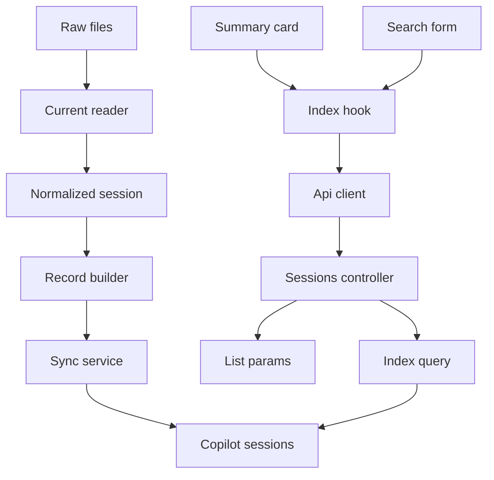
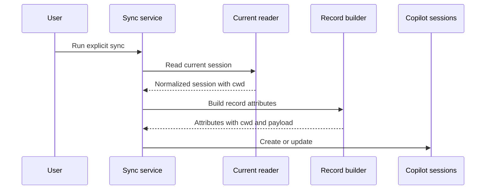
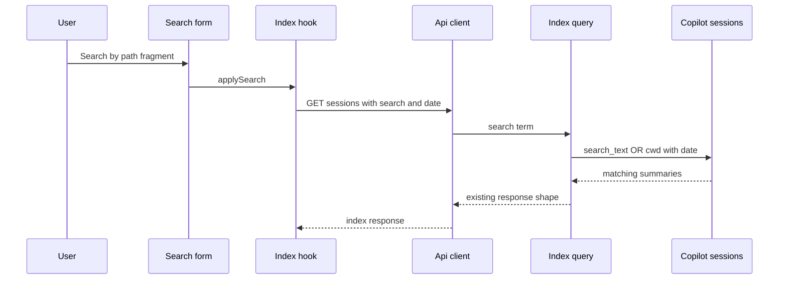

# 設計書

## 概要
この feature は、GitHub Copilot CLI のローカル会話履歴を読み返す利用者に、各セッションの実行ディレクトリを一覧カード上で確認し、そのパス断片を既存の一覧検索語として使える状態を提供する。利用者は詳細画面を開く前に、どのプロジェクトまたは作業ディレクトリで実行した会話か判断できる。

影響範囲は current 形式セッションから得られる `cwd` の保存契約、保存済み read model を使った一覧 API 検索、一覧カードの metadata 表示、検索フォームの説明に限定する。検索は raw files を直接読まず、既存本文検索 `search_text` と read model scalar `cwd` の両方を対象にする。

### 目標
- current 形式の `workspace.yaml` に含まれる `cwd` を、同期済み `CopilotSession` read model のセッション metadata として保持する。
- 一覧カードで `cwd` を repository / branch と独立して表示し、値がない session には placeholder を出さない。
- `GET /api/sessions?search=...` が既存本文検索を維持したまま、`cwd` の部分一致でも session summary を返す。
- 検索 UI が実行ディレクトリも検索対象であることを示し、既存の日付範囲・検索条件表示・検索条件エラーの扱いを維持する。

### 非目標
- raw files に実行ディレクトリが存在しない legacy session への推測付与。
- `git_root`、repository、branch、selected model の一般検索対象化または専用 filter 追加。
- 検索結果スコアリング、検索語ハイライト、semantic search、外部検索サービス、MySQL FULLTEXT 化。
- 詳細画面内検索、履歴編集・削除・共有、自動同期、認証・認可。
- API response shape の破壊的変更、raw files の request 時直接検索。

## 境界コミットメント

### この spec が責務を持つもの
- current 形式 `NormalizedSession#cwd` を `CopilotSession.cwd` と保存済み summary payload の `work_context.cwd` へ保持する保存契約。
- 明示同期で current session の `cwd` が欠落せず再生成されること。
- 一覧 API の既存 `search` param が `search_text` と `cwd` の OR 条件として保存済み read model を検索すること。
- 一覧カードで `cwd` を「実行ディレクトリ」として表示し、repository / branch 表示によって隠さないこと。
- 検索フォーム説明、条件 label、検索適用・解除、検索条件エラー表示が `cwd` 検索を含む一覧条件として成立すること。
- backend / frontend tests による保存、検索、表示、条件維持の回帰防止。

### 境界外
- legacy session の `cwd` 推測、`git_root` からの `cwd` 補完、repository / branch からの path 逆算。
- `SessionSearchTextBuilder` の本文・preview・issue projection へ `cwd` を混ぜること。
- `git_root`、repository、branch、selected model の検索対象化。
- 新規検索 endpoint、専用 `cwd` query param、search index service、background reindex job。
- detail API の payload shape 変更、詳細画面での必須表示変更。
- raw files を一覧検索 request 中に読むこと。

### 許可する依存
- `CurrentSessionReader` と `NormalizedSession` の current workspace metadata contract。
- `SessionRecordBuilder`、`HistorySyncService`、`CopilotSession`、`copilot_sessions.cwd` / `git_root` / `summary_payload`。
- `SessionListParams`、`SessionIndexQuery`、`SessionsController`、既存 error envelope。
- frontend `sessionApi.types.ts`、`sessionApi.ts`、`sessionIndexCriteria.ts`、`useSessionIndex.ts`、`SessionSummaryCard.tsx`、`SessionSearchForm.tsx`。
- Rails 8.1 API mode、ActiveRecord、MySQL 9.7、React 19、TypeScript 6、Vitest、RSpec。新規外部依存は追加しない。

### 再検証トリガー
- `workspace.yaml` の `cwd` field 名または current reader の workspace metadata contract が変わる。
- `CopilotSession` の `cwd` / `summary_payload.work_context` の nullable semantics が変わる。
- `GET /api/sessions` の search semantics、date range semantics、response envelope が変わる。
- `SessionSearchTextBuilder` の projection 対象を metadata へ広げる要求が出る。
- repository / branch / model filter、ranking、highlight、pagination、URL persistence が追加される。
- 同期 skip 判定、source fingerprint、read model 再生成方針が変わる。

## アーキテクチャ

### 既存アーキテクチャ分析
backend は同期時に raw files を読み、`CurrentSessionReader` が current 形式の `workspace.yaml` と `events.jsonl` を `NormalizedSession` へ正規化する。`SessionRecordBuilder` は `NormalizedSession` から scalar columns と summary/detail payload を作り、`HistorySyncService` が `CopilotSession` を create / update / skip する。通常の一覧 API は `SessionIndexQuery` が `CopilotSession` の保存済み `summary_payload` を返す。

frontend は sessions feature slice 内で API client、criteria helper、hook、component を分けている。`useSessionIndex` は日付範囲と検索語を `SessionIndexCriteria` として保持し、検索適用・解除時も現在の日付範囲を維持する。`SessionSummaryCard` は metadata items を表示し、値がない項目を出さない既存方針を持つ。

この feature は既存境界を維持し、実行ディレクトリを「read model metadata」として扱う。検索のために `cwd` を `search_text` に閉じ込めず、`SessionIndexQuery` が `search_text` と `cwd` の両方を read model 上で参照する。

### アーキテクチャパターンと境界マップ



**アーキテクチャ統合**:
- 採用パターン: read model metadata extension。同期時に `cwd` を scalar metadata と payload に保存し、一覧 query は保存済み metadata を検索する。
- 依存方向:
  - backend ingest: `CurrentSessionReader` → `NormalizedSession` → `SessionRecordBuilder` → `HistorySyncService` → `CopilotSession`
  - backend API: `SessionListParams` → `SessionIndexQuery` → `CopilotSession` → `SessionsController`
  - frontend: `sessionApi.types` → presentation helpers → `sessionApi` → `useSessionIndex` → page/components
- 維持する既存パターン: raw files は明示同期時だけ読む。controller は thin に保つ。frontend は sessions feature slice 内に閉じる。
- 新規 component rationale: 新規 component は作らない。既存保存・検索・表示境界の責務を拡張する。
- ステアリング適合: DB read model は再生成可能な補助層であり、通常表示と検索表示は read-only API を通じて MySQL を参照する。

### 技術スタック

| レイヤー | 選択 / バージョン | feature での役割 | 備考 |
|----------|--------------------|------------------|------|
| Backend / Services | Ruby 4 / Rails 8.1 API mode | 同期保存契約、一覧検索 query、request validation | 新規 gem なし |
| Data / Storage | MySQL 9.7 / ActiveRecord | `copilot_sessions.cwd` と `search_text` の read model query | 新規 table / column なし |
| Frontend UI | React 19 / TypeScript 6 | cwd metadata 表示、検索説明、条件表示 | `any` は使わない |
| Tests | RSpec / Vitest / Testing Library | reader-to-DB、query、UI 表示、条件維持の固定 | test case 直前コメント規約を守る |

## ファイル構成計画

### ディレクトリ構成
```text
backend/
├── lib/
│   └── copilot_history/
│       ├── current_session_reader.rb                 # workspace.yaml の cwd 読取契約を既存維持する
│       ├── persistence/
│       │   └── session_record_builder.rb             # cwd を scalar column と payload に保存する
│       ├── sync/
│       │   └── history_sync_service.rb               # cwd / summary payload 欠落 row の再生成が必要な場合の skip 判定を持つ
│       └── api/
│           ├── session_list_params.rb                 # search param validation を既存維持する
│           └── session_index_query.rb                # search_text OR cwd の一覧検索を行う
└── spec/
    ├── requests/
    │   └── api/
    │       └── sessions_spec.rb                      # cwd 検索と response shape 維持を検証する
    └── lib/
        └── copilot_history/
            ├── persistence/
            │   └── session_record_builder_spec.rb    # current cwd の保存属性を固定する
            ├── sync/
            │   └── history_sync_service_spec.rb      # cwd / summary payload 欠落 row の同期更新を検証する
            └── api/
                └── session_index_query_spec.rb       # cwd 部分一致、日付併用、literal escape を検証する

frontend/
├── src/
│   └── features/
│       └── sessions/
│           ├── presentation/
│           │   └── formatters.ts                     # summary metadata に実行ディレクトリ item を追加する
│           ├── components/
│           │   ├── SessionSummaryCard.tsx            # cwd item を wrap-safe に描画する
│           │   └── SessionSearchForm.tsx             # cwd も検索対象である説明を表示する
│           ├── hooks/
│           │   └── useSessionIndex.ts                # search 適用と解除で日付範囲を維持する
│           └── pages/
│               └── SessionIndexPage.tsx              # 既存 criteria label と search error 分類を維持する
└── tests/
    └── features/
        └── sessions/
            ├── presentation/
            │   └── formatters.test.ts
            └── components/
                ├── SessionSummaryCard.test.tsx
                └── SessionSearchForm.test.tsx
```

### 変更対象ファイル
- `backend/lib/copilot_history/persistence/session_record_builder.rb` — current session の `cwd` / `git_root` を scalar attributes と `summary_payload.work_context` に保持する既存 contract を維持し、欠落が再発しないよう spec を追加する。実装差分は不具合が見つかった場合に限定する。
- `backend/lib/copilot_history/sync/history_sync_service.rb` — source fingerprint が同じでも、raw current session に `cwd` があり保存済み read model の `cwd` または `summary_payload.work_context.cwd` が欠落・不一致の場合に再生成が必要かを判定する。実装時調査で既存 skip が問題でないと確認できた場合は変更しない。
- `backend/lib/copilot_history/api/session_index_query.rb` — `search_term` がある場合、`search_text LIKE term OR cwd LIKE term` を同じ date candidate scope に適用する。`cwd` が `NULL` の row は cwd 条件で一致しない。
- `backend/lib/copilot_history/api/session_list_params.rb` — 既存 `search` validation を維持し、cwd 検索でも同じ 200 文字上限、制御文字拒否、空白正規化を適用する。実装差分は不要想定。
- `backend/spec/lib/copilot_history/persistence/session_record_builder_spec.rb` — `cwd` がある current session で `attributes[:cwd]` と `summary_payload[:work_context][:cwd]` が一致すること、`cwd` がない session では `nil` を保つことを検証する。
- `backend/spec/lib/copilot_history/sync/history_sync_service_spec.rb` — current raw files に cwd があるのに保存済み row の `cwd` または `summary_payload.work_context.cwd` が `nil` / 不一致の場合、明示同期で scalar column と payload の両方が更新されることを検証する。
- `backend/spec/lib/copilot_history/api/session_index_query_spec.rb` — search_text 一致、cwd 一致、cwd 不一致、date range 併用、`%` / `_` literal escape を検証する。
- `backend/spec/requests/api/sessions_spec.rb` — `GET /api/sessions?search=<cwd断片>` が保存済み summary payload を返し、meta / degraded / issue shape と raw files 非読取を維持することを検証する。
- `frontend/src/features/sessions/presentation/formatters.ts` — summary surface の metadata item に `実行ディレクトリ` を追加し、repository / branch と併存させる。detail surface への影響は既存 helper の共有範囲で最小化する。
- `frontend/src/features/sessions/components/SessionSummaryCard.tsx` — 既存 metadata list rendering を使い、長い cwd がカード幅を破綻させない class を維持する。
- `frontend/src/features/sessions/components/SessionSearchForm.tsx` — 説明文を「会話本文、会話 preview、issue、実行ディレクトリ」に更新する。
- `frontend/src/features/sessions/hooks/useSessionIndex.ts` — 検索語の適用・解除が現在の日付範囲を維持する既存 contract を cwd 検索でも再確認する。実装差分は不要想定。
- `frontend/tests/features/sessions/presentation/formatters.test.ts` — cwd と repository / branch が同時に表示 item 化されること、cwd 欠損時は placeholder がないことを検証する。
- `frontend/tests/features/sessions/components/SessionSummaryCard.test.tsx` — repository / branch がある session でも cwd が表示され、長い path が `break-words` で描画されることを検証する。
- `frontend/tests/features/sessions/components/SessionSearchForm.test.tsx` — 検索対象説明に実行ディレクトリが含まれることを検証する。

### 作成するファイル
- なし。既存 schema と既存 sessions feature slice を拡張する。

## システムフロー





## 要件トレーサビリティ

| Requirement | Summary | Components | Interfaces | Flows |
|-------------|---------|------------|------------|-------|
| 1.1 | current 形式の実行ディレクトリを同期で利用可能にする | CurrentSessionReader, SessionRecordBuilder, HistorySyncService | `NormalizedSession#cwd`, `CopilotSession.cwd` | 同期保存 flow |
| 1.2 | 表示と検索が同じ cwd metadata を参照する | SessionRecordBuilder, SessionIndexQuery, SessionSummaryCard | `work_context.cwd`, `copilot_sessions.cwd` | 検索 flow |
| 1.3 | cwd 欠損時に推測値を作らない | CurrentSessionReader, formatters | nullable cwd contract | 同期保存 flow |
| 1.4 | 明示同期再生成で cwd を失わせない | HistorySyncService, SessionRecordBuilder | record attributes | 同期保存 flow |
| 1.5 | search_text だけに閉じ込めない | SessionIndexQuery, CopilotSession | `cwd` column query | 検索 flow |
| 2.1 | cwd あり session の一覧カードに表示する | formatters, SessionSummaryCard | metadata item | index display |
| 2.2 | repository / branch が cwd を隠さない | formatters, SessionSummaryCard | metadata item list | index display |
| 2.3 | cwd 欠損時は空項目を表示しない | formatters, SessionSummaryCard | nullable item filtering | index display |
| 2.4 | 長い path でもカード幅を破綻させない | SessionSummaryCard | wrap-safe classes | index display |
| 2.5 | preview、日時、例外 signal、詳細導線を維持する | SessionSummaryCard | existing props | index display |
| 3.1 | cwd に含まれる検索語で一致 session を含める | SessionIndexQuery | `search` param, `cwd LIKE` | 検索 flow |
| 3.2 | cwd 検索と日付範囲を AND で併用する | SessionListParams, SessionIndexQuery | from/to/search criteria | 検索 flow |
| 3.3 | 既存本文・preview・issue 検索を維持する | SessionIndexQuery | `search_text LIKE` | 検索 flow |
| 3.4 | cwd no match は空成功を返す | SessionIndexQuery, SessionsController | success meta count zero | 検索 flow |
| 3.5 | response shape、meta、degraded、issue を維持する | SessionIndexQuery, SessionsController | saved summary payload | 検索 flow |
| 4.1 | metadata 検索拡張を cwd に限定する | SessionIndexQuery | allowed searchable fields | 検索 flow |
| 4.2 | repository / branch / model 専用 filter を追加しない | SessionListParams, SessionIndexQuery, SessionSearchForm | no new params | n/a |
| 4.3 | scoring / highlight / semantic / external search を必須にしない | SessionIndexQuery | literal substring match | 検索 flow |
| 4.4 | raw files にない cwd を推測付与しない | CurrentSessionReader, SessionRecordBuilder | nullable cwd | 同期保存 flow |
| 4.5 | 通常表示も検索表示も read model を参照する | SessionIndexQuery, SessionSummaryCard | `CopilotSession` payload | 検索 flow |
| 5.1 | 検索フォームが cwd も対象と示す | SessionSearchForm | help text | index display |
| 5.2 | cwd 検索適用時も日付範囲を維持する | useSessionIndex | `SessionIndexCriteria` | 検索 flow |
| 5.3 | 検索解除時も日付範囲を維持する | useSessionIndex, SessionSearchForm | `clearSearch` | 検索 flow |
| 5.4 | 検索語と日付範囲を確認できる | sessionIndexCriteria, SessionSearchForm | criteria label | index display |
| 5.5 | 検索条件エラーを取得失敗と区別する | SessionListParams, SessionIndexPage, SessionSearchForm | error details field search | index display |

## コンポーネントとインターフェース

| Component | Domain/Layer | Intent | Req Coverage | Key Dependencies | Contracts |
|-----------|--------------|--------|--------------|------------------|-----------|
| CurrentSessionReader | Backend reader | current workspace metadata から cwd を正規化する | 1.1, 1.3, 4.4 | workspace.yaml P0, NormalizedSession P0 | Service |
| SessionRecordBuilder | Backend persistence | cwd を scalar と payload に保存する attributes を作る | 1.1, 1.2, 1.4, 4.4 | NormalizedSession P0, presenters P0 | Service |
| HistorySyncService | Backend sync | 明示同期で cwd を含む read model を create / update する | 1.1, 1.4 | SessionRecordBuilder P0, CopilotSession P0 | Batch |
| SessionListParams | Backend API | 既存 search param validation を cwd 検索にも適用する | 3.2, 5.5, 4.2 | controller params P0 | Service |
| SessionIndexQuery | Backend API | search_text と cwd を date range と合成して検索する | 1.2, 1.5, 3.1, 3.2, 3.3, 3.4, 3.5, 4.1, 4.3, 4.5 | CopilotSession P0 | Service |
| metadata display helpers | Frontend presentation | nullable metadata から一覧表示 item を作る | 2.1, 2.2, 2.3 | sessionApi.types P0 | Service |
| SessionSummaryCard | Frontend UI | cwd を含む session summary metadata を表示する | 2.1, 2.2, 2.3, 2.4, 2.5 | metadata display helpers P0 | State |
| SessionSearchForm | Frontend UI | 検索対象説明と検索操作を提供する | 5.1, 5.3, 5.4, 5.5 | sessionIndexCriteria P0 | State |
| useSessionIndex | Frontend hook | 検索語と日付範囲を同じ criteria として取得する | 5.2, 5.3, 5.4 | sessionApi P0, criteria helper P0 | State |

### Backend

#### CurrentSessionReader

| Field | Detail |
|-------|--------|
| Intent | current session の `workspace.yaml` にある実行ディレクトリを nullable metadata として返す |
| Requirements | 1.1, 1.3, 4.4 |

**Responsibilities & Constraints**
- `workspace.yaml` に `cwd` が存在する場合のみ `NormalizedSession#cwd` を設定する。
- workspace が読めない、parse できない、または `cwd` が存在しない場合は `nil` を返す。
- `git_root`、repository、branch は隣接 metadata として維持するが、`cwd` の代替値として推測しない。

**Dependencies**
- Inbound: `SessionCatalogReader` — current source 読取 (P0)
- Outbound: `NormalizedSession` — reader 共通 contract (P0)
- External: local filesystem / YAML parser — workspace metadata 読取 (P0)

**Contracts**: Service [x] / API [ ] / Event [ ] / Batch [ ] / State [ ]

##### Service Interface
```ruby
call(source) -> CopilotHistory::Types::NormalizedSession
```
- Preconditions: `source.format == :current`。
- Postconditions: raw workspace に `cwd` がある場合、`NormalizedSession#cwd` はその path を表す `Pathname` になる。
- Invariants: missing cwd には placeholder、`git_root` fallback、repository fallback を使わない。

#### SessionRecordBuilder

| Field | Detail |
|-------|--------|
| Intent | `NormalizedSession` の cwd を保存済み read model attributes に反映する |
| Requirements | 1.1, 1.2, 1.4, 4.4 |

**Responsibilities & Constraints**
- `session.cwd` を `CopilotSession.cwd` 用 scalar attribute へ `String` または `nil` として変換する。
- `summary_payload.work_context.cwd` と `detail_payload.work_context.cwd` が presenter contract に従って同じ cwd を持つ状態を保つ。
- `search_text` 生成には cwd を追加しない。

**Dependencies**
- Inbound: `HistorySyncService` — 同期保存 attributes 構築 (P0)
- Outbound: `SessionIndexPresenter`, `SessionDetailPresenter` — API payload snapshot 構築 (P0)
- Outbound: `SessionSearchTextBuilder` — 既存本文検索 projection 構築 (P1)

**Contracts**: Service [x] / API [ ] / Event [ ] / Batch [ ] / State [ ]

##### Service Interface
```ruby
call(session:, indexed_at: Time.current, source_fingerprint: nil) -> Hash
```
- Preconditions: `session` は `NormalizedSession`。
- Postconditions: `:cwd` と payload `work_context.cwd` は raw に値がある場合のみ non-nil。
- Invariants: `cwd` 欠損時に `git_root` や repository を代入しない。

#### HistorySyncService

| Field | Detail |
|-------|--------|
| Intent | 明示同期で cwd を含む read model row を保存または再生成する |
| Requirements | 1.1, 1.4 |

**Responsibilities & Constraints**
- 新規 current session は `SessionRecordBuilder` attributes で `CopilotSession` を作る。
- 既存 current row が `cwd` 欠落だが raw session に `cwd` がある場合、source fingerprint が同じでも update 対象にする。
- 既存 current row の `summary_payload.work_context.cwd` が欠落または raw session の `cwd` と不一致の場合も、一覧表示と検索の根拠を揃えるため update 対象にする。
- raw session に `cwd` がない場合は既存通り推測値なしで保存する。

**Dependencies**
- Inbound: `POST /api/history/sync` — 明示同期 trigger (P0)
- Outbound: `SessionRecordBuilder` — 保存 attributes (P0)
- Outbound: `CopilotSession` — read model 永続化 (P0)

**Contracts**: Service [ ] / API [ ] / Event [ ] / Batch [x] / State [ ]

##### Batch / Job Contract
- Trigger: 利用者操作による `POST /api/history/sync`。
- Input / validation: `SessionCatalogReader` が返す normalized sessions。
- Output / destination: `CopilotSession` rows と `HistorySyncRun` counts。
- Idempotency & recovery: fingerprint と projection version が同じ、かつ `cwd` scalar と `summary_payload.work_context.cwd` の欠落・不一致がない row は skip 可能。cwd 欠落または payload 不一致の補正 update は同じ raw input で再実行しても同じ row に収束する。

#### SessionIndexQuery

| Field | Detail |
|-------|--------|
| Intent | 一覧検索語を本文 projection と実行ディレクトリ metadata に適用する |
| Requirements | 1.2, 1.5, 3.1, 3.2, 3.3, 3.4, 3.5, 4.1, 4.3, 4.5 |

**Responsibilities & Constraints**
- `search_term` が空の場合は既存の日付範囲 query と ordering を維持する。
- `search_term` がある場合は、`search_text LIKE escaped_term OR cwd LIKE escaped_term` を候補 scope に適用する。
- `cwd` は nullable であり、`NULL` row は cwd 条件で一致しない。
- `git_root`、repository、branch、selected model は検索条件に含めない。
- payload は保存済み `summary_payload` を返し、response shape を再構築しない。

**Dependencies**
- Inbound: `SessionsController` — parsed criteria (P0)
- Outbound: `CopilotSession` — DB read model (P0)
- External: ActiveRecord SQL sanitization — LIKE wildcard escape (P0)

**Contracts**: Service [x] / API [ ] / Event [ ] / Batch [ ] / State [ ]

##### Service Interface
```ruby
call(from_time: nil, to_time: nil, limit: nil, search_term: nil) -> CopilotHistory::Api::Types::SessionIndexResult::Success
```
- Preconditions: `search_term` は `SessionListParams` で正規化済み。
- Postconditions: result data は date range と検索条件を満たす保存済み summary payload の配列。
- Invariants: no match は error ではなく `data: []`, `meta.count: 0`。

#### SessionListParams

| Field | Detail |
|-------|--------|
| Intent | 一覧検索語の validation を cwd 検索にも同じ基準で適用する |
| Requirements | 3.2, 5.5, 4.2 |

**Responsibilities & Constraints**
- `search` は trim と whitespace collapse 後の 200 文字以内に正規化する。
- 表示に有害な制御文字は query 実行前に invalid result とする。
- `cwd` 専用 param、repository / branch / model filter param は追加しない。

**Dependencies**
- Inbound: `SessionsController` — request params (P0)
- Outbound: `SessionIndexQuery` — normalized criteria (P0)

**Contracts**: Service [x] / API [ ] / Event [ ] / Batch [ ] / State [ ]

##### Service Interface
```ruby
call(params:, now: Time.current) -> Result | CopilotHistory::Api::Types::SessionIndexResult::Invalid
```
- Preconditions: `params` は controller から渡される query params。
- Postconditions: valid search は normalized `search_term` になり、invalid search は `details.field == "search"` を持つ。
- Invariants: 新しい filter key を解釈しない。

### Frontend

#### metadata display helpers

| Field | Detail |
|-------|--------|
| Intent | 一覧カードで表示可能な metadata item を作る |
| Requirements | 2.1, 2.2, 2.3 |

**Responsibilities & Constraints**
- summary surface では `workContext.cwd` が非空なら `label: '実行ディレクトリ'` の item を返す。
- repository / branch が非空でも cwd item を除外しない。
- cwd が `null` または空白なら item を返さず、不明 placeholder を作らない。

**Dependencies**
- Inbound: `SessionSummaryCard` — metadata rendering (P0)
- Outbound: `sessionApi.types` — nullable DTO (P0)

**Contracts**: Service [x] / API [ ] / Event [ ] / Batch [ ] / State [ ]

##### Service Interface
```typescript
interface MetadataDisplayItem {
  label: '表示日時' | '更新日時' | '作成日時' | '実行ディレクトリ' | '作業コンテキスト' | 'リポジトリ' | 'モデル'
  value: string
}
```
- Preconditions: input は backend DTO の nullable metadata。
- Postconditions: 戻り値は表示すべき item だけを含む。
- Invariants: `cwd` 欠損時に `git_root` fallback を「実行ディレクトリ」として表示しない。

#### SessionSummaryCard

| Field | Detail |
|-------|--------|
| Intent | session list で cwd を含む実値 metadata と既存 summary を描画する |
| Requirements | 2.1, 2.2, 2.3, 2.4, 2.5 |

**Responsibilities & Constraints**
- metadata item list をそのまま描画し、cwd と repository / branch が併存できる。
- 長い cwd はカード内で折り返し、横スクロールや layout 破綻を起こさない。
- 既存の preview、表示日時、exception signal、詳細リンクを維持する。

**Dependencies**
- Inbound: `SessionList` — summary card rendering (P0)
- Outbound: metadata display helpers — item building (P0)
- Outbound: React Router `Link` — detail navigation (P1)

**Contracts**: Service [ ] / API [ ] / Event [ ] / Batch [ ] / State [x]

##### State Management
- State model: stateless presentation component。
- Persistence & consistency: props の `SessionSummary` を信頼する。
- Concurrency strategy: なし。

#### SessionSearchForm

| Field | Detail |
|-------|--------|
| Intent | 検索対象に実行ディレクトリが含まれることを示し、検索操作を受け付ける |
| Requirements | 5.1, 5.3, 5.4, 5.5 |

**Responsibilities & Constraints**
- help text は会話本文、会話 preview、issue、実行ディレクトリが検索対象であることを示す。
- 現在の criteria label を表示し、検索語と日付範囲を確認可能にする。
- frontend validation と backend `field: search` error を generic fetch error と区別して表示する。

**Dependencies**
- Inbound: `SessionIndexPage` — applied criteria と callbacks (P0)
- Outbound: `sessionIndexCriteria` — normalize / validate (P0)

**Contracts**: Service [ ] / API [ ] / Event [ ] / Batch [ ] / State [x]

##### State Management
- State model: draft search term、submitted validation message。
- Persistence & consistency: applied search term が変わった場合は draft を applied に合わせる。
- Concurrency strategy: `isApplying` 中の二重 submit を抑止する。

#### useSessionIndex

| Field | Detail |
|-------|--------|
| Intent | 日付範囲と検索語を一覧 criteria として API request に反映する |
| Requirements | 5.2, 5.3, 5.4 |

**Responsibilities & Constraints**
- `applySearch(searchTerm)` は現在の date range を維持する。
- `clearSearch()` は検索語だけを空にし、date range を維持する。
- criteria label と query key は normalized search term を使う。
- stale request の結果を別 criteria の表示として採用しない。

**Dependencies**
- Inbound: `SessionIndexPage`, `useHistorySync` — index state 操作 (P0)
- Outbound: `sessionApi` — API request (P0)
- Outbound: `sessionIndexCriteria` — query/key/label (P0)

**Contracts**: Service [ ] / API [ ] / Event [ ] / Batch [ ] / State [x]

##### State Management
- State model: `appliedCriteria`, `settledState`, `isRefreshing`, active request id。
- Persistence & consistency: reusable snapshot は criteria key ごとに保存する。
- Concurrency strategy: AbortController と request id で stale result を破棄する。

## データモデル

### ドメインモデル
- **ExecutionDirectory**: current session の `workspace.yaml.cwd` に由来する nullable path metadata。raw にない場合は存在しない値として扱う。
- **CopilotSession**: 保存済み read model aggregate。`cwd` scalar column、`git_root` scalar column、summary/detail payload、`search_text` projection を併持する。
- **SessionIndexCriteria**: date range と search term をまとめた一覧条件。search term は backend で `search_text` と `cwd` に適用される。

### 論理データモデル

| Entity | Attribute | Type | Nullable | Meaning |
|--------|-----------|------|----------|---------|
| `NormalizedSession` | `cwd` | `Pathname` | yes | current raw workspace の実行ディレクトリ |
| `CopilotSession` | `cwd` | text | yes | 一覧表示と cwd 検索の正規 metadata |
| `SessionSummary.work_context` | `cwd` | string | yes | frontend 一覧カード用 DTO |
| `SessionIndexCriteria` | `searchTerm` | string | no | 本文・issue・cwd に適用される検索語 |

**Consistency & Integrity**
- `CopilotSession.cwd` と `summary_payload.work_context.cwd` は同じ raw metadata から生成される。
- raw current session に `cwd` がある場合、明示同期後の `CopilotSession.cwd` と `summary_payload.work_context.cwd` は同じ値に収束し、片方だけが欠落または古い値のまま残らない。
- `cwd` がない場合は `nil` / `null` として保存・返却し、空文字や「不明」は作らない。
- 明示同期が read model 再生成境界であり、API request 中に raw files を参照しない。

### 物理データモデル
- `copilot_sessions.cwd`: 既存 nullable `text` column。今回の cwd 検索対象。
- `copilot_sessions.search_text`: 既存 `mediumtext` column。会話本文、会話 preview、issue code / message の検索対象。
- 新規 index は追加しない。初期実装は `%term%` の literal substring match を採用する。

### データ契約と統合

**API Data Transfer**
- Request: `GET /api/sessions?from=YYYY-MM-DD&to=YYYY-MM-DD&search=<term>`
- Response: 既存 `SessionIndexResponse` を維持する。
- Validation: `search` は trim と whitespace collapse 後 200 文字以内。表示に有害な制御文字は `400 invalid_session_list_query`。

**Search Semantics**
- `search_term` がない場合: date range のみ。
- `search_term` がある場合: `(search_text LIKE escaped_term OR cwd LIKE escaped_term) AND date_range`。
- `%` と `_` は wildcard ではなく literal user input として扱う。

## エラーハンドリング

### Error Strategy
- raw workspace が読めない場合は既存 reader issue と degraded state に閉じ、cwd placeholder は作らない。
- invalid search は query 実行前に `SessionListParams` が `400` error envelope を返す。
- cwd no match は通常の空成功で返す。

### Error Categories and Responses
- **User Errors**: search term が長すぎる、制御文字を含む場合は `details.field == "search"` の `invalid_session_list_query`。
- **System Errors**: DB query failure は既存 API error handling に従う。cwd 検索固有の別 envelope は追加しない。
- **Business Logic Errors**: raw に cwd がない session は正常な「cwd なし」として扱い、表示 item と cwd 検索一致から除外する。

### Monitoring
- 新規 telemetry は追加しない。既存 request spec と sync run counts で回帰を検出する。

## テスト戦略

### Unit Tests
- `SessionRecordBuilder` が current session の `cwd` を scalar column と summary payload に保存し、欠損時は `nil` を保つ。
- `SessionIndexQuery` が `search_text` 一致と `cwd` 一致の両方を返し、repository / branch / model だけの一致では返さない。
- `SessionIndexQuery` が `cwd` 検索と date range、limit、ordering、wildcard escape を組み合わせる。
- `formatters` が summary metadata に `実行ディレクトリ` を追加し、repository / branch と併存させ、cwd 欠損時は item を作らない。

### Integration Tests
- `GET /api/sessions` が cwd 断片の `search` で保存済み summary payload を返し、meta、degraded、issues の shape を維持する。
- `GET /api/sessions` の cwd 検索が raw files reader を呼ばない。
- `POST /api/history/sync` 後、current fixture の cwd が `copilot_sessions.cwd` と一覧 API payload に反映される。
- 保存済み row の `cwd` または `summary_payload.work_context.cwd` が欠落・不一致の場合、明示同期で current raw cwd に更新され、scalar column と payload が一致する。

### E2E/UI Tests
- `SessionSummaryCard` が cwd と repository / branch を同時に表示し、長い cwd を折り返す。
- `SessionSummaryCard` が cwd 欠損 session に空項目や不明値を表示しない。
- `SessionSearchForm` が実行ディレクトリも検索対象である説明を表示する。
- `useSessionIndex` が cwd 由来検索語の適用・解除で現在の日付範囲を維持する既存 behavior を保つ。
- `SessionIndexPage` が search condition error と generic fetch error を区別する既存 behavior を保つ。

### Performance / Load
- 初期実装では local history 規模を前提に `%term%` search を維持する。
- 大量 row で cwd 検索が問題化した場合、`cwd` 専用 index、prefix search、FULLTEXT、structured filter は別 spec の再検証対象とする。

## セキュリティ考慮
- `cwd` はローカル path 情報であり、既存 read-only ローカル閲覧スコープの中で扱う。
- UI は path を text として描画し、HTML として解釈しない。
- 検索 query は parameterized condition と `sanitize_sql_like` による wildcard escape を使い、SQL injection と意図しない wildcard match を避ける。

## 移行戦略
- DB schema migration は追加しない。`copilot_sessions.cwd` / `git_root` は既存 column を使う。
- 既存 row の `cwd` または `summary_payload.work_context.cwd` が `null` / 不一致の場合、raw current session に cwd があれば明示同期で再生成する。
- raw files に cwd が存在しない row は `null` のまま維持する。
- 実装時に skip 判定が cwd 補正を妨げると確認された場合、`HistorySyncService` の update 条件へ「raw cwd があり、保存済み `cwd` または `summary_payload.work_context.cwd` が欠落・不一致」を追加する。

## 支援参照
- 詳細な調査と設計判断は `.kiro/specs/session-execution-directory-search/research.md` に記録する。
