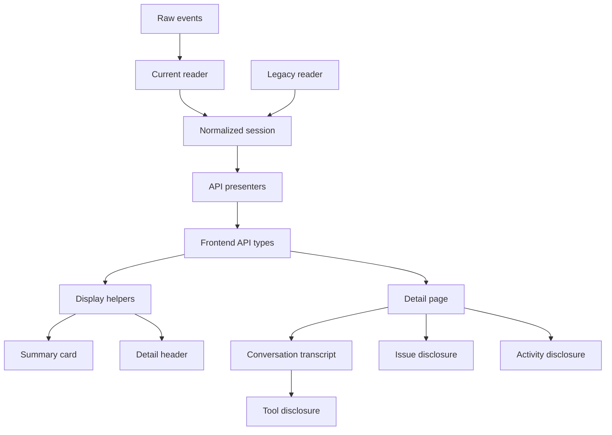
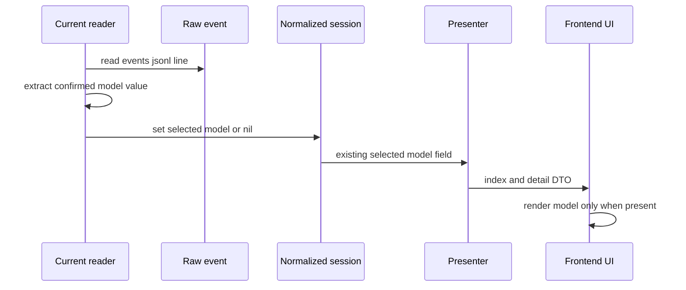
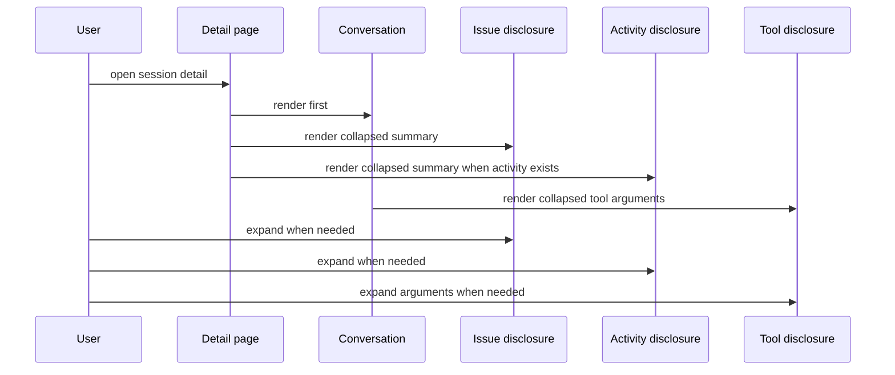

# 設計書

## 概要
この feature は、GitHub Copilot CLI のローカル会話履歴を読み返す利用者に、一覧では開く価値のある差分を見つけやすく、詳細では会話本文を最初に読める表示を提供する。対象利用者は、過去の user / assistant のやり取りを素早く読み返したい利用者である。

変更は既存の read-only session API と React UI への拡張である。API response shape は増やさず、backend は current 形式の model 抽出を既存 `selected_model` contract に追加し、tool call だけを持つ user / assistant event を既存 conversation entry contract に乗せる。frontend は metadata、issue、tool call、activity の初期表示 policy を整理する。

### 目標
- 一覧 card では通常状態の常設ラベルを減らし、会話なし・workspace-only・degraded などの例外シグナルを優先する。
- 一覧と詳細の metadata は値がある項目だけを表示し、`不明` プレースホルダーを既定表示からなくす。
- current 形式の model 情報を確認できる場合、legacy と同じ `selected_model` として一覧・詳細に表示する。
- 詳細画面は conversation-first にし、session issue、tool arguments、内部 activity は必要時に開ける。
- read-only 境界、current / legacy 共通表示、既存 API field を維持する。

### 非目標
- API response field、endpoint、query parameter の追加。
- degraded 判定、issue 生成、conversation/activity projector の全面再設計。ただし tool call だけを持つ user / assistant event を会話内で確認可能にするための `ConversationProjector` の限定的な抽出条件変更は scope 内とする。
- 履歴データの編集、削除、共有、検索、絞り込み、並び替え、手動 reload。
- raw payload viewer、詳細画面全体のレイアウト刷新、折りたたみ状態の永続化。
- CLI settings、環境変数、外部設定ファイルからの model 推測。

## 境界コミットメント

### この spec が責務を持つもの
- 一覧 card の既定表示 policy。通常の `complete` / `正常` / `会話あり` を常設しない。
- `work_context` と `selected_model` の値あり判定と、一覧・詳細での conditional metadata rendering。
- current `events.jsonl` に存在する model 値を `NormalizedSession#selected_model` へ昇格する抽出規則。
- content が空でも tool call を持つ user / assistant event を `conversation.entries` に残す投影規則。
- 詳細画面における session issue、tool arguments、activity の component-local disclosure state。
- 上記挙動を固定する backend / frontend tests。

### 境界外
- session source discovery、root failure、degraded / issue code の生成規則。
- `conversation_summary`、`conversation.entries`、`activity.entries`、`timeline` の shape 変更。
- raw payload の表示 policy 変更。ただし既存 `Raw を取得` action は維持する。
- source format ごとの専用 UI 分岐。
- UI state の URL、localStorage、DB、backend への保存。

### 許可する依存
- backend の `NormalizedSession#selected_model`、`CurrentSessionReader`、`EventNormalizer`、`ConversationProjector`、既存 presenter。
- frontend の `sessionApi.types.ts`、presentation helper、`SessionSummaryCard`、`SessionDetailHeader`、`SessionDetailPage`、`ConversationTranscript`、`TimelineContent`、`ActivityTimeline`、`IssueList`。
- React 19 の component state、TypeScript 6 の明示型、Vitest / Testing Library、RSpec。
- GitHub Copilot SDK / CLI の documented event field と、保存済み `events.jsonl` fixture で確認した model 候補を使う raw event model 抽出。

### 再検証トリガー
- `selected_model`、`work_context`、`source_state`、`conversation_summary` の API shape または nullable semantics が変わる場合。
- current event taxonomy、特に model を含む event field が変更される場合。
- issue scope、event-level issue の紐付け、activity entry の shape が変わる場合。
- detail page に検索、filter、raw viewer、編集系 action、永続 disclosure を追加する場合。
- frontend が source format や raw payload を直接判定する変更を加える場合。

## アーキテクチャ

### 既存アーキテクチャ分析
- backend は `CurrentSessionReader` / `LegacySessionReader` が `NormalizedSession` を作り、presenter が index/detail DTO を返す。`selected_model` はすでに DTO にある。
- current reader は `selected_model: nil` を固定しており、legacy reader だけが `selectedModel` を `selected_model` に入れている。
- frontend は `frontend/src/features/sessions` 配下で API 型、presentation helper、component、page、hook を feature-local に管理している。
- `SessionSummaryCard` と `SessionDetailHeader` は `formatWorkContext` / `formatModel` の placeholder を常時表示する。
- `SessionDetailPage` は session issue を会話より前に、`ActivityTimeline` を会話の後に常時展開する。
- `TimelineContent` は tool block と arguments disclosure を持つが、短い単一行 arguments は初期展開される。

### アーキテクチャパターンと境界マップ



**アーキテクチャ統合**:
- 採用パターン: existing contract reuse。backend は `selected_model` だけを current でも埋め、frontend は表示 policy を presentation / component 境界に閉じる。
- 依存方向: backend は `raw events -> reader -> NormalizedSession -> presenter`、frontend は `sessionApi.types -> presentation helpers -> components -> pages` を維持する。
- 維持する既存パターン: read-only API、current / legacy 共通 DTO、relative import、feature 近傍 test、component-local state。
- 新規 dependency: なし。
- ステアリング適合: raw files を正本とし、壊れた data は issue として残し、UI は保存形式ではなく実データの有無に基づいて表示する。

### 技術スタック

| レイヤー | 選択 / バージョン | feature での役割 | 備考 |
|----------|--------------------|------------------|------|
| Backend | Ruby 4 / Rails 8.1 API | current model 抽出と既存 session DTO への反映 | 新規 gem なし |
| Frontend | React 19 / TypeScript 6 | conditional metadata、disclosure state、read-only UI | `any` は使わない |
| Frontend UI | Tailwind CSS 4 | 既存 component styling と collapsed header 表示 | 新規 UI library なし |
| Tests | RSpec / Vitest / Testing Library | reader、request、component interaction の検証 | 既存 Docker Compose 導線 |

## ファイル構成計画

### ディレクトリ構成
```text
backend/
├── lib/copilot_history/
│   ├── current_session_reader.rb                    # current raw events から selected_model を抽出する
│   ├── projections/
│   │   └── conversation_projector.rb                # tool-only user / assistant event を会話 entry として残す
│   ├── types/normalized_session.rb                  # 既存 selected_model contract を維持する
│   └── api/presenters/
│       ├── session_index_presenter.rb               # 既存 selected_model / source_state を一覧 DTO に返す
│       └── session_detail_presenter.rb              # 既存 selected_model / issues / activity を詳細 DTO に返す
└── spec/
    ├── fixtures/copilot_history/current_model/      # model 付き current session fixture
    ├── lib/copilot_history/current_session_reader_spec.rb
    ├── lib/copilot_history/projections/conversation_projector_spec.rb
    ├── lib/copilot_history/api/presenters/session_index_presenter_spec.rb
    └── requests/api/sessions_spec.rb

frontend/
└── src/features/sessions/
    ├── api/
    │   └── sessionApi.types.ts                      # 既存 DTO contract。shape は変更しない
    ├── presentation/
    │   ├── formatters.ts                            # timestamp formatter と表示可能 metadata helper を所有する
    │   ├── formatters.test.ts                       # placeholder 非生成と値あり metadata の契約を固定する
    │   ├── conversationContent.ts                   # tool arguments の初期 collapse policy を所有する
    │   └── conversationContent.test.ts              # tool collapse reason と初期状態を検証する
    ├── components/
    │   ├── SessionSummaryCard.tsx                   # 一覧 card の例外シグナルと値あり metadata を描画する
    │   ├── SessionDetailHeader.tsx                  # 詳細 header の値あり metadata と degraded signal を描画する
    │   ├── ConversationTranscript.tsx               # 会話本文と発話近傍 issue を描画する
    │   ├── TimelineContent.tsx                      # tool block の collapsed arguments disclosure を描画する
    │   ├── ActivityTimeline.tsx                     # activity entry list と raw action を disclosure 内で描画可能にする
    │   ├── IssueList.tsx                            # 既存 issue list を disclosure body と発話近傍で再利用する
    │   └── DisclosureSection.tsx                    # session issue / activity の共通 disclosure shell を持つ
    └── pages/
        └── SessionDetailPage.tsx                    # conversation-first の並びと disclosure state を所有する
```

### 変更対象ファイル
- `backend/lib/copilot_history/current_session_reader.rb` — `events.jsonl` の raw event を読みながら model 値を抽出し、`selected_model` に設定する。
- `backend/lib/copilot_history/projections/conversation_projector.rb` — content が空でも tool call を持つ user / assistant event は conversation entry として残す。content も tool call もない message は引き続き会話から除外する。
- `backend/spec/lib/copilot_history/current_session_reader_spec.rb` — model 付き current event から `selected_model` が設定され、欠損時は `nil` のままであることを確認する。
- `backend/spec/lib/copilot_history/projections/conversation_projector_spec.rb` — tool-only assistant message が `conversation.entries` に残り、発話単位 issue と tool call が detail response へ到達することを確認する。
- `backend/spec/fixtures/copilot_history/current_model/session-state/current-model/events.jsonl` — model 抽出用 fixture を追加する。
- `backend/spec/requests/api/sessions_spec.rb` — current session の index/detail response で `selected_model` が既存 field に出ることを確認する。
- `frontend/src/features/sessions/presentation/formatters.ts` — `formatWorkContext` / `formatModel` の placeholder 依存をやめ、値あり表示用 helper を追加する。
- `frontend/src/features/sessions/presentation/formatters.test.ts` — 欠損 work context / model が `null` になり、実値だけ label 化されることを確認する。
- `frontend/src/features/sessions/presentation/conversationContent.ts` — tool arguments preview がある場合は全 tool call を初期折りたたみにし、`skill-context` reason を保持する。
- `frontend/src/features/sessions/components/SessionSummaryCard.tsx` — `会話あり`、`正常`、`complete`、内部 activity 数の常設表示を除外し、metadata `dl` は値あり項目だけ描画する。
- `frontend/src/features/sessions/components/SessionDetailHeader.tsx` — metadata `dl` を値あり項目だけにし、空領域を残さない。
- `frontend/src/features/sessions/components/ConversationTranscript.tsx` — tool arguments が collapsed でも発話近傍 issue を `IssueList` で表示し続ける。
- `frontend/src/features/sessions/components/TimelineContent.tsx` — collapsed 時も tool 名、partial/truncated と arguments toggle を表示する。issue 表示は親発話の `IssueList` に委譲する。
- `frontend/src/features/sessions/components/DisclosureSection.tsx` — session issue と activity の見出し、件数、警告状態、開閉 state を共通化する。
- `frontend/src/features/sessions/components/ActivityTimeline.tsx` — entry list と raw action を disclosure body として使えるよう、空 activity では見出しごと描画しない。
- `frontend/src/features/sessions/pages/SessionDetailPage.tsx` — `ConversationTranscript` を session issue より前に置き、session issue / activity は初期 collapsed にする。
- `frontend/src/features/sessions/pages/SessionIndexPage.test.tsx`, `SessionDetailPage.test.tsx`, `TimelineContent.test.tsx` — 新しい既定表示と明示展開を検証する。

## システムフロー





- model 抽出は raw event を読んでいる `CurrentSessionReader` 内に閉じる。presenter と frontend は source format を判定しない。
- conversation projection は user / assistant message のうち、本文または tool call のどちらかを持つ event を `conversation.entries` に残す。これにより `skill-context` などの tool-only event も detail 初期表示の会話領域で折りたたみ可能になる。
- detail 初期表示は conversation を最初に描画する。session issue と activity は見出し、件数、警告有無を残して collapsed にする。
- event-level issue は `ConversationTranscript` の発話 entry または `ActivityTimeline` の activity entry の近くに残し、`TimelineContent` の tool arguments collapsed 状態や session issue disclosure の collapsed 状態とは独立させる。

## 要件トレーサビリティ

| 要件 | 要約 | コンポーネント | インターフェース | フロー |
|------|------|----------------|------------------|--------|
| 1.1 | 通常状態ラベルを一覧既定表示から除外 | `SessionSummaryCard` | display policy | detail/index display |
| 1.2 | 会話本文なし session を識別 | `SessionSummaryCard` | `conversation_summary.has_conversation`, `source_state` | index display |
| 1.3 | 欠損や読取制約を例外シグナル化 | `SessionSummaryCard`, `IssueList` | `degraded`, `issues`, `source_state` | index display |
| 1.4 | current / legacy 通常 session を同基準で表示 | `SessionSummaryCard` | common `SessionSummary` | index display |
| 1.5 | 内部 activity 数を主要シグナルにしない | `SessionSummaryCard` | `conversation_summary.activity_count` | index display |
| 2.1 | 一覧で work context 欠損を非表示 | `SessionSummaryCard`, `formatters` | displayable metadata | index display |
| 2.2 | 詳細で work context 欠損を非表示 | `SessionDetailHeader`, `formatters` | displayable metadata | detail display |
| 2.3 | model 欠損を非表示 | `SessionSummaryCard`, `SessionDetailHeader`, `formatters` | displayable metadata | index/detail display |
| 2.4 | work context / model 実値を表示 | `SessionSummaryCard`, `SessionDetailHeader` | `work_context`, `selected_model` | index/detail display |
| 2.5 | 空 metadata 領域を残さない | `SessionSummaryCard`, `SessionDetailHeader` | metadata item list | index/detail display |
| 3.1 | current model を session metadata 化 | `CurrentSessionReader` | `NormalizedSession#selected_model` | model extraction |
| 3.2 | legacy と同じ方針で model 表示 | presenters, `SessionSummaryCard`, `SessionDetailHeader` | `selected_model` | index/detail display |
| 3.3 | model 欠損時に推測値を生成しない | `CurrentSessionReader`, `formatters` | `nil` selected model | model extraction |
| 3.4 | 保存形式でなく実データ有無に基づく表示 | `SessionSummaryCard`, `SessionDetailHeader` | displayable metadata | index/detail display |
| 3.5 | 内部データを読まず model を確認可能 | `CurrentSessionReader`, presenters | `selected_model` | model extraction |
| 4.1 | session issue を会話前に展開しない | `SessionDetailPage`, `DisclosureSection` | local disclosure state | detail display |
| 4.2 | session issue の存在を必要時に確認 | `DisclosureSection`, `IssueList` | `issues` | detail display |
| 4.3 | 発話近傍 issue を維持 | `ConversationTranscript`, `IssueList` | entry `issues` | detail display |
| 4.4 | 会話なし理由を表示 | `ConversationTranscript` | `conversation.empty_reason` | detail display |
| 4.5 | read-only 境界を維持 | pages, components | no mutation actions | architecture boundary |
| 5.1 | tool 補助情報を初期展開しない | `conversationContent`, `TimelineContent` | tool disclosure state | tool disclosure |
| 5.2 | 明示操作で tool 補助情報を表示 | `ConversationProjector`, `ConversationTranscript`, `TimelineContent` | conversation entry with tool calls, toggle state | tool disclosure |
| 5.3 | tool 名と補助情報を本文と区別 | `TimelineContent` | visual block | tool disclosure |
| 5.4 | `skill-context` の長い補助内容を追加操作まで折りたたむ | `ConversationProjector`, `conversationContent`, `TimelineContent` | conversation entry with tool calls, collapse reason | tool disclosure |
| 5.5 | tool issue の存在を完全に隠さない | `ConversationProjector`, `ConversationTranscript`, `IssueList`, `TimelineContent` | entry `issues`, tool disclosure state | tool disclosure |
| 6.1 | activity section を初期展開しない | `SessionDetailPage`, `DisclosureSection`, `ActivityTimeline` | local disclosure state | activity disclosure |
| 6.2 | 明示操作で activity を確認 | `DisclosureSection`, `ActivityTimeline` | toggle state | activity disclosure |
| 6.3 | activity 内容、時刻、状態、issue を区別表示 | `ActivityTimeline`, `IssueList` | `SessionActivityEntry` | activity disclosure |
| 6.4 | 空 activity section を会話前に表示しない | `SessionDetailPage`, `ActivityTimeline` | `activity.entries` | activity disclosure |
| 6.5 | activity collapsed 中も会話順と読解性を維持 | `SessionDetailPage`, `ConversationTranscript` | render order | detail display |

## コンポーネントとインターフェース

| コンポーネント | ドメイン / レイヤー | 目的 | 対応要件 | 主な依存 | 契約 |
|----------------|---------------------|------|----------|----------|------|
| `CurrentSessionReader` | Backend reader | current raw events から session metadata と model を作る | 3.1, 3.3, 3.5 | JSON P0, EventNormalizer P0 | Service |
| `ConversationProjector` | Backend projection | 本文または tool call を持つ user / assistant event を会話 entry に投影する | 4.3, 4.4, 5.2, 5.4, 5.5 | NormalizedSession P0, NormalizedEvent P0 | Service |
| `metadata display helpers` | Frontend presentation | 値がある metadata だけを表示用 item にする | 2.1, 2.2, 2.3, 2.4, 2.5, 3.4 | sessionApi.types P0 | Service |
| `SessionSummaryCard` | Frontend component | 一覧の例外シグナルと値あり metadata を描画する | 1.1, 1.2, 1.3, 1.4, 1.5, 2.1, 2.3, 2.4, 2.5, 3.2, 3.4 | metadata helpers P0 | State |
| `SessionDetailHeader` | Frontend component | 詳細 header の値あり metadata と degraded signal を描画する | 2.2, 2.3, 2.4, 2.5, 3.2, 3.4 | metadata helpers P0 | State |
| `DisclosureSection` | Frontend component | session issue と activity の初期折りたたみ shell を提供する | 4.1, 4.2, 6.1, 6.2 | React state P0 | State |
| `TimelineContent` | Frontend component | tool block と collapsed arguments を描画する | 5.1, 5.2, 5.3, 5.4 | conversationContent P0 | State |
| `ConversationTranscript` | Frontend component | 会話本文と発話近傍 issue を描画する | 4.3, 4.4, 5.5 | `IssueList` P0, `TimelineContent` P0 | State |
| `ActivityTimeline` | Frontend component | activity entry を会話とは別の補助情報として表示する | 6.2, 6.3, 6.4 | SessionActivity P0 | State |
| `SessionDetailPage` | Frontend page | conversation-first の表示順と disclosure 配置を所有する | 4.1, 4.2, 4.4, 4.5, 6.1, 6.4, 6.5 | detail components P0 | State |

### Backend Reader

#### `CurrentSessionReader`

| 項目 | 詳細 |
|------|------|
| 目的 | current session の raw files を読み、確認できる model を既存 `selected_model` に反映する |
| 要件 | 3.1, 3.3, 3.5 |

**責務と制約**
- `events.jsonl` の保存済み raw event から model 値を抽出する。
- 優先順は、`session.shutdown` の `data.currentModel`、次に `tool.execution_complete` の `data.model`、最後に保存済み event に実在する `assistant.usage` の `data.model` または root `model` とする。
- `assistant.usage` は GitHub Docs 上では ephemeral event であるため、fixture または実データの `events.jsonl` に存在する場合だけ後方互換候補として扱い、抽出の主要根拠にしない。
- `system.message` の `metadata` は documented model field ではないため、別途 fixture で確認できるまで抽出候補に含めない。
- 同一優先度で複数 model がある場合は、利用者が最後に使った model を示すため、sequence が後の非空 model を優先する。
- 空文字、空白のみ、非文字列値は採用しない。
- model が見つからない場合は `selected_model: nil` とし、`モデル不明` や推測値は生成しない。
- model 抽出失敗は issue にしない。読める raw event に model がないだけで degraded ではない。

**依存関係**
- 入力元: `SessionSourceCatalog` — current source paths を渡す (P0)
- 出力先: `NormalizedSession` — `selected_model` を保持する (P0)
- 出力先: `EventNormalizer` — event 正規化は既存どおり委譲する (P0)

**契約**: Service [x] / API [ ] / Event [ ] / Batch [ ] / State [ ]

##### サービスインターフェース
```ruby
class CopilotHistory::CurrentSessionReader
  def call(source) => CopilotHistory::Types::NormalizedSession
end
```
- 事前条件: `source.format == :current`。
- 事後条件: model 値が raw event 内で確認できる場合、返却 session の `selected_model` にその文字列が入る。
- 不変条件: model 欠損時は `nil`。reader は settings や環境変数から model を推測しない。

### Backend Projection

#### `ConversationProjector`

| 項目 | 詳細 |
|------|------|
| 目的 | 会話本文と tool call 補助情報を detail の conversation 領域へ投影する |
| 要件 | 4.3, 4.4, 5.2, 5.4, 5.5 |

**責務と制約**
- `event.kind == :message` かつ role が `user` または `assistant` の event を対象にする。
- content が非空の event は既存どおり conversation entry にする。
- content が空でも `tool_calls` が 1 件以上ある event は conversation entry にする。これは `skill-context` や tool arguments だけを持つ assistant message を会話の流れから落とさないための限定的な抽出条件変更である。
- content も tool call もない user / assistant message は、空の発話として表示価値がないため既存どおり除外する。
- event-level issue は同じ sequence の conversation entry に紐づけ、tool arguments disclosure が collapsed でも `ConversationTranscript` の `IssueList` から確認できる状態を保つ。
- API response shape は変えない。`SessionConversationEntry#content` は既存 contract の文字列として空文字を許容し、frontend は tool block だけの entry を描画できる。

**契約**: Service [x] / API [ ] / Event [ ] / Batch [ ] / State [ ]

##### サービスインターフェース
```ruby
class CopilotHistory::Projections::ConversationProjector
  def call(session) => CopilotHistory::Types::ConversationProjection
end
```
- 事前条件: `session.events` は `EventNormalizer` により normalized event と tool call preview を持つ。
- 事後条件: 本文または tool call がある user / assistant event は source sequence order で `conversation.entries` に残る。
- 不変条件: system message、detail、unknown は conversation ではなく activity / timeline の既存経路に残す。

### Frontend Presentation

#### `metadata display helpers`

| 項目 | 詳細 |
|------|------|
| 目的 | nullable DTO から表示可能な metadata item だけを作る |
| 要件 | 2.1, 2.2, 2.3, 2.4, 2.5, 3.4 |

**責務と制約**
- `repository + branch`、`repository`、`cwd`、`git_root` の順で work context 表示値を作る。
- `selected_model` は trim 後の非空文字列だけを表示値にする。
- 欠損時に `作業コンテキスト不明`、`モデル不明` を返さない。
- component は helper の `null` を受け取った項目を描画しない。

**契約**: Service [x] / API [ ] / Event [ ] / Batch [ ] / State [ ]

##### サービスインターフェース
```typescript
interface MetadataDisplayItem {
  label: '更新日時' | '作業コンテキスト' | 'モデル'
  value: string
}

function getDisplayableWorkContext(workContext: WorkContext): string | null
function getDisplayableModel(value: string | null): string | null
function buildSessionMetadataItems(input: {
  updatedAt: string | null
  workContext: WorkContext
  selectedModel: string | null
}): readonly MetadataDisplayItem[]
```
- 事前条件: input は backend DTO の nullable metadata である。
- 事後条件: 戻り値は表示可能な値だけを含む。
- 不変条件: placeholder-only item は生成しない。

#### `SessionSummaryCard`

| 項目 | 詳細 |
|------|------|
| 目的 | session list で例外と実値 metadata だけを優先表示する |
| 要件 | 1.1, 1.2, 1.3, 1.4, 1.5, 2.1, 2.3, 2.4, 2.5, 3.2, 3.4 |

**責務と制約**
- `conversation_summary.has_conversation == true` の通常 badge は表示しない。
- 会話本文がない場合は `metadata-only` または同等の例外 signal を表示する。
- `session.degraded == true` または `source_state != complete` の場合だけ例外 badge を表示する。
- `正常` / `complete` は通常状態として常設しない。
- 内部 activity 数は一覧 card の主要 badge から外す。必要なら補助文脈に留め、会話数や preview より優先しない。
- metadata item が 0 件の場合、`dl` 自体を描画しない。

**契約**: Service [ ] / API [ ] / Event [ ] / Batch [ ] / State [x]

##### 状態管理
- 状態モデル: なし。`SessionSummary` props だけで描画する。
- 永続性と整合性: backend order と DTO をそのまま使う。

#### `DisclosureSection`

| 項目 | 詳細 |
|------|------|
| 目的 | secondary 情報の存在を残しつつ初期折りたたみにする |
| 要件 | 4.1, 4.2, 6.1, 6.2 |

**責務と制約**
- 初期状態は collapsed。
- header に title、件数、warning/degraded indicator、開閉 button を表示する。
- body は expanded のときだけ描画する。
- state は component-local で、route 離脱や reload で永続化しない。

**契約**: Service [ ] / API [ ] / Event [ ] / Batch [ ] / State [x]

##### 状態管理
- 状態モデル: `expanded: boolean`。
- 永続性と整合性: component lifetime のみ。
- 競合時の方針: user click だけで変更し、backend state と同期しない。

#### `TimelineContent`

| 項目 | 詳細 |
|------|------|
| 目的 | tool 呼び出しの存在を見せつつ arguments を初期折りたたみにする |
| 要件 | 5.1, 5.2, 5.3, 5.4 |

**責務と制約**
- tool block は本文とは別 container で表示する。
- collapsed 時も tool 名、partial/truncated badge を表示する。
- arguments preview がある場合は初期 collapsed とし、明示 button で表示する。
- `skill-context` は通常 tool より長い補助情報として collapse reason を持つが、専用 raw 表示は追加しない。
- arguments preview がない場合は toggle を出さず、tool の存在だけを表示する。
- tool call に紐づく event-level issue は `TimelineContent` に props として重複注入せず、同じ発話 entry 内の `IssueList` が発話本文の直後に表示する。これにより arguments disclosure の collapsed state で issue の存在を隠さない。

**契約**: Service [ ] / API [ ] / Event [ ] / Batch [ ] / State [x]

##### 状態管理
- 状態モデル: `Readonly<Record<string, boolean>>`。block key ごとに expanded を持つ。
- 永続性と整合性: `stateScopeKey` が変わると disclosure state を使い回さない。
- 競合時の方針: user click のみで変更する。

#### `ConversationTranscript`

| 項目 | 詳細 |
|------|------|
| 目的 | 会話本文、tool block、発話近傍 issue を同じ発話 entry 内で表示する |
| 要件 | 4.3, 4.4, 5.5 |

**責務と制約**
- `ConversationTranscript` は `SessionConversationEntry#issues` を `IssueList` に渡し、発話 entry の本文と tool block の直後に表示する。
- content が空で tool call だけを持つ entry では、空本文の placeholder を追加せず、発話 metadata、tool block、発話近傍 issue を表示する。
- `TimelineContent` の tool arguments が collapsed でも、発話 entry が表示されている限り issue list は表示する。
- 発話 entry 全体を利用者が非表示にした場合だけ、その発話の本文、tool block、issue list をまとめて隠す。これは既存の発話 visibility state の範囲であり、tool arguments disclosure とは独立する。
- 表示可能な会話本文がない場合は、既存の empty conversation message を維持する。

**契約**: Service [ ] / API [ ] / Event [ ] / Batch [ ] / State [x]

##### 状態管理
- 状態モデル: `Readonly<Record<number, boolean>>`。発話 sequence ごとに visible state を持つ。
- 永続性と整合性: component lifetime のみ。
- 競合時の方針: user click のみで変更し、tool disclosure state とは同期しない。

## データモデル

### Domain Model
- `NormalizedSession`: session aggregate。`selected_model` は current / legacy 共通の nullable metadata として扱う。
- `SessionSummary`: 一覧用 DTO。`selected_model`, `work_context`, `source_state`, `conversation_summary`, `degraded`, `issues` を既存 contract として使う。
- `SessionDetail`: 詳細用 DTO。`selected_model`, `work_context`, `issues`, `conversation`, `activity` を既存 contract として使う。
- `SessionConversationEntry`: 会話 entry。本文を持つ user / assistant message に加え、content が空でも tool call を持つ user / assistant message を同じ contract で扱う。
- `MetadataDisplayItem`: frontend-only の表示 model。API DTO ではない。
- `DisclosureState`: frontend-only の component state。永続化しない。

### データ契約と連携

**Selected model**
| Source format | Source | API field | 欠損時 |
|---------------|--------|-----------|--------|
| current | `events.jsonl` 内の保存済み `session.shutdown.data.currentModel`、`tool.execution_complete.data.model`、または実在する後方互換 model 値 | `selected_model` | `null` |
| legacy | `history-session-state` の `selectedModel` | `selected_model` | `null` |

**Metadata display item**
| Item | 表示条件 | 非表示条件 |
|------|----------|------------|
| 更新日時 | `updated_at` が formatter で文字列化される | 既存仕様どおり `時刻不明` は許容。ただし空 metadata 領域は作らない |
| 作業コンテキスト | repository、cwd、git_root のいずれかが非空 | 全候補が `null` または空白 |
| モデル | `selected_model` が非空文字列 | `null` または空白 |

**Conversation entry projection**
| Event | Projection | 理由 |
|-------|------------|------|
| user / assistant message with non-empty content | `conversation.entries` に含める | 既存の会話本文表示 |
| user / assistant message with empty content and tool calls | `conversation.entries` に含める | tool arguments / `skill-context` を会話の流れで明示展開可能にする |
| user / assistant message with empty content and no tool calls | 除外する | 表示価値のない空発話を増やさない |
| system message / detail / unknown | conversation には含めない | 既存 activity / timeline の責務を維持する |

**Disclosure state**
| State | Owner | Initial | 永続性 |
|-------|-------|---------|--------|
| session issue disclosure | `DisclosureSection` | collapsed | なし |
| activity disclosure | `DisclosureSection` | collapsed | なし |
| tool arguments disclosure | `TimelineContent` | collapsed | なし |

## エラーハンドリング

### エラー戦略
- model が抽出できない current session は error ではなく `selected_model: nil` とする。
- model 値が malformed でも session degradation にはしない。読取や event mapping の issue は既存経路で扱う。
- `assistant.usage` が保存済み event に存在しないことは degradation ではない。ephemeral event に依存せず、保存済み候補がない場合は `selected_model: nil` とする。
- session issue disclosure が collapsed でも、header に issue 件数と degraded indication を残す。
- tool call だけを持つ message は malformed ではないため degradation にしない。既存 issue が同じ sequence にある場合だけ発話近傍 issue として表示する。
- event-level issue は `ConversationTranscript` または `ActivityTimeline` の近傍 `IssueList` に表示し、tool arguments の collapsed state で完全に隠さない。
- activity が 0 件の場合、activity disclosure と空 section は表示しない。

### 監視
新規 logging / telemetry は追加しない。reader と UI の振る舞いは既存 RSpec、request spec、Vitest、Testing Library で検証する。

## テスト戦略

### 単体テスト
- `CurrentSessionReader` が current `session.shutdown.data.currentModel` の model 値を `selected_model` に設定することを確認する。
- `CurrentSessionReader` が current `tool.execution_complete.data.model` を fallback model 候補として扱うことを確認する。
- `CurrentSessionReader` が `assistant.usage.data.model` を保存済み event に実在する場合だけ後方互換候補として扱い、主要 fixture は non-ephemeral event で検証する。
- `CurrentSessionReader` が model 欠損、空文字、非文字列値で `selected_model: nil` を維持することを確認する。
- `ConversationProjector` が content 空かつ tool call ありの user / assistant message を `conversation.entries` に残し、content も tool call もない空 message は除外することを確認する。
- `ConversationProjector` が tool-only message に紐づく event-level issue を同じ conversation entry に渡すことを確認する。
- `formatters.test.ts` で work context と model の表示可能値がある場合だけ文字列を返し、欠損時に placeholder を返さないことを確認する。
- `conversationContent.test.ts` で `skill-context`、truncated、短い単一行を含む tool arguments がすべて初期 collapsed になることを確認する。

### 結合テスト
- request spec で model 付き current fixture の `/api/sessions` と `/api/sessions/:id` が `selected_model` を返すことを確認する。
- request spec で model なし current fixture は `selected_model: nil` のままであり、推測値を返さないことを確認する。
- request spec で content 空かつ `skill-context` tool call を持つ current session の detail response が、対象 event を `conversation.entries` に含めることを確認する。
- presenter specs で existing `selected_model` field の shape が index/detail とも変わらないことを確認する。

### UI / コンポーネントテスト
- `SessionIndexPage.test.tsx` で通常 current / legacy session に `会話あり`、`正常`、`complete`、内部 activity 数の主要表示が出ないことを確認する。
- `SessionIndexPage.test.tsx` で metadata-only、workspace-only、degraded は一覧 card 上で識別できることを確認する。
- `SessionIndexPage.test.tsx` と `SessionDetailPage.test.tsx` で `作業コンテキスト不明`、`モデル不明` が表示されず、値がある場合だけ表示されることを確認する。
- `SessionDetailPage.test.tsx` で詳細初期表示は会話が session issue より先に読め、session issue は明示操作で展開できることを確認する。
- `TimelineContent.test.tsx` で tool arguments は初期 collapsed、展開後に tool 名と arguments が同じ block 内で読めることを確認する。
- `ConversationTranscript.test.tsx` で content 空かつ tool call だけの発話 entry が空本文 placeholder を増やさず tool block と issue を表示することを確認する。
- `ConversationTranscript.test.tsx` で tool arguments が collapsed のままでも同じ発話 entry 内の issue list が表示されることを確認する。
- `SessionDetailPage.test.tsx` で activity は初期 collapsed、明示操作で内容・時刻・状態・issue・raw action を確認できることを確認する。
- read-only 境界として、編集、削除、送信、共有、専用 raw viewer、折りたたみ永続化 UI が追加されていないことを確認する。

### 性能とスケーラビリティ
- model 抽出は `events.jsonl` 読取中の軽量な文字列候補確認に留め、追加 I/O を発生させない。
- collapsed disclosure は初期 DOM 量と縦方向の圧迫を減らす。長い tool arguments や activity raw は明示操作まで描画しない。

## セキュリティ考慮事項
- raw payload や tool arguments は React の text rendering / `<code>` 表示を継続し、HTML injection を行わない。
- model 抽出は local raw events の確認済み metadata に限定し、環境変数や settings を追加で読まない。
- read-only UI 境界を維持し、履歴の編集、削除、送信、共有を追加しない。

## Supporting References
- `.kiro/specs/session-ui-noise-reduction/research.md` — discovery log と design decisions。
- [GitHub Docs: Streaming events in the Copilot SDK](https://docs.github.com/en/copilot/how-tos/copilot-sdk/use-copilot-sdk/streaming-events) — current event taxonomy と model を含む usage event の確認。
- [GitHub Docs: Copilot CLI programmatic reference](https://docs.github.com/en/copilot/reference/copilot-cli-reference/cli-programmatic-reference) — CLI model 指定と設定 precedence の確認。
