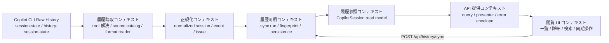
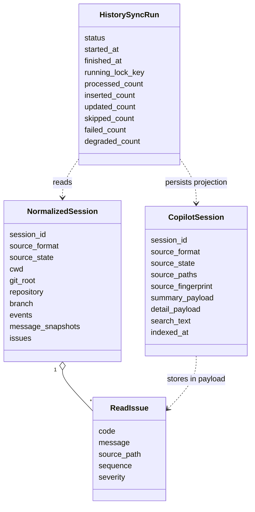
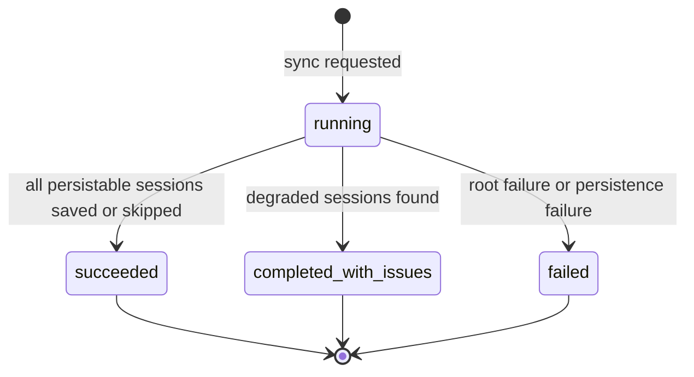
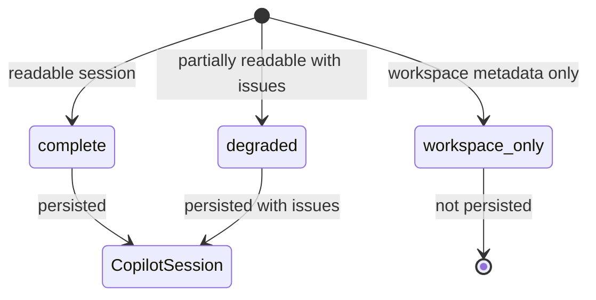
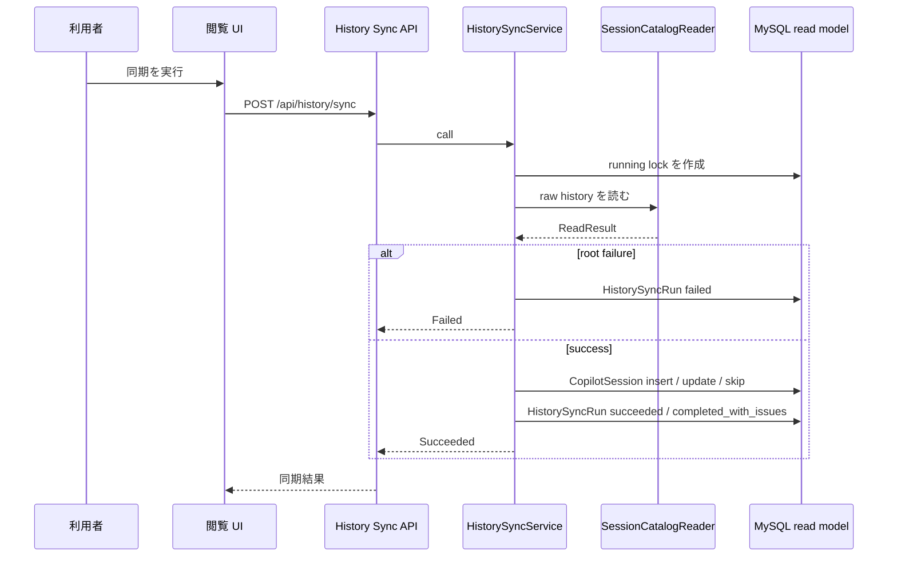

# ドメインモデル

updated_at: 2026-07-04

この文書は、現在の実装から読み取れる Copilot CLI 履歴閲覧アプリのドメインモデルを記録する。
設計図は Markdown に Mermaid を埋め込む形式を正とする。理由は、Kiro steering と同じレビュー単位で管理でき、文章による制約・判断理由・図を同じ差分で更新できるため。

## モデリング方針

- Raw files は一次ソースであり、アプリ内 DB は再生成可能な read model として扱う
- ドメインの中心は「ローカル履歴を読み、正規化し、明示同期によって参照可能にする」流れに置く
- Copilot CLI の保存形式差分は履歴読取コンテキストで吸収し、API / UI には共通のセッション表現を渡す
- 壊れた履歴を単純に失敗扱いせず、root failure と session 単位の degradation を区別する
- UI はドメインの正本を持たず、read model の表示・検索・同期要求を担う

## 境界づけられたコンテキスト

### 履歴読取コンテキスト

`COPILOT_HOME` または `~/.copilot` を起点に、履歴ルートとセッションソースを解決する。
現行形式と旧形式を識別し、それぞれの reader で `NormalizedSession` に変換する。

主な実装要素:
- `HistoryRootResolver`
- `SessionSourceCatalog`
- `SessionCatalogReader`
- `CurrentSessionReader`
- `LegacySessionReader`

### 正規化コンテキスト

保存形式ごとの差分を取り除き、API / persistence が扱える共通の履歴表現を作る。
正規化後も raw 由来の欠損や破損は `ReadIssue` として保持する。

主な実装要素:
- `NormalizedSession`
- `NormalizedEvent`
- `MessageSnapshot`
- `NormalizedToolCall`
- `ReadIssue`
- `ConversationProjector`
- `ActivityProjector`

### 履歴同期コンテキスト

利用者の明示操作を契機に raw files を読み、DB read model を insert / update / skip する。
同時実行は running lock で防ぎ、同期結果は `HistorySyncRun` として残す。

主な実装要素:
- `HistorySyncService`
- `HistorySyncRun`
- `SyncResult`
- `SessionRecordBuilder`
- `SourceFingerprintBuilder`
- `SessionSearchTextBuilder`

### 履歴参照コンテキスト

一覧・詳細・検索に使う再生成可能な read model を保持する。
`CopilotSession` は raw files の正本ではなく、表示速度・検索・API 契約維持のための投影である。

主な実装要素:
- `CopilotSession`
- `summary_payload`
- `detail_payload`
- `search_text`
- `source_fingerprint`

### API 提供コンテキスト

DB read model を読み、UI が利用する JSON contract に整形する。
HTTP controller は薄く保ち、query / presenter / type に責務を寄せる。

主な実装要素:
- `SessionIndexQuery`
- `SessionDetailQuery`
- `SessionIndexPresenter`
- `SessionDetailPresenter`
- `HistorySyncPresenter`
- `ErrorPresenter`

### 閲覧 UI コンテキスト

セッションの一覧・詳細・検索条件・同期操作を扱う。
UI は raw files を直接読まず、API contract と同期結果だけを信頼する。

主な実装要素:
- `SessionIndexPage`
- `SessionDetailPage`
- `useSessionIndex`
- `useSessionDetail`
- `useHistorySync`
- `sessionIndexCriteria`

## 主要集約とライフサイクル

### CopilotSession

同期済みセッションの read model。
`session_id` を識別子とし、一覧用 `summary_payload`、詳細用 `detail_payload`、検索用 `search_text` を保持する。

不変条件:
- `session_id` は一意
- `source_format` は `current` または `legacy`
- `source_state` は `complete`、`workspace_only`、`degraded`
- JSON contract fields は object である
- `search_text` は nil にしない
- count 系の値は 0 以上の整数

### HistorySyncRun

明示同期の実行履歴。
同期中・成功・失敗・部分劣化完了を区別し、競合制御と結果表示の根拠になる。

不変条件:
- `running` の間は `running_lock_key` を持ち、`finished_at` を持たない
- terminal status では `finished_at` を持ち、`running_lock_key` を持たない
- `saved_count` は `inserted_count + updated_count` と一致する
- count 系の値は 0 以上の整数

### NormalizedSession

raw files から読み取ったセッションを、形式差分を取り除いて表したドメインオブジェクト。
DB 永続化前の共通表現であり、source path や issue を保持して原因追跡可能にする。

## 状態モデル

### 同期実行状態

既に `running` の同期実行が存在する場合、新しい同期実行は作成せず、既存の running run を conflict として返す。これは `HistorySyncRun` 自体の状態遷移ではなく、同期要求に対する API 振る舞いである。

### セッションソース状態

## 主要フロー

### 明示同期

### セッション一覧参照

1. API は日付範囲・検索語・limit を受け取る。現行 UI は日付範囲・検索語を渡す
2. `SessionIndexQuery` が `CopilotSession` の `updated_at_source` / `created_at_source` と `search_text` を使って候補を絞る
3. `summary_payload` を返し、UI は degraded を含む場合に部分結果として扱う

### セッション詳細参照

1. UI が `session_id` を指定する
2. `SessionDetailQuery` が `CopilotSession.detail_payload` を取得する
3. 見つからない場合は not found として返す
4. 詳細表示は raw files を直接読まない

## 集約境界の判断

- `CopilotSession` と `HistorySyncRun` は別集約として扱う
- `HistorySyncRun` は同期実行の整合性と競合制御を守る
- `CopilotSession` はセッション参照 contract の整合性を守る
- `NormalizedSession` は永続化前のドメイン表現であり、ActiveRecord 集約ではない
- raw files の内容は外部システム由来の事実として扱い、アプリ内で直接変更しない

## 今後の更新ルール

- 新しい保存形式を追加した場合は、履歴読取コンテキストと `source_format` を更新する
- read model の意味が変わる場合は、`SessionRecordBuilder` とこの文書の `CopilotSession` を同時に見直す
- 検索対象が変わる場合は、`SessionSearchTextBuilder::VERSION` とユビキタス言語の「検索 projection」を更新する
- background job 化する場合は、同期実行状態と `HistorySyncRun` のライフサイクルを再定義する
